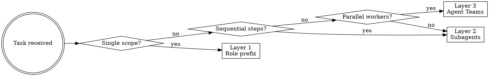

# NU-AURA Agent Orchestration

## Overview

NU-AURA development uses a 3-layer agent system. Choose the minimum layer that solves the task —
escalate only when needed. 70% of tasks need Layer 1. Agent Teams (Layer 3) burn 10–15× tokens —
reserve for full module builds.

## The 3-Layer System

```
Layer 1: Single session + role prefix    → Simple tasks, single scope
Layer 2: Subagents (sequential/parallel) → Compound tasks, design→impl→test
Layer 3: Agent Teams                     → Full modules, complex debugging, sprints
```

## Quick Decision



---

## Layer 1: Role Prefixes (Single Session)

Use in any conversation — prefix your request with a role tag. Claude adopts the full persona,
output format, and checklist defined for that role.

| Prefix       | Persona                   | Best For                                          |
|--------------|---------------------------|---------------------------------------------------|
| `@architect` | Principal Architect       | API contracts, DB schemas, Mermaid diagrams, ADRs |
| `@dev`       | Staff Full-Stack Engineer | Feature implementation, migrations, tests         |
| `@qa`        | Senior QA Engineer        | Test matrices, RBAC boundary tests, bug reports   |
| `@reviewer`  | Tech Lead                 | Code review, security audit, N+1 detection        |
| `@devops`    | Platform Engineer         | Docker, K8s, CI/CD, monitoring                    |
| `@docs`      | Technical Writer          | Swagger annotations, ADRs, runbooks, READMEs      |

**Example chain in one session:**

```
@architect Design the Overtime module for NU-HRMS.
  Include: API contract, Flyway migration (next = V94), RBAC, sequence diagram.

@dev Implement OvertimeController, OvertimeService, OvertimeRepository from the design above.
  Work in backend/src/main/java/com/hrms/application/attendance/ and frontend/app/overtime/

@qa Write RBAC boundary tests for all overtime endpoints across all 10 roles.

@reviewer Review the overtime module code. Flag any missing @RequiresPermission, N+1 queries, missing tenant_id filters.
```

**Role switching mid-session is fine** — Claude adjusts persona immediately.

---

## Layer 2: Subagents

Each subagent gets its own context window. **Always include full project context in the spawn prompt
** — the agent has no conversation history.

### Canonical Spawn Pattern

```
Spawn a @{role} subagent with this context:

PROJECT CONTEXT:
[paste the relevant sections from spawn-templates.md]

TASK:
[specific, concrete description with file paths and constraints]

OUTPUT FORMAT:
[what you expect back — files, test matrix, design doc, etc.]
```

Full spawn prompts for all 6 roles → see `spawn-templates.md`

### Subagent Patterns

**Sequential (design → build → test):**

```
Step 1: Spawn @architect → design doc
Step 2: Wait for Step 1 → Spawn @dev with design as input
Step 3: Wait for Step 2 → Spawn @qa with implementation as input
Step 4: Wait for Step 3 → Spawn @reviewer with all of the above
```

**Parallel (independent research):**

```
Spawn 3 subagents simultaneously:
1. Research: Kafka consumer group rebalancing strategies for NU-AURA audit topic
2. Research: Mantine v7 DataTable patterns for 10K+ row datasets
3. Research: PostgreSQL RLS performance at 1M+ rows with tenant_id UUID index
Synthesize findings into a recommendation.
```

**Bug investigation (competing hypotheses):**

```
Spawn 3 investigators in parallel:
1. Check SecurityConfig + JwtAuthenticationFilter (com.hrms.common.config/)
2. Check role_permissions table + Redis permission cache (SecurityService.getCachedPermissions())
3. Check API Gateway rate limiting (Bucket4j config in application.yml)
Converge on root cause — the hypothesis that survives peer review wins.
```

### Subagent Rules

- Max 3–4 subagents for manageability
- One task per subagent — don't overload
- Always mention `tenant_id` filtering requirement
- Always include the current Flyway migration number (next = **V94**)
- Reference `CLAUDE.md` conventions explicitly in every spawn prompt

---

## Layer 3: Agent Teams

**Requires:** `CLAUDE_CODE_EXPERIMENTAL_AGENT_TEAMS=1`

Full team configurations → see `team-configs.md`

### Available Configs

| Config                | Agents | Use When                                        |
|-----------------------|--------|-------------------------------------------------|
| Full Feature Build    | 6      | Building a complete new module end-to-end       |
| Cross-Module Refactor | 4      | RBAC changes, schema changes spanning sub-apps  |
| Bug Hunt (Debate)     | 3      | Complex intermittent bugs, cross-cutting issues |
| Sprint Execution      | 5      | 3–5 independent tickets in parallel             |

### Team Architecture Rules

**File ownership is mandatory.** Each agent must own distinct directories:

| Agent        | Owns                                                                 |
|--------------|----------------------------------------------------------------------|
| architect    | Design docs only (no code)                                           |
| backend-dev  | `backend/src/main/java/com/hrms/{module}/`                           |
| frontend-dev | `frontend/app/{module}/`, `frontend/components/{module}/`            |
| qa-engineer  | `backend/src/test/`, `frontend/e2e/`                                 |
| devops       | `docker-compose.yml`, `.github/workflows/`, `deployment/kubernetes/` |
| tech-writer  | `docs/`, Swagger annotations in controllers                          |

**Shared files protocol:** `SecurityConfig.java`, `application.yml`, `apps.ts` — any agent touching
these MUST post to the shared task list and wait for acknowledgment before editing.

**Dependency graph (Full Feature Build):**

```
architect ──→ backend-dev ──┐
          └→ frontend-dev ──┼──→ qa-engineer ──→ tech-reviewer
          └→ tech-writer    │
devops ────────────────────→ (independent, parallel)
```

### Team Failure Handling

| Symptom                         | Cause                              | Fix                                                     |
|---------------------------------|------------------------------------|---------------------------------------------------------|
| Agent exits immediately         | Missing context in spawn prompt    | Add more project context                                |
| Two agents editing same file    | No file ownership                  | Assign explicit paths per agent                         |
| Agent stuck waiting             | Dependency not posted to task list | Manually trigger or check task list                     |
| High token burn, low output     | Task too vague                     | Be specific — include file paths and constraints        |
| Agents contradicting each other | No shared design                   | Always architect first, then branch                     |
| Wrong permission string         | Used MODULE:ACTION in spawn prompt | DB format is `module.action`, code uses `MODULE:ACTION` |

---

## NU-AURA Orchestration Checklist

Apply to EVERY spawn prompt before sending:

- [ ] Flyway next migration number included (currently **V94**)
- [ ] tenant_id filtering requirement stated for any DB work
- [ ] @RequiresPermission requirement stated for any endpoint work
- [ ] Permission format clarified: DB = `module.action`, code = `MODULE:ACTION`
- [ ] SuperAdmin bypass behavior mentioned
- [ ] File paths explicitly named (not "implement the service" but "implement in
  `com/hrms/application/leave/LeaveService.java`")
- [ ] Role hierarchy included if RBAC work: Super Admin > Tenant Admin > HR Admin (85) > App Admin >
  HR Manager > Hiring Manager > Team Lead > Employee > Candidate > Viewer
- [ ] Output format specified (what do you want back?)
- [ ] Sky color palette reminder for any frontend UI (sky-700 primary, NOT purple)
- [ ] No new Axios instance instruction for any frontend work
- [ ] TypeScript strict mode — no `any` reminder

---

## Role Personas (Deep Reference)

### @architect

**Produces:** OpenAPI 3.0 contracts, Flyway SQL migrations, Mermaid diagrams (component + sequence),
ADRs
**Thinks about:** trade-offs between options, backward compat, sub-app integration impact
**Output template:**

1. Problem Statement
2. Design Options (min 2, with trade-offs)
3. Recommended Approach + justification
4. API Contract
5. Schema SQL (Flyway `V{n}__{description}.sql`)
6. Mermaid Diagram
7. Risks & Mitigations

### @dev

**Produces:** Complete production-grade code (not snippets), unit tests alongside implementation
**Enforces:** `@RequiresPermission` on every endpoint, DTOs at API boundary (never expose JPA
entities), thin controllers, service-layer logic, `@Transactional` on mutating services
**Frontend enforces:** React Hook Form + Zod (all forms), React Query (all data fetching), existing
Axios client, TypeScript strict, Mantine UI + Sky palette
**Output template:**

1. Files to create/modify (list with paths)
2. Complete implementation code
3. Unit tests (JUnit 5 + Mockito / Jest)
4. Integration notes (config changes, wiring)

### @qa

**Produces:** Test matrices, RBAC boundary tests (all 10 roles × all endpoints), Playwright E2E,
JUnit integration tests, structured bug reports
**Always covers:** happy path, edge cases, empty/error/loading states, unicode, XSS payloads,
concurrent access
**Output template:**

1. Test Matrix (table: Case | Input | Expected | Role | Priority)
2. RBAC Boundary Table (all 10 roles per endpoint)
3. Edge Cases
4. Integration Scenarios
5. Test code (ready to run)

### @reviewer

**Produces:** Findings table with severity + fix
**Severity levels:** CRITICAL (auth bypass, data loss, tenant isolation breach) → MAJOR (missing
RBAC, N+1, missing error handling) → MINOR (code smell, missing logs) → NIT
**Always checks:** every endpoint has `@RequiresPermission`, no entity in API response, no
`Optional.get()` without guard, no SQL concatenation, audit logs on sensitive ops, pagination on all
list endpoints, `tenant_id` filter present, no `any` in TypeScript

### @devops

**Produces:** Dockerfiles (multi-stage), docker-compose patches, GitHub Actions workflows, K8s
manifests, env var documentation, rollback plans
**Never does:** hardcode secrets, skip health checks, write single-stage Docker builds
**Manages:** 8 docker-compose services (Redis, Zookeeper, Kafka, Elasticsearch, MinIO, Prometheus,
Backend, Frontend), 10 K8s manifests in `deployment/kubernetes/`

### @docs

**Produces:** SpringDoc OpenAPI annotations, ADRs (Context → Decision → Consequences), module
READMEs, runbooks
**Always does:** puts docs next to the code they describe, updates docs when code changes
**ADR format:** ADR-{n}: {title}, Status, Context, Decision, Consequences

---

## Cost Reference

| Layer                  | Relative Token Cost | Token Budget      |
|------------------------|---------------------|-------------------|
| Single session + role  | 1×                  | Standard          |
| 2–3 subagents          | 2–3×                | Medium task       |
| Agent Teams (3 agents) | 5–8×                | Complex debug     |
| Agent Teams (6 agents) | 10–15×              | Full module build |

**Rule of thumb:** Start at Layer 1. Most tasks (70%) never need to escalate.

---

## Supporting Files

- `spawn-templates.md` — Full self-contained spawn prompts for all 6 roles (copy-paste ready)
- `team-configs.md` — Full Agent Teams configurations for all 4 team types
- `decision-matrix.md` — Scenario-to-approach quick reference table
