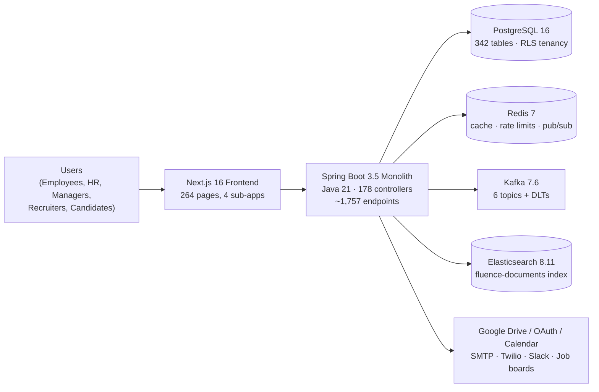

# NU-AURA Documentation (v2)

> Canonical, evidence-based documentation set for the NU-AURA platform.
> Every fact in these documents was verified against the codebase at the time of writing
> (branch `main`, June 2026). Where a number is approximate it is marked with `~`.

## What is NU-AURA?

NU-AURA is NULogic's internal operating system — a multi-tenant HR platform that replaces
KEKA and consolidates four previously siloed domains behind one login, one backend, and one
design language:

| Sub-app | Domain | Maturity |
|---------|--------|----------|
| **NU-HRMS** | Core HR: payroll, attendance, leave, expenses, contracts, assets, helpdesk | ~98% |
| **NU-Hire** | Recruitment: pipeline, agencies, scorecards, onboarding, career page, e-sign | ~97% |
| **NU-Grow** | Performance: reviews, OKRs, 360 feedback, LMS, training, surveys, wellness | ~92% |
| **NU-Fluence** | Knowledge: wiki, blogs, AI chat, search, company wall | ~90% |

## Document map

| Document | Answers |
|----------|---------|
| [PRD.md](PRD.md) | What are we building, for whom, and how do we know it's done? |
| [architecture/system-overview.md](architecture/system-overview.md) | What are the big pieces and how do they talk? (C4 context + container) |
| [architecture/backend.md](architecture/backend.md) | How is the Spring Boot monolith structured? |
| [architecture/frontend.md](architecture/frontend.md) | How is the Next.js app structured? |
| [architecture/data.md](architecture/data.md) | How is data modelled, isolated per tenant, migrated, and cached? |
| [architecture/security.md](architecture/security.md) | How are authentication, authorization, tenancy, and crypto enforced? |
| [architecture/integrations.md](architecture/integrations.md) | How do Kafka, WebSocket, Elasticsearch, and external services connect? |
| [architecture/infrastructure.md](architecture/infrastructure.md) | Where does it run and how does it ship? (Docker, K8s, CI/CD) |
| [architecture/observability.md](architecture/observability.md) | How do we see it running? (metrics, alerts, logs, traces) |
| [operations.md](operations.md) | How do we operate it? (environments, deploy gates, DR, runbook index) |

## Platform at a glance

## Key numbers (verified June 2026)

- **Backend:** Spring Boot 3.5.14, Java 21; 78 functional modules; 178 REST controllers;
  ~1,757 endpoint mappings; 319 JPA entities; 25 `@Scheduled` jobs (ShedLock-guarded)
- **Frontend:** Next.js 16.2.7, React 19.2.7, TypeScript 6, Mantine 9.2.2; 264 `page.tsx`
  routes across 88 route folders; 191 components; 126 Playwright E2E specs
- **Data:** 271 Flyway migrations (V0–V271); 342 tables, every one carrying
  `tenant_id UUID NOT NULL`; 116 tables with RLS enabled
- **Security:** JWT in httpOnly cookies, CSRF double-submit, BCrypt-12, AES-256-GCM field
  encryption, 9 canonical roles, 500+ `MODULE:ACTION` permissions, Postgres RLS

## PNG diagram exports

Every Mermaid diagram in this set is also rendered as a PNG (2× scale) in
[`diagrams/`](diagrams/) for slide decks and tools that don't render Mermaid:

| PNG | Source document |
|-----|-----------------|
| `platform-at-a-glance.png` | README.md |
| `c4-context.png` · `c4-container.png` · `request-flow.png` | architecture/system-overview.md |
| `backend-layering.png` · `security-filter-chain.png` | architecture/backend.md |
| `frontend-structure.png` · `openapi-orval-data-flow.png` | architecture/frontend.md |
| `tenant-isolation-layers.png` · `entity-hierarchy.png` · `core-er-sketch.png` | architecture/data.md |
| `defense-in-depth-layers.png` · `authentication-flow.png` | architecture/security.md |
| `kafka-eventing-map.png` · `websocket-redis-relay.png` | architecture/integrations.md |
| `kubernetes-topology.png` · `cicd-pipelines.png` | architecture/infrastructure.md |
| `observability-pipeline.png` | architecture/observability.md |

The Mermaid source in the documents is canonical; regenerate PNGs after editing a diagram
(`npx -p @mermaid-js/mermaid-cli mmdc -i <block>.mmd -o diagrams/<name>.png -b white -s 2`).

## Conventions used in this set

- Diagrams are [Mermaid](https://mermaid.js.org/) and render natively on GitHub.
- File paths are repo-relative (e.g. `backend/src/main/java/com/nulogic/...`).
- "Tenant" always means a row-level tenant in the shared-schema model — there is one
  database and one schema for all tenants.

## Relationship to `docs/`

The original `docs/` tree remains the home for ADRs (`docs/adr/`), runbooks
(`docs/runbooks/`), reusable patterns (`docs/patterns/`), and audit history. This `docs-v2`
set supersedes the scattered architecture notes in `docs/architecture/` as the single
current-state reference; it links into `docs/` rather than duplicating it.
