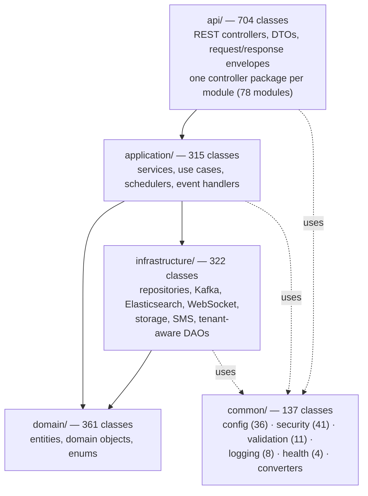
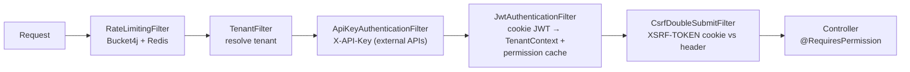

# Backend Architecture

Spring Boot 3.5.14 on Java 21. A single deployable, internally organized as a layered
modular monolith under `backend/src/main/java/com/nulogic/`.

## 1. Layering

Dependency direction is enforced by ArchUnit 1.4.2 tests (`backend/src/test/java/com/nulogic/architecture/`),
which also guard the RLS GUC convention (`RlsTenantGucScopeTest`).

## 2. Module inventory (78 modules)

Each module owns a vertical slice: controller(s) in `api/`, services in `application/`,
entities in `domain/`, repositories in `infrastructure/`.

| Group | Modules |
|-------|---------|
| HR core | attendance, leave, employee, payroll, performance, probation, exit, onboarding, preboarding, shift, timetracking |
| Admin/org | organization, department, roles, user management, compliance (DSR, audit), admin |
| Finance | compensation, budget, expense, loan, payment, tax, statutory, benefits, asset |
| Talent | recruitment, referral, training/LMS, career (PSA), bgv, esignature |
| Engagement | announcement, engagement (surveys), recognition, helpdesk, workflow, calendar, meeting, knowledge (Fluence), wall |
| Platform | auth, notification, document, data import, migration, analytics, reporting, dashboard, monitoring, feature flags, public API, external API, mobile API, webhook, integration (Slack, job boards), websocket, ai |

## 3. Security filter chain

Filters execute in this order (registered in `common/config/SecurityConfig.java`):

Key facts:

- **JWT** — JJWT 0.12.6; stateless; delivered in httpOnly Secure cookies; refresh-token
  rotation; revocation via `TokenBlacklistService` (Redis with in-memory fallback).
- **CSRF** — custom double-submit cookie (non-httpOnly `XSRF-TOKEN` + `X-XSRF-TOKEN`
  header); Spring's built-in CSRF is disabled in favor of this filter.
- **CORS** — explicit origin allowlist; wildcards rejected.
- **SSO** — SAML2 service provider with `DynamicSamlRelyingPartyRegistrationRepository`
  (per-tenant IdP registration); Google OAuth 2.0 for social login; TOTP MFA.
- **Passwords** — BCrypt cost 12; 12+ chars with complexity; history of 5; 90-day max age.
- **Actuator** — `/actuator/prometheus` guarded by a timing-safe bearer token; everything
  else SUPER_ADMIN-only.

## 4. Multi-tenancy mechanics

Tenancy is a first-class invariant, enforced in three places:

1. **`TenantContext`** (`common/security/TenantContext.java`) — ThreadLocal UUID;
   `requireCurrentTenant()` throws if absent. Propagated into `@Async` tasks
   (`TenantAwareTaskDecorator`) and Kafka consumers (`TenantContextRecordInterceptor`).
2. **`TenantRlsTransactionManager`** (`common/config/TenantRlsTransactionManager.java`) —
   primary JPA transaction manager; on every `doBegin()` executes
   `set_config('app.current_tenant_id', <uuid>, true)` (transaction-local `SET LOCAL`) and
   resets on cleanup. This is the load-bearing RLS hook.
3. **`TenantAwareDataSourceConfig`** (`common/config/TenantAwareDataSourceConfig.java`) —
   defense-in-depth for JDBC paths outside JPA transactions: session-scoped `set_config`
   with an explicit `RESET` on every connection checkout. It is the **only** allowlisted
   session-scoped (`false`) caller — `RlsTenantGucScopeTest` fails the build if any other
   production code uses session scope, because session-scoped GUCs leak across pooled
   connections (the root cause of the 2026-06 cross-tenant finding, fixed in `0ea63f6e`).

Database-side policies are described in [data.md](data.md).

## 5. Scheduled jobs

25 `@Scheduled` methods across 17 classes, **all** guarded by ShedLock 6.3.0
(JDBC provider) so multi-pod deployments execute each job exactly once:

| Scheduler | Responsibility |
|-----------|----------------|
| `LeaveAccrualScheduler` | Monthly leave balance accrual |
| `AutoRegularizationScheduler` | Fix missing attendance punches |
| `BiometricIntegrationService` | Poll biometric devices (2-min cadence) |
| `WorkflowEscalationScheduler` / `ApprovalEscalationJob` | Escalate overdue approvals |
| `ScheduledNotificationService` / `EmailSchedulerService` | Batch notification/email dispatch |
| `WebhookDeliveryService` | Webhook retry with backoff |
| `ScheduledReportExecutionJob` | Scheduled report runs and email export |
| `ContractLifecycleScheduler` | Contract milestone transitions |
| `JobBoardIntegrationService` | Job-board posting sync |
| `OrphanFileCleanupScheduler` | Drive file garbage collection |
| `TokenBlacklistService` | Expired-token cleanup |
| `RateLimitingFilter` | Rate-limit bucket sync |

Scheduling is globally toggled by `APP_SCHEDULING_ENABLED` (off on memory-constrained
Render free tier).

## 6. API surface

- 178 REST controllers, ~1,757 endpoint mappings, all under `/api/v1/`.
- Public unauthenticated routes: `/api/v1/public/**` (career page, offer portal, exit
  interview), webhooks (`/api/v1/integrations/{provider}/webhook`).
- External machine APIs: `/api/v1/external/**` via API key.
- Mobile-optimized endpoints under a dedicated mobile API module.
- WebSocket/STOMP endpoint at `/ws/**` (SockJS fallback).
- **OpenAPI** — SpringDoc 2.8.0 at `/v3/api-docs` and `/swagger-ui.html`
  (SUPER_ADMIN-only in prod). The spec is the contract for frontend codegen: Orval
  consumes it (or the committed `frontend/openapi-snapshot.json` in CI) to generate the
  typed client. API versioning headers: `X-API-Version`, `X-API-Deprecated`, `Sunset`.

## 7. Cross-cutting services (Redis-backed)

| Service | Behavior | Fallback when Redis is down |
|---------|----------|------------------------------|
| `CacheConfig` named caches | 8 TTL tiers, 30 s–24 h (see [data.md](data.md)) | `CacheErrorHandler` bypasses cache → DB |
| `DistributedRateLimiter` | Bucket4j 8.10.1; tiers: auth 5/min, API 100/min, export 5/5 min, wall 30/min; per-IP, per-user, per-tenant | In-memory buckets |
| `TokenBlacklistService` | JWT revocation list | ConcurrentHashMap |
| `AccountLockoutService` | 5 failed attempts / 15-min window | In-memory |
| `IdempotencyService` | Kafka consumer dedup via atomic SETNX, 24 h TTL | At-least-once tolerated |
| `FluenceEditLockService` | Distributed wiki edit locks, 5-min TTL | Optimistic conflict on save |
| `RedisWebSocketRelay` | Pub/sub fan-out of STOMP messages across pods | Single-pod delivery only |

## 8. Notable dependency versions

| Dependency | Version | Notes |
|------------|---------|-------|
| Spring Boot | 3.5.14 | Parent BOM; Hibernate 6.4.x, Jakarta Persistence 3.1 |
| Java | 21 | Temurin in CI |
| JJWT | 0.12.6 | JWT issue/verify |
| MapStruct | 1.6.3 | DTO mapping |
| SpringDoc OpenAPI | 2.8.0 | API docs + codegen source |
| Bucket4j | 8.10.1 | Rate limiting |
| ShedLock | 6.3.0 | Distributed scheduler locks |
| Apache POI / OpenPDF | 5.4.1 / 3.0.4 | Excel / PDF generation |
| Tess4j / Apache Tika | 5.18.0 / 3.3.0 | Receipt OCR / content detection |
| Twilio SDK | 10.1.0 | SMS |
| Google Drive / Calendar API | v3 (2023-11 revs) | Storage / calendar sync |
| PostgreSQL driver | 42.7.11 | CVE-patched |
| Tomcat / Netty / BouncyCastle | 10.1.55 / 4.1.133 / 1.84 | CVE-patched pins |
| Testcontainers | 1.21.4 | Integration tests (304 test files) |

## 9. Conventions for new code

- New module = new vertical slice across the four layers; controllers stay thin, business
  logic in `application/`, persistence in `infrastructure/`.
- Every entity extends `TenantAware` (which extends `BaseEntity`) unless it is genuinely
  global; `TenantEntityListener` auto-populates `tenant_id`.
- Never call `set_config('app.current_tenant_id', …, false)` — the build will fail.
- Every new `@Scheduled` job must carry `@SchedulerLock`.
- Write paths on regulated entities emit an `AuditEvent` to `nu-aura.audit`.
- Reusable implementation patterns (Redis, RLS, Kafka, etc.) live in `docs/patterns/`.
