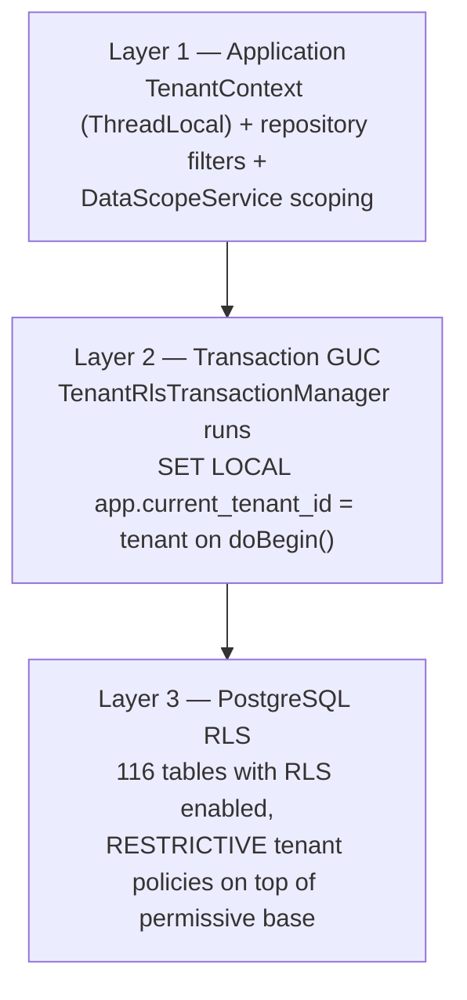
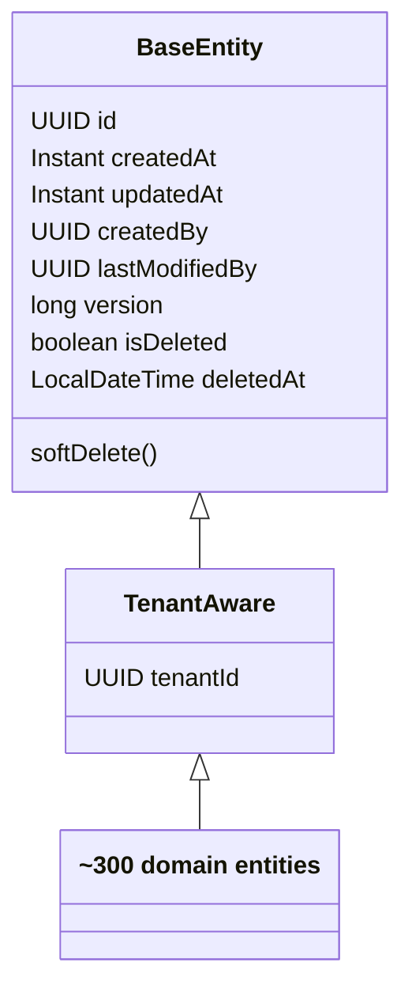
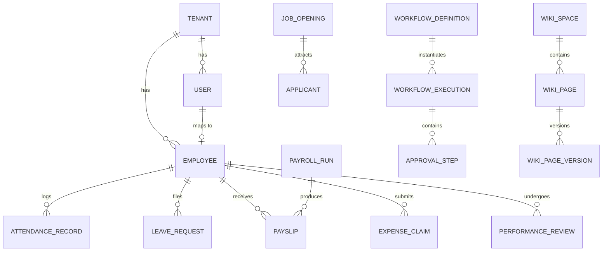

# Data Architecture

One PostgreSQL 16 database, one schema, all tenants. Isolation is layered: application
filters, a tenant GUC set per transaction, and PostgreSQL Row-Level Security policies.
Schema lifecycle is Flyway-only.

## 1. Schema lifecycle

- **Migrations:** `backend/src/main/resources/db/migration` — 271 versioned files,
  `V0__init.sql` (199 KB baseline generated from the original 244 entities) through
  `V271__encrypt_benefit_dependent_dob.sql`. Naming: `V<number>__<description>.sql`.
- **Rule:** Flyway is the only schema mechanism (Liquibase was retired). JPA never
  generates DDL.
- **Execution:** Flyway always connects through the **direct** (non-pooled) database
  endpoint — advisory locks do not survive PgBouncer transaction pooling.
- CI clean-applies V0→latest against `postgres:16` via Testcontainers on every run.

## 2. Tenancy and Row-Level Security

### 2.1 The invariant

Every one of the **342 tables** carries `tenant_id UUID NOT NULL`. Isolation enforcement:

### 2.2 How the GUC is managed

| Component | Scope | Behavior |
|-----------|-------|----------|
| `TenantRlsTransactionManager` | Transaction-local (`set_config(…, true)` = `SET LOCAL`) | Set on every transaction begin; reset on cleanup. The primary mechanism. |
| `TenantAwareDataSourceConfig` | Session (`set_config(…, false)`) **with RESET on every checkout** | Defense-in-depth for raw-JDBC paths outside JPA transactions; wraps both primary and replica pools. |

**Hard rule:** transaction-local (`true`) everywhere. Session-scoped GUCs leak across
pooled connections — this caused a real cross-tenant read finding (fixed in commit
`0ea63f6e`). The ArchUnit guard `RlsTenantGucScopeTest` scans production sources and fails
the build on any session-scoped caller other than the allowlisted
`TenantAwareDataSourceConfig`.

### 2.3 Policy design

- 116 `ENABLE ROW LEVEL SECURITY` statements; 18 `CREATE POLICY` statements
  (V36 reinstatement wave, hardened in V179).
- Strategy: a PERMISSIVE allow-all base policy plus **RESTRICTIVE** tenant-match policies.
  When `app.current_tenant_id` is unset (Flyway, health checks, system jobs) the
  restrictive policy does not constrain — "graceful defense-in-depth."
- **Production requirement:** the application must connect as `nu_app_rls`, a
  non-superuser role **without** `BYPASSRLS` (V179). Superuser connections bypass RLS
  silently. `RLS_PROBE_FAIL_ON_BYPASS=true` makes the app refuse to start if its role can
  bypass RLS. Roadmap hardening: `FORCE ROW LEVEL SECURITY` per table.

## 3. Entity model

~319 JPA entities (Hibernate 6.4 via Spring Boot 3.5.14). Common hierarchy:

- **Auditing:** Spring Data JPA auditing (`@CreatedDate`, `@LastModifiedBy` via
  `JpaAuditingConfig`); optimistic locking with `@Version`.
- **Soft delete:** `softDelete()` sets `is_deleted` + timestamp. Entity-level filters
  exclude deleted rows; **native queries must add `AND is_deleted = false` explicitly**
  (Hibernate filters don't apply to native SQL). On Hibernate 6 use `@SQLRestriction`,
  not the removed `@Where`.
- **`TenantEntityListener`** populates `tenant_id` from `TenantContext` on persist, so
  application code can't forget it.

## 4. Domain table families (342 tables)

| Family | Representative tables | ~Count |
|--------|----------------------|-------:|
| Employees & HR core | `employees`, `employee_skills`, `employee_loans`, `employee_pf_records`, `employment_change_requests` | 15 |
| Attendance & shifts | `attendance_records`, `attendance_time_entries`, `shift_assignments`, `shift_swap_requests` | 8 |
| Leave | `leave_requests`, `leave_balances`, `leave_types`, `comp_off_requests`, `restricted_holidays` | 8 |
| Payroll | `payroll_runs`, `payslips`, `payroll_components`, `salary_structures`, `salary_revisions` | 12 |
| Performance & OKR | `performance_reviews`, `review_cycles`, `goals`, `key_results`, `feedback_360_responses` | 12 |
| Recruitment | `job_openings`, `applicants`, `interviews`, `interview_scorecards`, `recruitment_agencies`, `background_verifications` | 10 |
| Travel & expenses | `expense_claims`, `expense_items`, `travel_requests`, `mileage_logs` | 8 |
| Knowledge (Fluence) | `wiki_spaces`, `wiki_pages`, `wiki_page_versions`, `blog_posts`, `blog_comments` | 10 |
| Notifications | `notifications`, `notification_templates`, `multi_channel_notifications`, `user_notification_preferences` | 8 |
| Workflow engine | `workflow_definitions`, `workflow_executions`, `approval_steps`, `approval_delegates` | 8 |
| Audit & compliance | `audit_logs`, `compliance_audit_logs`, `dsr_requests` | 6 |
| Access control | `users`, `roles`, `permissions`, `role_permissions`, `api_keys` | 10 |
| Config & org | `tenant_settings`, `departments`, `designations`, `office_locations`, `holidays`, `benefit_plans` | 15 |
| Analytics | `analytics_metrics`, `dashboard_widgets`, `report_definitions`, `report_executions` | 8 |
| Onboarding | `onboarding_processes`, `onboarding_tasks`, `preboarding_candidates` | 6 |
| Other (LMS, wellness, assets, surveys, flags…) | `lms_courses`, `lms_enrollments`, `wellness_challenges`, `assets`, `surveys`, `feature_flags` | 60+ |

Core relationship sketch (illustrative, not exhaustive):

## 5. PII encryption

Sensitive columns are encrypted at rest with AES-256-GCM via `EncryptedStringConverter`
(KMS-wrapped data-encryption key per tenant). Covered columns include
`users.mfa_secret`; employee personal email, phone, emergency contact, DOB, addresses,
bank account/IFSC, tax ID; benefit-dependent PII (V271 extended DOB coverage);
`tax_declarations.pan` (V147 backfill). Logs mask PII via `PiiMaskingLogstashEncoder`
(email/phone/PAN/Aadhaar patterns).

## 6. Connection management

| Setting | Value | Why |
|---------|-------|-----|
| Pool | HikariCP, max 8 / min idle 2 (env-overridable) | Sized for Neon pooled endpoint |
| Endpoint (app) | Neon **pooled** (PgBouncer transaction mode) | Serverless-friendly |
| Endpoint (Flyway) | Neon **direct** | Advisory locks need a stable session |
| Prepared statements | Disabled (`prepareThreshold=0`) | Server-side prepares break under transaction-mode PgBouncer |
| Connection init | `SET app.current_tenant_id = ''; SET statement_timeout = '120s'` | Clean tenant state + runaway-query guard |
| Leak detection | 60 s threshold | Surfaces connection leaks in logs |
| Read replica | `RoutingDataSourceConfig` — `@Transactional(readOnly=true)` routes to replica when `SPRING_DATASOURCE_REPLICA_URL` is set | Optional scale-out; tenant GUC wrapper applies to both pools |

## 7. Redis cache tiers

`CacheConfig` defines tenant-prefixed named caches
(`tenant:<tenantId>:<class>.<method>:<params>`), JSON-serialized, null-caching disabled,
with graceful bypass to the database on Redis failure:

| TTL | Caches |
|-----|--------|
| 24 h | `leaveTypes`, `designations`, `shiftPolicies`, `holidays`, `permissions`, `roles` |
| 4 h | `departments`, `officeLocations`, `benefitPlans`, `tenantSettings`, `tenantAttendanceConfig`, `featureFlags` |
| 1 h | `webhooks`, `analyticsSnapshot` (default tier) |
| 30 m | `activeWebhooks` |
| 15 m | `employeeBasic`, `employees`, `rolePermissions` |
| 10 m | `employeeWithDetails` |
| 5 m | `leaveBalances`, `analyticsSummary`, `dashboardMetrics` |
| 30 s | `tenantStatus` (hot path: JWT filter), `unreadCountByUser` (bell poll) |

`CacheWarmUpService` pre-loads the five long-lived caches per tenant at startup.

## 8. Search index

Single Elasticsearch index `fluence-documents` (1 shard, 0 replicas), populated
asynchronously from the `nu-aura.fluence-content` Kafka topic. Document identity is
`contentType_contentId`; fields include `tenantId` (keyword — every query filters on it),
title/excerpt/bodyText (text), tags/space/category (keyword), counters, timestamps, and a
soft-delete flag. Elasticsearch is opt-in (`app.elasticsearch.enabled`); when disabled,
wiki search falls back to Postgres `pg_trgm` GIN indexes.
