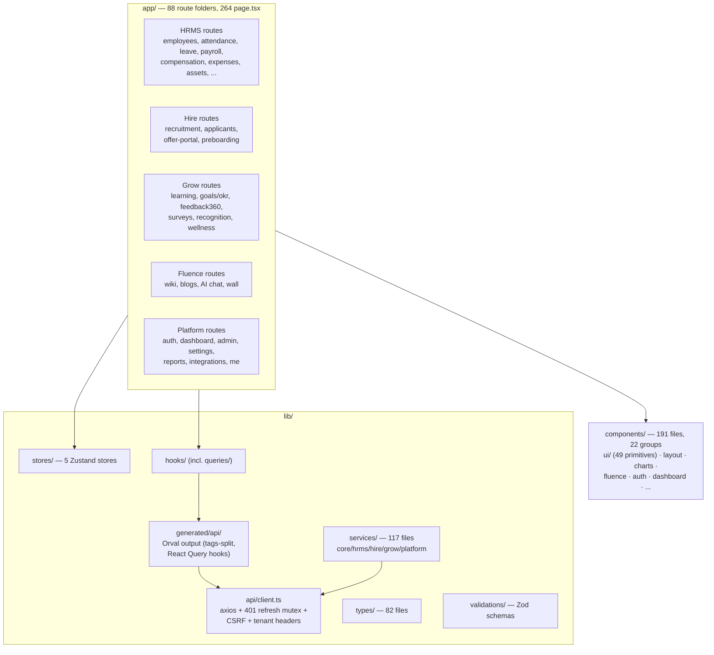
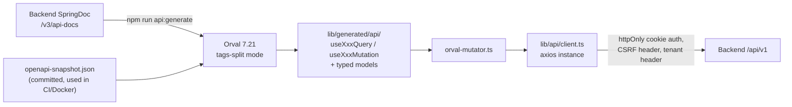

# Frontend Architecture

Next.js 16.2.7 (App Router, standalone output) with React 19.2.7 and TypeScript 6 in
strict mode. UI is Mantine 9.2.2 themed through a token-driven design system bridged into
Tailwind CSS 3.4.

## 1. Structure

## 2. Data flow: OpenAPI-first

The backend OpenAPI spec is the single source of truth for the API layer:

- **`lib/api/client.ts`** — the one axios instance. Implements a shared 401 refresh mutex
  (concurrent 401s trigger exactly one token refresh), CSRF token echo, tenant header
  injection. `public-client.ts` exists for unauthenticated routes (career page, offer
  portal).
- **React Query (TanStack 5.100)** owns all server state — components never cache API
  responses in Zustand.
- **Zustand 4.4** holds client-only state in 5 stores (`useUiStore`, `useThemeStore`,
  `useNotificationStore`, plus auth/session helpers), with `persist` middleware for
  sidebar/theme only.
- **Forms** — React Hook Form 7.49 + Zod 3.23 resolvers; shared schemas in
  `lib/validations/`.
- **Real-time** — `lib/services/websocket.ts`: STOMP 7.2 over SockJS with reconnect and
  message queuing, fed by the backend's Redis-relayed STOMP broker.

## 3. Security in the frontend

- **`proxy.ts` middleware** is the single source of CSP (per-request nonce) plus auth
  gating. `next.config.js` adds the static OWASP headers: `X-Frame-Options: DENY`,
  `nosniff`, HSTS (preload), and a restrictive Permissions-Policy.
- Auth tokens never touch JavaScript: JWT lives in httpOnly cookies; the client only
  handles the non-httpOnly CSRF cookie.
- `/api/v1/*` and `/ws/*` are proxied to the backend origin via Next rewrites, keeping the
  app same-origin in the browser.
- HTML from rich-text sources is sanitized with DOMPurify 3.3 before rendering.
- RBAC: route/permission mapping declared in `nu-rbac.config.ts`, verified continuously by
  a dedicated Playwright RBAC sweep.

## 4. Design system — "Studio Slate v2" / AURA contract

Authoritative contract: `frontend/AURA_CONTRACT.md`; tokens in `app/globals.css`
(light + dark), bridged to Tailwind via `tailwind.config.js` and to Mantine via
`styles/mantine-theme.ts`.

| Token family | Examples |
|--------------|----------|
| Accent scale | `--aura-accent-50…950` (anchor 700, Lapis blue); semantic `--accent`, `--accent-soft` |
| Product colors | `--prod-hrms`, `--prod-hire`, `--prod-grow`, `--prod-fluence` |
| Status | `--ok-*`, `--warn-*`, `--err-*`, `--info-*`, `--neutral-*` (bg/fg/border triplets) |
| Charts | `--chart-1…5`, `--chart-axis`, `--chart-grid` (consumed by Recharts 3.8) |
| Radii | `--r-xs(5)…--r-2xl(22)`, `--r-control(10)` for buttons/inputs |
| Shadows | `--sh-xs…--sh-pop`, `--sh-focus`, `--ring` |
| Motion | `--t-fast(120ms)`, `--t-base(180ms)`, `--t-slow(280ms)`, ease-out curves |
| Type | Open Sans (body), Montserrat (display), Roboto Mono (numerics, tabular-nums) |

Rules enforced by `npm run lint:design-system` (`scripts/check-styling-drift.mjs`):
**no hardcoded hex colors, spacing, or radii** — everything flows from tokens. Banned
patterns (side-stripe cards, gradient text, nested cards, hero-metric templates,
modal-first flows) are listed in `DESIGN.md`.

Accessibility baseline: WCAG 2.1 AA; visible focus rings on every focusable element;
`prefers-reduced-motion: reduce` collapses every animation to 0 ms; status is always
color + label + icon; 36 px compact controls on desktop, 44×44 px targets on touch.

## 5. Component organization

- `components/ui/` — 49 locked primitives (Button, Input, Card, DataTable, Tabs, Modal…)
  composed from Mantine + Radix primitives and AURA tokens. Primitive APIs are owned by
  the design-system layer; feature work composes, never forks, them.
- Feature groups (`dashboard/`, `fluence/`, `charts/`, `recruitment/`, `payroll/`,
  `wall/`, `motion/`, `errors/` …) hold page-specific composition.
- Charts are Recharts wrappers bound to `--chart-*` tokens so both themes stay coherent.

## 6. Testing

| Layer | Tooling | Scope |
|-------|---------|-------|
| Unit | Vitest (jsdom) + Testing Library | 26 test files; 60% coverage threshold; setup mocks next/navigation, next/image, observers |
| E2E | Playwright (Chromium + Firefox) | 126 specs in `e2e/`; screenshots/video/trace on failure |
| RBAC sweep | Playwright via `nu-rbac.config.ts` | Every route × role permission matrix |
| Design drift | `lint:design-system` script | Blocks hardcoded styling |
| Static | ESLint (`--max-warnings=0`) + `tsc` strict | CI-gated |

## 7. Build and runtime

- `next.config.js`: standalone output; `optimizePackageImports` for Mantine, Radix,
  TanStack, Recharts, Framer Motion, lucide; AVIF/WebP images with 7-day cache TTL;
  allowlisted remote image hosts (Google OAuth avatars, Drive, S3/CloudFront, LinkedIn).
- Docker: multi-stage Node 20 Alpine build; Orval codegen from the committed
  `openapi-snapshot.json` during image build; non-root runtime user; port 3000.
- Environment variables: `NEXT_PUBLIC_API_URL`, `NEXT_PUBLIC_GOOGLE_CLIENT_ID`,
  `NEXT_PUBLIC_ENABLE_WEBSOCKET`, `NEXT_PUBLIC_DEMO_MODE`,
  `NEXT_PUBLIC_PAYMENTS_ENABLED`, `ALLOW_INSECURE_RELEASE_API_URL` (CI-only escape hatch).
- Heavy libraries (charts, editor) are route-level imports so the first-load JS budget
  (< 300 KB gzipped) holds.
