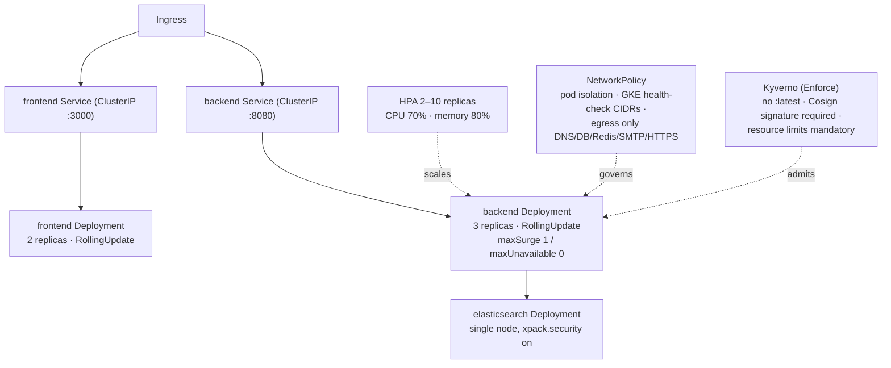
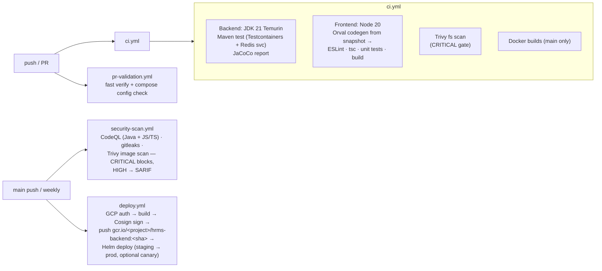

# Infrastructure & CI/CD

The same two containers (backend, frontend) run in three deployment shapes: local Docker
Compose, beta (Vercel + Render), and the GKE production path. CI builds, scans, signs, and
ships them.

## 1. Environments

| Environment | Frontend | Backend | Data plane |
|-------------|----------|---------|------------|
| Local dev | `next dev` on :3000 | Spring Boot on :8080 | Compose: Redis 7 (:6380), Kafka/Zookeeper 7.6.0, Elasticsearch 8.11, Prometheus 2.53, Grafana 11.2 (:3001), AlertManager 0.27; Postgres on Neon cloud |
| Beta | Vercel — live at `hrms-frontend-vert.vercel.app` (auto-deploy on main) | Render blueprint (`render.yaml`): Docker runtime, health check `/actuator/health/readiness` | Render Postgres 16 + Key-Value (free tier: no Elasticsearch, 512 MB heap, `APP_SCHEDULING_ENABLED=false`) |
| Production path | GKE (Helm) | GKE (Helm) | Postgres 16 (RLS-enforced role), Redis, Elasticsearch with `xpack.security` on |

`docker-compose.prod.yml` adds the production hardening locally testable: Postgres 16 with
an init container creating the `nu_app_rls` NOBYPASSRLS role, secured Elasticsearch, no
externally exposed data ports, and `RLS_PROBE_FAIL_ON_BYPASS=true` on the backend.

## 2. Kubernetes topology

- Manifests: `infra/deployment/kubernetes/` (namespace, deployments, services, ingress,
  HPA, NetworkPolicy, ConfigMap/Secrets).
- Helm chart: `infra/deployment/helm/hrms` (Chart v1.0.0, appVersion 2.5.0, kubeVersion
  ≥ 1.27) parameterizes registry, tags, replicas, resources, and JVM options, with
  `values-prod.yaml` / `values-staging.yaml` overlays and a PodDisruptionBudget
  (minAvailable 1).
- Probes: backend startup probe up to 300 s (cold JVM), readiness 30 s initial / 5 s
  period, liveness 120 s initial; graceful shutdown 60 s
  (`server.shutdown=graceful` + matching `terminationGracePeriodSeconds`).

## 3. CI/CD pipelines (GitHub Actions)

Gates that block merge/deploy:

1. Backend suite green (304 test files; Testcontainers Postgres 16 clean-applies all
   Flyway migrations; Redis service container).
2. Frontend lint (`--max-warnings=0`), typecheck, unit tests, production build.
3. Trivy CRITICAL findings (vuln scanner; secrets are gitleaks' job).
4. gitleaks: any secret match fails.
5. Architecture guards inside the test suite (ArchUnit, `RlsTenantGucScopeTest`).

Supply chain: images are tagged by git SHA, signed with Cosign 2.2.4 in CI, and verified
at admission by Kyverno; `:latest` is rejected cluster-side.

## 4. Render blueprint (backend beta hosting)

`render.yaml` provisions: Postgres 16 (`nu-aura-postgres`), Key-Value Redis
(`nu-aura-redis`), backend (Docker, auto-deploy, readiness health check), frontend
(Docker). Free-tier constraints are explicit: no Elasticsearch (search falls back to
Postgres), 512 MB heap (schedulers disabled via `APP_SCHEDULING_ENABLED=false`), and the
`nu_app_rls` NOBYPASSRLS role must be created post-provision before pointing the app at
the database. Walkthrough: `docs/runbooks/render-backend-deploy.md`.

Backend env contract (names only): `SPRING_PROFILES_ACTIVE`, `SPRING_DATASOURCE_*`
(pooled endpoint), `FLYWAY_*` (direct endpoint), `SPRING_REDIS_*`, `JWT_SECRET`,
`RLS_PROBE_FAIL_ON_BYPASS`, `APP_SCHEDULING_ENABLED`, `PROMETHEUS_SCRAPE_TOKEN`,
`APP_SLACK_SIGNING_SECRET`, `APP_STORAGE_PROVIDER`, `GOOGLE_DRIVE_CREDENTIALS_PATH`,
`GOOGLE_DRIVE_ROOT_FOLDER_ID`, `JAVA_TOOL_OPTIONS`.

## 5. Container images

| Image | Base | Notes |
|-------|------|-------|
| Backend | Eclipse Temurin 21 (multi-stage Maven build) | G1GC tuning via `JAVA_TOOL_OPTIONS`; CVE-patched dependency pins in `pom.xml` |
| Frontend | Node 20 Alpine (multi-stage) | Standalone Next output; Orval codegen at build; non-root `nodejs:1001`; API URL baked per environment |

## 6. Secrets and configuration

- Runtime secrets come from environment (K8s Secrets / Render env / Vercel env) — never
  from the repo; `.env.example` documents required names.
- Flyway and the application intentionally use **different database URLs** (direct vs
  pooled) — see [data.md](data.md) §6.
- `configmap.yaml` carries non-secret config; Helm values inject per-environment
  differences.
- gitleaks runs per commit and in CI as the enforcement backstop.
