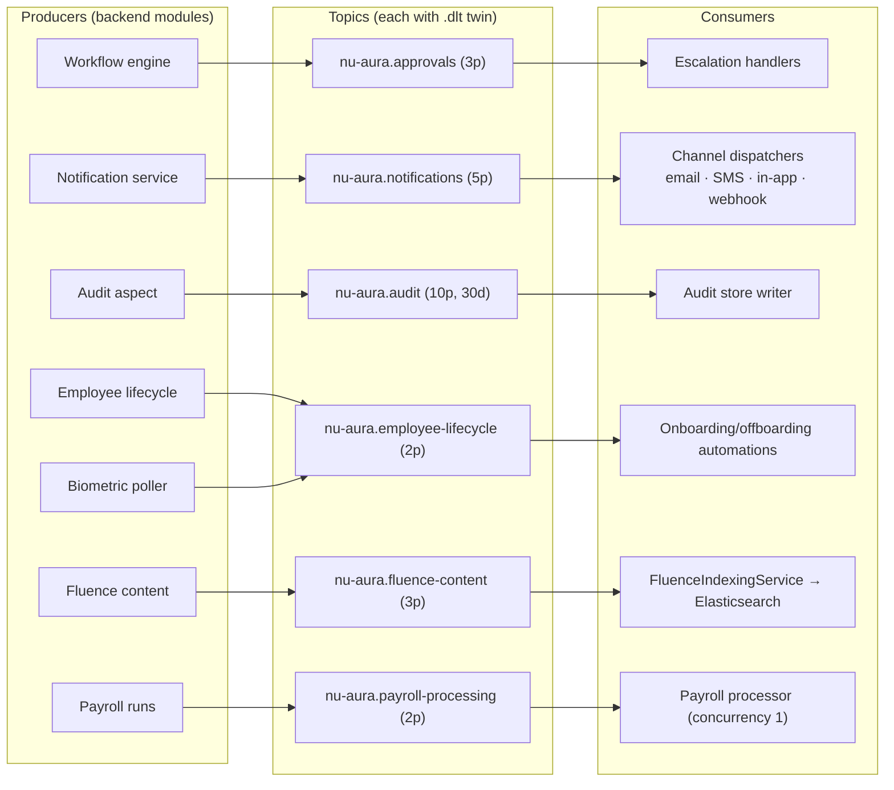
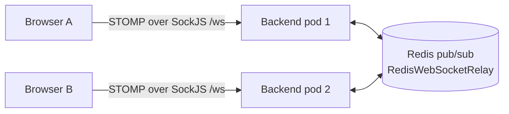

# Integration Architecture

How NU-AURA's internal async backbone (Kafka, WebSocket, Elasticsearch) and external
integrations (Google, email/SMS, Slack, job boards, webhooks) fit together.

## 1. Eventing (Kafka)

Reliability contract (`infrastructure/kafka/KafkaConfig.java`):

- **Producers:** idempotent, `acks=all`, snappy compression, 3 retries with backoff.
- **Consumers:** manual commit; concurrency 3 (payroll fixed at 1 for ordering);
  exponential retry 1 s → 5 s → 25 s, then dead-letter to `<topic>.dlt` (7-day retention).
  DLT recovery procedure: `docs/runbooks/kafka-dead-letter.md`.
- **Idempotency:** `IdempotencyService` dedups deliveries via Redis `SETNX` (24 h TTL).
- **Tenancy:** `TenantContextRecordInterceptor` re-establishes `TenantContext` from the
  event payload before any consumer logic runs.

## 2. Real-time (WebSocket/STOMP)

- STOMP broker config in `infrastructure/websocket/`; authentication enforced at the
  STOMP layer (`WebSocketSecurityConfig`), sessions tracked in a registry.
- `RedisWebSocketRelay` broadcasts messages across pods so a notification produced on one
  pod reaches sessions connected to another.
- Graceful shutdown broadcasts `/topic/system.shutdown` so clients reconnect cleanly.
- Frontend client: `lib/services/websocket.ts` (STOMP 7.2 + SockJS, reconnect + queue),
  toggled by `NEXT_PUBLIC_ENABLE_WEBSOCKET`.

## 3. Search indexing pipeline (NU-Fluence)

Content writes (wiki pages, blogs, templates) publish to `nu-aura.fluence-content`;
`FluenceIndexingService` consumes and upserts `FluenceDocument` records into the
`fluence-documents` index (document ID `contentType_contentId`, tenant-filtered queries).
Reads go through `FluenceSearchService`. Elasticsearch is optional
(`app.elasticsearch.enabled`); without it, search degrades to Postgres `pg_trgm`.

## 4. Google Workspace

| Integration | Mechanism | Config |
|-------------|-----------|--------|
| OAuth login | `@react-oauth/google` frontend + backend token verification | `NEXT_PUBLIC_GOOGLE_CLIENT_ID` |
| Drive storage | `GoogleDriveStorageProvider` — tenant-scoped folders, signed URLs (24 h expiry) | `GOOGLE_DRIVE_CREDENTIALS_PATH`, `GOOGLE_DRIVE_ROOT_FOLDER_ID`, `APP_STORAGE_PROVIDER` |
| Calendar sync | Google Calendar API v3 (interview scheduling, 1:1s) | Service credentials |

Drive isolation was an audit focus: per-tenant folder roots, no cross-tenant link
exposure, orphan cleanup via `OrphanFileCleanupScheduler`.

## 5. Messaging channels

| Channel | Stack | Notes |
|---------|-------|-------|
| Email | Spring Mail (SMTP, TLS 587) + Thymeleaf templates | Batch dispatch via `EmailSchedulerService` consuming notification events |
| SMS | Twilio SDK 10.1.0 | MockMode in dev; MessagingService SID support |
| In-app | Notification entities + WebSocket push + 30 s unread-count cache | |
| Slack | Webhook integration (`APP_SLACK_SIGNING_SECRET` for inbound verification) | Also the AlertManager alert channel |

All channels fan out from the single `nu-aura.notifications` topic, so a notification is
authored once and dispatched per user channel preference.

## 6. Outbound webhooks (tenant-facing)

- Tenants register webhook endpoints per event type; payloads are HMAC-SHA256 signed with
  a per-tenant secret.
- Delivery is async with scheduled retry (`WebhookDeliveryService`) and health tracking
  (`WebhookHealthIndicator`); active webhook configs are cached (30 m TTL).
- Inbound provider webhooks land at `/api/v1/integrations/{provider}/webhook` with
  signature verification.

## 7. Job boards and talent integrations

`JobBoardIntegrationService` (scheduled) syncs job postings to Naukri, Indeed, and
LinkedIn. Recruitment additionally integrates BGV (background verification) and
e-signature flows for offers, plus the public offer portal and career page (served from
`/api/v1/public/**`, no auth, rate-limited).

## 8. Biometric attendance

Biometric devices are polled every 2 minutes (ShedLock-guarded `@Scheduled` job); punches
enter the platform as employee-lifecycle events and feed attendance records, with
auto-regularization correcting missing punches.

## 9. External API for machines

`/api/v1/external/**` exposes a partner-facing API authenticated by `X-API-Key`
(hashed, scoped keys). Versioning is header-based (`X-API-Version`, with `X-API-Deprecated`
and `Sunset` signaling deprecation). The OpenAPI document at `/v3/api-docs` is the
authoritative contract — the same one Orval consumes for the first-party frontend.
