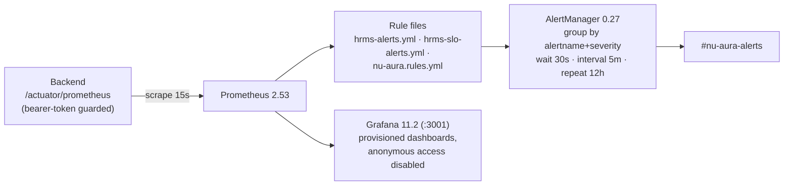

# Observability

Prometheus scrapes the backend; Grafana visualizes; AlertManager routes to Slack. Logs are
structured JSON with PII masking; tracing is W3C-propagated with optional OTLP export.

## 1. Pipeline

Config lives in `infra/monitoring/` (`prometheus.yml`, `alertmanager/alertmanager.yml`,
`prometheus/rules/`, Grafana provisioning).

## 2. Metrics

- **Exporter:** Micrometer → Prometheus registry; HTTP latency histograms with explicit
  percentile buckets (50/100/200/500 ms, 1 s, 2 s); common tags `application`, `region`.
- **Scrape auth:** custom bearer token (`PROMETHEUS_SCRAPE_TOKEN`), timing-safe
  comparison — metrics are never anonymous.
- **Domain metrics:** `api_errors_total`, `auth_login_total{status}`,
  `rate_limit_exceeded_total`, `active_users`, `payroll_processed_total`, plus HikariCP,
  JVM, Kafka consumer, and cache metrics from Micrometer binders.

## 3. Alert rules

| Alert | Condition | Severity |
|-------|-----------|----------|
| ApplicationDown | `up{job="hrms-backend"} == 0` for 1 m | critical |
| HighErrorRate | error rate > 5% over 5 m | warning |
| HighAPILatency | p95 > 2 s over 5 m | warning |
| DatabaseConnectionPoolLow | active/max Hikari > 0.8 for 5 m | warning |
| HighMemoryUsage | JVM heap > 85% for 5 m | warning |
| HighFailedLoginRate | failed logins > 0.1/s over 5 m | warning |
| HighRateLimitExceeded | rejections > 0.5/s over 5 m | info |
| LowActiveUsers | `active_users < 5` for 10 m | info |
| PayrollProcessingDelayed | no payroll processed in 24 h window (2 h hold) | warning |

SLO-style burn alerts live in `hrms-slo-alerts.yml` alongside the base rules.

## 4. Health checks

- Actuator exposes `health`, `info`, `metrics`, `prometheus`; liveness/readiness probe
  groups are enabled for K8s.
- Custom indicators: `ApplicationHealthIndicator`, `DatabaseHealthIndicator`,
  `RedisHealthIndicator` (PING + memory + latency), `WebhookHealthIndicator`; built-ins
  for `db`, `redis`, `diskSpace` (> 1 GB).
- Deployment health gates: Render uses `/actuator/health/readiness`; K8s startup probe
  tolerates 300 s cold JVM start.

## 5. Logging

- JSON logs via Logstash Logback Encoder 7.4.
- **PII masking:** `PiiMaskingLogstashEncoder` masks email, phone, PAN, and Aadhaar
  patterns before emission.
- Authorization denials log at WARN with actor/resource/action; audit-grade events go to
  Kafka (`nu-aura.audit`), not application logs — see
  [security.md](security.md) §7 for retention.
- App log retention: 90 days.

## 6. Tracing

- Micrometer Tracing with W3C Trace Context propagation across HTTP, JDBC, and Kafka.
- Optional OTLP exporter (default 10% sampling) for Tempo/Jaeger/Grafana Cloud — disabled
  unless an endpoint is configured.

## 7. Dashboards and access

- Grafana is provisioned from `infra/monitoring/` (read-only mount); login required
  (anonymous + signup disabled; admin password injected via `GRAFANA_ADMIN_PASSWORD`,
  fail-closed with no default).
- Grafana binds :3001 locally because :3000 belongs to the frontend.
- The in-product monitoring module surfaces operational metrics to SUPER_ADMIN users.
