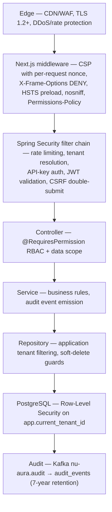
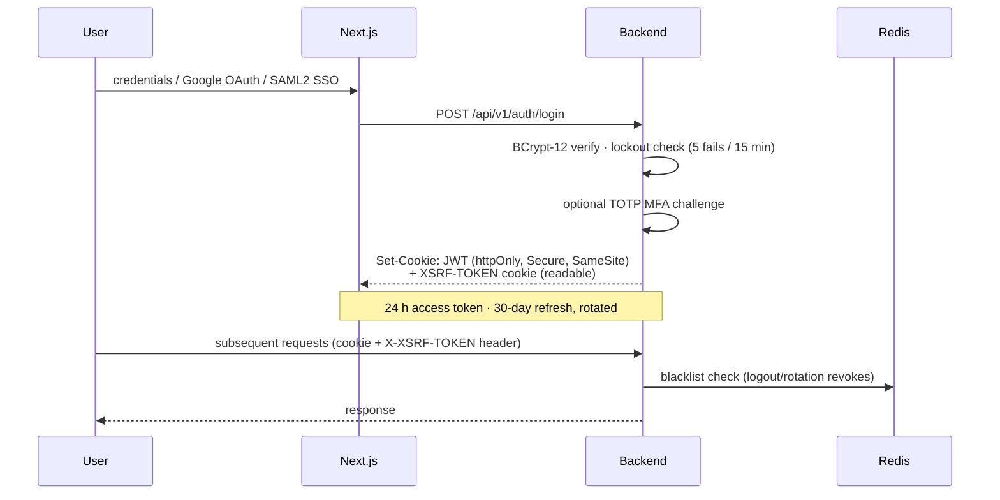

# Security Architecture

Defense in depth around four crown jewels: tenant isolation, PII/compensation data,
authentication credentials, and audit-trail integrity. Baseline ownership and scan cadence
live in `docs/security/baseline.md`; this document is the architectural view.

## 1. Defense layers

## 2. Authentication

- **Mechanisms:** password (policy: 12+ chars, complexity, history 5, 90-day max age),
  Google OAuth 2.0, per-tenant SAML2 SSO (`DynamicSamlRelyingPartyRegistrationRepository`),
  TOTP MFA (secret AES-encrypted at rest).
- **Tokens:** JJWT 0.12.6, HS256 with env-provided `JWT_SECRET` (rotated quarterly,
  runbook `docs/runbooks/key-rotation.md`). JWTs carry roles only — permissions load from
  DB through the Redis permission cache, so permission changes apply without re-login.
- **Revocation:** `TokenBlacklistService` (Redis, in-memory fallback);
  `AccountLockoutService` enforces the lockout window.
- **Anonymized accounts** (post-GDPR-erasure) are rejected at both login and SSO.
- **Machine auth:** `X-API-Key` for `/api/v1/external/**`; scoped API keys stored hashed.
- **Demo credentials:** historical seed users with `Welcome@123` are neutralized by V270
  (suspend + hash-lock) whenever `DEMO_CREDENTIALS_ENABLED=false`; the production deploy
  gate requires prod profile + that flag + Flyway ≥ V270 (`docs/HANDOVER-DEPLOY.md`).

## 3. Authorization

- **Roles:** 9 canonical (SUPER_ADMIN, TENANT_ADMIN, HR_ADMIN, MANAGER, EMPLOYEE,
  RECRUITER, FINANCE, SYSTEM_ADMIN, HR sub-roles) plus per-tenant custom roles.
- **Permissions:** 500+ `MODULE:ACTION` strings enforced at controllers via
  `@RequiresPermission`; denials log actor/resource/action at WARN.
- **Data scope:** ALL / LOCATION / DEPARTMENT / TEAM / SELF / CUSTOM evaluated by
  `DataScopeService` — empty scope returns zero rows, never a SELF fallback.
- **SUPER_ADMIN** is the only cross-tenant principal; impersonation leaves an audit trail.
- **Drift control:** nightly RBAC drift detector alerts on permissions absent from the
  documented matrix; the Playwright RBAC sweep (`frontend/nu-rbac.config.ts`) checks every
  route × role in CI.

## 4. Tenant isolation

Summarized here; mechanics in [data.md](data.md):

1. Application: `TenantContext` ThreadLocal, propagated to async/Kafka/scheduled paths.
2. Transaction: `SET LOCAL app.current_tenant_id` per transaction
   (`TenantRlsTransactionManager`).
3. Database: RLS policies; production runs as `nu_app_rls` (no `BYPASSRLS`), with
   `RLS_PROBE_FAIL_ON_BYPASS=true` refusing startup on a bypass-capable role.
4. Build guard: `RlsTenantGucScopeTest` blocks session-scoped GUC writes.
5. Cache keys, rate-limit buckets, and Elasticsearch queries are all tenant-prefixed.
6. Nightly cross-tenant query detector pages on any hit.

## 5. Cryptography inventory

| Use | Algorithm | Key handling |
|-----|-----------|--------------|
| Passwords | BCrypt cost 12 | One-way |
| JWT signing | HMAC-SHA256 (HS256) | `JWT_SECRET` env; quarterly rotation |
| PII field encryption | AES-256-GCM | KMS-wrapped DEK per tenant |
| Webhook signatures | HMAC-SHA256 | Per-tenant secret |
| Export integrity | SHA-256 stamp | On all DSR exports |
| Transport | TLS 1.2+ | Edge/GCP-managed certs |
| Session cookie | httpOnly + Secure + SameSite | Browser-enforced |

## 6. Input and abuse controls

| Control | Configuration |
|---------|---------------|
| Rate limits | auth 5/min · API 100/min · exports 5/5 min · wall 30/min; per-IP, per-user, per-tenant (Bucket4j + Redis Lua) |
| Account lockout | 5 failed attempts / 15-minute window |
| Upload safety | Apache Tika content-type verification; OCR pipeline isolates parsing |
| Bulk import | `CellValueSanitizer` neutralizes spreadsheet formula injection |
| XSS | DOMPurify sanitization client-side; CSP nonce; no `dangerouslySetInnerHTML` of raw input |
| SQL injection | JPA parameter binding; native queries reviewed + soft-delete guarded |
| SSRF / redirects | Outbound integrations use allowlisted endpoints |
| Export exfiltration | Alert on exports > 1k rows |

## 7. Audit and retention

- Every write on regulated entities emits an `AuditEvent` → `nu-aura.audit` (10
  partitions) → audit store. Authentication events flow to a dedicated auth-audit stream.
- Retention: audit events **7 years** (monthly partitions, supports §139A legal hold),
  auth audit 1 year, app logs 90 days, scan results indefinitely.
- Audit records survive GDPR erasure (legal-hold carve-out) — PII inside event
  descriptions is the documented residual risk under legal review.

## 8. Vulnerability management

| Scan | Cadence | Gate |
|------|---------|------|
| Dependency CVEs (Maven + npm audit) | Per PR + nightly | Block Critical; Slack on High |
| SAST (SpotBugs, SonarQube) | Per PR + nightly | Block Security category |
| CodeQL (Java + JS/TS) | Weekly + main push | Report to Security tab |
| Container (Trivy) | Per build | **CRITICAL blocks** (exit 1); HIGH → SARIF report |
| Secrets (gitleaks) | Per commit + CI | Block any match |
| DAST (OWASP ZAP) | Weekly | Triage in 5 business days |
| Pentest | Annual + major release | Findings tracked to closure |

CVE budget: Critical patched within 24 h, High 7 days, Medium 30 days, Low quarterly
review. Current pinned CVE patches (Tomcat 10.1.55, Netty 4.1.133, PG driver 42.7.11,
BouncyCastle 1.84, commons-io 2.18.0, lz4 1.8.1) are recorded in `pom.xml`.

## 9. Compliance posture

| Regime | Status |
|--------|--------|
| GDPR (EU) — Art. 15/17/20 DSR | Compliant; 30-day SLA tooling in product |
| Indian DPDP Act | Compliant (PII encryption + masking + consent surfaces) |
| SOC 2 Type II | Audit in progress |
| ISO 27001 | Roadmap |
| India statutory payroll | PF/ESI/PT/TDS/LWF + Gratuity/Bonus Acts (see [PRD](../PRD.md) §5) |

## 10. Supply chain

Images are Cosign-signed in CI; Kyverno admission policies on the cluster enforce
signature verification, immutable tags (no `:latest`), and mandatory resource limits.
Frontend third-party surface is minimized (self-hosted fonts, no analytics trackers).
