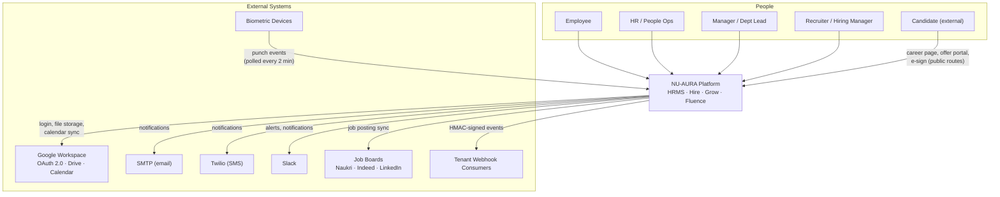
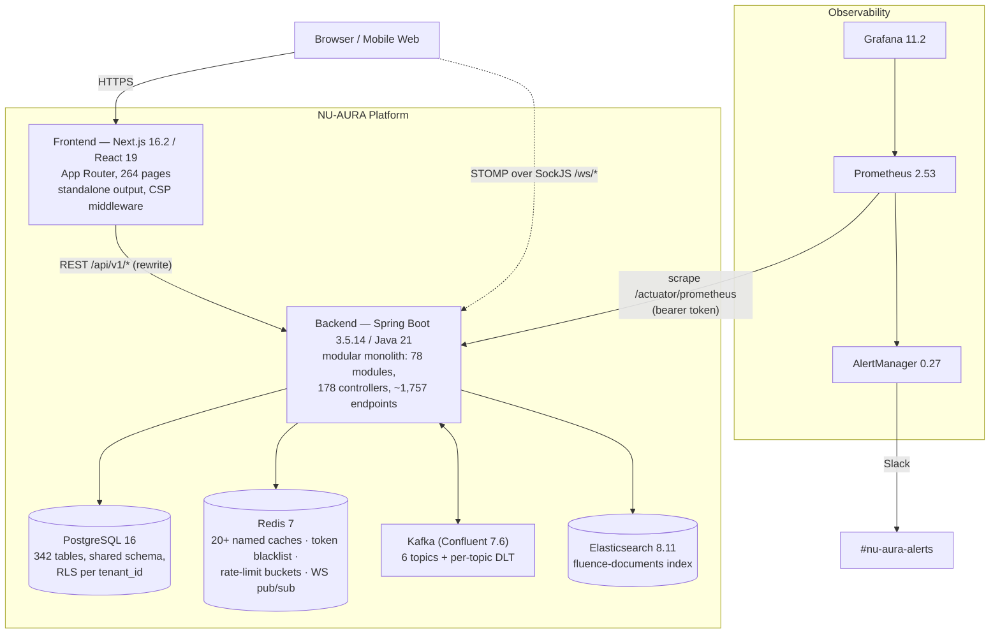
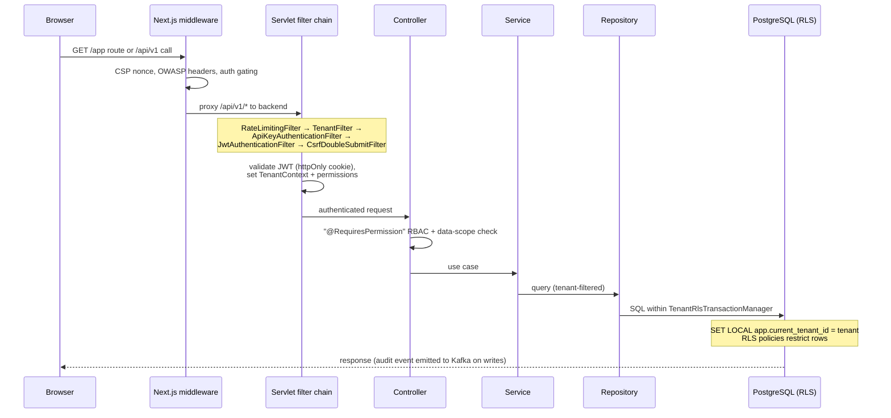

# System Overview

NU-AURA is a **modular monolith**: one Next.js frontend, one Spring Boot backend, one
PostgreSQL database shared by all tenants and isolated by Row-Level Security. Asynchronous
work flows through Kafka; Redis serves caching, rate limiting, and multi-pod fan-out;
Elasticsearch powers NU-Fluence search.

## 1. System context (C4 level 1)

## 2. Container diagram (C4 level 2)

**Why a monolith?** One deployable keeps transactions, RLS context, and the approval
workflow engine simple. Module boundaries are enforced in-package (ArchUnit tests) so a
future extraction along Kafka topic seams remains possible. See `docs/adr/` for the
decision record history.

## 3. Anatomy of a request

Every authenticated API call crosses these layers in order. Tenancy is established twice —
in the JWT filter (application scope) and on the database transaction (RLS scope).

## 4. Sub-app to module map

The four product surfaces share one backend; modules group as follows (78 total — the
representative ones):

| Surface | Backend modules |
|---------|-----------------|
| NU-HRMS | employee, attendance, shift, leave, payroll, tax, statutory, compensation, budget, expense, loan, payment, benefits, asset, document, helpdesk, announcement, organization, department, exit, probation, timetracking |
| NU-Hire | recruitment, referral, bgv, esignature, onboarding, preboarding, career |
| NU-Grow | performance, training/LMS, engagement, recognition, meeting, calendar |
| NU-Fluence | knowledge, wall, ai, search (Elasticsearch) |
| Platform | auth, user management, roles, admin, compliance/DSR, workflow, notification, webhook, integration, data import, migration, analytics, dashboard, monitoring, feature flags, public API, mobile API, websocket |

## 5. Asynchronous backbone

Kafka decouples write paths from slow or fan-out work. All topics have dead-letter twins
(`.dlt`, 7-day retention).

| Topic | Partitions | Retention | Purpose |
|-------|-----------:|-----------|---------|
| `nu-aura.approvals` | 3 | 24 h | Workflow approval events |
| `nu-aura.notifications` | 5 | 24 h | Multi-channel notification fan-out |
| `nu-aura.audit` | 10 | 30 d | Audit trail (high throughput) |
| `nu-aura.employee-lifecycle` | 2 | 24 h | Hire/exit/change events |
| `nu-aura.fluence-content` | 3 | 24 h | Elasticsearch indexing pipeline |
| `nu-aura.payroll-processing` | 2 | 24 h | Payroll runs (consumer concurrency = 1, serialized) |

Producers are idempotent (`acks=all`, snappy); consumers use manual commits with
exponential-backoff retry (1 s → 5 s → 25 s) before dead-lettering. Tenant context is
restored per record by `TenantContextRecordInterceptor`.

## 6. State stores and their jobs

| Store | Used for | Not used for |
|-------|----------|--------------|
| PostgreSQL 16 | System of record; 342 tables; RLS isolation; Flyway-managed schema | Search ranking, queues |
| Redis 7 | Tiered caches (30 s–24 h TTL), JWT blacklist, distributed rate limits (Bucket4j/Lua), idempotency keys, WebSocket cross-pod relay, edit locks | Durable data — every Redis consumer has a DB or in-memory fallback |
| Kafka | Async event transport, audit pipeline, payroll serialization | Request/response RPC |
| Elasticsearch | NU-Fluence full-text search (single `fluence-documents` index) | Source of truth — opt-in via `app.elasticsearch.enabled`; search degrades to pg_trgm when off |
| Google Drive | Tenant file storage (signed URLs, 24 h expiry) | Static assets |

## 7. Deployment shapes

The same containers run in three shapes (full detail in
[infrastructure.md](infrastructure.md)):

1. **Local dev** — Docker Compose (Redis, Kafka+Zookeeper, Elasticsearch, Prometheus,
   Grafana, AlertManager) with Neon cloud Postgres; backend and frontend run natively or
   under the `app` compose profile.
2. **Beta** — Frontend live on Vercel (`hrms-frontend-vert.vercel.app`); backend deployable
   to Render via `render.yaml` blueprint (free tier: no Elasticsearch, schedulers off).
3. **Production path** — GKE via Helm chart (`infra/deployment/helm/hrms`), HPA 2–10
   replicas, Kyverno admission policies, Cosign-signed images from GitHub Actions.
