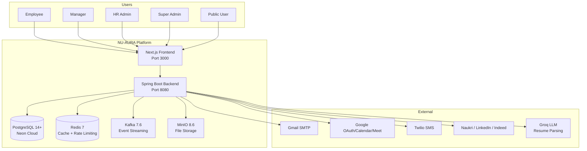
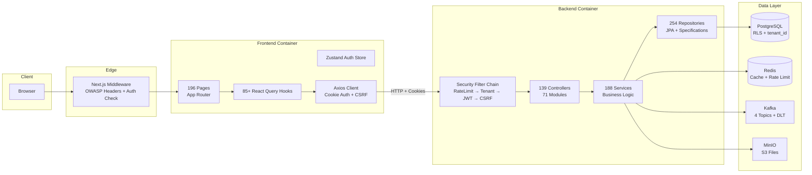
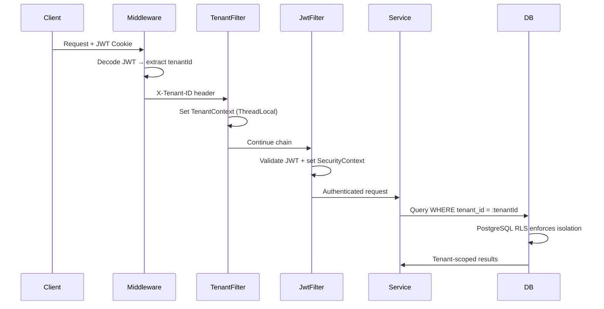
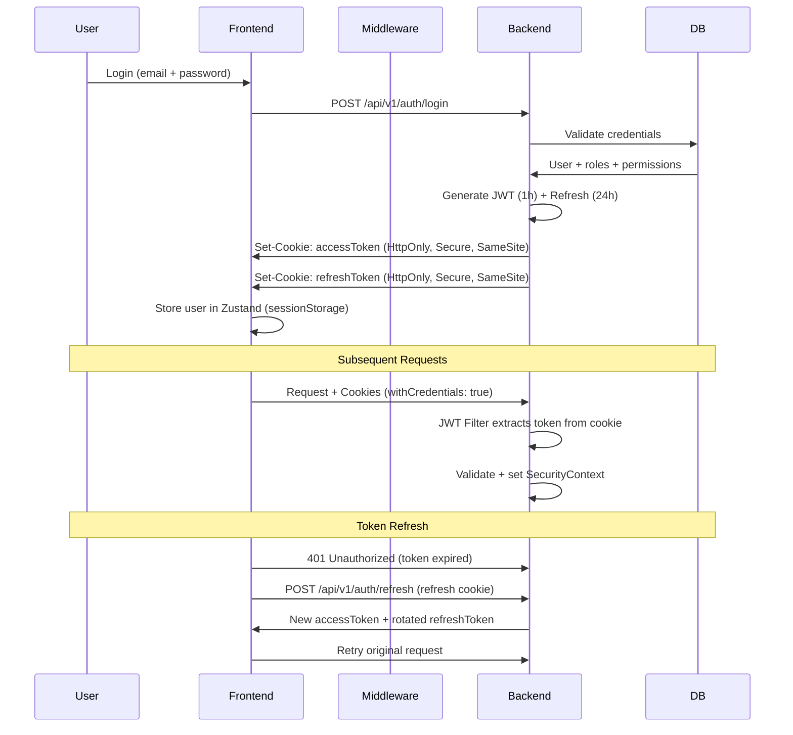
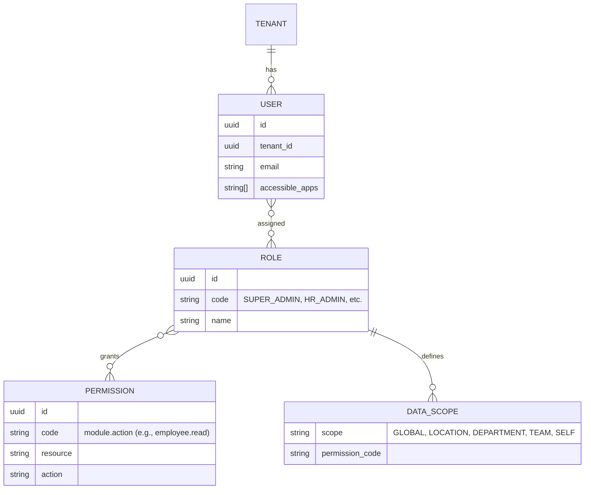
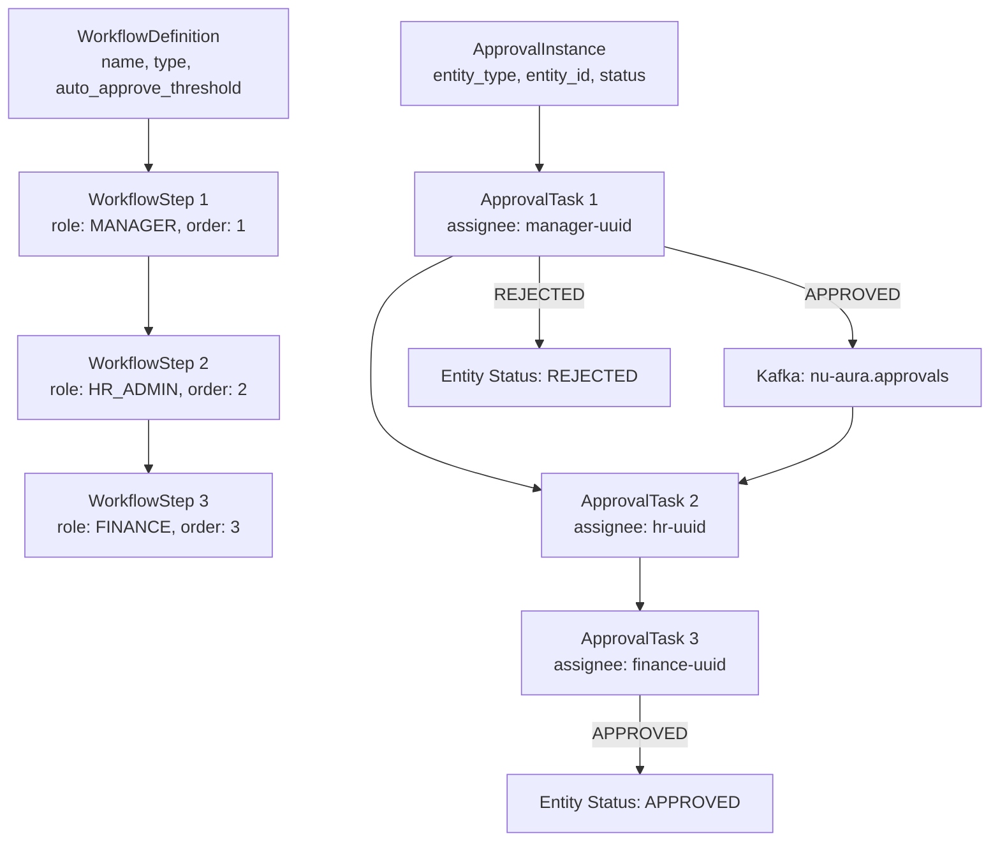
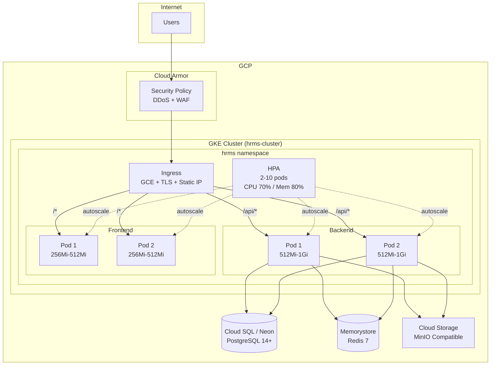
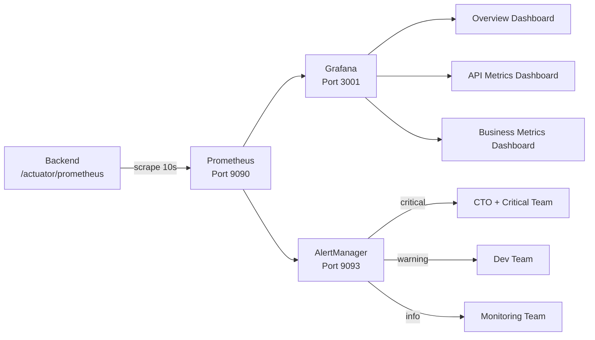
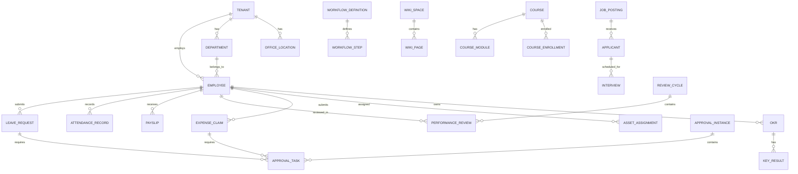
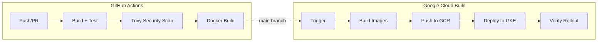

# NU-AURA Platform — System Design & Architecture

> Last updated: 2026-03-19 | Auto-maintained by SHDS

## System Context



---

## Container Architecture



---

## Multi-Tenant Architecture

### Strategy: Shared Database, Shared Schema



### Isolation Layers
1. **Application Layer**: `TenantContext` ThreadLocal, `TenantAwareAsyncTask` for background threads
2. **Query Layer**: JPA Specifications add `tenant_id` filter to all queries
3. **Database Layer**: PostgreSQL RLS policies (V36–V38) enforce at DB level
4. **Cache Layer**: Tenant-prefixed keys (`{tenantId}::{cacheName}::{key}`)

---

## Authentication Flow



---

## RBAC Data Model



### Data Scope Filtering
| Scope | Filter Applied |
|-------|---------------|
| GLOBAL / ALL | No additional filter |
| LOCATION | `WHERE office_location_id = :userLocationId` |
| DEPARTMENT | `WHERE department_id = :userDepartmentId` |
| TEAM | `WHERE team_id = :userTeamId` |
| SELF | `WHERE created_by = :userId OR employee_id = :userId` |
| CUSTOM | Custom JPA Specification |

---

## Approval Workflow Engine



---

## Payroll Processing Flow

```mermaid
graph TD
    INIT[Initialize Payroll Run<br/>month, year, tenant]
    FETCH[Fetch Employees<br/>active, not terminated]
    CALC[Calculate Components<br/>SpEL formulas, DAG order]

    subgraph SpEL Engine
        BASIC[Basic Salary]
        HRA[HRA = Basic * 0.4]
        DA[DA = Basic * 0.12]
        PF[PF = Basic * 0.12]
        TAX[Tax = f(gross, declarations)]
        NET[Net = Gross - Deductions]
    end

    DEDUCT[Apply Leave Deductions<br/>LOP from attendance]
    STATUTORY[Statutory Components<br/>PF, ESI, PT, TDS]
    PAYSLIP[Generate Payslips]
    APPROVE[Approval Workflow]
    DISBURSE[Mark Disbursed]

    INIT --> FETCH --> CALC
    CALC --> BASIC --> HRA --> DA --> PF --> TAX --> NET
    NET --> DEDUCT --> STATUTORY --> PAYSLIP --> APPROVE --> DISBURSE
```

---

## Deployment Architecture (GCP GKE)



### Kubernetes Resources
| Resource | File | Key Config |
|----------|------|-----------|
| Namespace | namespace.yaml | `hrms` with production labels |
| ConfigMap | configmap.yaml | 115 non-secret config values |
| Secrets | secrets.yaml | 80+ secret entries (template) |
| Backend Deployment | backend-deployment.yaml | 2 replicas, init container waits for DB |
| Frontend Deployment | frontend-deployment.yaml | 2 replicas, init container waits for backend |
| Backend Service | backend-service.yaml | ClusterIP, session affinity (3h) |
| Frontend Service | frontend-service.yaml | ClusterIP, session affinity |
| Ingress | ingress.yaml | GCE, static IP, managed cert, Cloud Armor |
| HPA | hpa.yaml | 2-10 pods, CPU 70% / Memory 80% |
| Network Policy | network-policy.yaml | Default deny + whitelist |

---

## Monitoring Architecture



### Alert Rules
| Alert | Condition | Severity |
|-------|-----------|----------|
| ApplicationDown | up == 0 for 1m | Critical |
| HighErrorRate | API errors > 5% for 5m | Warning |
| HighAPILatency | p95 > 2s for 5m | Warning |
| DatabaseConnectionPoolLow | usage > 80% for 5m | Warning |
| HighMemoryUsage | heap > 85% for 5m | Warning |
| HighFailedLoginRate | > 0.1/s for 5m | Warning |
| PayrollProcessingDelayed | none in 24h for 2h | Warning |

---

## Data Model Overview (Core Entities)



---

## CI/CD Pipeline



### Pipeline Steps
1. **Build**: Maven compile (backend) + npm ci + tsc + lint (frontend)
2. **Test**: JUnit + JaCoCo (backend) + vitest (frontend)
3. **Security**: Trivy filesystem scan (CRITICAL + HIGH)
4. **Docker**: Multi-stage builds (no push in CI, build validation only)
5. **Deploy** (Cloud Build): Build → Push GCR → Apply K8s manifests → Wait for rollout

---

## Architecture Decision Records (ADRs)

| ADR | Decision | Status |
|-----|----------|--------|
| ADR-001 | Multi-tenant shared DB + tenant_id + RLS | Accepted |
| ADR-002 | JWT in HttpOnly cookies + refresh rotation | Accepted |
| ADR-003 | Redis caching with tenant-prefixed keys + 1h TTL | Accepted |
| ADR-004 | Async webhook delivery with Redis queue + retry | Accepted |
| Build-Kit ADR-001 | Theme consolidation (Mantine + Tailwind) | Accepted |
| Build-Kit ADR-002 | JWT token optimization | Accepted |
| Build-Kit ADR-003 | Payroll saga pattern (SpEL + DAG) | Accepted |
| Build-Kit ADR-004 | Recruitment ATS gap analysis | Accepted |
| Build-Kit ADR-005 | Database connection pool sizing | Accepted |
