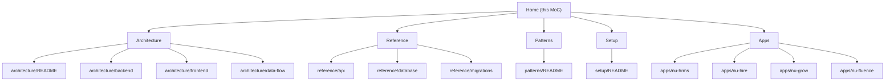

# NU-AURA Knowledge Base — Home

> **Map of Content (MoC).** This is the Obsidian entry point for the NU-AURA documentation
> vault. NU-AURA is a multi-tenant bundle-app HR platform with four sub-applications
> (NU-HRMS, NU-Hire, NU-Grow, NU-Fluence) built on a Spring Boot (Java 21) backend and a
> Next.js 14 (App Router) frontend.

Mirror of the routing discipline in the repo `CLAUDE.md`: **consult these maps at task
start, not after mistakes.** Find your need in the left column, follow the wikilink.

---

## When you need X → go here

### Architecture — how the system is shaped

| When you need…                                              | Go to                                            |
|-------------------------------------------------------------|--------------------------------------------------|
| The big-picture system overview and how the pieces fit      | [[architecture/README\|Architecture Overview]]   |
| Backend layering (api / application / domain / infra), DDD  | [[architecture/backend\|Backend Architecture]]   |
| Frontend structure (App Router, state, data fetching)       | [[architecture/frontend\|Frontend Architecture]] |
| How a request flows end-to-end across the stack             | [[architecture/data-flow\|Data Flow]]            |

### Reference — concrete catalogs

| When you need…                                              | Go to                                            |
|-------------------------------------------------------------|--------------------------------------------------|
| The catalog of REST endpoints / controllers                 | [[reference/api\|API Reference]]                 |
| Database tables, entities, and the schema map               | [[reference/database\|Database Reference]]       |
| The Flyway migration history and conventions                | [[reference/migrations\|Migrations Reference]]   |

### Patterns — reusable approaches

| When you need…                                              | Go to                                            |
|-------------------------------------------------------------|--------------------------------------------------|
| Existing code patterns (Redis, RLS, Kafka, caching, etc.)   | [[patterns/README\|Code Patterns]]               |

### Setup — getting running

| When you need…                                              | Go to                                            |
|-------------------------------------------------------------|--------------------------------------------------|
| Local environment setup, ports, run instructions           | [[setup/README\|Setup Guide]]                    |

### Apps — the four sub-applications

| When you need…                                              | Go to                                            |
|-------------------------------------------------------------|--------------------------------------------------|
| Core HR (employees, payroll, attendance, leave)             | [[apps/nu-hrms\|NU-HRMS]]                        |
| Recruitment (agencies, scorecards, onboarding, e-sign)      | [[apps/nu-hire\|NU-Hire]]                        |
| Performance & learning (reviews, OKRs, LMS, surveys)        | [[apps/nu-grow\|NU-Grow]]                        |
| Knowledge (wiki, blogs, templates, search, wall)            | [[apps/nu-fluence\|NU-Fluence]]                  |

---

## Routing rule

Before designing anything, search **Architecture** for prior structure. Before implementing
anything, search **Patterns** for an existing approach. Before touching the schema, read the
**Reference** maps (`database`, `migrations`). Before running locally, read **Setup**.

## Map of all documents

