```mermaid
graph TD
  Home["docs/Home (MoC)"]
  Home --> A["Architecture"]
  Home --> R["Reference"]
  Home --> P["Patterns & Setup"]
  Home --> APP["Sub-Apps"]
  Home --> META["Product & Meta"]

  A --> A1["docs/architecture/README"]
  A --> A2["docs/architecture/backend"]
  A --> A3["docs/architecture/frontend"]
  A --> A4["docs/architecture/data-flow"]

  R --> R1["docs/reference/api"]
  R --> R2["docs/reference/database"]
  R --> R3["docs/reference/migrations"]

  P --> P1["docs/patterns/README"]
  P --> S1["docs/setup/README"]

  APP --> APP1["docs/apps/nu-hrms"]
  APP --> APP2["docs/apps/nu-hire"]
  APP --> APP3["docs/apps/nu-grow"]
  APP --> APP4["docs/apps/nu-fluence"]

  META --> M1["PRODUCT"]
  META --> M2["DESIGN"]
  META --> M3["CONTRIBUTING"]
  META --> M4["SECURITY"]
  META --> M5["MEMORY"]
  META --> M6["AGENTS"]
```

---
tags:
  - type/moc
  - area/documentation
  - app/nu-aura
  - layer/platform
title: "NU-AURA Knowledge Base — Home"
---

# NU-AURA Knowledge Base — Home

> **Map of Content (MoC).** This is the Obsidian entry point for the NU-AURA documentation vault. NU-AURA is a multi-tenant bundle-app HR platform with four sub-applications (NU-HRMS, NU-Hire, NU-Grow, NU-Fluence) built on a Spring Boot 3.5 (Java 21) backend and a Next.js (App Router) frontend.

Mirror of the routing discipline in the repo `CLAUDE.md`: **consult these maps at task start, not after mistakes.** Find your need in the left column, follow the wikilink.

---

## Architecture — how the system is shaped

| When you need… | Go to |
|---|---|
| The big-picture system overview and how the pieces fit | [[docs/architecture/README\|Architecture Overview]] |
| Backend layering (api / application / domain / infra), DDD modules, Redis, Kafka | [[docs/architecture/backend\|Backend Architecture]] |
| Frontend structure (App Router, state, RBAC, data fetching, Orval codegen) | [[docs/architecture/frontend\|Frontend Architecture]] |
| How a request flows end-to-end: auth, RLS, Kafka events | [[docs/architecture/data-flow\|Data Flow & Request Lifecycle]] |

## Reference — concrete catalogs

| When you need… | Go to |
|---|---|
| The catalog of ~150 REST endpoints grouped by domain | [[docs/reference/api\|API Reference]] |
| Database tables, entities, RLS model, and schema map | [[docs/reference/database\|Database Reference]] |
| The Flyway migration index and conventions (V0–V294) | [[docs/reference/migrations\|Migrations Reference]] |

## Sub-Apps — the four product surfaces

| When you need… | Go to |
|---|---|
| Core HR: employees, payroll, attendance, leave, expenses | [[docs/apps/nu-hrms\|NU-HRMS]] |
| Recruitment: agencies, ATS, scorecards, offer, e-sign, onboarding | [[docs/apps/nu-hire\|NU-Hire]] |
| Performance & learning: reviews, OKRs, 360 feedback, LMS, surveys, wellness | [[docs/apps/nu-grow\|NU-Grow]] |
| Knowledge & social: wiki, blogs, templates, search, wall, AI chat | [[docs/apps/nu-fluence\|NU-Fluence]] |

## Setup & Patterns

| When you need… | Go to |
|---|---|
| Local environment setup, ports, Docker services, run instructions | [[docs/setup/README\|Local Dev Setup]] |
| Reusable backend coordination patterns (Redis, RLS, Kafka, locks) | [[docs/patterns/README\|Code Patterns]] |

## Product & Meta

| When you need… | Go to |
|---|---|
| Product vision, target users, brand personality, accessibility baseline | [[PRODUCT\|Product Vision]] |
| Studio Slate v2 design system: tokens, typography, component rules | [[DESIGN\|Design System]] |
| Developer workflow: branching, commits, standards, pre-push checklist | [[CONTRIBUTING\|Contributing Guide]] |
| Security vulnerability disclosure policy | [[SECURITY\|Security Policy]] |
| Living architecture wiki and evolving project state log | [[MEMORY\|Architecture Memory]] |
| AI agent orchestration config (swarm topology, routing, memory) | [[AGENTS\|Agent Config]] |
| Top-level project overview and repo layout (GitHub README) | [[README\|Project README]] |
| GitHub-style documentation index | [[docs/README\|Docs Index]] |

---

## Routing rule

Before designing anything, read **Architecture** for prior structure. Before implementing anything, check **Patterns** for an existing approach. Before touching the schema, read **Reference** (`database`, `migrations`). Before running locally, read **Setup**. Before any security-sensitive change, read [[docs/architecture/data-flow\|Data Flow & Request Lifecycle]] (auth + RLS tenancy model).

---

