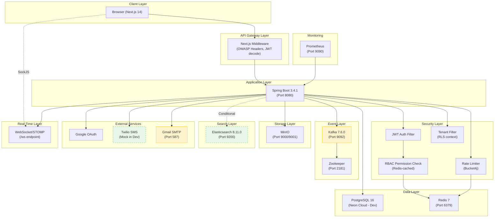
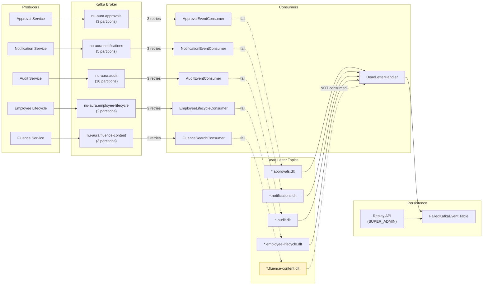

# NU-AURA Integration Health Report

> **Date:** 2026-03-22
> **Phase:** Discovery (Day 1)
> **Author:** Integration Engineer Agent
> **Sprint:** Nu-HRMS Beta Launch (1-Week)

---

## Executive Summary

All infrastructure services are **operationally running** with one cosmetic issue (Kafka Docker healthcheck). The application is ready for beta launch from an integration standpoint, with known limitations documented below.

| Metric | Value |
|--------|-------|
| Services Verified | 7 |
| Services GREEN | 5 (Redis, MinIO, Elasticsearch, WebSocket, Google OAuth) |
| Services YELLOW | 2 (Kafka healthcheck cosmetic, SMTP credentials placeholder) |
| Services RED | 0 |
| Kafka Topics Created | 10 (5 primary + 5 DLT) |
| Circuit Breakers Configured | 7 (Slack, AI, Email, SMS, Storage, Google Auth, DocuSign) |

---

## Service Health Status

### 1. Redis -- GREEN

| Attribute | Value |
|-----------|-------|
| Container | `hrms-redis` |
| Status | Up 17h (healthy) |
| Port | 6379 |
| Image | `redis:7-alpine` |
| Persistence | AOF (appendonly yes) |

**Verified:**
- `PING` returns `PONG`
- Used for: permission cache (1h TTL), rate limiting (Bucket4j), sessions, general cache
- Dev profile disables Redis-backed rate limiting (in-memory fallback)
- Lettuce pool: max-active=8, max-idle=8, min-idle=2

**Risk:** None for beta. Single instance is acceptable for 50-100 users.

---

### 2. Kafka -- YELLOW (Cosmetic)

| Attribute | Value |
|-----------|-------|
| Container | `hrms-kafka` |
| Status | Up 17h (**unhealthy** -- false alarm) |
| Port | 9092 (external), 29092 (internal) |
| Image | `confluentinc/cp-kafka:7.6.0` |
| Zookeeper | `hrms-zookeeper` (Up 17h) |

**Root Cause of "unhealthy":** The Docker healthcheck command `kafka-broker-api-versions.sh` is **not on PATH** in the Confluent 7.6.0 image. The healthcheck has been failing (FailingStreak: 2376) with exit code 127 (`command not found`). **Kafka itself is fully operational.**

**Topics Verified (10/10):**

| Topic | Partitions | Retention |
|-------|-----------|-----------|
| `nu-aura.approvals` | 3 | 24h |
| `nu-aura.approvals.dlt` | 1 | 7 days |
| `nu-aura.notifications` | 5 | 24h |
| `nu-aura.notifications.dlt` | 1 | 7 days |
| `nu-aura.audit` | 10 | 30 days |
| `nu-aura.audit.dlt` | 1 | 7 days |
| `nu-aura.employee-lifecycle` | 2 | 24h |
| `nu-aura.employee-lifecycle.dlt` | 1 | 7 days |
| `nu-aura.fluence-content` | 3 | 24h |
| `nu-aura.fluence-content.dlt` | 1 | 7 days |

**Consumer Groups:** None active (backend not running at time of check).

**Producer Config:**
- Idempotent producer enabled (exactly-once semantics)
- Compression: snappy
- Acks: all
- Retries: 3

**Consumer Config:**
- Manual ACK mode (no auto-commit)
- Exponential backoff retry: 1s -> 5s -> 25s (capped at 30s)
- `fatalIfBrokerNotAvailable=false` -- app starts even without Kafka

**DLT Handling:**
- `DeadLetterHandler` consumes from all 4 DLT topics (fluence-content DLT not included in listener -- see Finding F-001)
- Failed events persisted to `FailedKafkaEvent` table with idempotency guard
- Replay API: `POST /api/v1/admin/kafka/replay/{id}` (SUPER_ADMIN only)
- Poison pill protection: max 3 replay attempts per event
- Micrometer metrics: `kafka.dlt.messages.total{topic="..."}`

**Action Required:**
- **P2:** Fix Docker healthcheck command path in `docker-compose.yml` (cosmetic, does not affect functionality)

---

### 3. Elasticsearch -- GREEN

| Attribute | Value |
|-----------|-------|
| Container | `hrms-elasticsearch` |
| Status | Up 17h (healthy) |
| Port | 9200 |
| Image | `elasticsearch:8.11.0` |
| Cluster Status | **green** |

**Verified:**
- `_cluster/health` returns `green`
- Single-node mode (`discovery.type=single-node`)
- Security disabled (`xpack.security.enabled=false`) -- acceptable for dev/beta
- JVM: `-Xms512m -Xmx512m`

**Config Note:** Elasticsearch is conditionally activated via `@ConditionalOnProperty(name = "app.elasticsearch.enabled", havingValue = "true")`. Default is `false` in `application.yml`. For NU-Fluence search to work, `ELASTICSEARCH_ENABLED=true` must be set.

**Beta Impact:** NU-Fluence is out of scope for beta. Elasticsearch being disabled by default is correct.

---

### 4. MinIO (S3-Compatible Storage) -- GREEN

| Attribute | Value |
|-----------|-------|
| Container | `hrms-minio` |
| Status | Up 17h |
| API Port | 9000 |
| Console Port | 9001 |
| Image | `minio/minio:latest` |

**Verified:**
- `/minio/health/live` returns OK
- Default credentials: `minioadmin` / `minioadmin123` (acceptable for dev)
- Default bucket: `hrms-files`
- Tenant-isolated storage paths: `{tenantId}/{category}/{entityId}/{filename}`

**FileStorageService Features:**
- File type validation (JPEG, PNG, GIF, PDF, Word, Excel, CSV, TXT)
- Size limits per type (images: 5MB, documents: 20MB, CSV: 10MB)
- Pre-signed URL generation with configurable expiry (default 24h)
- Auto bucket creation on first upload

**Risk:** None for beta. Single instance with Docker volume persistence.

---

### 5. Google OAuth -- GREEN (Config-Dependent)

| Attribute | Value |
|-----------|-------|
| Endpoint | `POST /api/v1/auth/google` |
| Frontend | `@react-oauth/google` |
| Config | `app.google.client-id`, `app.google.client-secret` |

**Verified:**
- `AuthController.googleLogin()` endpoint exists and is public
- Circuit breaker registered: `CircuitBreakerRegistry.forGoogleAuth()` (3 failures -> open, 15s cooldown)
- Config via env vars: `GOOGLE_CLIENT_ID`, `GOOGLE_CLIENT_SECRET`

**Risk:** Depends on valid Google OAuth credentials being set in environment. If empty, Google login will fail gracefully (circuit breaker protects against cascading failures).

---

### 6. Twilio SMS -- GREEN (Mock Mode)

| Attribute | Value |
|-----------|-------|
| Config | `TwilioConfig.java` |
| Service | `MockSmsService.java` (active in dev) |
| Mock Mode | `true` (default) |

**Verified:**
- `twilio.mock-mode=true` in `application.yml` -- SMS messages are logged, not sent
- `MockSmsService` implements `SmsService` interface with full mock behavior
- `isConfigured()` checks for `accountSid`, `authToken`, `fromNumber` presence
- Circuit breaker registered: `CircuitBreakerRegistry.forSMS()`
- No real Twilio SDK call in dev mode

**Beta Impact:** SMS is informational only (notifications). Mock mode is appropriate for internal beta. Real SMS can be enabled by setting `TWILIO_MOCK_MODE=false` + credentials.

---

### 7. SMTP Email -- YELLOW (Placeholder Credentials)

| Attribute | Value |
|-----------|-------|
| Host | `smtp.gmail.com` (default) |
| Port | 587 (STARTTLS) |
| Config | `EmailConfig.java` |

**Verified:**
- `JavaMailSender` bean configured with Gmail SMTP defaults
- Credentials are placeholder: `your-email@gmail.com` / `your-app-password`
- STARTTLS enabled
- Circuit breaker registered: `CircuitBreakerRegistry.forEmail()`
- Timeouts: connect=5s, read=3s, write=5s

**Action Required:**
- **P1 for beta:** Set `MAIL_USERNAME` and `MAIL_PASSWORD` env vars with real credentials if email notifications (password reset, approval notifications) are needed for beta
- If email is not critical for beta, the system degrades gracefully (circuit breaker will open after 3 failures)

---

### 8. WebSocket/STOMP -- GREEN

| Attribute | Value |
|-----------|-------|
| Endpoint | `/ws` (SockJS fallback) |
| Config | `WebSocketConfig.java` |
| Frontend | `WebSocketContext.tsx` (STOMP client) |

**Verified:**
- Simple message broker for `/topic` (broadcast) and `/queue` (user-targeted)
- User destination prefix: `/user` (for `convertAndSendToUser`)
- Application prefix: `/app`
- CORS: Explicit allowed origins (no wildcards)
- CSRF excluded for `/ws/**`
- Auth: handled at STOMP level, not HTTP

**Frontend WebSocket Client:**
- `@stomp/stompjs` + `sockjs-client`
- Subscribes to: `/topic/broadcast`, `/topic/user/{employeeId}`, `/topic/user/{employeeId}/approvals`
- Max reconnection attempts: 5 (with counter reset on success)
- Heartbeat: 4s incoming / 4s outgoing
- Reconnect delay: 5s
- Graceful disconnect on logout

**Risk:** Low. In-memory broker is fine for single-instance beta. For multi-pod deployment, `RedisWebSocketRelay` (mentioned in config comments) would be needed.

---

## Findings

### F-001: Kafka DLT Handler Missing Fluence Content DLT (LOW)

**Description:** `DeadLetterHandler.java` listens on 4 DLT topics but does NOT include `nu-aura.fluence-content.dlt`:

```java
@KafkaListener(topics = {
    KafkaTopics.APPROVALS_DLT,
    KafkaTopics.NOTIFICATIONS_DLT,
    KafkaTopics.AUDIT_DLT,
    KafkaTopics.EMPLOYEE_LIFECYCLE_DLT
    // MISSING: KafkaTopics.FLUENCE_CONTENT_DLT
})
```

Also missing from `@PostConstruct registerMetrics()`.

**Impact:** If a fluence content event fails all retries, it lands in `nu-aura.fluence-content.dlt` but no consumer processes it. The event is silently lost. However, NU-Fluence is Phase 2 / out of scope for beta, so this is LOW priority.

**Fix:** Add `KafkaTopics.FLUENCE_CONTENT_DLT` to both the `@KafkaListener` topics and `registerMetrics()` pre-registration list.

---

### F-002: Kafka Docker Healthcheck Broken (P2)

**Description:** The `docker-compose.yml` Kafka healthcheck uses `kafka-broker-api-versions.sh` which is not on PATH in the Confluent 7.6.0 image. FailingStreak: 2376.

**Impact:** Docker reports Kafka as "unhealthy" even though it's fully functional. This could mislead monitoring systems.

**Fix:** Update the healthcheck command to use the correct path:
```yaml
healthcheck:
  test: ["CMD-SHELL", "/bin/kafka-broker-api-versions --bootstrap-server=localhost:9092"]
```

---

### F-003: MapStruct Unused (INFO)

**Description:** MapStruct 1.6.3 is declared in `pom.xml` (dependency + annotation processor) but **zero `@Mapper` interfaces exist** in the codebase. All DTO mapping is done manually in service classes.

**Impact:** No functional impact. The dependency adds ~300KB to the build but is not used. Consider removing to reduce build complexity, or start adopting for new code.

---

### F-004: SMTP Credentials Are Placeholders (P1)

**Description:** `application.yml` has placeholder email credentials (`your-email@gmail.com` / `your-app-password`). If `MAIL_USERNAME` and `MAIL_PASSWORD` env vars are not set, email delivery will fail.

**Impact:** Password reset, approval notifications, and onboarding emails will not be sent. Circuit breaker will protect against cascading failures.

**Fix:** Set `MAIL_USERNAME` and `MAIL_PASSWORD` in environment before beta launch.

---

### F-005: No Real Twilio SMS Service Implementation (INFO)

**Description:** Only `MockSmsService.java` exists. There is no `TwilioSmsService.java` implementation that uses the Twilio SDK. The `SmsService` interface is defined but only the mock is implemented.

**Impact:** SMS cannot be sent even if `twilio.mock-mode=false` is set. A real implementation would need to be created. This is acceptable for beta (SMS is supplementary to email notifications).

---

### F-006: Elasticsearch Disabled by Default (INFO)

**Description:** `app.elasticsearch.enabled=false` in `application.yml`. The `ElasticsearchConfig` is `@ConditionalOnProperty` gated. Even though the ES container is running, the app won't connect to it unless the flag is set.

**Impact:** No impact for beta (NU-Fluence is Phase 2). Elasticsearch container resources (512MB JVM heap) could be freed if not needed.

---

## Service Dependency Graph



---

## Kafka Event Flow Diagram



---

## Circuit Breaker Configuration

| Service | Failure Threshold | Success Threshold | Open Duration | Purpose |
|---------|-------------------|-------------------|---------------|---------|
| `google-auth` | 3 | 2 | 15s | Google OAuth token verification |
| `email` | 3 | 2 | 30s | SMTP email delivery |
| `sms` | 3 | 2 | 30s | Twilio SMS delivery |
| `storage` | 5 | 2 | 45s | MinIO file operations |
| `ai-service` | 5 | 3 | 60s | Groq/OpenAI API calls |
| `slack` | 3 | 2 | 30s | Slack webhook notifications |
| `docusign` | 5 | 2 | 30s | DocuSign eSignature API |

All circuit breakers support:
- Automatic state transitions (CLOSED -> OPEN -> HALF_OPEN -> CLOSED)
- Manual override (`forceOpen()`, `forceClose()`)
- Status monitoring via `CircuitBreakerRegistry.getAllStatus()`

---

## API Contract Validation

### Error Response Format

All API errors return a consistent `ErrorResponse` structure:

```json
{
  "timestamp": "2026-03-22T13:00:00",
  "status": 403,
  "error": "Forbidden",
  "message": "Missing permission: EMPLOYEE:READ",
  "path": "/api/v1/employees",
  "requestId": "abc-123",
  "tenantId": "660e8400-..."
}
```

**Verified:**
- `GlobalExceptionHandler` handles: validation errors, access denied, bad credentials, data integrity, business exceptions
- Micrometer metrics recorded for every error (`api.errors{category, type, status}`)
- Request ID correlation via MDC
- Tenant context included in error responses

### REST Endpoint Conventions

| Convention | Status |
|-----------|--------|
| Prefix: `/api/v1/` | Consistent |
| HTTP verbs (GET/POST/PUT/DELETE/PATCH) | Consistent |
| Error codes (400, 401, 403, 404, 500) | Consistent |
| Pagination (page/size params) | Consistent |
| SpringDoc OpenAPI (`/api-docs`) | Available (SUPER_ADMIN only) |
| CSRF protection | Double-submit cookie |
| Rate limiting | Per-category (auth: 5/min, API: 100/min, export: 5/5min) |

### DTO Mapping

- **MapStruct:** Declared in POM (1.6.3) but **not used** -- zero `@Mapper` interfaces
- **Current approach:** Manual DTO mapping in service layer
- **Impact:** Increases boilerplate but has no functional risk for beta

---

## Integration Failure Playbook

### Scenario 1: Kafka Broker Unreachable

**Symptoms:** `KafkaException` in logs, events not published
**Impact:** Approval workflows, notifications, and audit events queued in memory
**Recovery:**
1. Check Kafka container: `docker ps | grep kafka`
2. Check logs: `docker logs hrms-kafka --tail 50`
3. Restart: `docker restart hrms-kafka`
4. App behavior: `fatalIfBrokerNotAvailable=false` -- app continues without Kafka
5. Events published after Kafka recovers will be processed (producer retries 3x)

### Scenario 2: Redis Unavailable

**Symptoms:** Permission cache miss, rate limiting falls back to in-memory
**Impact:** Slower permission resolution (DB hit per request), inconsistent rate limiting across pods
**Recovery:**
1. Check: `docker exec hrms-redis redis-cli ping`
2. Restart: `docker restart hrms-redis`
3. Rate limiting falls back to in-memory Bucket4j automatically
4. Permission cache rebuilds on next request

### Scenario 3: MinIO Down

**Symptoms:** File upload/download 500 errors
**Impact:** Profile photos, document attachments, payslips unavailable
**Recovery:**
1. Check: `curl http://localhost:9000/minio/health/live`
2. Restart: `docker restart hrms-minio`
3. Circuit breaker (`storage`) will open after 5 failures, recover after 45s

### Scenario 4: Elasticsearch Down

**Symptoms:** NU-Fluence search returns empty/errors
**Impact:** None for beta (NU-Fluence out of scope, ES disabled by default)
**Recovery:**
1. Check: `curl http://localhost:9200/_cluster/health`
2. Restart: `docker restart hrms-elasticsearch`

### Scenario 5: SMTP Delivery Failure

**Symptoms:** Email notifications not sent, circuit breaker opens
**Impact:** Password reset emails, approval notifications not delivered
**Recovery:**
1. Verify credentials: `MAIL_USERNAME` and `MAIL_PASSWORD` env vars
2. Check Gmail app password settings
3. Circuit breaker (`email`) auto-recovers after 30s cooldown

### Scenario 6: Google OAuth Failure

**Symptoms:** Google login returns 500 or connection timeout
**Impact:** Users cannot use Google SSO (can still use email/password login)
**Recovery:**
1. Verify `GOOGLE_CLIENT_ID` and `GOOGLE_CLIENT_SECRET` env vars
2. Check Google Cloud Console for OAuth consent screen status
3. Circuit breaker (`google-auth`) auto-recovers after 15s cooldown

---

## Beta Launch Readiness Checklist (Integration)

| Check | Status | Notes |
|-------|--------|-------|
| Redis running and healthy | PASS | Healthy, PONG verified |
| Kafka broker running | PASS | Functional despite Docker healthcheck bug |
| Kafka topics created (10/10) | PASS | All 5 primary + 5 DLT topics exist |
| Elasticsearch running | PASS | Green cluster, disabled in app by default |
| MinIO running and accessible | PASS | Live, health endpoint OK |
| Google OAuth config present | CONDITIONAL | Depends on env vars being set |
| Twilio SMS mock mode | PASS | Mock mode active, appropriate for beta |
| SMTP credentials | NEEDS ACTION | Placeholder credentials, must set env vars |
| WebSocket/STOMP config | PASS | Correct CORS, SockJS fallback, auth handling |
| Circuit breakers configured | PASS | 7 services covered |
| DLT handling | PASS (with caveat) | Fluence DLT not consumed (F-001, low priority) |
| Error response format | PASS | Consistent ErrorResponse with request ID |
| Rate limiting | PASS | 4 tiers configured, Redis-backed |
| Graceful degradation | PASS | App starts without Kafka, falls back without Redis |

---

## Priority Actions for Beta

| Priority | Action | Owner |
|----------|--------|-------|
| **P1** | Set `MAIL_USERNAME` / `MAIL_PASSWORD` env vars for email delivery | DevOps |
| **P1** | Verify `GOOGLE_CLIENT_ID` / `GOOGLE_CLIENT_SECRET` are set | DevOps |
| **P2** | Fix Kafka Docker healthcheck command path | Dev Lead |
| **P2** | Add `FLUENCE_CONTENT_DLT` to `DeadLetterHandler` listener | Dev Lead |
| **P3** | Remove or adopt MapStruct (currently unused dependency) | Dev Lead |
| **P3** | Consider disabling Elasticsearch container if not needed for beta | DevOps |
