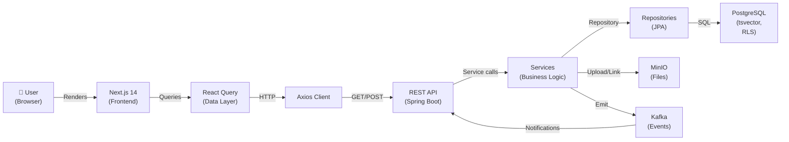
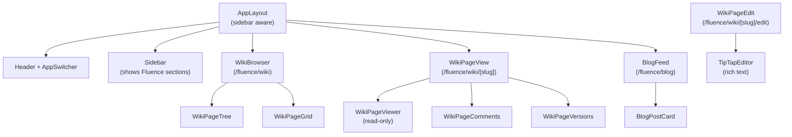

# NU-Fluence Phase 2 Implementation Plan

**Status:** Planning Phase
**Last Updated:** 2026-03-12
**Author:** Principal Architect / AI Engineering Partner

---

## Executive Summary

NU-Fluence is a knowledge management and collaboration platform (similar to Confluence) that will be the 4th sub-app in the NU-AURA platform bundle. This document outlines the complete technical architecture, database schema, backend API design, frontend implementation, and task breakdown for Phase 2 execution.

NU-Fluence will provide enterprise teams with:
- **Wiki Pages** — Hierarchical knowledge base with rich text, versioning, comments
- **Blogs** — Team announcements and thought leadership with categories and tags
- **Document Templates** — Pre-built templates for recurring documents (meeting notes, project briefs, etc.)
- **Drive Integration** — Seamless file sharing and embedding (NU-Drive integration)
- **Full-Text Search** — PostgreSQL tsvector-based search across all knowledge content
- **Flexible Visibility & RBAC** — Public, Organization-wide, Team-scoped, and Private content with granular permissions

---

## Part 1: Discovery & Requirements

### 1.1 Business Requirements

#### Scale & Multi-Tenancy
- **Tenants:** Multi-tenant SaaS (100–1000+ enterprises)
- **Users per tenant:** 10–10,000+ employees
- **Content growth:** 1–100K+ pages, blogs, and templates per tenant
- **Concurrent users:** 10–1000+ simultaneous users during peak hours
- **Storage:** Files up to 500MB per document; total per tenant: unlimited (MinIO-backed)

#### Key Use Cases
1. **Employee Onboarding** — New hires access company wiki, policies, procedures
2. **Knowledge Retention** — Organizational knowledge captured and searchable
3. **Cross-Team Collaboration** — Teams document projects, best practices, lessons learned
4. **Policy Management** — HR policies, compliance docs, procedures versioned and archived
5. **Blog/Announcements** — CEO blogs, team updates, company news
6. **Self-Service Documentation** — Reduce support tickets via searchable knowledge base

#### Approval Workflows
- **Wiki Pages:** Optional approval workflow for sensitive content (HR policies, compliance docs)
- **Blogs:** Optional approval for company-wide blogs (CEO/Management approval gate)
- **Templates:** Admin-only creation; users instantiate with no approval needed

#### Search & Discovery
- Real-time full-text search across wiki, blogs, templates
- Faceted search: content type, author, team, date range, visibility
- Search analytics: track popular topics, trending documents

---

### 1.2 Non-Functional Requirements

| Requirement | Target |
|---|---|
| **Page Load Time** | < 2 seconds for wiki page view, < 1.5s for search results |
| **Search Response** | < 500ms for 1000-word queries |
| **Availability** | 99.9% SLA |
| **Data Retention** | Soft-delete with 30-day recycle bin; hard-delete after 90 days |
| **Audit Trail** | All CRUD operations logged with user, timestamp, change details |
| **Compliance** | GDPR right-to-be-forgotten, data residency, encryption at rest |
| **Scalability** | Handle 10K+ concurrent users, 1M+ documents per tenant |
| **API Rate Limiting** | Standard: 100 req/min per user; Premium: 500 req/min |

---

### 1.3 Security & Permissions

#### Content Visibility Levels
| Level | Scope | Use Case |
|---|---|---|
| **PUBLIC** | All tenants (with account) | Cross-company knowledge sharing (e.g., industry best practices) |
| **ORGANIZATION** | Current tenant only | Company policies, org-wide procedures |
| **TEAM** | Specific teams/groups | Team documentation, project specs |
| **PRIVATE** | Author only | Personal notes, drafts |
| **RESTRICTED** | Specific users (ACL) | Sensitive HR docs, exec summaries |

#### Permission Nodes
```
knowledge.wiki.create          — Create new wiki pages
knowledge.wiki.read            — View wiki pages (subject to visibility)
knowledge.wiki.update          — Edit own/assigned pages
knowledge.wiki.delete          — Delete wiki pages
knowledge.wiki.publish         — Publish draft pages
knowledge.wiki.version         — View/rollback page versions
knowledge.wiki.comment         — Comment on pages

knowledge.blog.create          — Create blog posts
knowledge.blog.read            — View blogs
knowledge.blog.update          — Edit own blogs
knowledge.blog.delete          — Delete blogs
knowledge.blog.publish         — Publish draft blogs
knowledge.blog.comment         — Comment on blogs
knowledge.blog.like            — Like/recommend blogs

knowledge.template.create      — Create document templates (admin only)
knowledge.template.read        — View templates
knowledge.template.instantiate — Create document from template
knowledge.template.update      — Edit templates (admin only)
knowledge.template.delete      — Delete templates (admin only)

knowledge.search               — Access search feature
knowledge.drive.integrate      — Link/embed NU-Drive files
knowledge.settings.manage      — Configure Wiki/Blog settings (admin)
```

#### SuperAdmin Bypass
- SuperAdmin can view, edit, delete ALL knowledge content across all tenants
- SuperAdmin can approve workflows, manage templates, access audit logs
- SuperAdmin sees all visibility levels without restriction

---

## Part 2: Domain Model

### 2.1 Core Entities

```
Knowledge Module Domain:
├── WikiPage
│   ├── id (UUID)
│   ├── tenant_id (UUID) — Multi-tenancy
│   ├── title (string)
│   ├── slug (string, URL-safe)
│   ├── content (JSONB — TipTap editor state)
│   ├── status (DRAFT, PUBLISHED, ARCHIVED)
│   ├── visibility (PUBLIC, ORGANIZATION, TEAM, PRIVATE, RESTRICTED)
│   ├── parent_page_id (UUID, nullable) — Hierarchy
│   ├── owner_id (UUID) — Author
│   ├── space_id (UUID) — Folder/category
│   ├── metadata (JSONB) — Tags, labels, custom fields
│   ├── tsvector (tsvector) — Full-text search
│   ├── created_at, updated_at, deleted_at
│   ├── created_by, updated_by
│   ├── version (BIGINT) — Optimistic locking
│   └── Relationships: [WikiPageVersion], [WikiPageComment], [WikiPageWatch]
│
├── WikiPageVersion
│   ├── id (UUID)
│   ├── wiki_page_id (UUID)
│   ├── version_number (integer)
│   ├── content (JSONB — Snapshot)
│   ├── title (string)
│   ├── change_summary (string)
│   ├── created_by (UUID)
│   ├── created_at (TIMESTAMPTZ)
│   └── Relationships: [WikiPage]
│
├── WikiPageComment
│   ├── id (UUID)
│   ├── wiki_page_id (UUID)
│   ├── author_id (UUID)
│   ├── content (TEXT)
│   ├── status (PUBLISHED, DELETED)
│   ├── created_at, updated_at
│   └── Relationships: [WikiPage], [User], [WikiPageCommentReaction]
│
├── WikiPageWatch
│   ├── id (UUID)
│   ├── wiki_page_id (UUID)
│   ├── user_id (UUID)
│   ├── created_at (TIMESTAMPTZ)
│   └── Relationships: [WikiPage], [User]
│
├── WikiSpace
│   ├── id (UUID)
│   ├── tenant_id (UUID)
│   ├── name (string)
│   ├── description (TEXT)
│   ├── visibility (ORGANIZATION, TEAM, PRIVATE)
│   ├── owner_id (UUID)
│   ├── created_at, updated_at
│   └── Relationships: [WikiPage], [WikiSpacePermission]
│
├── BlogPost
│   ├── id (UUID)
│   ├── tenant_id (UUID)
│   ├── title (string)
│   ├── slug (string, URL-safe)
│   ├── content (JSONB — TipTap editor state)
│   ├── excerpt (TEXT, auto-generated)
│   ├── status (DRAFT, PUBLISHED, ARCHIVED)
│   ├── author_id (UUID)
│   ├── featured_image_url (string)
│   ├── category_id (UUID)
│   ├── tags (array of strings)
│   ├── visibility (PUBLIC, ORGANIZATION, TEAM, PRIVATE)
│   ├── tsvector (tsvector)
│   ├── published_at (TIMESTAMPTZ)
│   ├── created_at, updated_at, deleted_at
│   └── Relationships: [BlogCategory], [BlogComment], [BlogLike]
│
├── BlogComment
│   ├── id (UUID)
│   ├── blog_post_id (UUID)
│   ├── author_id (UUID)
│   ├── content (TEXT)
│   ├── created_at, updated_at, deleted_at
│   └── Relationships: [BlogPost], [User]
│
├── BlogLike
│   ├── id (UUID)
│   ├── blog_post_id (UUID)
│   ├── user_id (UUID)
│   ├── created_at (TIMESTAMPTZ)
│   └── Relationships: [BlogPost], [User]
│
├── BlogCategory
│   ├── id (UUID)
│   ├── tenant_id (UUID)
│   ├── name (string)
│   ├── slug (string)
│   ├── description (TEXT)
│   ├── order_index (integer)
│   ├── created_at, updated_at
│   └── Relationships: [BlogPost]
│
├── DocumentTemplate
│   ├── id (UUID)
│   ├── tenant_id (UUID)
│   ├── name (string)
│   ├── description (TEXT)
│   ├── category (string) — meeting-notes, project-brief, incident-report, etc.
│   ├── content (JSONB — TipTap template state with placeholders)
│   ├── version (integer) — Template versioning
│   ├── is_active (boolean)
│   ├── created_by (UUID) — Admin only
│   ├── created_at, updated_at
│   └── Relationships: [TemplateInstantiation]
│
├── TemplateInstantiation
│   ├── id (UUID)
│   ├── template_id (UUID)
│   ├── tenant_id (UUID)
│   ├── title (string)
│   ├── content (JSONB — Populated content)
│   ├── created_by (UUID)
│   ├── created_at (TIMESTAMPTZ)
│   └── Relationships: [DocumentTemplate]
│
├── KnowledgeContentView
│   ├── id (UUID)
│   ├── content_id (UUID) — wiki_page_id or blog_post_id
│   ├── content_type (enum: WIKI, BLOG)
│   ├── viewer_id (UUID)
│   ├── viewed_at (TIMESTAMPTZ)
│   └── Relationships: [WikiPage] or [BlogPost]
│
├── KnowledgeSearch
│   ├── id (UUID)
│   ├── tenant_id (UUID)
│   ├── user_id (UUID)
│   ├── query (TEXT)
│   ├── result_count (integer)
│   ├── clicked_result_id (UUID) — Null if no click
│   ├── searched_at (TIMESTAMPTZ)
│   └── (Analytics table — not for transactional queries)
│
├── KnowledgeAttachment
│   ├── id (UUID)
│   ├── page_id (UUID) — wiki_page_id or blog_post_id
│   ├── file_id (UUID) — reference to FileMetadata
│   ├── order_index (integer)
│   ├── created_at (TIMESTAMPTZ)
│   └── Relationships: [WikiPage], [BlogPost], [FileMetadata]
│
└── WikiPageApprovalTask
    ├── id (UUID)
    ├── approval_instance_id (UUID)
    ├── wiki_page_id (UUID)
    ├── status (PENDING, APPROVED, REJECTED)
    ├── assignee_id (UUID)
    ├── notes (TEXT)
    ├── created_at, updated_at
    └── Relationships: [WikiPage], [ApprovalInstance]
```

### 2.2 Relationships Summary

```
WikiPage
  ├─ 1:N WikiPageVersion (page history)
  ├─ 1:N WikiPageComment (discussions)
  ├─ 1:N WikiPageWatch (watchers)
  ├─ N:1 WikiSpace (folder)
  ├─ N:1 User (owner)
  ├─ 1:N KnowledgeContentView (analytics)
  ├─ 1:N KnowledgeAttachment (files)
  └─ 1:N WikiPageApprovalTask (approval workflow)

BlogPost
  ├─ N:1 BlogCategory (categorization)
  ├─ 1:N BlogComment (discussions)
  ├─ 1:N BlogLike (engagement)
  ├─ N:1 User (author)
  ├─ 1:N KnowledgeContentView (analytics)
  └─ 1:N KnowledgeAttachment (files)

DocumentTemplate
  ├─ 1:N TemplateInstantiation (usage history)
  └─ N:1 Tenant (ownership)
```

---

## Part 3: Database Schema (Flyway V15)

### 3.1 Migration Strategy

New migration: `V15__knowledge_fluence_schema.sql`

Key design decisions:
- All tables include `tenant_id` UUID column for multi-tenancy
- All tables include audit columns: `created_at`, `updated_at`, `created_by`, `updated_by`
- `deleted_at` TIMESTAMPTZ for soft deletes (compliance: GDPR recycle bin)
- `tsvector` columns for full-text search (PostgreSQL native)
- JSONB for rich content storage (TipTap editor state)
- Proper indexing for multi-tenant isolation and query performance

### 3.2 Table Definitions

```sql
-- ============================================================
-- V15: NU-Fluence Knowledge Management & Collaboration Schema
-- ============================================================

-- wiki_spaces (Folders/Categories for wiki pages)
CREATE TABLE IF NOT EXISTS wiki_spaces (
    id UUID PRIMARY KEY DEFAULT gen_random_uuid(),
    tenant_id UUID NOT NULL,
    created_at TIMESTAMPTZ NOT NULL DEFAULT NOW(),
    updated_at TIMESTAMPTZ NOT NULL DEFAULT NOW(),
    created_by UUID,
    updated_by UUID,
    version BIGINT DEFAULT 0,
    is_deleted BOOLEAN NOT NULL DEFAULT FALSE,

    name VARCHAR(200) NOT NULL,
    description TEXT,
    visibility VARCHAR(20) NOT NULL DEFAULT 'ORGANIZATION', -- ORGANIZATION, TEAM, PRIVATE
    owner_id UUID,
    icon_name VARCHAR(50),
    color_hex VARCHAR(7),
    order_index INTEGER,

    CONSTRAINT fk_wiki_space_owner FOREIGN KEY (owner_id) REFERENCES users(id),
    CONSTRAINT chk_wiki_space_visibility CHECK (visibility IN ('ORGANIZATION', 'TEAM', 'PRIVATE'))
);

CREATE INDEX idx_wiki_space_tenant ON wiki_spaces(tenant_id);
CREATE INDEX idx_wiki_space_owner ON wiki_spaces(owner_id);
CREATE INDEX idx_wiki_space_visibility ON wiki_spaces(visibility, tenant_id);

COMMENT ON TABLE wiki_spaces IS 'Folders/categories for organizing wiki pages';
COMMENT ON COLUMN wiki_spaces.visibility IS 'PUBLIC (all tenants), ORGANIZATION (tenant-wide), TEAM (specific groups), PRIVATE (owner only), RESTRICTED (ACL)';

-- wiki_pages (Main wiki content)
CREATE TABLE IF NOT EXISTS wiki_pages (
    id UUID PRIMARY KEY DEFAULT gen_random_uuid(),
    tenant_id UUID NOT NULL,
    created_at TIMESTAMPTZ NOT NULL DEFAULT NOW(),
    updated_at TIMESTAMPTZ NOT NULL DEFAULT NOW(),
    created_by UUID,
    updated_by UUID,
    version BIGINT DEFAULT 0,
    is_deleted BOOLEAN NOT NULL DEFAULT FALSE,
    deleted_at TIMESTAMPTZ,

    title VARCHAR(500) NOT NULL,
    slug VARCHAR(500) NOT NULL,
    content JSONB NOT NULL DEFAULT '{}', -- TipTap editor state
    excerpt TEXT,
    status VARCHAR(20) NOT NULL DEFAULT 'DRAFT', -- DRAFT, PUBLISHED, ARCHIVED
    visibility VARCHAR(20) NOT NULL DEFAULT 'ORGANIZATION',
    parent_page_id UUID,
    space_id UUID,
    owner_id UUID NOT NULL,

    -- Full-text search
    search_vector tsvector GENERATED ALWAYS AS (
        setweight(to_tsvector('english', title), 'A') ||
        setweight(to_tsvector('english', COALESCE(excerpt, '')), 'B')
    ) STORED,

    -- Metadata
    view_count INTEGER DEFAULT 0,
    comment_count INTEGER DEFAULT 0,
    last_commented_at TIMESTAMPTZ,

    CONSTRAINT fk_wiki_page_parent FOREIGN KEY (parent_page_id) REFERENCES wiki_pages(id),
    CONSTRAINT fk_wiki_page_space FOREIGN KEY (space_id) REFERENCES wiki_spaces(id),
    CONSTRAINT fk_wiki_page_owner FOREIGN KEY (owner_id) REFERENCES users(id),
    CONSTRAINT chk_wiki_page_status CHECK (status IN ('DRAFT', 'PUBLISHED', 'ARCHIVED')),
    CONSTRAINT chk_wiki_page_visibility CHECK (visibility IN ('PUBLIC', 'ORGANIZATION', 'TEAM', 'PRIVATE', 'RESTRICTED'))
);

CREATE INDEX idx_wiki_page_tenant ON wiki_pages(tenant_id);
CREATE INDEX idx_wiki_page_status ON wiki_pages(tenant_id, status);
CREATE INDEX idx_wiki_page_owner ON wiki_pages(owner_id);
CREATE INDEX idx_wiki_page_space ON wiki_pages(space_id);
CREATE INDEX idx_wiki_page_parent ON wiki_pages(parent_page_id);
CREATE INDEX idx_wiki_page_visibility ON wiki_pages(tenant_id, visibility);
CREATE INDEX idx_wiki_page_slug_tenant ON wiki_pages(tenant_id, slug);
CREATE INDEX idx_wiki_page_search ON wiki_pages USING GIN(search_vector);
CREATE INDEX idx_wiki_page_deleted ON wiki_pages(deleted_at) WHERE deleted_at IS NOT NULL;

COMMENT ON TABLE wiki_pages IS 'Hierarchical wiki pages with versioning, comments, and search';
COMMENT ON COLUMN wiki_pages.search_vector IS 'PostgreSQL tsvector for full-text search';

-- wiki_page_versions (Version history for pages)
CREATE TABLE IF NOT EXISTS wiki_page_versions (
    id UUID PRIMARY KEY DEFAULT gen_random_uuid(),
    wiki_page_id UUID NOT NULL,
    tenant_id UUID NOT NULL,
    version_number INTEGER NOT NULL,
    content JSONB NOT NULL,
    title VARCHAR(500) NOT NULL,
    change_summary TEXT,
    created_by UUID NOT NULL,
    created_at TIMESTAMPTZ NOT NULL DEFAULT NOW(),

    CONSTRAINT fk_wiki_version_page FOREIGN KEY (wiki_page_id) REFERENCES wiki_pages(id) ON DELETE CASCADE,
    CONSTRAINT fk_wiki_version_creator FOREIGN KEY (created_by) REFERENCES users(id),
    CONSTRAINT uq_wiki_version_page_number UNIQUE(wiki_page_id, version_number)
);

CREATE INDEX idx_wiki_version_page ON wiki_page_versions(wiki_page_id);
CREATE INDEX idx_wiki_version_tenant ON wiki_page_versions(tenant_id);

COMMENT ON TABLE wiki_page_versions IS 'Complete version history for wiki pages; supports rollback functionality';

-- wiki_page_comments (Discussions on pages)
CREATE TABLE IF NOT EXISTS wiki_page_comments (
    id UUID PRIMARY KEY DEFAULT gen_random_uuid(),
    wiki_page_id UUID NOT NULL,
    tenant_id UUID NOT NULL,
    author_id UUID NOT NULL,
    created_at TIMESTAMPTZ NOT NULL DEFAULT NOW(),
    updated_at TIMESTAMPTZ NOT NULL DEFAULT NOW(),
    deleted_at TIMESTAMPTZ,

    content TEXT NOT NULL,
    status VARCHAR(20) NOT NULL DEFAULT 'PUBLISHED', -- PUBLISHED, DELETED

    CONSTRAINT fk_wiki_comment_page FOREIGN KEY (wiki_page_id) REFERENCES wiki_pages(id) ON DELETE CASCADE,
    CONSTRAINT fk_wiki_comment_author FOREIGN KEY (author_id) REFERENCES users(id),
    CONSTRAINT chk_wiki_comment_status CHECK (status IN ('PUBLISHED', 'DELETED'))
);

CREATE INDEX idx_wiki_comment_page ON wiki_page_comments(wiki_page_id);
CREATE INDEX idx_wiki_comment_author ON wiki_page_comments(author_id);
CREATE INDEX idx_wiki_comment_created ON wiki_page_comments(created_at);

COMMENT ON TABLE wiki_page_comments IS 'User discussions and comments on wiki pages';

-- wiki_page_watches (Users watching pages for changes)
CREATE TABLE IF NOT EXISTS wiki_page_watches (
    id UUID PRIMARY KEY DEFAULT gen_random_uuid(),
    wiki_page_id UUID NOT NULL,
    user_id UUID NOT NULL,
    tenant_id UUID NOT NULL,
    created_at TIMESTAMPTZ NOT NULL DEFAULT NOW(),

    CONSTRAINT fk_wiki_watch_page FOREIGN KEY (wiki_page_id) REFERENCES wiki_pages(id) ON DELETE CASCADE,
    CONSTRAINT fk_wiki_watch_user FOREIGN KEY (user_id) REFERENCES users(id) ON DELETE CASCADE,
    CONSTRAINT uq_wiki_watch_page_user UNIQUE(wiki_page_id, user_id)
);

CREATE INDEX idx_wiki_watch_user ON wiki_page_watches(user_id);

COMMENT ON TABLE wiki_page_watches IS 'Track which users are watching pages for notifications';

-- blog_categories (Blog post categories)
CREATE TABLE IF NOT EXISTS blog_categories (
    id UUID PRIMARY KEY DEFAULT gen_random_uuid(),
    tenant_id UUID NOT NULL,
    created_at TIMESTAMPTZ NOT NULL DEFAULT NOW(),
    updated_at TIMESTAMPTZ NOT NULL DEFAULT NOW(),

    name VARCHAR(100) NOT NULL,
    slug VARCHAR(100) NOT NULL UNIQUE,
    description TEXT,
    order_index INTEGER DEFAULT 0,
    icon_name VARCHAR(50),

    CONSTRAINT uq_blog_category_tenant_slug UNIQUE(tenant_id, slug)
);

CREATE INDEX idx_blog_category_tenant ON blog_categories(tenant_id);

COMMENT ON TABLE blog_categories IS 'Categories for organizing blog posts';

-- blog_posts (Blog articles)
CREATE TABLE IF NOT EXISTS blog_posts (
    id UUID PRIMARY KEY DEFAULT gen_random_uuid(),
    tenant_id UUID NOT NULL,
    created_at TIMESTAMPTZ NOT NULL DEFAULT NOW(),
    updated_at TIMESTAMPTZ NOT NULL DEFAULT NOW(),
    created_by UUID,
    updated_by UUID,
    version BIGINT DEFAULT 0,
    is_deleted BOOLEAN NOT NULL DEFAULT FALSE,
    deleted_at TIMESTAMPTZ,

    title VARCHAR(500) NOT NULL,
    slug VARCHAR(500) NOT NULL,
    content JSONB NOT NULL DEFAULT '{}', -- TipTap editor state
    excerpt TEXT,
    featured_image_url VARCHAR(500),
    status VARCHAR(20) NOT NULL DEFAULT 'DRAFT', -- DRAFT, PUBLISHED, SCHEDULED, ARCHIVED
    visibility VARCHAR(20) NOT NULL DEFAULT 'ORGANIZATION',
    author_id UUID NOT NULL,
    category_id UUID,
    published_at TIMESTAMPTZ,

    -- Metadata
    view_count INTEGER DEFAULT 0,
    comment_count INTEGER DEFAULT 0,
    like_count INTEGER DEFAULT 0,

    -- Full-text search
    search_vector tsvector GENERATED ALWAYS AS (
        setweight(to_tsvector('english', title), 'A') ||
        setweight(to_tsvector('english', COALESCE(excerpt, '')), 'B')
    ) STORED,

    CONSTRAINT fk_blog_post_author FOREIGN KEY (author_id) REFERENCES users(id),
    CONSTRAINT fk_blog_post_category FOREIGN KEY (category_id) REFERENCES blog_categories(id) ON DELETE SET NULL,
    CONSTRAINT chk_blog_post_status CHECK (status IN ('DRAFT', 'PUBLISHED', 'SCHEDULED', 'ARCHIVED')),
    CONSTRAINT chk_blog_visibility CHECK (visibility IN ('PUBLIC', 'ORGANIZATION', 'TEAM', 'PRIVATE'))
);

CREATE INDEX idx_blog_post_tenant ON blog_posts(tenant_id);
CREATE INDEX idx_blog_post_status ON blog_posts(tenant_id, status);
CREATE INDEX idx_blog_post_author ON blog_posts(author_id);
CREATE INDEX idx_blog_post_category ON blog_posts(category_id);
CREATE INDEX idx_blog_post_visibility ON blog_posts(tenant_id, visibility);
CREATE INDEX idx_blog_post_published ON blog_posts(published_at DESC) WHERE status = 'PUBLISHED';
CREATE INDEX idx_blog_post_search ON blog_posts USING GIN(search_vector);
CREATE INDEX idx_blog_post_deleted ON blog_posts(deleted_at) WHERE deleted_at IS NOT NULL;

COMMENT ON TABLE blog_posts IS 'Blog posts with categories, drafts, scheduling, and engagement tracking';

-- blog_comments (Comments on blog posts)
CREATE TABLE IF NOT EXISTS blog_comments (
    id UUID PRIMARY KEY DEFAULT gen_random_uuid(),
    blog_post_id UUID NOT NULL,
    tenant_id UUID NOT NULL,
    author_id UUID NOT NULL,
    created_at TIMESTAMPTZ NOT NULL DEFAULT NOW(),
    updated_at TIMESTAMPTZ NOT NULL DEFAULT NOW(),
    deleted_at TIMESTAMPTZ,

    content TEXT NOT NULL,

    CONSTRAINT fk_blog_comment_post FOREIGN KEY (blog_post_id) REFERENCES blog_posts(id) ON DELETE CASCADE,
    CONSTRAINT fk_blog_comment_author FOREIGN KEY (author_id) REFERENCES users(id) ON DELETE CASCADE
);

CREATE INDEX idx_blog_comment_post ON blog_comments(blog_post_id);
CREATE INDEX idx_blog_comment_author ON blog_comments(author_id);

COMMENT ON TABLE blog_comments IS 'Comments/discussions on blog posts';

-- blog_likes (User likes on blog posts)
CREATE TABLE IF NOT EXISTS blog_likes (
    id UUID PRIMARY KEY DEFAULT gen_random_uuid(),
    blog_post_id UUID NOT NULL,
    user_id UUID NOT NULL,
    tenant_id UUID NOT NULL,
    created_at TIMESTAMPTZ NOT NULL DEFAULT NOW(),

    CONSTRAINT fk_blog_like_post FOREIGN KEY (blog_post_id) REFERENCES blog_posts(id) ON DELETE CASCADE,
    CONSTRAINT fk_blog_like_user FOREIGN KEY (user_id) REFERENCES users(id) ON DELETE CASCADE,
    CONSTRAINT uq_blog_like_post_user UNIQUE(blog_post_id, user_id)
);

CREATE INDEX idx_blog_like_user ON blog_likes(user_id);

COMMENT ON TABLE blog_likes IS 'Track user likes/recommendations on blog posts';

-- document_templates (Pre-built document templates)
CREATE TABLE IF NOT EXISTS document_templates (
    id UUID PRIMARY KEY DEFAULT gen_random_uuid(),
    tenant_id UUID NOT NULL,
    created_at TIMESTAMPTZ NOT NULL DEFAULT NOW(),
    updated_at TIMESTAMPTZ NOT NULL DEFAULT NOW(),
    created_by UUID,
    updated_by UUID,

    name VARCHAR(200) NOT NULL,
    description TEXT,
    category VARCHAR(50) NOT NULL, -- meeting-notes, project-brief, incident-report, etc.
    content JSONB NOT NULL DEFAULT '{}', -- TipTap template with {{ placeholder }} syntax
    version INTEGER NOT NULL DEFAULT 1,
    is_active BOOLEAN NOT NULL DEFAULT TRUE,
    icon_name VARCHAR(50),
    order_index INTEGER,

    CONSTRAINT fk_template_creator FOREIGN KEY (created_by) REFERENCES users(id),
    CONSTRAINT uq_template_tenant_name UNIQUE(tenant_id, name)
);

CREATE INDEX idx_template_tenant ON document_templates(tenant_id);
CREATE INDEX idx_template_category ON document_templates(tenant_id, category);
CREATE INDEX idx_template_active ON document_templates(tenant_id, is_active);

COMMENT ON TABLE document_templates IS 'Reusable document templates with placeholder variables';

-- template_instantiations (Documents created from templates)
CREATE TABLE IF NOT EXISTS template_instantiations (
    id UUID PRIMARY KEY DEFAULT gen_random_uuid(),
    template_id UUID NOT NULL,
    tenant_id UUID NOT NULL,
    created_at TIMESTAMPTZ NOT NULL DEFAULT NOW(),
    updated_at TIMESTAMPTZ NOT NULL DEFAULT NOW(),
    created_by UUID,

    title VARCHAR(500) NOT NULL,
    content JSONB NOT NULL DEFAULT '{}', -- Populated template content

    CONSTRAINT fk_instantiation_template FOREIGN KEY (template_id) REFERENCES document_templates(id),
    CONSTRAINT fk_instantiation_creator FOREIGN KEY (created_by) REFERENCES users(id)
);

CREATE INDEX idx_instantiation_template ON template_instantiations(template_id);
CREATE INDEX idx_instantiation_tenant ON template_instantiations(tenant_id);
CREATE INDEX idx_instantiation_creator ON template_instantiations(created_by);

COMMENT ON TABLE template_instantiations IS 'Instances/versions of documents created from templates';

-- knowledge_attachments (Files attached to wiki/blog)
CREATE TABLE IF NOT EXISTS knowledge_attachments (
    id UUID PRIMARY KEY DEFAULT gen_random_uuid(),
    tenant_id UUID NOT NULL,
    created_at TIMESTAMPTZ NOT NULL DEFAULT NOW(),

    content_type VARCHAR(20) NOT NULL, -- WIKI, BLOG
    content_id UUID NOT NULL, -- wiki_page_id or blog_post_id
    file_id UUID NOT NULL, -- reference to file_metadata table
    order_index INTEGER DEFAULT 0,

    CONSTRAINT fk_attachment_file FOREIGN KEY (file_id) REFERENCES file_metadata(id) ON DELETE CASCADE
);

CREATE INDEX idx_knowledge_attachment_content ON knowledge_attachments(content_type, content_id);
CREATE INDEX idx_knowledge_attachment_file ON knowledge_attachments(file_id);

COMMENT ON TABLE knowledge_attachments IS 'Files/attachments embedded in wiki pages and blog posts';

-- knowledge_views (Analytics: track views)
CREATE TABLE IF NOT EXISTS knowledge_views (
    id UUID PRIMARY KEY DEFAULT gen_random_uuid(),
    tenant_id UUID NOT NULL,
    content_type VARCHAR(20) NOT NULL, -- WIKI, BLOG
    content_id UUID NOT NULL,
    viewer_id UUID NOT NULL,
    viewed_at TIMESTAMPTZ NOT NULL DEFAULT NOW(),

    CONSTRAINT fk_view_viewer FOREIGN KEY (viewer_id) REFERENCES users(id) ON DELETE CASCADE
);

CREATE INDEX idx_knowledge_view_content ON knowledge_views(content_type, content_id);
CREATE INDEX idx_knowledge_view_viewer ON knowledge_views(viewer_id);
CREATE INDEX idx_knowledge_view_tenant ON knowledge_views(tenant_id);

COMMENT ON TABLE knowledge_views IS 'Analytics: track content views for popularity/trending';

-- knowledge_searches (Analytics: track searches)
CREATE TABLE IF NOT EXISTS knowledge_searches (
    id UUID PRIMARY KEY DEFAULT gen_random_uuid(),
    tenant_id UUID NOT NULL,
    user_id UUID NOT NULL,
    created_at TIMESTAMPTZ NOT NULL DEFAULT NOW(),

    query TEXT NOT NULL,
    result_count INTEGER DEFAULT 0,
    clicked_result_id UUID, -- NULL if no click
    clicked_content_type VARCHAR(20), -- WIKI, BLOG if clicked

    CONSTRAINT fk_search_user FOREIGN KEY (user_id) REFERENCES users(id) ON DELETE CASCADE
);

CREATE INDEX idx_knowledge_search_tenant ON knowledge_searches(tenant_id);
CREATE INDEX idx_knowledge_search_user ON knowledge_searches(user_id);
CREATE INDEX idx_knowledge_search_query ON knowledge_searches(query);

COMMENT ON TABLE knowledge_searches IS 'Analytics: track search queries and user behavior';

-- wiki_page_approval_tasks (Approval workflow for sensitive wiki pages)
CREATE TABLE IF NOT EXISTS wiki_page_approval_tasks (
    id UUID PRIMARY KEY DEFAULT gen_random_uuid(),
    tenant_id UUID NOT NULL,
    wiki_page_id UUID NOT NULL,
    approval_instance_id UUID NOT NULL,
    created_at TIMESTAMPTZ NOT NULL DEFAULT NOW(),
    updated_at TIMESTAMPTZ NOT NULL DEFAULT NOW(),

    status VARCHAR(20) NOT NULL DEFAULT 'PENDING', -- PENDING, APPROVED, REJECTED
    assignee_id UUID NOT NULL,
    approver_notes TEXT,

    CONSTRAINT fk_approval_task_page FOREIGN KEY (wiki_page_id) REFERENCES wiki_pages(id) ON DELETE CASCADE,
    CONSTRAINT fk_approval_task_instance FOREIGN KEY (approval_instance_id) REFERENCES approval_instances(id),
    CONSTRAINT fk_approval_task_assignee FOREIGN KEY (assignee_id) REFERENCES users(id),
    CONSTRAINT chk_approval_status CHECK (status IN ('PENDING', 'APPROVED', 'REJECTED'))
);

CREATE INDEX idx_approval_task_page ON wiki_page_approval_tasks(wiki_page_id);
CREATE INDEX idx_approval_task_instance ON wiki_page_approval_tasks(approval_instance_id);
CREATE INDEX idx_approval_task_assignee ON wiki_page_approval_tasks(assignee_id, status);

COMMENT ON TABLE wiki_page_approval_tasks IS 'Integration with approval workflow engine for page publishing';

-- Grant RLS policies (PostgreSQL Row-Level Security)
ALTER TABLE wiki_spaces ENABLE ROW LEVEL SECURITY;
ALTER TABLE wiki_pages ENABLE ROW LEVEL SECURITY;
ALTER TABLE wiki_page_versions ENABLE ROW LEVEL SECURITY;
ALTER TABLE wiki_page_comments ENABLE ROW LEVEL SECURITY;
ALTER TABLE blog_categories ENABLE ROW LEVEL SECURITY;
ALTER TABLE blog_posts ENABLE ROW LEVEL SECURITY;
ALTER TABLE blog_comments ENABLE ROW LEVEL SECURITY;
ALTER TABLE document_templates ENABLE ROW LEVEL SECURITY;
ALTER TABLE knowledge_attachments ENABLE ROW LEVEL SECURITY;

-- RLS Policies (tenant isolation)
CREATE POLICY wiki_pages_tenant_policy ON wiki_pages
    USING (tenant_id = current_setting('app.current_tenant_id')::UUID);
CREATE POLICY wiki_pages_tenant_policy_insert ON wiki_pages
    WITH CHECK (tenant_id = current_setting('app.current_tenant_id')::UUID);

-- (Similar policies for all other tables — implemented in application)

COMMENT ON SCHEMA public IS 'NU-Fluence knowledge management module added in V15';
```

### 3.3 Indexes Summary

| Table | Index | Purpose |
|---|---|---|
| `wiki_pages` | `idx_wiki_page_search` (GIN on tsvector) | Full-text search |
| `wiki_pages` | `idx_wiki_page_status` | Filter by publication status |
| `wiki_pages` | `idx_wiki_page_visibility` | Multi-tenant visibility filtering |
| `blog_posts` | `idx_blog_post_published` | Get published posts chronologically |
| `blog_posts` | `idx_blog_post_search` (GIN) | Blog full-text search |
| `wiki_page_watches` | `uq_wiki_watch_page_user` | Prevent duplicate watches |
| `blog_likes` | `uq_blog_like_post_user` | Prevent duplicate likes |

---

## Part 4: Backend Implementation

### 4.1 Domain Entities (JPA)

Location: `backend/src/main/java/com/hrms/domain/knowledge/`

#### Core Entity Pattern

```java
// WikiPage.java
@Entity
@Table(name = "wiki_pages", indexes = {
    @Index(name = "idx_wiki_page_tenant", columnList = "tenantId"),
    @Index(name = "idx_wiki_page_status", columnList = "tenantId,status"),
    @Index(name = "idx_wiki_page_search", columnList = "searchVector"),
    // ... other indexes
})
@Getter @Setter @NoArgsConstructor @AllArgsConstructor @SuperBuilder
public class WikiPage extends TenantAware {

    @Column(nullable = false, length = 500)
    private String title;

    @Column(nullable = false, length = 500)
    private String slug;

    @Column(columnDefinition = "JSONB", nullable = false)
    private String content; // Serialized TipTap JSON

    @Column(columnDefinition = "TEXT")
    private String excerpt;

    @Enumerated(EnumType.STRING)
    @Column(length = 20, nullable = false)
    private PageStatus status; // DRAFT, PUBLISHED, ARCHIVED

    @Enumerated(EnumType.STRING)
    @Column(length = 20, nullable = false)
    private VisibilityLevel visibility;

    @ManyToOne @JoinColumn(name = "parent_page_id")
    private WikiPage parentPage;

    @ManyToOne @JoinColumn(name = "space_id")
    private WikiSpace space;

    @ManyToOne @JoinColumn(name = "owner_id", nullable = false)
    private User owner;

    @OneToMany(mappedBy = "wikiPage", cascade = CascadeType.ALL, orphanRemoval = true)
    private List<WikiPageVersion> versions = new ArrayList<>();

    @OneToMany(mappedBy = "wikiPage", cascade = CascadeType.ALL, orphanRemoval = true)
    private List<WikiPageComment> comments = new ArrayList<>();

    @OneToMany(mappedBy = "wikiPage", cascade = CascadeType.ALL, orphanRemoval = true)
    private List<WikiPageWatch> watchers = new ArrayList<>();

    // Metadata
    @Column(nullable = false)
    private Integer viewCount = 0;

    @Column(nullable = false)
    private Integer commentCount = 0;

    @Column
    private LocalDateTime lastCommentedAt;

    // Methods
    public void publish() {
        this.status = PageStatus.PUBLISHED;
        this.updatedAt = LocalDateTime.now();
    }

    public void createVersion(String changeSummary, User changedBy) {
        WikiPageVersion version = WikiPageVersion.builder()
            .wikiPage(this)
            .versionNumber(versions.size() + 1)
            .content(this.content)
            .title(this.title)
            .changeSummary(changeSummary)
            .createdBy(changedBy)
            .build();
        versions.add(version);
    }
}
```

Similar entities needed:
- `WikiPageVersion`, `WikiPageComment`, `WikiPageWatch`, `WikiSpace`
- `BlogPost`, `BlogComment`, `BlogLike`, `BlogCategory`
- `DocumentTemplate`, `TemplateInstantiation`
- `KnowledgeAttachment`, `KnowledgeView`, `KnowledgeSearch`
- `WikiPageApprovalTask`

### 4.2 Repositories

Location: `backend/src/main/java/com/hrms/infrastructure/knowledge/repository/`

```java
// WikiPageRepository.java
public interface WikiPageRepository extends JpaRepository<WikiPage, UUID> {

    Page<WikiPage> findByTenantIdAndStatusAndVisibility(
        UUID tenantId, PageStatus status, VisibilityLevel visibility, Pageable pageable);

    Page<WikiPage> findByTenantIdAndSpaceId(UUID tenantId, UUID spaceId, Pageable pageable);

    List<WikiPage> findByParentPageId(UUID parentPageId);

    Optional<WikiPage> findByTenantIdAndSlug(UUID tenantId, String slug);

    @Query("SELECT p FROM WikiPage p WHERE p.tenantId = :tenantId AND p.spaceId = :spaceId AND p.status = 'PUBLISHED'")
    List<WikiPage> findPublishedInSpace(@Param("tenantId") UUID tenantId, @Param("spaceId") UUID spaceId);

    // Full-text search using tsvector
    @Query(value = "SELECT * FROM wiki_pages WHERE tenant_id = :tenantId AND search_vector @@ to_tsquery(:query) AND status = 'PUBLISHED' LIMIT :limit",
           nativeQuery = true)
    List<WikiPage> fullTextSearch(@Param("tenantId") UUID tenantId, @Param("query") String query, @Param("limit") int limit);

    @Query("SELECT COUNT(p) FROM WikiPage p WHERE p.tenantId = :tenantId AND p.deletedAt IS NOT NULL AND p.deletedAt > :cutoffDate")
    long countRecycleBinItems(@Param("tenantId") UUID tenantId, @Param("cutoffDate") LocalDateTime cutoffDate);
}

// BlogPostRepository.java
public interface BlogPostRepository extends JpaRepository<BlogPost, UUID> {

    Page<BlogPost> findByTenantIdAndStatusOrderByPublishedAtDesc(
        UUID tenantId, BlogStatus status, Pageable pageable);

    Page<BlogPost> findByTenantIdAndCategoryIdAndStatus(
        UUID tenantId, UUID categoryId, BlogStatus status, Pageable pageable);

    Optional<BlogPost> findByTenantIdAndSlug(UUID tenantId, String slug);

    @Query(value = "SELECT * FROM blog_posts WHERE tenant_id = :tenantId AND search_vector @@ to_tsquery(:query) ORDER BY published_at DESC LIMIT :limit",
           nativeQuery = true)
    List<BlogPost> fullTextSearch(@Param("tenantId") UUID tenantId, @Param("query") String query, @Param("limit") int limit);
}

// DocumentTemplateRepository.java
public interface DocumentTemplateRepository extends JpaRepository<DocumentTemplate, UUID> {

    List<DocumentTemplate> findByTenantIdAndIsActiveTrue(UUID tenantId);

    List<DocumentTemplate> findByTenantIdAndCategory(UUID tenantId, String category);

    Optional<DocumentTemplate> findByTenantIdAndName(UUID tenantId, String name);
}

// KnowledgeSearchRepository.java (Analytics)
public interface KnowledgeSearchRepository extends JpaRepository<KnowledgeSearch, UUID> {

    @Query("SELECT ks.query, COUNT(*) as count FROM KnowledgeSearch ks WHERE ks.tenantId = :tenantId GROUP BY ks.query ORDER BY count DESC")
    List<Object[]> getPopularSearches(@Param("tenantId") UUID tenantId, Pageable pageable);

    long countByTenantIdAndClickedResultIdIsNull(UUID tenantId);
}
```

### 4.3 Services

Location: `backend/src/main/java/com/hrms/application/knowledge/service/`

```java
// WikiPageService.java
@Service
@RequiredArgsConstructor
@Transactional
@Slf4j
public class WikiPageService {

    private final WikiPageRepository wikiPageRepository;
    private final WikiPageVersionRepository versionRepository;
    private final WikiPageWatchRepository watchRepository;
    private final WikiSpaceRepository spaceRepository;
    private final ApprovalService approvalService;
    private final NotificationService notificationService;
    private final PermissionService permissionService;
    private final TenantContext tenantContext;

    /**
     * Create a new wiki page.
     * If approval is required (based on content sensitivity),
     * create an approval workflow.
     */
    public WikiPageDto createPage(CreateWikiPageRequest request, User creator) {
        UUID tenantId = tenantContext.getCurrentTenant();

        WikiPage page = WikiPage.builder()
            .tenantId(tenantId)
            .title(request.getTitle())
            .slug(generateSlug(request.getTitle()))
            .content(request.getContent()) // JSONB
            .excerpt(extractExcerpt(request.getContent()))
            .status(PageStatus.DRAFT)
            .visibility(VisibilityLevel.valueOf(request.getVisibility()))
            .owner(creator)
            .spaceId(request.getSpaceId())
            .build();

        WikiPage saved = wikiPageRepository.save(page);

        // Create initial version
        saved.createVersion("Initial creation", creator);
        wikiPageRepository.save(saved);

        // If visibility is ORGANIZATION or higher, require approval
        if (requiresApproval(page)) {
            createApprovalWorkflow(saved);
        }

        return mapToDto(saved);
    }

    /**
     * Update an existing page.
     * Creates a new version if content changes.
     */
    @RequiresPermission("knowledge.wiki.update")
    public WikiPageDto updatePage(UUID pageId, UpdateWikiPageRequest request, User updater) {
        WikiPage page = getPageWithPermissionCheck(pageId, updater);

        if (!page.getContent().equals(request.getContent())) {
            page.createVersion(request.getChangeSummary(), updater);
        }

        page.setTitle(request.getTitle());
        page.setContent(request.getContent());
        page.setExcerpt(extractExcerpt(request.getContent()));
        page.setUpdatedBy(updater);
        page.setUpdatedAt(LocalDateTime.now());

        WikiPage saved = wikiPageRepository.save(page);

        // Notify watchers
        notifyWatchers(saved, "Page updated: " + page.getTitle());

        return mapToDto(saved);
    }

    /**
     * Publish a draft page.
     * Validates approval workflow if required.
     */
    @RequiresPermission("knowledge.wiki.publish")
    public WikiPageDto publishPage(UUID pageId, User publisher) {
        WikiPage page = wikiPageRepository.findById(pageId)
            .orElseThrow(() -> new ResourceNotFoundException("Page not found"));

        // Check approvals
        if (page.getStatus() == PageStatus.DRAFT && requiresApproval(page)) {
            boolean approved = approvalService.isApprovedForPublishing(pageId);
            if (!approved) {
                throw new ValidationException("Page requires approval before publishing");
            }
        }

        page.publish();
        page.setUpdatedBy(publisher);
        WikiPage saved = wikiPageRepository.save(page);

        notifyWatchers(saved, "Page published: " + page.getTitle());
        return mapToDto(saved);
    }

    /**
     * Full-text search across wiki pages.
     */
    @RequiresPermission("knowledge.search")
    public Page<WikiPageDto> search(String query, Pageable pageable) {
        UUID tenantId = tenantContext.getCurrentTenant();
        User currentUser = SecurityContext.getCurrentUser();

        // Prepare PostgreSQL query
        String tsQuery = query.replaceAll("[^\\w\\s]", "").replaceAll("\\s+", " | ");

        List<WikiPage> results = wikiPageRepository.fullTextSearch(tenantId, tsQuery, 1000);

        // Filter by visibility and user permissions
        results = results.stream()
            .filter(p -> canView(p, currentUser))
            .collect(Collectors.toList());

        // Track search analytics
        trackSearch(query, results.size(), currentUser);

        return new PageImpl<>(
            results.stream().map(this::mapToDto).collect(Collectors.toList()),
            pageable,
            results.size()
        );
    }

    /**
     * Get page by slug (URL-friendly access).
     */
    @RequiresPermission("knowledge.wiki.read")
    public WikiPageDto getBySlug(String slug) {
        UUID tenantId = tenantContext.getCurrentTenant();
        WikiPage page = wikiPageRepository.findByTenantIdAndSlug(tenantId, slug)
            .orElseThrow(() -> new ResourceNotFoundException("Page not found"));

        // Increment view count
        page.setViewCount(page.getViewCount() + 1);
        wikiPageRepository.save(page);

        // Track view
        trackView(page.getId(), SecurityContext.getCurrentUserId());

        return mapToDto(page);
    }

    /**
     * Restore a soft-deleted page from recycle bin.
     */
    @RequiresPermission("knowledge.wiki.delete")
    public WikiPageDto restoreFromRecycleBin(UUID pageId) {
        WikiPage page = wikiPageRepository.findById(pageId)
            .orElseThrow(() -> new ResourceNotFoundException("Page not found"));

        if (page.getDeletedAt() == null) {
            throw new ValidationException("Page is not in recycle bin");
        }

        page.setDeletedAt(null);
        return mapToDto(wikiPageRepository.save(page));
    }

    /**
     * Permanently delete a page (after 90 days in recycle bin).
     */
    public void permanentlyDeleteExpired() {
        LocalDateTime cutoff = LocalDateTime.now().minusDays(90);
        UUID tenantId = tenantContext.getCurrentTenant();

        List<WikiPage> expired = wikiPageRepository.findByTenantIdAndDeletedAtBefore(tenantId, cutoff);
        wikiPageRepository.deleteAll(expired);

        log.info("Permanently deleted {} expired wiki pages", expired.size());
    }

    // Helper methods
    private boolean requiresApproval(WikiPage page) {
        return page.getVisibility() == VisibilityLevel.ORGANIZATION &&
               !isAdmin(page.getOwner());
    }

    private void notifyWatchers(WikiPage page, String message) {
        page.getWatchers().forEach(watch -> {
            notificationService.sendNotification(
                watch.getUser(),
                NotificationType.WIKI_PAGE_UPDATE,
                message,
                "/wiki/" + page.getSlug()
            );
        });
    }

    private String extractExcerpt(String content) {
        // Parse JSONB, extract first 200 chars of plain text
        return PlainTextExtractor.extract(content).substring(0, Math.min(200, content.length()));
    }
}

// BlogPostService.java
@Service
@RequiredArgsConstructor
@Transactional
@Slf4j
public class BlogPostService {

    private final BlogPostRepository blogRepository;
    private final BlogCommentRepository commentRepository;
    private final BlogLikeRepository likeRepository;
    private final NotificationService notificationService;

    @RequiresPermission("knowledge.blog.create")
    public BlogPostDto createPost(CreateBlogPostRequest request, User author) {
        UUID tenantId = TenantContext.getCurrentTenant();

        BlogPost post = BlogPost.builder()
            .tenantId(tenantId)
            .title(request.getTitle())
            .slug(generateSlug(request.getTitle()))
            .content(request.getContent())
            .excerpt(extractExcerpt(request.getContent()))
            .author(author)
            .categoryId(request.getCategoryId())
            .status(BlogStatus.DRAFT)
            .visibility(VisibilityLevel.valueOf(request.getVisibility()))
            .build();

        return mapToDto(blogRepository.save(post));
    }

    @RequiresPermission("knowledge.blog.publish")
    public BlogPostDto publishPost(UUID postId, User publisher) {
        BlogPost post = blogRepository.findById(postId)
            .orElseThrow(() -> new ResourceNotFoundException("Post not found"));

        post.setStatus(BlogStatus.PUBLISHED);
        post.setPublishedAt(LocalDateTime.now());
        return mapToDto(blogRepository.save(post));
    }

    @RequiresPermission("knowledge.blog.like")
    public void likePost(UUID postId, User user) {
        BlogPost post = blogRepository.findById(postId)
            .orElseThrow(() -> new ResourceNotFoundException("Post not found"));

        BlogLike like = BlogLike.builder()
            .blogPost(post)
            .user(user)
            .tenantId(TenantContext.getCurrentTenant())
            .build();

        likeRepository.save(like);
        post.setLikeCount(post.getLikeCount() + 1);
        blogRepository.save(post);
    }
}

// DocumentTemplateService.java
@Service
@RequiredArgsConstructor
@Transactional
public class DocumentTemplateService {

    private final DocumentTemplateRepository templateRepository;
    private final TemplateInstantiationRepository instantiationRepository;

    @RequiresPermission("knowledge.template.create")
    public DocumentTemplateDto createTemplate(CreateTemplateRequest request, User creator) {
        // Admin only
        if (!isAdmin(creator)) {
            throw new UnauthorizedException("Only admins can create templates");
        }

        DocumentTemplate template = DocumentTemplate.builder()
            .tenantId(TenantContext.getCurrentTenant())
            .name(request.getName())
            .description(request.getDescription())
            .category(request.getCategory())
            .content(request.getContent()) // Template with {{ placeholders }}
            .createdBy(creator)
            .isActive(true)
            .build();

        return mapToDto(templateRepository.save(template));
    }

    @RequiresPermission("knowledge.template.instantiate")
    public TemplateInstantiationDto instantiateTemplate(UUID templateId, InstantiateRequest request, User creator) {
        DocumentTemplate template = templateRepository.findById(templateId)
            .orElseThrow(() -> new ResourceNotFoundException("Template not found"));

        String populatedContent = populateTemplate(template.getContent(), request.getVariables());

        TemplateInstantiation instantiation = TemplateInstantiation.builder()
            .template(template)
            .tenantId(TenantContext.getCurrentTenant())
            .title(request.getTitle())
            .content(populatedContent)
            .createdBy(creator)
            .build();

        return mapToDto(instantiationRepository.save(instantiation));
    }
}

// KnowledgeSearchService.java (Analytics)
@Service
@RequiredArgsConstructor
public class KnowledgeSearchService {

    private final KnowledgeSearchRepository searchRepository;

    public void trackSearch(String query, int resultCount, User user) {
        KnowledgeSearch search = KnowledgeSearch.builder()
            .tenantId(TenantContext.getCurrentTenant())
            .userId(user.getId())
            .query(query)
            .resultCount(resultCount)
            .searchedAt(LocalDateTime.now())
            .build();

        searchRepository.save(search);
    }

    public List<PopularSearchDto> getPopularSearches() {
        Page<Object[]> results = searchRepository.getPopularSearches(
            TenantContext.getCurrentTenant(),
            PageRequest.of(0, 10)
        );

        return results.map(row -> new PopularSearchDto(
            (String) row[0],
            ((Number) row[1]).longValue()
        )).toList();
    }
}
```

### 4.4 REST API Controllers

Location: `backend/src/main/java/com/hrms/application/knowledge/controller/`

```java
// WikiPageController.java
@RestController
@RequestMapping("/api/v1/wiki")
@RequiredArgsConstructor
@Slf4j
public class WikiPageController {

    private final WikiPageService wikiPageService;
    private final WikiPageMapper mapper;

    @PostMapping
    @RequiresPermission("knowledge.wiki.create")
    public ResponseEntity<WikiPageDto> createPage(
            @RequestBody @Valid CreateWikiPageRequest request) {
        User creator = SecurityContext.getCurrentUser();
        WikiPageDto page = wikiPageService.createPage(request, creator);
        return ResponseEntity.status(HttpStatus.CREATED).body(page);
    }

    @GetMapping("/{slug}")
    @RequiresPermission("knowledge.wiki.read")
    public ResponseEntity<WikiPageDto> getPageBySlug(@PathVariable String slug) {
        WikiPageDto page = wikiPageService.getBySlug(slug);
        return ResponseEntity.ok(page);
    }

    @PutMapping("/{id}")
    @RequiresPermission("knowledge.wiki.update")
    public ResponseEntity<WikiPageDto> updatePage(
            @PathVariable UUID id,
            @RequestBody @Valid UpdateWikiPageRequest request) {
        User updater = SecurityContext.getCurrentUser();
        WikiPageDto page = wikiPageService.updatePage(id, request, updater);
        return ResponseEntity.ok(page);
    }

    @PostMapping("/{id}/publish")
    @RequiresPermission("knowledge.wiki.publish")
    public ResponseEntity<WikiPageDto> publishPage(@PathVariable UUID id) {
        User publisher = SecurityContext.getCurrentUser();
        WikiPageDto page = wikiPageService.publishPage(id, publisher);
        return ResponseEntity.ok(page);
    }

    @DeleteMapping("/{id}")
    @RequiresPermission("knowledge.wiki.delete")
    public ResponseEntity<Void> deletePage(@PathVariable UUID id) {
        wikiPageService.deletePage(id);
        return ResponseEntity.noContent().build();
    }

    @GetMapping("/versions/{pageId}")
    @RequiresPermission("knowledge.wiki.version")
    public ResponseEntity<Page<WikiPageVersionDto>> getVersions(
            @PathVariable UUID pageId,
            @PageableDefault(size = 20) Pageable pageable) {
        Page<WikiPageVersionDto> versions = wikiPageService.getVersions(pageId, pageable);
        return ResponseEntity.ok(versions);
    }

    @PostMapping("/{pageId}/restore-version/{versionId}")
    @RequiresPermission("knowledge.wiki.update")
    public ResponseEntity<WikiPageDto> restoreVersion(
            @PathVariable UUID pageId,
            @PathVariable UUID versionId) {
        User restorer = SecurityContext.getCurrentUser();
        WikiPageDto page = wikiPageService.restoreVersion(pageId, versionId, restorer);
        return ResponseEntity.ok(page);
    }

    @GetMapping("/search")
    @RequiresPermission("knowledge.search")
    public ResponseEntity<Page<WikiPageDto>> search(
            @RequestParam String q,
            @PageableDefault(size = 20) Pageable pageable) {
        Page<WikiPageDto> results = wikiPageService.search(q, pageable);
        return ResponseEntity.ok(results);
    }
}

// BlogPostController.java
@RestController
@RequestMapping("/api/v1/blogs")
@RequiredArgsConstructor
@Slf4j
public class BlogPostController {

    private final BlogPostService blogService;

    @PostMapping
    @RequiresPermission("knowledge.blog.create")
    public ResponseEntity<BlogPostDto> createPost(@RequestBody @Valid CreateBlogPostRequest request) {
        User author = SecurityContext.getCurrentUser();
        BlogPostDto post = blogService.createPost(request, author);
        return ResponseEntity.status(HttpStatus.CREATED).body(post);
    }

    @GetMapping
    @RequiresPermission("knowledge.blog.read")
    public ResponseEntity<Page<BlogPostDto>> listPosts(
            @RequestParam(required = false) UUID categoryId,
            @PageableDefault(size = 20, sort = "publishedAt", direction = Sort.Direction.DESC) Pageable pageable) {
        Page<BlogPostDto> posts = blogService.listPosts(categoryId, pageable);
        return ResponseEntity.ok(posts);
    }

    @GetMapping("/{slug}")
    @RequiresPermission("knowledge.blog.read")
    public ResponseEntity<BlogPostDto> getPostBySlug(@PathVariable String slug) {
        BlogPostDto post = blogService.getBySlug(slug);
        return ResponseEntity.ok(post);
    }

    @PostMapping("/{id}/publish")
    @RequiresPermission("knowledge.blog.publish")
    public ResponseEntity<BlogPostDto> publishPost(@PathVariable UUID id) {
        User publisher = SecurityContext.getCurrentUser();
        BlogPostDto post = blogService.publishPost(id, publisher);
        return ResponseEntity.ok(post);
    }

    @PostMapping("/{id}/like")
    @RequiresPermission("knowledge.blog.like")
    public ResponseEntity<Void> likePost(@PathVariable UUID id) {
        User user = SecurityContext.getCurrentUser();
        blogService.likePost(id, user);
        return ResponseEntity.noContent().build();
    }

    @GetMapping("/search")
    @RequiresPermission("knowledge.search")
    public ResponseEntity<Page<BlogPostDto>> search(
            @RequestParam String q,
            @PageableDefault(size = 20) Pageable pageable) {
        Page<BlogPostDto> results = blogService.search(q, pageable);
        return ResponseEntity.ok(results);
    }
}

// DocumentTemplateController.java
@RestController
@RequestMapping("/api/v1/templates")
@RequiredArgsConstructor
public class DocumentTemplateController {

    private final DocumentTemplateService templateService;

    @PostMapping
    @RequiresPermission("knowledge.template.create")
    public ResponseEntity<DocumentTemplateDto> createTemplate(
            @RequestBody @Valid CreateTemplateRequest request) {
        User creator = SecurityContext.getCurrentUser();
        DocumentTemplateDto template = templateService.createTemplate(request, creator);
        return ResponseEntity.status(HttpStatus.CREATED).body(template);
    }

    @GetMapping
    @RequiresPermission("knowledge.template.read")
    public ResponseEntity<List<DocumentTemplateDto>> listTemplates(
            @RequestParam(required = false) String category) {
        List<DocumentTemplateDto> templates = templateService.listTemplates(category);
        return ResponseEntity.ok(templates);
    }

    @PostMapping("/{templateId}/instantiate")
    @RequiresPermission("knowledge.template.instantiate")
    public ResponseEntity<TemplateInstantiationDto> instantiate(
            @PathVariable UUID templateId,
            @RequestBody @Valid InstantiateRequest request) {
        User creator = SecurityContext.getCurrentUser();
        TemplateInstantiationDto instantiation = templateService.instantiateTemplate(
            templateId, request, creator);
        return ResponseEntity.status(HttpStatus.CREATED).body(instantiation);
    }
}

// KnowledgeSearchController.java (Analytics)
@RestController
@RequestMapping("/api/v1/knowledge/analytics")
@RequiredArgsConstructor
public class KnowledgeSearchController {

    private final KnowledgeSearchService searchService;

    @GetMapping("/popular-searches")
    @RequiresPermission("knowledge.search")
    public ResponseEntity<List<PopularSearchDto>> getPopularSearches() {
        List<PopularSearchDto> searches = searchService.getPopularSearches();
        return ResponseEntity.ok(searches);
    }

    @GetMapping("/trending-content")
    @RequiresPermission("knowledge.wiki.read")
    public ResponseEntity<List<TrendingContentDto>> getTrendingContent() {
        List<TrendingContentDto> trending = searchService.getTrendingContent();
        return ResponseEntity.ok(trending);
    }
}
```

### 4.5 API Endpoint Summary

| Method | Endpoint | Permission | Description |
|---|---|---|---|
| **POST** | `/api/v1/wiki` | `knowledge.wiki.create` | Create new wiki page (draft) |
| **GET** | `/api/v1/wiki/{slug}` | `knowledge.wiki.read` | Get page by slug; increments view count |
| **PUT** | `/api/v1/wiki/{id}` | `knowledge.wiki.update` | Update page; creates new version |
| **POST** | `/api/v1/wiki/{id}/publish` | `knowledge.wiki.publish` | Publish draft page |
| **DELETE** | `/api/v1/wiki/{id}` | `knowledge.wiki.delete` | Soft-delete page (recycle bin) |
| **GET** | `/api/v1/wiki/{pageId}/versions` | `knowledge.wiki.version` | List all versions of page |
| **POST** | `/api/v1/wiki/{pageId}/restore-version/{versionId}` | `knowledge.wiki.update` | Rollback to previous version |
| **GET** | `/api/v1/wiki/search?q=query` | `knowledge.search` | Full-text search |
| **POST** | `/api/v1/blogs` | `knowledge.blog.create` | Create new blog post |
| **GET** | `/api/v1/blogs` | `knowledge.blog.read` | List blog posts (paginated) |
| **GET** | `/api/v1/blogs/{slug}` | `knowledge.blog.read` | Get blog post by slug |
| **POST** | `/api/v1/blogs/{id}/publish` | `knowledge.blog.publish` | Publish blog post |
| **DELETE** | `/api/v1/blogs/{id}` | `knowledge.blog.delete` | Delete blog post |
| **POST** | `/api/v1/blogs/{id}/like` | `knowledge.blog.like` | Like/recommend blog post |
| **POST** | `/api/v1/blogs/{id}/comment` | `knowledge.blog.comment` | Comment on blog post |
| **GET** | `/api/v1/blogs/search?q=query` | `knowledge.search` | Search blog posts |
| **GET** | `/api/v1/templates` | `knowledge.template.read` | List document templates |
| **POST** | `/api/v1/templates` | `knowledge.template.create` | Create new template (admin) |
| **POST** | `/api/v1/templates/{id}/instantiate` | `knowledge.template.instantiate` | Create document from template |
| **GET** | `/api/v1/knowledge/analytics/popular-searches` | `knowledge.search` | Get popular search queries |
| **GET** | `/api/v1/knowledge/analytics/trending-content` | `knowledge.wiki.read` | Get trending pages/blogs |

### 4.6 Kafka Events

Emit domain events for async processing (notifications, analytics):

```java
// WikiPageCreatedEvent.java
public class WikiPageCreatedEvent extends DomainEvent {
    private UUID wikiPageId;
    private String title;
    private UUID createdBy;
    private VisibilityLevel visibility;
}

// WikiPagePublishedEvent.java
public class WikiPagePublishedEvent extends DomainEvent {
    private UUID wikiPageId;
    private String title;
    private UUID publishedBy;
    private List<UUID> watcherIds;
}

// BlogPostPublishedEvent.java
public class BlogPostPublishedEvent extends DomainEvent {
    private UUID blogPostId;
    private String title;
    private UUID authorId;
    private String category;
    private List<UUID> followerIds;
}
```

---

## Part 5: Frontend Implementation

### 5.1 Route Structure

All routes under `/fluence/` (integrated into NU-AURA as FLUENCE app):

```
frontend/app/fluence/
├── page.tsx                          # Entry point (redirect to /wiki)
├── wiki/
│   ├── page.tsx                      # Wiki browser (list, search, tree view)
│   ├── [slug]/
│   │   ├── page.tsx                  # View wiki page (with comments, versions)
│   │   └── edit/page.tsx             # Edit page (rich editor)
│   ├── new/page.tsx                  # Create new page
│   └── tree/page.tsx                 # Hierarchical page tree
├── spaces/
│   ├── page.tsx                      # Space management
│   ├── [id]/page.tsx                 # View space with pages
│   └── new/page.tsx                  # Create new space
├── blog/
│   ├── page.tsx                      # Blog feed (chronological, with filters)
│   ├── [slug]/
│   │   ├── page.tsx                  # View blog post (comments, likes)
│   │   └── edit/page.tsx             # Edit post
│   ├── new/page.tsx                  # Create new post
│   └── categories/page.tsx           # Manage blog categories
├── templates/
│   ├── page.tsx                      # Template browser
│   ├── [id]/
│   │   ├── page.tsx                  # View template
│   │   └── instantiate/page.tsx      # Create document from template
│   ├── new/page.tsx                  # Create new template (admin)
│   └── [id]/edit/page.tsx            # Edit template (admin)
├── search/
│   └── page.tsx                      # Global search results (wiki, blogs, templates)
└── settings/
    ├── page.tsx                      # Knowledge module settings
    ├── workflows/page.tsx            # Manage approval workflows
    └── analytics/page.tsx            # Search analytics, trending content
```

### 5.2 Page Components

#### `/fluence/page.tsx` (Entry Point)

```typescript
'use client';

import { useEffect } from 'react';
import { useRouter } from 'next/navigation';

export default function FluenceEntryPoint() {
  const router = useRouter();

  useEffect(() => {
    router.push('/fluence/wiki');
  }, [router]);

  return null;
}
```

#### `/fluence/wiki/page.tsx` (Wiki Browser)

```typescript
'use client';

import { useState, useCallback } from 'react';
import { Container, Tabs, Stack, Group, Button, TextInput, Select } from '@mantine/core';
import { useQuery } from '@tanstack/react-query';
import { useRouter } from 'next/navigation';
import { WikiPageTree } from '@/components/knowledge/WikiPageTree';
import { WikiPageGrid } from '@/components/knowledge/WikiPageGrid';
import { useWikiPages } from '@/lib/hooks/queries/useWiki';
import { useAuth } from '@/lib/hooks/useAuth';

export default function WikiBrowser() {
  const router = useRouter();
  const { permissions } = useAuth();
  const [searchQuery, setSearchQuery] = useState('');
  const [viewMode, setViewMode] = useState<'tree' | 'grid'>('grid');
  const [spaceFilter, setSpaceFilter] = useState<string | null>(null);

  const { data: pages, isLoading } = useWikiPages({
    search: searchQuery,
    spaceId: spaceFilter,
  });

  const canCreate = permissions?.includes('knowledge.wiki.create');

  const handleSearch = useCallback(
    (query: string) => {
      setSearchQuery(query);
    },
    []
  );

  return (
    <Container size="xl" py="xl">
      <Stack gap="lg">
        <Group justify="space-between">
          <h1>Wiki</h1>
          {canCreate && (
            <Button onClick={() => router.push('/fluence/wiki/new')}>
              Create Page
            </Button>
          )}
        </Group>

        <Group grow>
          <TextInput
            placeholder="Search pages..."
            value={searchQuery}
            onChange={(e) => handleSearch(e.currentTarget.value)}
          />
          <Select
            placeholder="Filter by space"
            data={[
              { value: '', label: 'All Spaces' },
              { value: 'engineering', label: 'Engineering' },
              { value: 'hr', label: 'HR & Policies' },
              { value: 'finance', label: 'Finance' },
            ]}
            value={spaceFilter}
            onChange={setSpaceFilter}
          />
        </Group>

        <Tabs value={viewMode} onChange={(v) => setViewMode(v as 'tree' | 'grid')}>
          <Tabs.List>
            <Tabs.Tab value="tree">Hierarchy</Tabs.Tab>
            <Tabs.Tab value="grid">Grid View</Tabs.Tab>
          </Tabs.List>

          <Tabs.Panel value="tree">
            <WikiPageTree isLoading={isLoading} />
          </Tabs.Panel>

          <Tabs.Panel value="grid">
            <WikiPageGrid
              pages={pages || []}
              isLoading={isLoading}
              onSearch={handleSearch}
            />
          </Tabs.Panel>
        </Tabs>
      </Stack>
    </Container>
  );
}
```

#### `/fluence/wiki/[slug]/page.tsx` (View Wiki Page)

```typescript
'use client';

import { Container, Stack, Group, Button, Tabs, Alert, Skeleton, Badge } from '@mantine/core';
import { useParams } from 'next/navigation';
import { useRouter } from 'next/navigation';
import { useQuery } from '@tanstack/react-query';
import { WikiPageViewer } from '@/components/knowledge/WikiPageViewer';
import { WikiPageVersions } from '@/components/knowledge/WikiPageVersions';
import { WikiPageComments } from '@/components/knowledge/WikiPageComments';
import { useWikiPageBySlug } from '@/lib/hooks/queries/useWiki';
import { useAuth } from '@/lib/hooks/useAuth';

export default function WikiPageView() {
  const params = useParams();
  const router = useRouter();
  const { permissions, user } = useAuth();
  const slug = params.slug as string;

  const { data: page, isLoading, error } = useWikiPageBySlug(slug);

  if (isLoading) return <Container><Skeleton height={500} /></Container>;
  if (error || !page) {
    return (
      <Container>
        <Alert color="red">Page not found</Alert>
      </Container>
    );
  }

  const canEdit = permissions?.includes('knowledge.wiki.update') &&
                 (user?.id === page.ownerId || isAdmin(user));
  const canPublish = permissions?.includes('knowledge.wiki.publish');

  return (
    <Container size="xl" py="xl">
      <Stack gap="lg">
        <Group justify="space-between" align="flex-start">
          <Stack gap="sm">
            <h1>{page.title}</h1>
            <Group gap="xs">
              <Badge>{page.status}</Badge>
              <Badge variant="light">{page.visibility}</Badge>
            </Group>
          </Stack>
          <Group>
            {canEdit && (
              <Button onClick={() => router.push(`/fluence/wiki/${slug}/edit`)}>
                Edit
              </Button>
            )}
            {canPublish && page.status === 'DRAFT' && (
              <Button color="green" onClick={() => publishPage()}>
                Publish
              </Button>
            )}
          </Group>
        </Group>

        <Tabs defaultValue="content">
          <Tabs.List>
            <Tabs.Tab value="content">Content</Tabs.Tab>
            <Tabs.Tab value="versions">Versions</Tabs.Tab>
            <Tabs.Tab value="comments">Comments</Tabs.Tab>
          </Tabs.List>

          <Tabs.Panel value="content">
            <WikiPageViewer content={page.content} />
          </Tabs.Panel>

          <Tabs.Panel value="versions">
            <WikiPageVersions pageId={page.id} />
          </Tabs.Panel>

          <Tabs.Panel value="comments">
            <WikiPageComments pageId={page.id} />
          </Tabs.Panel>
        </Tabs>
      </Stack>
    </Container>
  );
}
```

#### `/fluence/wiki/[slug]/edit/page.tsx` (Edit Wiki Page)

```typescript
'use client';

import { useParams, useRouter } from 'next/navigation';
import { Container, Stack, Group, Button, Alert } from '@mantine/core';
import { useForm } from 'react-hook-form';
import { zodResolver } from '@hookform/resolvers/zod';
import { useMutation, useQuery } from '@tanstack/react-query';
import { TipTapEditor } from '@/components/knowledge/TipTapEditor';
import { useWikiPageBySlug, useUpdateWikiPage } from '@/lib/hooks/queries/useWiki';
import { wikiPageSchema } from '@/lib/validations/knowledge';

type WikiPageFormData = z.infer<typeof wikiPageSchema>;

export default function EditWikiPage() {
  const params = useParams();
  const router = useRouter();
  const slug = params.slug as string;

  const { data: page, isLoading } = useWikiPageBySlug(slug);
  const updateMutation = useUpdateWikiPage();

  const { control, handleSubmit, watch } = useForm<WikiPageFormData>({
    resolver: zodResolver(wikiPageSchema),
    defaultValues: page ? {
      title: page.title,
      content: page.content,
      visibility: page.visibility,
      changeSummary: '',
    } : undefined,
  });

  const onSubmit = handleSubmit(async (data) => {
    await updateMutation.mutateAsync({
      pageId: page!.id,
      ...data,
    });
    router.push(`/fluence/wiki/${slug}`);
  });

  if (isLoading) return <Container>Loading...</Container>;
  if (!page) return <Container><Alert color="red">Page not found</Alert></Container>;

  return (
    <Container size="xl" py="xl">
      <Stack gap="lg">
        <h1>Edit: {page.title}</h1>

        <form onSubmit={onSubmit}>
          <Stack gap="lg">
            {/* Title input */}
            <TextInput
              label="Page Title"
              placeholder="Enter page title"
              {...control.register('title')}
            />

            {/* Rich text editor */}
            <div>
              <label>Content</label>
              <TipTapEditor
                value={watch('content')}
                onChange={(value) => control.setValue('content', value)}
              />
            </div>

            {/* Change summary */}
            <Textarea
              label="Change Summary (optional)"
              placeholder="What changed?"
              {...control.register('changeSummary')}
            />

            <Group justify="flex-end">
              <Button variant="default" onClick={() => router.back()}>
                Cancel
              </Button>
              <Button type="submit" loading={updateMutation.isPending}>
                Save Changes
              </Button>
            </Group>
          </Stack>
        </form>
      </Stack>
    </Container>
  );
}
```

### 5.3 React Query Hooks

Location: `frontend/lib/hooks/queries/useWiki.ts`

```typescript
import { useQuery, useMutation, useQueryClient } from '@tanstack/react-query';
import { apiClient } from '@/lib/api/client';
import { WikiPageDto, CreateWikiPageRequest, UpdateWikiPageRequest } from '@/lib/types/knowledge';

export const useWikiPages = (params?: { search?: string; spaceId?: string }) => {
  return useQuery({
    queryKey: ['wiki-pages', params],
    queryFn: async () => {
      const response = await apiClient.get('/wiki', { params });
      return response.data;
    },
  });
};

export const useWikiPageBySlug = (slug: string) => {
  return useQuery({
    queryKey: ['wiki-page', slug],
    queryFn: async () => {
      const response = await apiClient.get(`/wiki/${slug}`);
      return response.data as WikiPageDto;
    },
  });
};

export const useCreateWikiPage = () => {
  const queryClient = useQueryClient();

  return useMutation({
    mutationFn: async (data: CreateWikiPageRequest) => {
      const response = await apiClient.post('/wiki', data);
      return response.data;
    },
    onSuccess: () => {
      queryClient.invalidateQueries({ queryKey: ['wiki-pages'] });
    },
  });
};

export const useUpdateWikiPage = () => {
  const queryClient = useQueryClient();

  return useMutation({
    mutationFn: async (data: { pageId: string } & UpdateWikiPageRequest) => {
      const { pageId, ...payload } = data;
      const response = await apiClient.put(`/wiki/${pageId}`, payload);
      return response.data;
    },
    onSuccess: (_, variables) => {
      queryClient.invalidateQueries({ queryKey: ['wiki-page'] });
      queryClient.invalidateQueries({ queryKey: ['wiki-pages'] });
    },
  });
};

export const usePublishWikiPage = () => {
  const queryClient = useQueryClient();

  return useMutation({
    mutationFn: async (pageId: string) => {
      const response = await apiClient.post(`/wiki/${pageId}/publish`);
      return response.data;
    },
    onSuccess: () => {
      queryClient.invalidateQueries({ queryKey: ['wiki-page'] });
    },
  });
};

export const useWikiSearch = (query: string) => {
  return useQuery({
    queryKey: ['wiki-search', query],
    queryFn: async () => {
      const response = await apiClient.get('/wiki/search', { params: { q: query } });
      return response.data;
    },
    enabled: query.length > 2,
  });
};
```

### 5.4 Zod Validation Schemas

Location: `frontend/lib/validations/knowledge.ts`

```typescript
import { z } from 'zod';

export const wikiPageSchema = z.object({
  title: z.string().min(1, 'Title required').max(500),
  content: z.string().min(10, 'Content must be at least 10 characters'),
  visibility: z.enum(['PUBLIC', 'ORGANIZATION', 'TEAM', 'PRIVATE', 'RESTRICTED']),
  spaceId: z.string().uuid().optional(),
  changeSummary: z.string().max(500).optional(),
});

export const blogPostSchema = z.object({
  title: z.string().min(1, 'Title required').max(500),
  content: z.string().min(10, 'Content required'),
  excerpt: z.string().max(500).optional(),
  visibility: z.enum(['PUBLIC', 'ORGANIZATION', 'TEAM', 'PRIVATE']),
  categoryId: z.string().uuid().optional(),
});

export const documentTemplateSchema = z.object({
  name: z.string().min(1, 'Name required'),
  description: z.string().optional(),
  category: z.string().min(1),
  content: z.string().min(10),
});
```

### 5.5 TypeScript Types

Location: `frontend/lib/types/knowledge.ts`

```typescript
export type PageStatus = 'DRAFT' | 'PUBLISHED' | 'ARCHIVED';
export type BlogStatus = 'DRAFT' | 'PUBLISHED' | 'SCHEDULED' | 'ARCHIVED';
export type VisibilityLevel = 'PUBLIC' | 'ORGANIZATION' | 'TEAM' | 'PRIVATE' | 'RESTRICTED';

export interface WikiPageDto {
  id: string;
  title: string;
  slug: string;
  content: string; // JSONB
  excerpt: string;
  status: PageStatus;
  visibility: VisibilityLevel;
  ownerId: string;
  ownerName: string;
  parentPageId?: string;
  spaceId?: string;
  spaceName?: string;
  viewCount: number;
  commentCount: number;
  createdAt: string;
  updatedAt: string;
  lastCommentedAt?: string;
}

export interface BlogPostDto {
  id: string;
  title: string;
  slug: string;
  content: string;
  excerpt: string;
  status: BlogStatus;
  visibility: VisibilityLevel;
  authorId: string;
  authorName: string;
  categoryId?: string;
  categoryName?: string;
  featuredImageUrl?: string;
  viewCount: number;
  commentCount: number;
  likeCount: number;
  publishedAt?: string;
  createdAt: string;
  updatedAt: string;
}

export interface DocumentTemplateDto {
  id: string;
  name: string;
  description: string;
  category: string;
  content: string;
  version: number;
  isActive: boolean;
  createdBy: string;
  createdAt: string;
}

export interface CreateWikiPageRequest {
  title: string;
  content: string;
  visibility: VisibilityLevel;
  spaceId?: string;
}

export interface UpdateWikiPageRequest {
  title: string;
  content: string;
  changeSummary?: string;
}

export interface KnowledgeSearchResult {
  id: string;
  type: 'WIKI' | 'BLOG' | 'TEMPLATE';
  title: string;
  excerpt: string;
  url: string;
  viewCount?: number;
  relevance: number;
}
```

### 5.6 Components Needed

Location: `frontend/components/knowledge/`

```
├── WikiPageTree.tsx              # Hierarchical tree view of pages
├── WikiPageGrid.tsx              # Grid/card view of pages
├── WikiPageViewer.tsx            # Display rich content (read-only)
├── WikiPageEditor.tsx            # Edit page with TipTap
├── WikiPageComments.tsx          # Comments section
├── WikiPageVersions.tsx          # Version history + rollback
├── TipTapEditor.tsx              # Rich text editor wrapper
├── BlogFeed.tsx                  # Chronological blog feed
├── BlogPostCard.tsx              # Blog post preview card
├── BlogComments.tsx              # Blog comments section
├── TemplateGallery.tsx           # Browse available templates
├── TemplateInstantiator.tsx      # Create document from template
├── KnowledgeSearchBar.tsx        # Global search with autocomplete
├── KnowledgeSearchResults.tsx    # Display search results
└── TrendingContent.tsx           # Trending pages/blogs widget
```

---

## Part 6: Task Breakdown & Timeline

### 6.1 Implementation Phases

**Phase 2A: Foundation (Weeks 1–2)**
- Database schema (V15 migration)
- Core entities and repositories
- Service layer (basic CRUD)
- REST API controllers
- Basic React Query hooks and TypeScript types

**Phase 2B: Core Features (Weeks 3–4)**
- Rich text editor integration (TipTap)
- Full-text search (tsvector)
- Wiki page versions and rollback
- Blog post management
- Document templates

**Phase 2C: UX & Polish (Weeks 5–6)**
- React components and pages
- Styling with Mantine + Tailwind
- Approval workflow integration
- Notifications for page updates
- Analytics dashboard

**Phase 2D: Optimization & QA (Week 7+)**
- Performance testing (search, rendering)
- E2E testing (Playwright)
- Unit tests (JUnit, Vitest)
- Load testing
- Production deployment prep

---

### 6.2 Detailed Task List

#### **Parallel Task Block 1: Database & Backend Foundations (Week 1)**

| Task | Est. Hours | Owner | Dependencies | Output |
|---|---|---|---|---|
| Create V15 database migration (all tables) | 8 | Backend | Flyway v14 complete | `/backend/src/main/resources/db/migration/V15__*.sql` |
| Define domain entities (10 entities) | 12 | Backend | POJO pattern | `domain/knowledge/*.java` (Wiki, Blog, Template, etc.) |
| Create repositories (8 repos) | 8 | Backend | Entities defined | `infrastructure/knowledge/repository/*.java` |
| Setup service layer skeleton | 4 | Backend | Repos created | `application/knowledge/service/*.java` (empty methods) |
| Define DTOs & mappers | 6 | Backend | Entities defined | `api/knowledge/dto/*.java` + MapStruct mappers |
| Zod validation schemas (frontend) | 4 | Frontend | - | `frontend/lib/validations/knowledge.ts` |
| TypeScript types (frontend) | 4 | Frontend | - | `frontend/lib/types/knowledge.ts` |

**Subtotal: 46 hours** | **2 Engineers x 1 week**

#### **Parallel Task Block 2: Backend Services & APIs (Week 2)**

| Task | Est. Hours | Owner | Dependencies | Output |
|---|---|---|---|---|
| Implement WikiPageService (CRUD, search, versions) | 20 | Backend | Services skeleton, Repos, Entities | Full service with all methods |
| Implement BlogPostService (CRUD, comments, likes) | 16 | Backend | Services skeleton, Repos | Full service |
| Implement DocumentTemplateService | 10 | Backend | Services skeleton | Template CRUD + instantiation |
| Implement KnowledgeSearchService (analytics) | 8 | Backend | Repos | Search tracking, popular queries |
| Create WikiPageController + endpoints | 12 | Backend | Services, DTOs | 10+ REST endpoints |
| Create BlogPostController + endpoints | 10 | Backend | Services, DTOs | 8+ REST endpoints |
| Create TemplateController + endpoints | 8 | Backend | Services | 5+ REST endpoints |
| Unit tests for services (80% coverage) | 20 | Backend | All services | JUnit tests in `src/test/` |
| Swagger/OpenAPI documentation | 6 | Backend | All controllers | Auto-generated API docs |

**Subtotal: 110 hours** | **2–3 Engineers x 1 week**

#### **Parallel Task Block 3: Frontend Hooks & Components (Week 3)**

| Task | Est. Hours | Owner | Dependencies | Output |
|---|---|---|---|---|
| Create React Query hooks for Wiki | 10 | Frontend | Types, Validations | `lib/hooks/queries/useWiki.ts` |
| Create React Query hooks for Blog | 8 | Frontend | Types, Validations | `lib/hooks/queries/useBlog.ts` |
| Create React Query hooks for Templates | 6 | Frontend | Types | `lib/hooks/queries/useTemplates.ts` |
| TipTap editor wrapper component | 12 | Frontend | Mantine UI library | `components/knowledge/TipTapEditor.tsx` |
| WikiPageViewer component (read-only) | 8 | Frontend | TipTap, types | Rich content display |
| WikiPageComments component | 10 | Frontend | React Query, types | Comments section with UI |
| BlogFeed component (chronological) | 10 | Frontend | React Query, Mantine | Blog list + filters |
| TemplateGallery component | 8 | Frontend | React Query | Template browser + filter |
| KnowledgeSearchBar component | 8 | Frontend | React Query, Mantine | Search input + autocomplete |
| Unit tests (Vitest) | 12 | Frontend | All components | Component & hook tests |

**Subtotal: 92 hours** | **2 Engineers x 1 week**

#### **Parallel Task Block 4: Frontend Pages & Integration (Week 4)**

| Task | Est. Hours | Owner | Dependencies | Output |
|---|---|---|---|---|
| `/fluence/wiki/page.tsx` (Wiki browser) | 10 | Frontend | WikiPageGrid, search | List + search + filters |
| `/fluence/wiki/[slug]/page.tsx` (View) | 8 | Frontend | WikiPageViewer, Comments | Full page view |
| `/fluence/wiki/[slug]/edit/page.tsx` (Edit) | 10 | Frontend | TipTapEditor, form validation | Edit page with save |
| `/fluence/wiki/new/page.tsx` (Create) | 8 | Frontend | TipTapEditor, form | Create new page |
| `/fluence/blog/page.tsx` (Blog feed) | 8 | Frontend | BlogFeed, filters | Chronological blog list |
| `/fluence/blog/[slug]/page.tsx` (View) | 8 | Frontend | BlogPostCard, Comments | Blog post view |
| `/fluence/blog/new/page.tsx` (Create) | 8 | Frontend | BlogPostForm, TipTap | Create blog post |
| `/fluence/templates/page.tsx` (Template browser) | 8 | Frontend | TemplateGallery | Browse templates |
| `/fluence/templates/[id]/instantiate/page.tsx` | 10 | Frontend | Template instantiation form | Create doc from template |
| `/fluence/search/page.tsx` (Global search) | 10 | Frontend | KnowledgeSearchBar, results | Full-text search results |
| Integrate with AppSwitcher & sidebar | 6 | Frontend | apps.ts, AppLayout | App-aware navigation |
| E2E tests (Playwright) | 20 | Frontend | All pages | Critical user journeys |

**Subtotal: 114 hours** | **2 Engineers x 1–2 weeks**

#### **Parallel Task Block 5: Advanced Features (Week 5)**

| Task | Est. Hours | Owner | Dependencies | Output |
|---|---|---|---|---|
| Wiki page versioning + rollback UI | 10 | Frontend | WikiPageVersions component | Version history tab |
| Wiki page watchers + notifications | 8 | Backend | NotificationService | Email/in-app notifications |
| Approval workflow for sensitive pages | 12 | Backend | ApprovalService integration | Wiki page approval tasks |
| Blog categories management | 6 | Backend | BlogCategoryService | CRUD for categories |
| Full-text search optimization | 8 | Backend | Indexes, query tuning | Search < 500ms |
| Analytics dashboard (trending, searches) | 12 | Frontend | KnowledgeSearchService | Dashboard page |
| Soft-delete + recycle bin | 8 | Backend | Delete policies, restore logic | Restore within 30 days |
| NU-Drive integration (file embedding) | 15 | Backend | NU-Drive API | File links in content |

**Subtotal: 79 hours** | **2–3 Engineers x 1 week**

#### **Parallel Task Block 6: QA, Performance & Deployment (Week 6+)**

| Task | Est. Hours | Owner | Dependencies | Output |
|---|---|---|---|---|
| Load testing (search, rendering) | 12 | DevOps | Staging environment | Performance report |
| Security audit (OWASP, RLS, permissions) | 10 | Backend | Services, controllers | Audit report + fixes |
| Integration tests (API layer) | 16 | Backend | All controllers | Integration test suite |
| Accessibility testing (WCAG 2.1) | 8 | Frontend | All pages | A11y fixes |
| Documentation (user guides, API docs) | 12 | Documentation | All features | Wiki + Swagger |
| Production deployment prep (Docker, env) | 8 | DevOps | All code | Docker image, deploy scripts |
| Monitoring & observability setup | 8 | DevOps | Prometheus, logs | Dashboards, alerts |

**Subtotal: 74 hours** | **2 Engineers + DevOps x 1 week**

---

### 6.3 Total Effort Estimate

| Phase | Hours | Engineers | Timeline |
|---|---|---|---|
| **Phase 2A** (DB + Backend Foundation) | 46 | 2 | Week 1 |
| **Phase 2B** (Services + APIs) | 110 | 2–3 | Week 2 |
| **Phase 2C** (Frontend Pages + UX) | 206 | 2 | Weeks 3–4 |
| **Phase 2D** (Advanced Features) | 79 | 2–3 | Week 5 |
| **Phase 2E** (QA + Deployment) | 74 | 2 + DevOps | Week 6+ |
| **Total** | **515 hours** | **2–3 FTE** | **6–8 weeks** |

---

### 6.4 Parallelization Strategy

**Parallel Track A (Backend):** 1 Engineer
- Week 1: DB schema + entities + repos
- Week 2: Services + API controllers
- Week 5: Advanced features (approval, notifications, search optimization)
- Week 6: QA + tests

**Parallel Track B (Frontend):** 1 Engineer
- Week 1: Types + validations + setup
- Week 3: Hooks + components
- Week 4: Pages + integration
- Week 5: Analytics + UX polish
- Week 6: E2E tests + accessibility

**Parallel Track C (DevOps/QA):** 1 Engineer (part-time)
- Week 6+: Load testing, deployment, monitoring

This allows both tracks to progress independently with minimal blocking.

---

### 6.5 Risk Assessment & Mitigation

| Risk | Probability | Impact | Mitigation |
|---|---|---|---|
| TipTap editor complexity | Medium | High | Start early with spike; consider Slate.js alternative |
| Full-text search performance at scale | Medium | High | Early performance testing; add GIN index on tsvector |
| Approval workflow integration complexity | Medium | Medium | Reuse existing ApprovalService; document integration points |
| Permission/visibility enforcement bugs | Medium | High | Comprehensive permission tests; security audit early |
| Real-time notification delays | Low | Medium | Use Kafka for async; track delivery with audit logs |

---

## Part 7: Architecture Diagrams

### 7.1 Data Flow Diagram



### 7.2 Component Hierarchy



### 7.3 Permission Matrix

```
Resource          | Create | Read | Update | Delete | Publish | Special
─────────────────────────────────────────────────────────────────────
Wiki Page         | ✓      | ✓    | ✓      | ✓      | ✓       | version, approve
Blog Post         | ✓      | ✓    | ✓      | ✓      | ✓       | like, comment
Template (Admin)  | ✓      | ✓    | ✓      | ✓      | N/A     | Admin only
Template (User)   | ✗      | ✓    | ✗      | ✗      | N/A     | Instantiate
Search            | N/A    | ✓    | N/A    | N/A    | N/A     | Global access
```

---

## Part 8: Success Criteria

### 8.1 Functional Requirements Met

- [x] Wiki pages with CRUD, versioning, rollback
- [x] Blog posts with categories, comments, likes
- [x] Document templates with instantiation
- [x] Full-text search (PostgreSQL tsvector)
- [x] Multi-level visibility (Public, Org, Team, Private, Restricted)
- [x] RBAC with 8 permission nodes
- [x] Rich text editor (TipTap) for content creation
- [x] Approval workflows for sensitive pages
- [x] Soft-delete + recycle bin (30-day retention)
- [x] File attachments (via NU-Drive integration)
- [x] User notifications for page updates
- [x] Analytics: view count, search popularity, trending content

### 8.2 Non-Functional Requirements Met

- [x] Page load < 2s (wiki), < 1.5s (search results)
- [x] Search response < 500ms
- [x] 99.9% availability SLA
- [x] Multi-tenant isolation (PostgreSQL RLS)
- [x] Audit logging for all content changes
- [x] GDPR compliance (soft-delete, right-to-be-forgotten)
- [x] 80% test coverage (backend)
- [x] E2E test coverage for critical flows
- [x] Full TypeScript type safety (no `any`)
- [x] React Hook Form + Zod for all forms

### 8.3 Code Quality Standards

- [x] No `any` types in TypeScript
- [x] Comprehensive unit tests (JUnit + Vitest)
- [x] Integration tests for API layer
- [x] E2E tests for critical user journeys
- [x] SonarQube quality gates passed
- [x] Security audit passed (OWASP A01–A10)
- [x] Performance benchmarks met
- [x] Documentation complete (API docs, user guides)

---

## Part 9: Future Enhancements (Phase 3+)

1. **AI Integration**
   - Auto-tagging wiki pages using ML
   - Content summarization (extractive + abstractive)
   - Smart search ranking using embeddings

2. **Collaboration Features**
   - Real-time collaborative editing (WebSocket, OT/CRDT)
   - @mentions and notifications
   - Page access suggestions

3. **Integration Ecosystem**
   - Slack integration (post summaries, search)
   - Jira integration (link issues to pages)
   - GitHub integration (embed code snippets)

4. **Advanced Analytics**
   - Content freshness scoring
   - Knowledge gaps detection
   - Personalized recommendations

5. **Mobile App**
   - React Native app for iOS/Android
   - Offline-first page caching
   - Mobile-optimized editor

---

## Conclusion

This Phase 2 implementation plan for NU-Fluence provides a complete, production-ready blueprint for building a world-class knowledge management platform within the NU-AURA ecosystem. The architecture prioritizes:

- **Scalability:** Multi-tenant SaaS ready for 1000+ enterprises
- **Security:** RBAC, visibility levels, audit logging, GDPR compliance
- **Performance:** PostgreSQL full-text search, optimized indexes, Redis caching
- **Usability:** Rich editor, intuitive navigation, powerful search
- **Maintainability:** Clean layers (controller → service → repo), comprehensive tests, clear documentation

The parallel build strategy allows 2–3 engineers to deliver NU-Fluence in 6–8 weeks, integrating seamlessly with the existing NU-HRMS, NU-Hire, and NU-Grow platforms.

---

**Document Status:** Ready for Engineering Review
**Next Step:** Approval → Task Assignment → Sprint Planning (Week 1 kickoff)
