# NU-AURA HRMS - UI Architecture

> Interactive architecture diagrams for the NU-AURA HRMS platform

---

## 1. System Overview

```mermaid
flowchart TB
    subgraph Clients["🖥️ Client Layer"]
        Desktop["💻 Desktop Browser"]
        Tablet["📱 Tablet"]
        Mobile["📲 Mobile Browser"]
        PWA["⚡ PWA"]
    end

    subgraph Frontend["⚛️ Next.js 14 Application"]
        App["App Router"]
        Components["Components"]
        Services["Services"]
        State["State Management"]
    end

    subgraph APIs["🔌 API Layer"]
        REST["REST API\n/api/v1/*"]
        WS["WebSocket\nSTOMP/SockJS"]
        OAuth["Google OAuth\nDrive/Mail/Calendar"]
    end

    subgraph Backend["🚀 Spring Boot 3.4"]
        Auth["🔐 Auth Filter"]
        RBAC["🛡️ RBAC"]
        Tenant["🏢 Multi-Tenant"]
        Rate["⏱️ Rate Limiter"]
        Audit["📝 Audit Log"]
    end

    subgraph Data["💾 Data Layer"]
        PG[("PostgreSQL\n80+ Tables")]
        Redis[("Redis\nCache")]
        MinIO[("MinIO\nStorage")]
        External["📧 Twilio/SMTP"]
    end

    Clients --> Frontend
    Frontend --> APIs
    APIs --> Backend
    Backend --> Data

    style Clients fill:#e1f5fe,stroke:#01579b
    style Frontend fill:#f3e5f5,stroke:#7b1fa2
    style APIs fill:#fff3e0,stroke:#e65100
    style Backend fill:#e8f5e9,stroke:#2e7d32
    style Data fill:#fce4ec,stroke:#c2185b
```

---

## 2. Frontend Provider Architecture

```mermaid
flowchart TB
    subgraph Providers["🎁 Provider Stack"]
        EB["ErrorBoundary\n🚨 Error Handling"]
        GOA["GoogleOAuthProvider\n🔑 OAuth Context"]
        QC["QueryClientProvider\n📊 React Query"]
        TP["ToastProvider\n🔔 Notifications"]
        DM["DarkModeProvider\n🌙 Theme Toggle"]
        MT["MantineThemeProvider\n🎨 UI Theme"]
        WS["WebSocketProvider\n⚡ Real-time"]
        APP["📱 Application"]
    end

    EB --> GOA --> QC --> TP --> DM --> MT --> WS --> APP

    style EB fill:#ffcdd2,stroke:#c62828
    style GOA fill:#bbdefb,stroke:#1565c0
    style QC fill:#c8e6c9,stroke:#2e7d32
    style TP fill:#fff9c4,stroke:#f9a825
    style DM fill:#d1c4e9,stroke:#512da8
    style MT fill:#b2ebf2,stroke:#00838f
    style WS fill:#ffe0b2,stroke:#e65100
    style APP fill:#f5f5f5,stroke:#424242
```

---

## 3. State Management Architecture

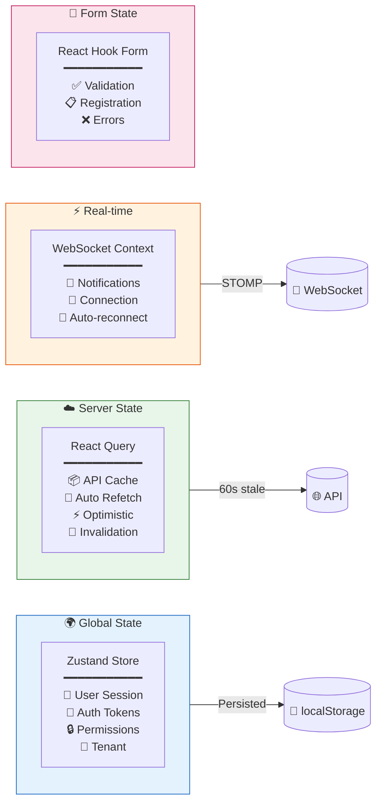

---

## 4. Component Hierarchy

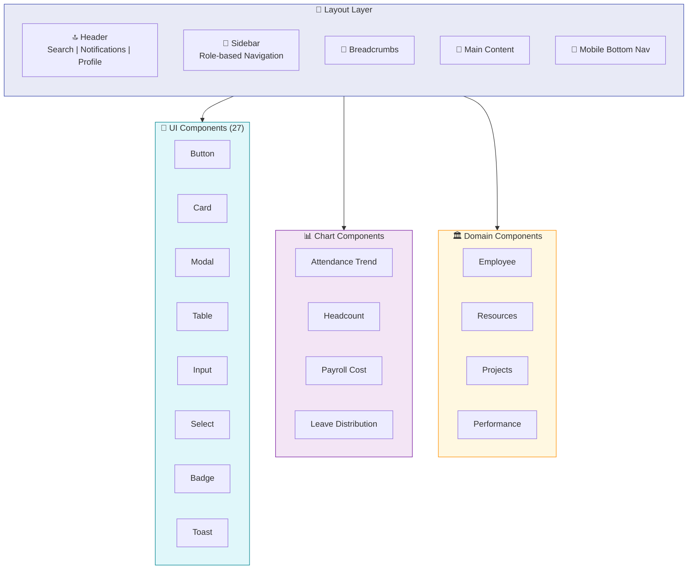

---

## 5. API & Service Architecture

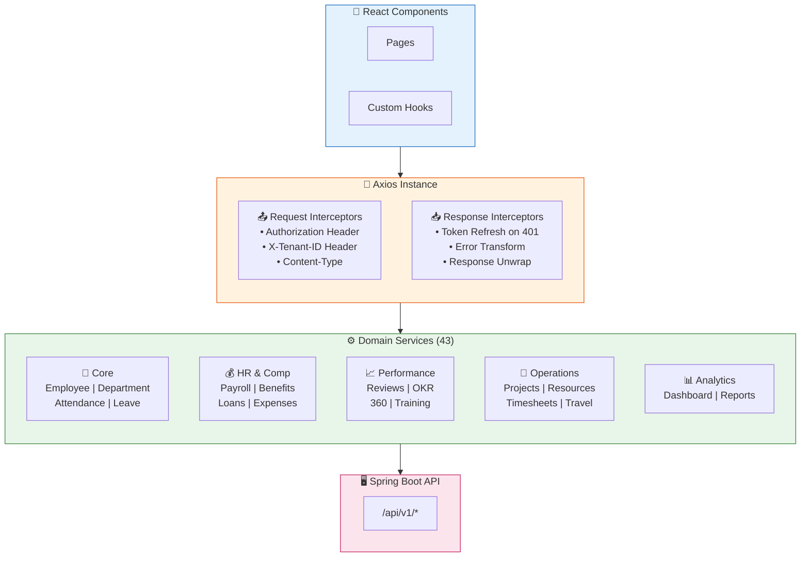

---

## 6. Real-time WebSocket Architecture

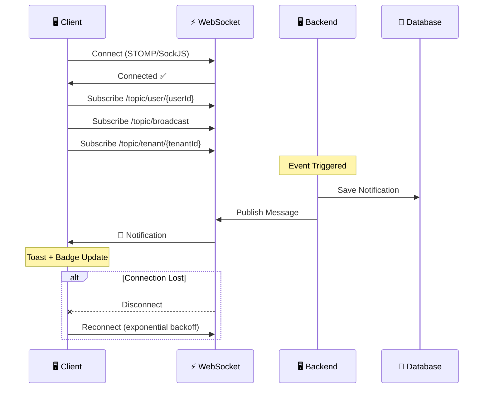

---

## 7. Authentication Flow

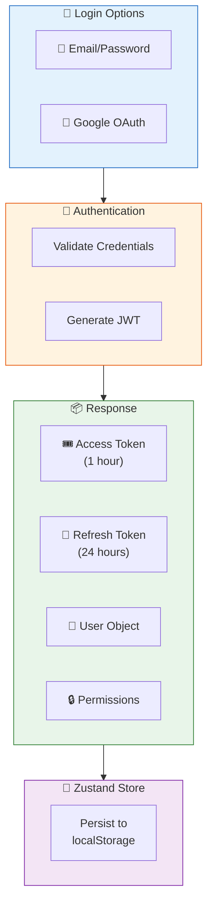

---

## 8. Role Hierarchy

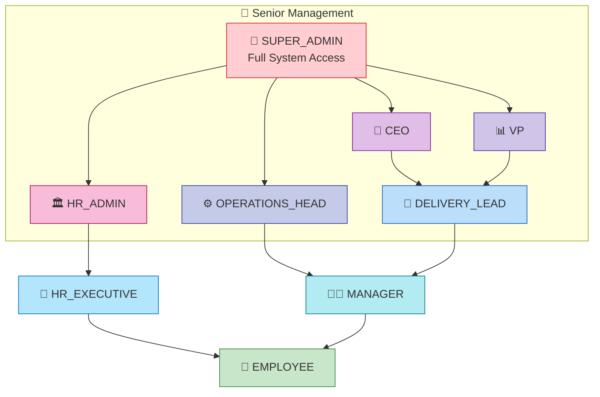

---

## 9. Google Workspace Integration

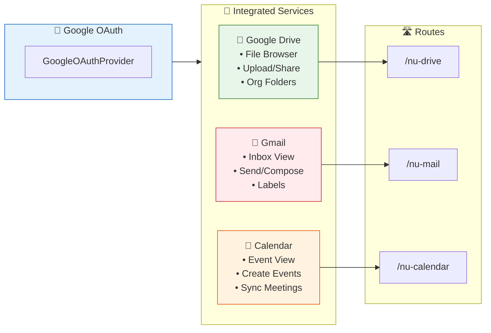

---

## 10. Application Modules

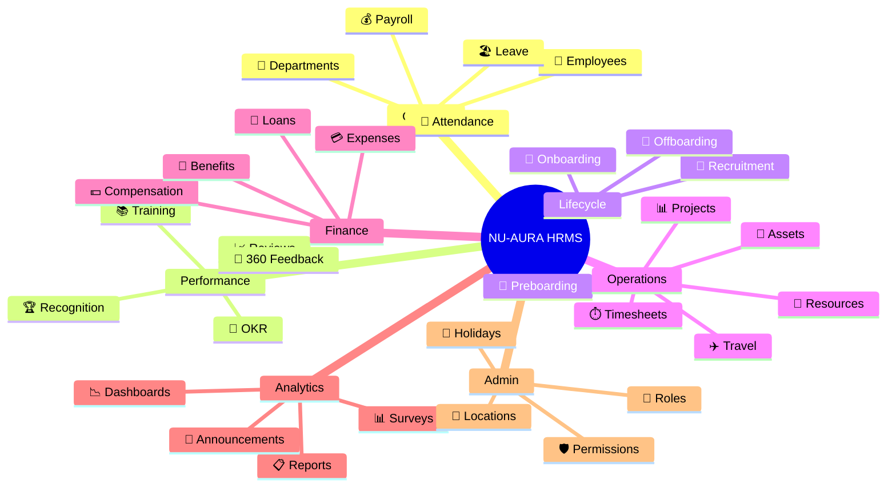

---

## 11. Data Flow Architecture

```mermaid
flowchart LR
    subgraph UI["🖥️ UI Layer"]
        Page["Page Component"]
        Hook["useQuery Hook"]
    end

    subgraph Service["⚙️ Service Layer"]
        Svc["Domain Service"]
        Axios["Axios Client"]
    end

    subgraph API["🌐 API Layer"]
        REST["REST Endpoint"]
        Controller["Controller"]
    end

    subgraph Domain["🏛️ Domain Layer"]
        Svc2["Service"]
        Repo["Repository"]
    end

    subgraph DB["💾 Data Layer"]
        PG[("PostgreSQL")]
    end

    Page --> Hook --> Svc --> Axios --> REST --> Controller --> Svc2 --> Repo --> PG

    PG --> Repo --> Svc2 --> Controller --> REST --> Axios --> Svc --> Hook --> Page

    style UI fill:#e3f2fd,stroke:#1565c0
    style Service fill:#fff3e0,stroke:#e65100
    style API fill:#e8f5e9,stroke:#2e7d32
    style Domain fill:#f3e5f5,stroke:#7b1fa2
    style DB fill:#fce4ec,stroke:#c2185b
```

---

## 12. Technology Stack

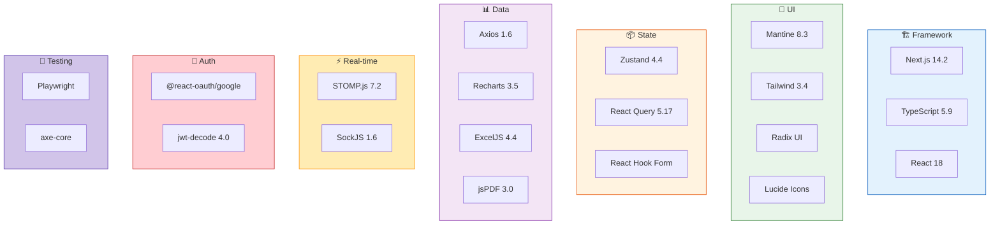

---

## 13. File Structure

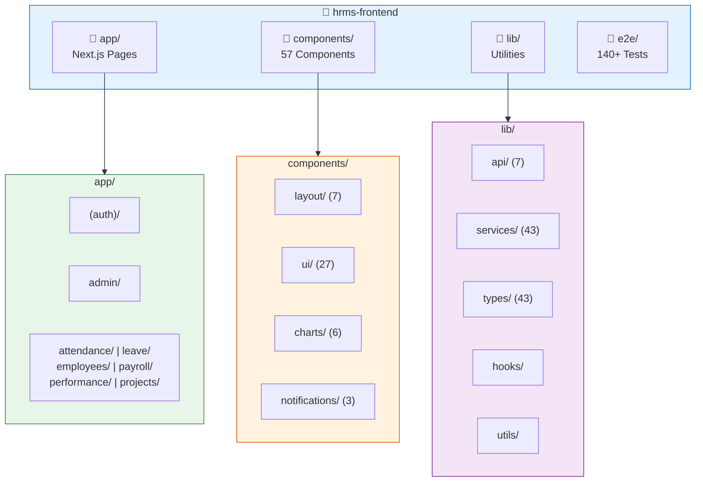

---

## 14. Request Lifecycle

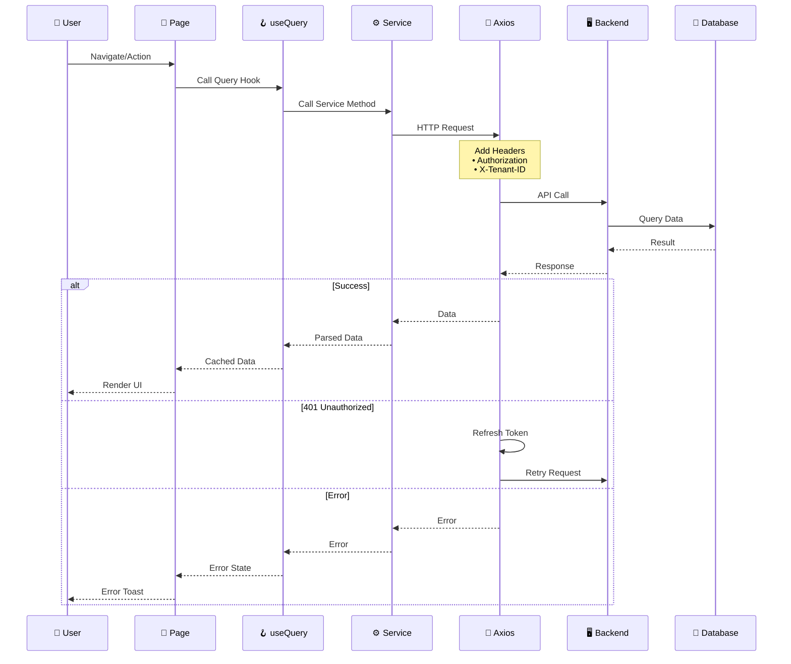

---

## Quick Stats

| Category | Count |
|----------|-------|
| 📄 Pages/Routes | 60+ |
| ⚙️ Services | 43 |
| 🧩 Components | 57 |
| 📊 Chart Components | 6 |
| 📝 Type Definitions | 43 |
| 🧪 E2E Tests | 140+ |
| 🔌 API Modules | 7 |

---

*Last Updated: January 12, 2026*
