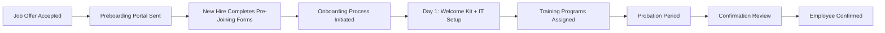
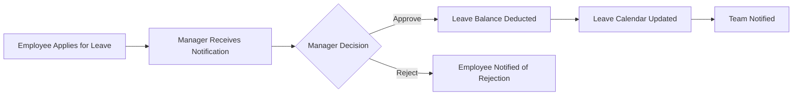
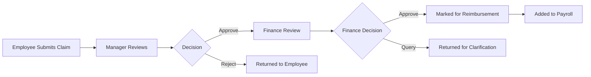
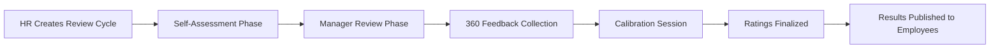
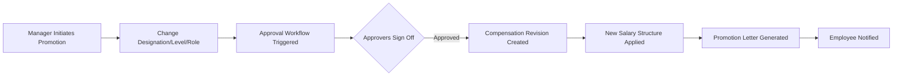
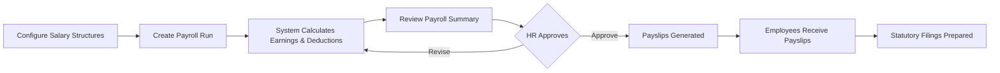

# NU-AURA Platform — User Handover Guide

**Version 1.0 | March 2026**

---

## Table of Contents

1. [Platform Overview](#1-platform-overview)
2. [Getting Started](#2-getting-started)
3. [NU-HRMS — Core HR Flows](#3-nu-hrms--core-hr-flows)
4. [NU-Hire — Recruitment Flows](#4-nu-hire--recruitment-flows)
5. [NU-Grow — Performance & Learning Flows](#5-nu-grow--performance--learning-flows)
6. [NU-Fluence — Knowledge Management](#6-nu-fluence--knowledge-management)
7. [Projects & Allocations](#7-projects--allocations)
8. [Manager Flows](#8-manager-flows)
9. [RBAC & Permissions](#9-rbac--permissions)
10. [Key Workflows](#10-key-workflows)
11. [Integrations](#11-integrations)
12. [Appendix A: Keyboard Shortcuts](#appendix-a-keyboard-shortcuts)
13. [Appendix B: Glossary](#appendix-b-glossary)
14. [Appendix C: FAQ](#appendix-c-faq)

---

## 1. Platform Overview

### What Is NU-AURA?

NU-AURA is a **bundle application platform** that combines four sub-applications under a single login:

| Sub-App | Purpose | Entry Point |
|---------|---------|-------------|
| **NU-HRMS** | Core HR management — employees, attendance, leave, payroll, benefits, assets, contracts, helpdesk | `/me/dashboard` |
| **NU-Hire** | Recruitment & onboarding — job openings, candidate pipeline, interviews, preboarding, onboarding, offboarding | `/recruitment` |
| **NU-Grow** | Performance, learning & engagement — goals, OKRs, reviews, 360 feedback, training, LMS, recognition, surveys, wellness | `/performance` |
| **NU-Fluence** | Knowledge management & collaboration — wiki, blogs/articles, templates, Drive, search | `/fluence/wiki` |

All four sub-apps share a single authentication system, role-based access control (RBAC), and platform services (approvals, notifications, audit logging).

### Login Methods

NU-AURA supports two authentication methods:

- **Google SSO** — Click **"Sign in with Google"** on the login page. Your Google account domain must match the configured tenant domain (e.g., `nulogic.io`).
- **Email & Password** — Enter your work email and password. Passwords must be at least 12 characters with uppercase, lowercase, digit, and special character.

In **Demo Mode** (when enabled), pre-configured demo accounts are available on the login page with roles ranging from Super Admin to Employee.

#### Multi-Factor Authentication (MFA)

If MFA is enabled for your account, after entering credentials you will be prompted with the MFA Verification screen. Enter the 6-digit code from your authenticator app to complete login.

### App Switcher (Waffle Grid)

The **App Switcher** is a grid icon in the header bar. Clicking it reveals a panel showing all four sub-apps:

- Each app appears as a card with its name, icon, and color gradient
- Apps you have permission to access show normally; apps you lack access to show a **lock icon**
- Click any unlocked app to switch to it; the sidebar updates automatically to show that app's navigation
- NU-HRMS (blue), NU-Hire (emerald), NU-Grow (amber/orange), NU-Fluence (violet/purple)

### Navigation

**Sidebar** — The left sidebar contains all navigation items grouped into sections. It changes based on which sub-app is active:

- **NU-HRMS sections**: Home, My Space, People, HR Operations, Pay & Finance, Projects & Work, Reports & Insights, Admin
- **NU-Hire sections**: NU-Hire hub (Recruitment, Onboarding, Preboarding, Offboarding, Offer Portal, Careers Page)
- **NU-Grow sections**: NU-Grow hub (Performance Hub, Revolution, OKR, 360 Feedback, Training, Learning, Recognition, Surveys, Wellness)
- **NU-Fluence sections**: NU-Fluence hub (Wiki, Articles, My Content, Templates, Drive, Search)

Sidebar features:
- **Collapse/Expand**: Click the collapse button or press `Cmd+B` / `Ctrl+B`
- **Section collapsing**: Click section headers to collapse/expand groups
- **Flyover panels**: When the sidebar is collapsed, hovering over items with children shows a flyover panel
- **Badge counts**: The Approvals item shows a live count of pending approvals

**Header Bar** — Contains (left to right):
- Mobile hamburger menu (mobile only)
- Logo (mobile only)
- App Switcher (waffle grid)
- Global Search (`Cmd+K` / `Ctrl+K`)
- Dark/Light mode toggle
- Notification bell (with unread count badge)
- User avatar and dropdown menu (Profile, Settings, Logout)

**Breadcrumbs** — Displayed below the header on pages that define them, showing navigation hierarchy (e.g., Dashboard > Contracts).

**Global Search** — Press `Cmd+K` (Mac) or `Ctrl+K` (Windows) to open the search dialog. Search across employees, pages, and actions.

**Mobile Bottom Navigation** — On mobile devices, a fixed bottom bar provides quick access to 5 key areas based on the active app.

### Dark/Light Mode

Click the **theme toggle** button in the header (sun/moon icon) to switch between light and dark modes. Your preference is persisted in local storage.

---

## 2. Getting Started

### First Login Flow

1. Navigate to the NU-AURA login page (`/auth/login`)
2. Choose your login method:
   - Click **"Sign in with Google"** to use Google SSO, OR
   - Enter your **Work Email** and **Password** and click **"Sign In"**
3. If MFA is enabled, enter your 6-digit authenticator code
4. You will be redirected to **My Dashboard** (`/me/dashboard`)

### My Dashboard Overview

Your personal dashboard (`/me/dashboard`) is the landing page after login. It contains:

- **Welcome Banner** — Greeting with your name, date, and quick access shortcuts
- **Time Clock Widget** — Clock In / Clock Out button with live timer showing hours worked today
- **Holiday Carousel** — Upcoming company holidays displayed in a scrollable carousel
- **Team Presence Widget** — Shows which team members are online, on leave, or absent
- **Leave Balance Widget** — Current leave balance cards (Annual Leave, Sick Leave, Casual Leave, etc.)
- **Post Composer** — Write posts for the company social feed
- **Celebration Tabs** — Birthdays, work anniversaries, and new joiners this month
- **Company Feed** — Social feed with posts, announcements, and celebrations

### My Profile Setup

Navigate to **My Space > My Profile** (`/me/profile`) or click your avatar in the header > **Profile**.

Your profile page allows you to:
- View and edit personal information (name, email, phone, address)
- Upload a profile picture
- View your department, designation, and reporting manager
- See your employee code and joining date

### Notification Preferences

Navigate to **Settings > Notifications** (`/settings/notifications`) to configure:
- Email notification preferences
- In-app notification preferences
- WebSocket real-time notification settings

---

## 3. NU-HRMS — Core HR Flows

### 3.1 Employee Self-Service (MY SPACE)

The **My Space** section is available to ALL authenticated users regardless of role. These are personal self-service pages.

#### My Dashboard (`/me/dashboard`)

Your personal landing page with:
- **Clock In/Out**: Click the "Clock In" button to start your workday. The button changes to "Clock Out" after check-in, with a live timer showing elapsed hours.
- **Leave Balances**: Cards showing remaining days for each leave type (Annual, Sick, Casual, etc.)
- **Upcoming Holidays**: Scrollable holiday carousel
- **Team Presence**: See who on your team is present, on leave, or absent today
- **Social Feed**: Company-wide posts, celebrations, and announcements
- **Post Composer**: Share updates with your team

#### My Profile (`/me/profile`)

View and manage your personal information:
- Personal details (name, email, phone, date of birth, gender)
- Address information (city, state, postal code, country)
- Emergency contact number
- Bank account details (account number, bank name, IFSC code)
- Tax ID (PAN)

#### My Payslips (`/me/payslips`)

- View monthly salary statements
- Download payslips as PDF
- See salary breakdown (basic, allowances, deductions, net pay)
- Filter by month/year

#### My Attendance (`/me/attendance`)

- View your daily attendance records with check-in/check-out times
- See monthly summary (present days, absent days, late days, attendance percentage)
- Submit **attendance regularization** requests for missed punches
- View work hours breakdown

#### My Leaves (`/me/leaves`)

- View current leave balances by type
- See history of all leave requests with statuses (Approved, Pending, Rejected, Cancelled)
- Quick link to apply for new leave

#### My Documents (`/me/documents`)

- View uploaded documents (ID proofs, certificates, etc.)
- Request HR documents (employment verification, salary certificate)
- Download available documents

---

### 3.2 People Management

#### Employee Directory (`/employees/directory`)

- Search employees by name, email, employee code, or department
- Filter by department, status (Active, On Leave, On Notice, Terminated, Resigned)
- View employee cards with photo, name, designation, department
- Click any employee to view their full profile

**Required Permission**: `EMPLOYEE:READ`

#### Employees List (`/employees`)

Full employee management page with:
- **Employee Table**: Sortable columns (Employee Code, Name, Email, Department, Designation, Status, Joining Date)
- **Search Bar**: Search by name, email, or employee code
- **Filters**: Department, employment type, status, level
- **Add New Employee** button (requires `EMPLOYEE:CREATE` permission)

**Add New Employee Flow** — Click **"+ Add Employee"** to open the creation form:

1. **Basic Information**: Employee Code, First Name, Middle Name, Last Name
2. **Contact Details**: Work Email (required), Personal Email, Phone Number, Emergency Contact
3. **Personal Details**: Date of Birth, Gender (Male/Female/Other/Prefer Not to Say), Address, City, State, Postal Code, Country
4. **Job Information**: Designation (required), Level (Entry/Mid/Senior/Lead/Manager/Senior Manager/Director/VP/SVP/CXO), Job Role, Department (required, dropdown), Employment Type (Full-time/Part-time/Contract/Intern), Status, Joining Date (required), Confirmation Date
5. **Reporting**: Manager (searchable dropdown), Dotted Line Manager 1, Dotted Line Manager 2
6. **Banking**: Bank Account Number, Bank Name, Bank IFSC Code, Tax ID
7. **Credentials**: Password (required, for initial login)
8. Click **"Create Employee"** to save

#### Employee Detail Page (`/employees/[id]`)

The employee detail page has **five tabs**:

| Tab | Contents |
|-----|----------|
| **About** | Summary (key info, contact), Timeline (employment events), Wall Activity (posts/updates) |
| **Profile** | Full personal details, address, emergency contacts, custom fields |
| **Job** | Department, designation, level, reporting manager, employment type, dates, salary info |
| **Documents** | Uploaded documents organized by category, upload/download capabilities |
| **Assets** | Assigned assets, asset requests, damage charges |

Additional features:
- **Talent Journey Tab**: View the employee's complete career progression
- **Custom Fields**: View and edit organization-specific custom fields
- **Edit Employee** button to modify details
- **Delete Employee** button (with confirmation dialog)

#### Departments (`/departments`)

- View all departments with head count
- Create new departments
- Edit department name, description, and department head
- View department hierarchy

**Required Permission**: `DEPARTMENT:VIEW`

#### Org Chart (`/org-chart`)

- Visual organization hierarchy chart
- Two views: **Hierarchy View** (reporting lines) and **Department View** (grouped by department)
- Click any node to view employee details
- Zoom and pan controls

**Required Permission**: `ORG_STRUCTURE:VIEW`

#### Announcements (`/announcements`)

- View company-wide announcements
- Create new announcements (requires permission)
- Rich text content with attachments

**Required Permission**: `ANNOUNCEMENT:VIEW`

#### Approvals Inbox (`/approvals/inbox`)

The unified approval inbox for all workflow types:

- **Module Tabs**: Filter by All, Leave, Expense, Asset, Travel, Recruitment, Others
- **Search**: Search by requester name or description
- **Actions**: Approve or Reject each item with comments
- **Delegation**: Set up approval delegation when you are away:
  - Click "Delegate" to open the delegation form
  - Select a delegate (employee search)
  - Set start date and end date
  - Optionally add a reason
- **Real-time updates**: WebSocket notifications for new approvals
- **Badge count**: Total pending approvals shown in sidebar badge

**Required Permission**: `WORKFLOW:VIEW`

---

### 3.3 Pay & Finance

#### Payroll Management (`/payroll`)

The payroll hub page shows navigation cards to sub-modules:

- **Payroll Runs** (`/payroll/runs`) — Create and manage payroll processing runs for each pay period
- **Payslips** (`/payroll/payslips`) — View and download employee payslips with salary breakdowns
- **Salary Structures** (`/payroll/structures`) — Define salary structures with configurable allowances and deductions
- **Bulk Processing** (`/payroll/bulk-processing`) — Process payroll for multiple employees at once with a guided wizard
- **Statutory** (`/payroll/statutory`) — Statutory deductions and compliance (PF, ESI, PT)
- **Components** (`/payroll/components`) — Manage salary components (earnings, deductions, taxes)

**Required Permission**: `PAYROLL:VIEW`

#### Compensation Planning (`/compensation`)

- Create compensation review cycles
- Track salary revisions
- View compensation history
- Manage promotion-linked compensation changes

**Required Permission**: `COMPENSATION:VIEW`

#### Benefits Management (`/benefits`)

Benefits management with multiple tabs:

- **Available Plans**: Browse active benefit plans (Health Insurance, Life Insurance, Retirement, Dental, Vision, Wellness, etc.)
- **My Enrollments**: View your current benefit enrollments with coverage level and status
- **Enroll**: Select a plan, choose coverage level (EMPLOYEE_ONLY / EMPLOYEE_SPOUSE / EMPLOYEE_FAMILY / FAMILY), and submit enrollment
- **Claims**: Submit benefit claims with:
  - Claim Amount
  - Claim Date
  - Description
  - Supporting Documents
- **Terminate Enrollment**: End an active enrollment with confirmation

**Required Permission**: `BENEFIT:VIEW_SELF`

#### Expense Claims (`/expenses`)

Manage expense reimbursements with four tabs:

- **My Claims**: View your submitted expense claims
- **Pending**: Expense claims awaiting your approval (managers)
- **All**: All expense claims across the organization (admin view)
- **Analytics**: Expense analytics dashboard with charts

**Create Expense Claim** — Click **"+ New Claim"**:
1. **Claim Date**: Select the date of expense
2. **Category**: Choose from predefined categories (Travel, Meals, Office Supplies, etc.)
3. **Description**: Describe the expense
4. **Amount**: Enter the amount
5. **Currency**: Select currency code (3-letter ISO code)
6. **Receipt URL**: Upload or link to receipt (optional)
7. **Notes**: Additional notes (optional)
8. Click **"Submit"**

Claim lifecycle: Draft > Submitted > Under Review > Approved/Rejected > Paid

**Bulk Actions**: Select multiple claims and approve/reject in batch.

**Required Permission**: `EXPENSE:VIEW`

#### Employee Loans (`/loans`)

- **Overview**: Dashboard showing active loans, total outstanding, total repaid, pending approvals
- **My Loans**: List of all your loan applications with status (Pending, Active, Disbursed, Repaid, Rejected)
- **New Loan** (`/loans/new`): Apply for a new loan with amount, tenure, and purpose
- **Loan Detail** (`/loans/[id]`): View repayment schedule, outstanding balance, EMI details

**Required Permission**: `LOAN:VIEW`

#### Travel Management (`/travel`)

- **Overview**: List of travel requests with search, status filter (Pending/Approved/Rejected/Completed), and type filter (Business/Training/Conference/Client Visit/Relocation)
- **New Travel Request** (`/travel/new`): Submit a new request with:
  - Travel type
  - Origin and destination
  - Travel dates
  - Transport mode (Flight, Train, Car, Bus)
  - Estimated budget
  - Purpose description
- **Travel Detail** (`/travel/[id]`): View full request details, approval status, and expense tracking

**Required Permission**: `TRAVEL:VIEW`

#### Statutory Compliance (`/statutory`)

- PF (Provident Fund) configuration
- ESI (Employee State Insurance) settings
- PT (Professional Tax) configuration
- View statutory deduction history

**Required Permission**: `STATUTORY:VIEW`

#### Tax Declarations (`/tax`)

- **Overview** (`/tax`): Tax declaration dashboard
- **Declarations** (`/tax/declarations`): Submit and manage investment declarations for tax saving (80C, 80D, HRA, etc.)

**Required Permission**: `TAX:VIEW`

---

### 3.4 HR Operations

#### Attendance Management (`/attendance`)

Sub-pages accessible from the sidebar:

| Page | Route | Description |
|------|-------|-------------|
| Overview | `/attendance` | Organization-wide attendance dashboard with charts and stats |
| Team Attendance | `/attendance/team` | View team members' attendance for the selected date range |
| Regularization | `/attendance/regularization` | Review and approve attendance regularization requests |
| Comp-Off | `/attendance/comp-off` | Manage compensatory off requests for weekend/holiday work |
| Shift Swap | `/attendance/shift-swap` | Handle shift swap requests between employees |

**Required Permission**: `ATTENDANCE:VIEW_ALL`

#### Leave Management (`/leave`)

Sub-pages:

| Page | Route | Description |
|------|-------|-------------|
| Overview | `/leave` | Leave balances, recent requests, and leave type cards |
| My Leaves | `/leave/my-leaves` | Personal leave history and balances |
| Apply Leave | `/leave/apply` | Submit a new leave application |
| Leave Approvals | `/leave/approvals` | Approve/reject leave requests (for managers) |
| Leave Calendar | `/leave/calendar` | Calendar view of team absences |

**Apply Leave Flow** (`/leave/apply`):
1. Select **Leave Type** (Annual, Sick, Casual, etc.)
2. Choose **Start Date** and **End Date**
3. Select **Duration** (Full Day / First Half / Second Half)
4. Enter **Reason** for leave
5. Optionally attach supporting documents
6. Click **"Apply"**

Leave statuses: PENDING > APPROVED / REJECTED / CANCELLED

#### Assets (`/assets`)

Manage company assets (laptops, monitors, phones, furniture, vehicles, access cards):

- **Asset List**: View all assets with search and filter
- **Add Asset** — Click **"+ Add Asset"**:
  - Asset Name
  - Category (Laptop, Monitor, Phone, Tablet, Furniture, Vehicle, Access Card, Other)
  - Serial Number, Model
  - Purchase Date, Purchase Price
  - Location
  - Status (Available, Assigned, Under Repair, Retired)
- **Assign Asset**: Assign an asset to an employee
- **Return Asset**: Process asset return from an employee
- **Edit/Delete**: Modify or remove asset records

**Required Permission**: `ASSET:VIEW`

#### Letters (`/letters`)

- Generate and manage HR letters (offer letters, experience certificates, salary certificates, etc.)
- Use predefined templates
- Download generated letters as PDF

**Required Permission**: `LETTER_TEMPLATE:VIEW`

#### Contracts (`/contracts`)

- **Contract List**: View all employment contracts with stats (Active, Expiring Soon, Expired, Total)
- **Create Contract** (`/contracts/new`): Create new employment contracts
- **Contract Detail** (`/contracts/[id]`): View full contract details
- **Templates** (`/contracts/templates`): Manage contract templates
- **Digital Signature** (`/sign/[token]`): Employees can digitally sign contracts via a unique link

**Required Permission**: `CONTRACT:VIEW`

---

### 3.5 Helpdesk

#### Helpdesk (`/helpdesk`)

Employee helpdesk for raising and tracking support tickets:

- **SLA Management** (`/helpdesk/sla`): Configure Service Level Agreements for ticket categories
- **Knowledge Base** (`/helpdesk/knowledge-base`): Self-service articles and FAQs

**Required Permission**: `HELPDESK:SLA_MANAGE` (SLA), `HELPDESK:KB_VIEW` (Knowledge Base)

---

### 3.6 Reports & Analytics

#### Reports (`/reports`)

Report hub with downloadable reports:

| Report | Category | Date Range Required | Filters |
|--------|----------|-------------------|---------|
| Employee Directory Report | HR | No | Department, Status |
| Attendance Report | Attendance | Yes | Department, Employee, Status |
| Leave Report | Leave | Yes | Department, Leave Type |
| Payroll Report | Payroll | Yes | Department, Pay Period |
| Performance Report | Performance | Yes | Department, Cycle |
| Headcount Report | HR | No | Department |
| Attrition Report | HR | Yes | Department |
| Utilization Report | Projects | Yes | Department, Project |

Additional report pages:
- **Report Builder** (`/reports/builder`) — Custom report builder with drag-and-drop fields
- **Scheduled Reports** (`/reports/scheduled`) — Configure automatic report generation and email delivery

**Required Permission**: `REPORT:VIEW` (view), `REPORT:CREATE` (builder)

#### Analytics (`/analytics`)

Interactive analytics dashboards with charts and visualizations.

#### Org Health (`/analytics/org-health`)

Organization health metrics:
- Attrition rate trends
- Headcount growth
- Department distribution
- Tenure analysis
- Diversity metrics

**Required Permission**: `ANALYTICS:VIEW`

---

### 3.7 Admin

#### System Admin (`/admin`)

The admin dashboard shows platform-wide metrics:
- Total users, active employees, departments
- System health status (backend, database, Redis, Kafka, Elasticsearch, MinIO)
- User management table with search and role assignment

Sub-pages:

| Page | Route | Description |
|------|-------|-------------|
| Roles & Access | `/admin/roles` | Create and manage RBAC roles |
| Permissions | `/admin/permissions` | View and assign granular permissions |
| System Settings | `/admin/system` | Platform-wide system configuration |
| Feature Flags | `/admin/feature-flags` | Toggle features on/off per tenant |

**Required Permission**: `SETTINGS:VIEW`, `ROLE:MANAGE`, `PERMISSION:MANAGE`

#### Organization Setup

| Page | Route | Description |
|------|-------|-------------|
| Holidays | `/admin/holidays` | Manage company holiday calendar |
| Shifts | `/admin/shifts` | Define work shifts (morning, evening, night, flexible) |
| Office Locations | `/admin/office-locations` | Manage office addresses and geo-fencing |
| Org Hierarchy | `/admin/org-hierarchy` | Configure organizational hierarchy levels |
| Custom Fields | `/admin/custom-fields` | Create custom data fields for employees, departments, etc. |

#### Leave Setup

| Page | Route | Description |
|------|-------|-------------|
| Leave Types | `/admin/leave-types` | Configure leave types (accrual rules, carry-forward, max days) |
| Leave Requests (Admin) | `/admin/leave-requests` | Admin view of all leave requests across organization |

#### Integrations (`/admin/integrations`)

Configure third-party integrations:
- Google OAuth settings
- Twilio (SMS) configuration
- MinIO (file storage) settings
- Elasticsearch connection
- SMTP email configuration

#### Settings (`/settings`)

| Page | Route | Description |
|------|-------|-------------|
| Profile | `/settings/profile` | Edit your account profile |
| Security | `/settings/security` | Change password, enable MFA, view login history |
| Notifications | `/settings/notifications` | Configure notification preferences |

---

## 4. NU-Hire — Recruitment Flows

Switch to NU-Hire using the **App Switcher** (waffle grid) in the header.

### 4.1 Recruitment Dashboard (`/recruitment`)

The recruitment overview displays:
- **KPI Stats**: Total job openings, active candidates, interviews this week, offers extended
- **Active Jobs**: List of open positions with location, department, and candidate count
- **Recent Candidates**: Latest candidates added to the pipeline
- **Upcoming Interviews**: Scheduled interviews with time, candidate, and interviewer details

### 4.2 Job Openings (`/recruitment/jobs`)

- **Job List**: All job openings with status (Open, Closed, On Hold, Draft)
- **Create Job Opening** — Click **"+ Create Job"**:
  1. Job Title
  2. Department
  3. Location
  4. Employment Type (Full-time, Part-time, Contract, Intern)
  5. Experience Range (min-max years)
  6. Salary Range (optional)
  7. Job Description (rich text editor)
  8. Requirements and qualifications
  9. Number of openings
  10. Click **"Publish"** or **"Save as Draft"**

### 4.3 Candidate Pipeline (`/recruitment/pipeline`)

Visual **Kanban board** view of candidates across stages:

| Stage | Description |
|-------|-------------|
| NEW | Newly added candidates |
| SCREENING | Resume screening in progress |
| INTERVIEW | Scheduled for or in interview process |
| SELECTED | Passed all interview rounds |
| OFFER_EXTENDED | Offer letter sent |
| OFFER_ACCEPTED | Candidate accepted the offer |
| OFFER_DECLINED | Candidate declined |
| REJECTED | Not selected |
| WITHDRAWN | Candidate withdrew application |

**Candidate Detail** (`/recruitment/candidates/[id]`):
- Personal information, resume, contact details
- Interview history and feedback
- Stage progression timeline
- Notes and comments

**Job-specific Kanban** (`/recruitment/[jobId]/kanban`):
- Drag-and-drop candidates between stages for a specific job opening

#### Interviews (`/recruitment/interviews`)

- View all scheduled interviews
- Calendar view of interview schedule
- Interview feedback forms

#### Job Boards (`/recruitment/job-boards`)

- Manage external job board integrations
- Track application sources

### 4.4 Onboarding (`/onboarding`)

Manage the onboarding process for new hires:

- **Overview**: Dashboard with stats (Total onboardings, In Progress, Completed, Not Started, Cancelled)
- **Search & Filter**: Find onboarding processes by employee name/ID and status
- **New Onboarding** (`/onboarding/new`): Initiate onboarding for a new hire
- **Onboarding Detail** (`/onboarding/[id]`): Track checklist completion, document collection, training assignments
- **Templates** (`/onboarding/templates`): Create reusable onboarding checklists
  - Template Detail (`/onboarding/templates/[id]`): Edit template steps
  - New Template (`/onboarding/templates/new`): Build a new onboarding template

**Required Permission**: `ONBOARDING:VIEW`, `ONBOARDING:CREATE`

### 4.5 Preboarding (`/preboarding`)

Pre-joining activities for candidates who have accepted offers:
- Send preboarding portal links to new hires
- **Preboarding Portal** (`/preboarding/portal/[token]`): External-facing portal where new hires complete pre-joining formalities (document upload, personal info, bank details)

### 4.6 Offboarding (`/offboarding`)

Manage employee exits:

- **Exit Process List**: All exit processes with search and status filter
- **Create Exit Process** — Click **"+ Initiate Exit"**:
  1. Employee ID (search)
  2. Exit Type (Resignation, Termination, Retirement, End of Contract, Mutual Separation)
  3. Resignation Date
  4. Last Working Date
  5. Notice Period Days
  6. Reason
- **Status Tracking**: NOT_STARTED > IN_PROGRESS > COMPLETED / CANCELLED
- **Exit Interview** (`/exit-interview/[token]`): Confidential exit interview form
- **Full & Final Settlement** (`/offboarding/exit/fnf`): Calculate and process final settlement

**Required Permission**: `EXIT:VIEW`

### 4.7 Offer Portal (`/offer-portal`)

Manage offer letters for selected candidates:
- Generate offer letters from templates
- Track offer status (Sent, Viewed, Accepted, Declined)
- Digital signature integration

### 4.8 Careers Page (`/careers`)

Public-facing careers page showing open positions. Candidates can:
- Browse open positions
- Filter by department, location, employment type
- Apply directly through the portal

---

## 5. NU-Grow — Performance & Learning Flows

Switch to NU-Grow using the **App Switcher**.

### 5.1 Performance Hub (`/performance`)

The performance hub shows module navigation cards and live stats:

- **Total Goals**: Number of goals across the organization
- **Active Review Cycles**: Currently running review cycles
- **OKR Objectives**: Total objectives tracked
- **Pending 360 Reviews**: Reviews awaiting your input

#### Goals (`/performance/goals`)

Set and track individual, team, and organizational goals:
- **Goal Types**: Individual, Team, Department, Organization
- **Goal Attributes**: Title, description, target metric, current progress, due date, priority
- **Progress Tracking**: Update progress percentage, add milestones
- **Status**: Not Started, In Progress, At Risk, Completed, Cancelled

#### OKR Management (`/performance/okr`)

Objectives and Key Results for strategic alignment:
- **Create Objective**: Title, description, time period, owner, alignment to parent objective
- **Key Results**: Measurable outcomes with target values and progress tracking
- **OKR Dashboard Summary**: Overall OKR progress, objectives count, completion rates
- **Cascade View**: See how OKRs align from company to team to individual

#### Performance Reviews (`/performance/reviews`)

Conduct and manage employee performance reviews:
- View all review assignments
- Complete self-assessments
- Manager review forms
- Rating scales and competency evaluation

#### Review Cycles (`/performance/cycles`)

Manage performance review cycles:
- **Create Cycle**: Name, start date, end date, review type, participants
- **Cycle Detail** (`/performance/cycles/[id]`): Track cycle progress
- **Calibration** (`/performance/cycles/[id]/calibration`): Calibrate ratings across teams
- **Nine-Box Grid** (`/performance/cycles/[id]/nine-box`): Plot employees on performance vs. potential grid

#### 360 Feedback (`/performance/360-feedback`)

Multi-rater feedback system:
- Request feedback from peers, managers, and direct reports
- Complete pending 360 review requests
- View aggregated feedback results

#### Continuous Feedback (`/performance/feedback`)

Ongoing feedback between employees:
- Give feedback to any colleague
- Receive and view feedback
- Feedback categories and tags

#### Revolution (`/performance/revolution`)

Advanced performance analytics and insights dashboard with AI-powered recommendations.

#### PIP — Performance Improvement Plan (`/performance/pip`)

- Create PIPs for underperforming employees
- Track improvement milestones
- Set review dates and success criteria

#### Calibration (`/performance/calibration`)

Cross-team rating calibration to ensure fairness:
- Drag-and-drop employees between rating bands
- View distribution curves

#### 9-Box Grid (`/performance/9box`)

Plot employees on a 3x3 grid of Performance (X) vs. Potential (Y):
- Low/Medium/High Performance
- Low/Medium/High Potential
- Click any box to see employees in that category

---

### 5.2 Training & LMS

#### Training Programs (`/training`)

Manage training programs with three tabs:

- **My Trainings**: Your enrolled training programs with progress and status (Enrolled, In Progress, Completed, Dropped)
- **Course Catalog** (`/training/catalog`): Browse available programs by category:
  - Technical Skills
  - Soft Skills
  - Leadership
  - Compliance
  - Product Knowledge
  - Safety
  - Onboarding
- **Manage Programs**: Create and edit training programs (admin)

**Create Training Program**:
1. Program Name
2. Category (Technical Skills, Soft Skills, Leadership, Compliance, etc.)
3. Delivery Mode (Online, Classroom, Blended, Self-paced)
4. Duration, Start Date, End Date
5. Maximum Participants
6. Description and objectives
7. Trainer information

**Skill Gap Analysis**: Built-in component that identifies skill gaps and recommends training programs.

#### Learning Management System (`/learning`)

Full LMS with three tabs:

- **Catalog**: Browse published courses with difficulty levels (Beginner, Intermediate, Advanced)
  - View course details (`/learning/courses/[id]`)
  - Enroll in courses
  - Play course content (`/learning/courses/[id]/play`)
  - Take quizzes (`/learning/courses/[id]/quiz/[quizId]`)
- **My Courses**: Track enrolled courses and progress
- **Certificates** (`/learning/certificates`): View and download earned certificates
- **Learning Paths** (`/learning/paths`): Curated sequences of courses for career development

#### My Learning (`/training/my-learning`)

Personal learning dashboard showing all your training enrollments and progress.

---

### 5.3 Recognition (`/recognition`)

Employee recognition and appreciation system:

- **Public Feed**: Wall of recognitions visible to everyone
- **Give Recognition** — Click **"+ Recognize"**:
  1. Select **Recipient** (employee search)
  2. Choose **Type**: KUDOS, APPRECIATION, ACHIEVEMENT, INNOVATION, TEAMWORK, LEADERSHIP, CUSTOMER_FOCUS, GOING_ABOVE
  3. Choose **Category**: Core Values, Peer Recognition, Manager Recognition, Spot Award, Milestone
  4. Enter **Title** (required, max 255 chars)
  5. Write a **Message** (optional, max 2000 chars)
  6. Click **"Send"**
- **My Received**: View recognitions you have received
- **My Given**: View recognitions you have sent
- **Leaderboard**: Top recognized employees with points ranking
- **Points System**: Earn points for receiving recognitions
- **Reactions**: React to recognitions with emojis (Like, Love, Celebrate, Insightful, Funny, Support)

**Required Permission**: `RECOGNITION:VIEW`

### 5.4 Surveys (`/surveys`)

Create and manage employee surveys:

- **Survey List**: All surveys with status (Draft, Active, Paused, Completed)
- **Create Survey** — Click **"+ New Survey"**:
  1. Survey Name
  2. Type (ENGAGEMENT, PULSE, ONBOARDING, EXIT, FEEDBACK, CUSTOM)
  3. Description
  4. Start Date, End Date
  5. Target Audience
  6. Questions (add/edit/reorder)
- **Launch Survey**: Activate a draft survey
- **Complete Survey**: Mark as completed and view results
- **Analytics**: Response rates, question-by-question analysis

**Required Permission**: `SURVEY:VIEW`

### 5.5 Wellness (`/wellness`)

Employee wellness program:

- **Active Programs**: Browse wellness programs by category:
  - Physical Fitness
  - Mental Health
  - Nutrition
  - Sleep
- **Active Challenges**: Join team or individual wellness challenges
- **Log Health Metrics**: Record daily health data:
  - Steps count
  - Sleep hours
  - Water intake (glasses)
  - Exercise duration (minutes)
  - Meditation duration (minutes)
- **My Points**: Track your wellness points
- **Leaderboard**: Top participants ranked by wellness points

**Required Permission**: `WELLNESS:VIEW`

---

## 6. NU-Fluence — Knowledge Management

Switch to NU-Fluence using the **App Switcher**.

### Wiki (`/fluence/wiki`)

- Browse wiki pages organized by category
- Create new wiki pages (`/fluence/wiki/new`) with rich text editor (Tiptap)
- Edit existing pages (`/fluence/wiki/[slug]/edit`)
- View page history and contributors
- Full-text search powered by Elasticsearch

### Articles / Blogs (`/fluence/blogs`)

- Browse published articles
- Write new articles (`/fluence/blogs/new`) with rich text editor
- Edit articles (`/fluence/blogs/[slug]/edit`)
- Categories, tags, and featured images

### My Content (`/fluence/my-content`)

- View all content you have authored (wiki pages, articles, templates)
- Draft management

### Templates (`/fluence/templates`)

- Browse document templates
- Create new templates (`/fluence/templates/new`)
- Use templates to start new wiki pages or articles

### Drive (`/fluence/drive`)

- File storage and management (powered by MinIO)
- Upload, download, organize files in folders

### Search (`/fluence/search`)

- Full-text search across all wiki pages, articles, and templates
- Powered by Elasticsearch for fast, relevant results

### Wall (`/fluence/wall`)

- Social wall / discussion feed for the Fluence community

### AI Chat Widget

When browsing NU-Fluence, an **AI Chat Widget** appears in the bottom-right corner for contextual assistance.

---

## 7. Projects & Allocations

### Projects (`/projects`)

Project management for HR-tracked projects:

- **Project List**: Table of all projects with search, filter, and pagination
- **Create Project** — Click **"+ New Project"**:
  1. Project Name
  2. Project Code
  3. Type (Internal, Client, Research, Support, Other)
  4. Priority (Low, Medium, High, Critical)
  5. Status (Planning, Active, On Hold, Completed, Cancelled)
  6. Start Date, End Date
  7. Budget
  8. Description
  9. Owner (employee search)
  10. Team Members (multi-select employee search)
- **Project Detail** (`/projects/[id]`): Full project view with team, timeline, budget tracking
- **Export**: Download project data as Excel
- **Edit/Delete**: Modify or remove projects

Additional project views:
- **Gantt Chart** (`/projects/gantt`): Timeline visualization of all projects
- **Project Calendar** (`/projects/calendar`): Calendar view of project milestones
- **Resource Conflicts** (`/projects/resource-conflicts`): Identify over-allocated employees

### Resource Management (`/resources`)

| Page | Route | Description |
|------|-------|-------------|
| Overview | `/resources` | Resource management dashboard |
| Capacity | `/resources/capacity` | View team capacity and availability |
| Availability | `/resources/availability` | Check employee availability for assignments |
| Workload | `/resources/workload` | Visualize workload distribution |
| Resource Pool | `/resources/pool` | Manage the pool of assignable resources |

### Allocations (`/allocations`)

- View and manage employee project allocations with percentage split
- **Allocation Summary** (`/allocations/summary`): Organization-wide allocation overview

### Timesheets (`/timesheets`)

- Weekly timesheet entry for project hours
- Submit timesheets for approval

### Time Tracking (`/time-tracking`)

- **Time Entries List** (`/time-tracking`): View all time entries
- **New Entry** (`/time-tracking/new`): Log time against projects/tasks
- **Entry Detail** (`/time-tracking/[id]`): View and edit a time entry

### Calendar (`/nu-calendar`)

Shared organizational calendar:
- View events, meetings, holidays, birthdays
- Create new events (`/calendar/new`)
- Event detail (`/calendar/[id]`)

### NU-Drive (`/nu-drive`)

File storage and document management (separate from Fluence Drive).

### NU-Mail (`/nu-mail`)

Internal email/messaging system.

---

## 8. Manager Flows

Managers have additional capabilities beyond the employee self-service:

### Manager Dashboard (`/dashboards/manager`)

Manager-specific dashboard with:
- Team size and presence overview
- Pending approvals count
- Team performance summary
- Direct reports list

### Executive Dashboard (`/dashboards/executive`)

C-level executive view with:
- Organization-wide KPIs
- Headcount trends
- Attrition metrics
- Department performance comparison
- Budget utilization

**Required Permission**: `DASHBOARD:EXECUTIVE`

### Team Attendance (`/attendance/team`)

View team attendance patterns, late arrivals, and absence trends.

### Leave Approvals (`/leave/approvals`)

Approve or reject leave requests from direct reports with one-click actions.

### Expense Approvals

The **Pending** tab in Expenses (`/expenses`) shows claims awaiting manager approval. Approve, reject, or request additional information.

### Approval Inbox (`/approvals/inbox`)

Centralized inbox for ALL approval types: Leave, Expense, Asset, Travel, Recruitment offers, and more.

---

## 9. RBAC & Permissions

### Role Hierarchy

NU-AURA uses role-based access control. The following roles exist (in order of authority):

| Role | Level | Description |
|------|-------|-------------|
| **SUPER_ADMIN** | 100 | Full platform access across all tenants |
| **TENANT_ADMIN** | 90 | Full access within a single tenant |
| **HR_ADMIN** | 80 | Full HR module access |
| **HR_MANAGER** | 75 | HR operations and team management |
| **FINANCE_ADMIN** | 70 | Payroll, compensation, and finance modules |
| **PAYROLL_ADMIN** | 65 | Payroll processing and payslip management |
| **DEPARTMENT_HEAD** | 60 | Department-level management |
| **MANAGER** | 55 | Team management and approvals |
| **RECRUITMENT_ADMIN** | 50 | Recruitment module administration |
| **TEAM_LEAD** | 45 | Team-level oversight |
| **TRAINER** | 40 | Training program management |
| **RECRUITER** | 35 | Candidate and job management |
| **EMPLOYEE** | 10 | Self-service access only |

### How RBAC Works

1. **Sidebar Visibility**: Menu items are shown/hidden based on the `requiredPermission` field. Items without a required permission (e.g., My Space) are always visible.
2. **App-Level Gating**: The App Switcher shows lock icons on sub-apps the user cannot access, determined by whether the user has at least one permission matching the app's permission prefixes.
3. **SuperAdmin Bypass**: Users with the SUPER_ADMIN role automatically bypass all permission checks — they see every menu item, every page, and every feature.
4. **Every User Is an Employee**: All users (including managers, HR admins, executives) see the My Space self-service pages. Roles are additive — higher roles get additional pages on top of the base employee experience.
5. **Permission Format**: Permissions follow the `MODULE:ACTION` pattern (e.g., `EMPLOYEE:READ`, `PAYROLL:VIEW`, `LEAVE:APPROVE`).
6. **Permission Scopes**: Some permissions have scope levels:
   - `VIEW_ALL` — See all records in the module
   - `VIEW_DEPARTMENT` — See records in your department only
   - `VIEW_TEAM` — See records for your direct reports only
   - `VIEW_SELF` — See only your own records

---

## 10. Key Workflows

### 10.1 Employee Onboarding (End-to-End)

**Steps:**
1. **Offer Accepted**: Recruitment marks candidate as OFFER_ACCEPTED
2. **Preboarding**: HR sends preboarding portal link; candidate uploads documents, fills personal info, bank details
3. **Onboarding Initiated**: HR creates onboarding process from template with checklist items
4. **Day 1**: IT assets assigned, workspace allocated, welcome kit delivered
5. **Training**: Mandatory training programs auto-assigned based on role and department
6. **Probation**: Employee enters probation period (tracked in contract)
7. **Confirmation**: Manager initiates confirmation review; HR approves; status changes to CONFIRMED

### 10.2 Leave Request & Approval

**Steps:**
1. Employee navigates to **My Leaves** or **Leave > Apply Leave**
2. Selects leave type, dates, duration (Full Day / Half Day), and enters reason
3. Clicks **"Apply"** — request status becomes PENDING
4. Manager receives real-time notification (WebSocket + email)
5. Manager opens **Leave Approvals** or **Approvals Inbox**
6. Manager clicks **Approve** or **Reject** (with optional comments)
7. If approved: leave balance is deducted in a database transaction; leave calendar updated
8. Employee receives notification of the decision

### 10.3 Expense Claim

**Steps:**
1. Employee clicks **"+ New Claim"** on Expenses page
2. Fills in date, category, description, amount, currency, receipt
3. Submits claim — status becomes SUBMITTED
4. Manager receives approval notification
5. Manager reviews and approves/rejects
6. If approved, finance team reviews (if multi-level approval is configured)
7. Approved claims are queued for payroll reimbursement

### 10.4 Performance Review Cycle

**Steps:**
1. HR Admin creates a review cycle with name, dates, and participants
2. **Self-Assessment**: Employees complete self-evaluation forms
3. **Manager Review**: Managers review and rate each direct report
4. **360 Feedback**: Peers, managers, and reports provide multi-rater feedback
5. **Calibration**: Leadership calibrates ratings across teams using the calibration tool or 9-Box grid
6. **Publish**: Final ratings are published; employees receive notification to view results

### 10.5 Employee Promotion / Compensation Revision

**Steps:**
1. Manager or HR initiates a promotion via employee profile or compensation module
2. Changes to designation, level, and role are specified
3. Approval workflow is triggered (configurable multi-step approval)
4. After all approvals, compensation revision is created with new salary
5. Salary structure is updated effective from the specified date
6. Promotion letter is auto-generated from template (PDF via OpenPDF)
7. Employee is notified and can view the letter in My Documents

### 10.6 Payroll Processing

**Steps:**
1. **Configure Salary Structures**: Define components (Basic, HRA, DA, Special Allowance, PF, ESI, PT, TDS) with formula-based calculations using SpEL
2. **Create Payroll Run**: Select pay period (month/year) and employee scope
3. **Calculate**: System evaluates salary components in dependency order (DAG), applies statutory deductions
4. **Review**: HR reviews the payroll summary, checks for anomalies
5. **Bulk Processing** (`/payroll/bulk-processing`): Process payroll for multiple employees simultaneously
6. **Approve & Generate**: HR approves the run; payslips are generated as PDF
7. **Distribute**: Employees can view and download payslips from My Payslips
8. **Statutory**: PF, ESI, PT filing data is prepared for compliance

---

## 11. Integrations

| Integration | Purpose | Configuration |
|-------------|---------|---------------|
| **Google OAuth** | Single Sign-On (SSO) for employee login | Admin > Integrations; domain restriction via `NEXT_PUBLIC_SSO_ALLOWED_DOMAIN` |
| **Twilio** | SMS notifications for critical alerts (e.g., leave approvals, password resets) | Admin > Integrations; mock mode available for development |
| **MinIO** | S3-compatible file storage for documents, profile photos, receipts, attachments | Auto-configured via infrastructure |
| **Elasticsearch** | Full-text search across employees, wiki, blogs, and knowledge base | Powers NU-Fluence search and global search |
| **Kafka** | Event streaming for async workflows — approvals, notifications, audit logging, employee lifecycle events | 5 topics: approvals, notifications, audit, employee-lifecycle, fluence-content |
| **WebSocket (STOMP)** | Real-time notifications pushed to browser — new approvals, messages, announcements | Automatic; notification bell shows live unread count |
| **SMTP** | Email notifications for all workflows (leave approvals, payroll, onboarding, etc.) | Admin > Integrations > Email Configuration |

---

## Appendix A: Keyboard Shortcuts

| Shortcut | Action |
|----------|--------|
| `Cmd+K` / `Ctrl+K` | Open Global Search |
| `Cmd+B` / `Ctrl+B` | Toggle Sidebar Collapse/Expand |
| `Escape` | Close modals, flyovers, search |

---

## Appendix B: Glossary

| Term | Definition |
|------|-----------|
| **Tenant** | An organization using NU-AURA. Each tenant has isolated data. |
| **RBAC** | Role-Based Access Control — permissions are assigned to roles, roles are assigned to users. |
| **SuperAdmin** | A role that bypasses all permission checks and can access all tenants. |
| **OKR** | Objectives and Key Results — a goal-setting framework for strategic alignment. |
| **PIP** | Performance Improvement Plan — a formal process for underperforming employees. |
| **9-Box Grid** | A talent management tool plotting Performance vs. Potential on a 3x3 matrix. |
| **Comp-Off** | Compensatory Off — leave granted for working on holidays or weekends. |
| **FnF** | Full and Final Settlement — the final payment made to an employee upon exit. |
| **SpEL** | Spring Expression Language — used for formula-based payroll component calculations. |
| **DAG** | Directed Acyclic Graph — the order in which salary components are calculated. |
| **SLA** | Service Level Agreement — defines response/resolution time targets for helpdesk tickets. |
| **LMS** | Learning Management System — the course catalog and training platform. |
| **Regularization** | The process of correcting attendance records for missed check-in/check-out punches. |
| **Accrual** | The periodic addition of leave balance to an employee's account (monthly). |
| **Delegation** | Temporarily transferring your approval authority to another employee. |

---

## Appendix C: FAQ

**Q: I cannot see certain menu items in the sidebar.**
A: Your role may not include the required permissions. Contact your HR Admin to request access. SuperAdmin users see all menu items.

**Q: I forgot my password.**
A: Click **"Forgot Password"** on the login page (`/auth/forgot-password`). Enter your email address, and a password reset link will be sent.

**Q: How do I switch between NU-HRMS, NU-Hire, NU-Grow, and NU-Fluence?**
A: Click the **waffle grid icon** (App Switcher) in the top header bar. Click the app you want to switch to. The sidebar navigation will update automatically.

**Q: Why does an app show a lock icon in the App Switcher?**
A: You do not have any permissions for that sub-app. Contact your admin to request access.

**Q: How do I clock in/out?**
A: Go to **My Dashboard** (`/me/dashboard`). Click the **"Clock In"** button. To end your day, click **"Clock Out"**. If you miss a punch, submit an attendance regularization request.

**Q: How do I apply for leave?**
A: Navigate to **Leave > Apply Leave** (`/leave/apply`), or use the sidebar **My Leaves** quick link. Select leave type, dates, and reason, then click **"Apply"**.

**Q: Where can I see my payslip?**
A: Go to **My Space > My Payslips** (`/me/payslips`). You can view and download salary statements for each month.

**Q: How do I submit an expense claim?**
A: Navigate to **Expenses** (`/expenses`), click **"+ New Claim"**, fill in the details (date, category, amount, receipt), and submit.

**Q: How are approvals routed?**
A: NU-AURA uses a generic approval engine. When you submit a leave request, expense claim, travel request, or asset request, it is automatically routed to the configured approver(s) based on the workflow definition set by your HR Admin.

**Q: How do I delegate my approvals when I am on leave?**
A: Go to **Approvals Inbox** (`/approvals/inbox`), click **"Delegate"**, select the delegate employee, set the date range, and save. During that period, your approvals will be routed to the delegate.

**Q: How do I change my password or enable MFA?**
A: Go to **Settings > Security** (`/settings/security`).

**Q: How do I give recognition to a colleague?**
A: Navigate to **Recognition** in NU-Grow (`/recognition`), click **"+ Recognize"**, select the person, choose a recognition type (Kudos, Appreciation, etc.), write a message, and send.

**Q: Who can I contact for system issues?**
A: Use the **Helpdesk** (`/helpdesk`) to create a support ticket, or contact your HR Admin directly.

---

*This document was generated from the NU-AURA codebase (March 2026). For the latest updates, refer to the platform's inline help and admin documentation.*
