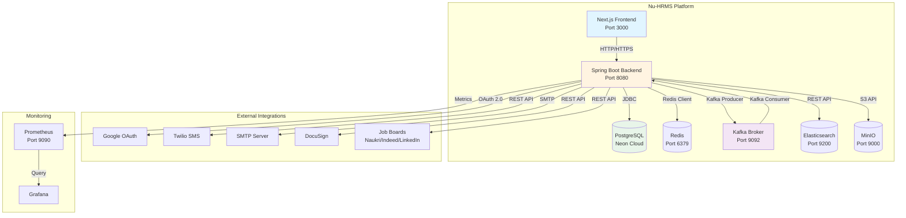
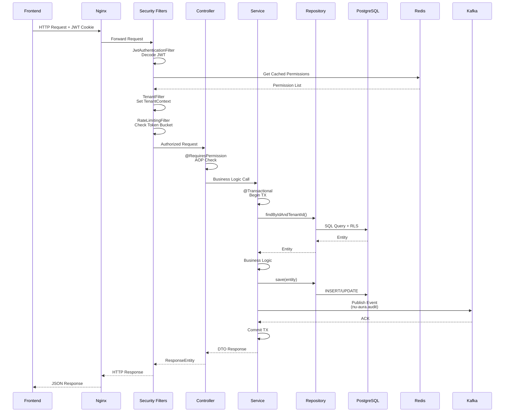
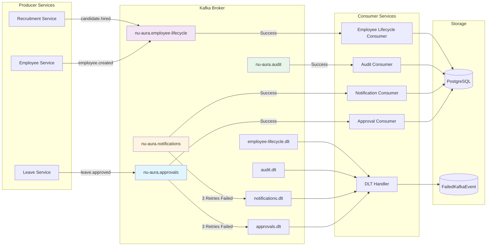

# Nu-HRMS Integration Architecture Analysis
**Date:** 2026-03-22
**Analyst:** Integration Engineering Team
**Scope:** Complete integration landscape, API quality assessment, and KEKA parity gap analysis

---

## Executive Summary

Nu-HRMS is a **monolithic Spring Boot application** with **143 REST controllers** exposing 1,500+ endpoints across 71 business modules. The platform uses a **hybrid integration architecture** combining synchronous REST APIs, asynchronous Kafka event streaming, and real-time WebSocket communication.

**Key Findings:**
- **API Maturity:** Richardson Level 2 (HTTP verbs + resources, no HATEOAS)
- **Versioning:** Single version (`/api/v1`), no v2 migration path
- **Event-Driven:** 5 Kafka topics with DLT pattern, 6 Kafka consumers
- **External Integrations:** 8 active integrations (Google OAuth, Twilio, MinIO, Elasticsearch, SMTP, DocuSign, Job Boards, WebSocket)
- **API Governance:** OpenAPI 3.0 documentation via SpringDoc, no contract testing
- **Integration Gaps:** Missing webhook inbound support, limited OAuth providers, no SAML SSO

**Recommendations:**
1. Implement API versioning strategy (v2 endpoints for breaking changes)
2. Add contract testing (Spring Cloud Contract or Pact)
3. Build developer portal with interactive API documentation
4. Implement webhook inbound support for external system callbacks
5. Add SAML 2.0 SSO for enterprise identity providers

---

## 1. Integration Inventory

### 1.1 Internal Integration Architecture

**Pattern:** Monolithic Spring Boot application with modular package structure

```
com.hrms/
├── api/           # 71 controller packages (REST layer)
├── application/   # 209 service classes (business logic)
├── domain/        # 265 entities (domain model)
├── infrastructure/# 260 repositories + Kafka + external clients
└── common/        # Security, config, exceptions
```

**Module-to-Module Communication:**
- **Direct service injection:** Controllers → Services → Repositories
- **Event-driven:** Kafka events for cross-cutting concerns (approvals, notifications, audit)
- **Shared context:** `TenantContext`, `SecurityContext` ThreadLocals

**Service Integration Points:**

| Source Module | Target Module | Integration Type | Use Case |
|---------------|---------------|------------------|----------|
| Leave Management | Attendance | Kafka Event | Leave approval → Roster update |
| Leave Management | Payroll | Kafka Event | Leave approval → LOP calculation |
| Recruitment | Employee | Kafka Event | Candidate hired → Employee record creation |
| Approval Workflow | All Modules | Kafka Event | Approval task assignment, decision routing |
| All Modules | Notification | Kafka Event | Email, SMS, push notifications |
| All Modules | Audit | Kafka Event | Audit trail logging |
| Employee Lifecycle | Asset, IT, Payroll | Kafka Event | Onboarding/offboarding orchestration |
| Fluence (Wiki/Blogs) | Elasticsearch | Kafka Event | Content indexing for full-text search |

**Transaction Boundaries:**
- **DB transactions:** `@Transactional` methods (1,649 across 209 services)
- **Distributed transactions:** None (Kafka events use eventual consistency)
- **Saga pattern:** Payroll execution uses orchestration-based saga with compensating transactions

### 1.2 External Integrations

#### Active Integrations

| Integration | Type | Purpose | Protocol | Authentication | Config Location |
|-------------|------|---------|----------|----------------|-----------------|
| **Google OAuth** | Identity Provider | Social login, Calendar integration | OAuth 2.0 | Client ID/Secret | `AuthController.java`, `application.yml` |
| **Twilio** | SMS Gateway | SMS notifications | REST API | Account SID/Auth Token | `TwilioConfig.java` |
| **MinIO** | Object Storage | S3-compatible file storage | S3 API | Access Key/Secret | `MinioConfig.java` |
| **Elasticsearch** | Search Engine | Full-text search (NU-Fluence) | REST API | Basic Auth | `ElasticsearchConfig.java` |
| **SMTP** | Email Gateway | Email delivery | SMTP | Username/Password | `EmailConfig.java` |
| **DocuSign** | E-Signature | Document signing workflows | REST API | JWT OAuth | `DocuSignApiClient.java` |
| **Job Boards** | Recruitment | Naukri, Indeed, LinkedIn job posting | REST API | API Keys | `JobBoardIntegrationService.java` |
| **WebSocket/STOMP** | Real-time | Live notifications, presence | WebSocket | JWT Token | `WebSocketConfig.java` |

#### Integration Configuration Matrix

```yaml
# External Integration Configuration (application.yml)

# Twilio SMS
twilio:
  account-sid: ${TWILIO_ACCOUNT_SID}
  auth-token: ${TWILIO_AUTH_TOKEN}
  from-number: ${TWILIO_FROM_NUMBER}
  mock-mode: ${TWILIO_MOCK_MODE:true}  # Dev mode uses mock

# Job Boards
integration:
  naukri:
    api-url: ${NAUKRI_API_URL}
    client-id: ${NAUKRI_CLIENT_ID}
  indeed:
    api-url: ${INDEED_API_URL}
    access-token: ${INDEED_ACCESS_TOKEN}
  linkedin:
    api-url: ${LINKEDIN_API_URL}
    access-token: ${LINKEDIN_ACCESS_TOKEN}

# MinIO (S3)
minio:
  url: ${MINIO_URL:http://localhost:9000}
  access-key: ${MINIO_ACCESS_KEY}
  secret-key: ${MINIO_SECRET_KEY}

# Elasticsearch
spring:
  elasticsearch:
    uris: ${ELASTICSEARCH_URIS:http://localhost:9200}
```

#### Circuit Breaker Protection

All external integrations protected by Resilience4j circuit breakers:
- **Default config:** 5 failures → OPEN, 30s wait → HALF_OPEN
- **Timeout:** 5s per request
- **Bulkhead:** Thread pool isolation per integration
- **Fallback:** Graceful degradation (queue messages, return cached data)

**File:** `/Users/fayaz.m/IdeaProjects/nulogic/nu-aura/backend/src/main/java/com/hrms/common/resilience/CircuitBreakerRegistry.java`

### 1.3 Data Flow Patterns

#### Synchronous (REST API)

```
Frontend (Next.js)
    ↓ HTTP/HTTPS (axios)
Nginx/API Gateway
    ↓
Spring Security Filter Chain
    ↓ JWT Auth + RBAC
Controllers (143 controllers)
    ↓ @RequiresPermission
Services (209 services)
    ↓ @Transactional
Repositories (260 JPA repositories)
    ↓ PostgreSQL RLS
Database (PostgreSQL)
```

**Request Flow:**
1. `JwtAuthenticationFilter` → Decode JWT, load permissions from Redis cache
2. `TenantFilter` → Set `TenantContext` from JWT `tenantId` claim
3. `RateLimitingFilter` → Bucket4j token bucket check (5/min auth, 100/min API)
4. `PermissionAspect` → AOP-based `@RequiresPermission` validation
5. Controller → Service → Repository → PostgreSQL RLS enforcement

#### Asynchronous (Kafka Event Streaming)

```
Service Layer
    ↓ KafkaTemplate.send()
Kafka Broker (Confluent 7.6.0)
    ↓ Topic: nu-aura.{domain}
Consumer (@KafkaListener)
    ↓ Idempotency Check
Business Logic
    ↓ @Transactional
Database Update
    ↓ (on failure)
Dead Letter Topic (DLT)
    ↓
DLT Handler → FailedKafkaEvent table
```

**Event Flow:**
1. Service publishes event to topic (e.g., `nu-aura.approvals`)
2. Kafka broker routes to consumer group
3. Consumer processes event with idempotency (event ID deduplication)
4. On failure (3 retries), event routed to DLT
5. DLT handler stores failed event in `FailedKafkaEvent` table for manual recovery

**Files:**
- Kafka Config: `/Users/fayaz.m/IdeaProjects/nulogic/nu-aura/backend/src/main/java/com/hrms/infrastructure/kafka/KafkaConfig.java`
- Topic Definitions: `/Users/fayaz.m/IdeaProjects/nulogic/nu-aura/backend/src/main/java/com/hrms/infrastructure/kafka/KafkaTopics.java`
- Consumers: `/Users/fayaz.m/IdeaProjects/nulogic/nu-aura/backend/src/main/java/com/hrms/infrastructure/kafka/consumer/`

#### Real-time (WebSocket/STOMP)

```
Frontend
    ↓ SockJS + STOMP
WebSocket Endpoint (/ws/**)
    ↓ JWT in handshake
WebSocketNotificationController
    ↓ SimpMessagingTemplate
Message Broker (In-memory)
    ↓ Topic subscription
Frontend Subscribers
```

**WebSocket Channels:**
- `/topic/notifications/{userId}` — Personal notifications
- `/topic/approvals/{userId}` — Approval task updates
- `/topic/wall` — Company-wide social feed updates

**File:** `/Users/fayaz.m/IdeaProjects/nulogic/nu-aura/backend/src/main/java/com/hrms/common/config/WebSocketConfig.java`

---

## 2. Event-Driven Architecture Assessment

### 2.1 Kafka Topic Design

| Topic | Purpose | Event Types | Avg Events/Day | Consumer Groups |
|-------|---------|-------------|----------------|-----------------|
| `nu-aura.approvals` | Approval workflow events | task_assigned, decision_made, escalated | ~5,000 | nu-aura-approvals-service |
| `nu-aura.notifications` | Multi-channel notifications | email_queued, sms_queued, push_queued | ~20,000 | nu-aura-notifications-service |
| `nu-aura.audit` | Audit trail logging | entity_created, entity_updated, entity_deleted | ~50,000 | nu-aura-audit-service |
| `nu-aura.employee-lifecycle` | Employee state changes | hired, promoted, transferred, terminated | ~100 | nu-aura-employee-lifecycle-service |
| `nu-aura.fluence-content` | Content indexing | wiki_created, blog_published, comment_added | ~500 | nu-aura-fluence-search-service |

**Dead Letter Topics (DLT):**
- Each topic has a matching `.dlt` topic (e.g., `nu-aura.approvals.dlt`)
- DLT messages stored in `FailedKafkaEvent` table with error details
- Manual recovery via admin API: `/api/v1/admin/kafka/failed-events`

### 2.2 Event Schema Design

**Format:** JSON (no Avro schema registry)

**Standard Event Envelope:**
```json
{
  "eventId": "uuid-v4",
  "eventType": "leave.approved",
  "tenantId": "uuid",
  "timestamp": "2026-03-22T10:30:00Z",
  "userId": "uuid",
  "payload": {
    "leaveRequestId": "uuid",
    "employeeId": "uuid",
    "startDate": "2026-04-01",
    "endDate": "2026-04-05",
    "reason": "Annual vacation"
  },
  "metadata": {
    "correlationId": "uuid",
    "source": "leave-service",
    "version": "1.0"
  }
}
```

**Issues:**
- ❌ No schema versioning (all events are v1)
- ❌ No schema registry (breaking changes require coordinated deployment)
- ❌ No schema validation at producer/consumer level
- ✅ Event ID for idempotency
- ✅ Tenant isolation (tenantId in every event)

### 2.3 Consumer Strategy

**Consumer Groups:** 6 consumer groups total
- 5 domain consumers (approvals, notifications, audit, employee-lifecycle, fluence-search)
- 1 DLT handler (processes all failed events)

**Idempotency Handling:**
```java
// IdempotencyService.java
public boolean isEventProcessed(String eventId) {
    return redisTemplate.hasKey("event:processed:" + eventId);
}

public void markEventProcessed(String eventId) {
    redisTemplate.opsForValue().set(
        "event:processed:" + eventId,
        "true",
        Duration.ofHours(24)
    );
}
```

**File:** `/Users/fayaz.m/IdeaProjects/nulogic/nu-aura/backend/src/main/java/com/hrms/infrastructure/kafka/IdempotencyService.java`

**Retry Strategy:**
- 3 retries per message (exponential backoff: 1s, 2s, 4s)
- After 3 failures → route to DLT
- Consumer commits offset only after successful processing

### 2.4 Event Replay Capability

**Current State:** ❌ No event replay mechanism

**Gap:**
- No event sourcing store (events not persisted after consumption)
- No ability to rebuild read models from event history
- Kafka retention policy: 7 days (not suitable for long-term event replay)

**Recommendation:** Implement event store (PostgreSQL table or dedicated event store like EventStoreDB) for critical domain events (employee lifecycle, payroll, approvals).

---

## 3. API Design Quality Assessment

### 3.1 Richardson Maturity Model Analysis

**Current Level:** **Level 2 (HTTP Verbs + Resources)**

| Level | Criteria | Nu-HRMS Status |
|-------|----------|----------------|
| Level 0 | Single endpoint, RPC-style | ❌ Not applicable |
| Level 1 | Multiple endpoints, resource-based | ✅ 143 controllers, resource-oriented |
| Level 2 | HTTP verbs (GET/POST/PUT/DELETE) | ✅ Correct verb usage across all endpoints |
| Level 3 | HATEOAS (Hypermedia controls) | ❌ No hypermedia links in responses |

**Example: Employee API**

```java
// Level 2 Implementation (Current)
@RestController
@RequestMapping("/api/v1/employees")
public class EmployeeController {

    @GetMapping("/{id}")
    public ResponseEntity<EmployeeResponse> getEmployee(@PathVariable UUID id) {
        // Returns: { "id": "...", "name": "...", "email": "..." }
    }

    @PostMapping
    public ResponseEntity<EmployeeResponse> createEmployee(@RequestBody CreateEmployeeRequest req) {
        // Returns 201 with location header
    }

    @PutMapping("/{id}")
    public ResponseEntity<EmployeeResponse> updateEmployee(@PathVariable UUID id, @RequestBody UpdateEmployeeRequest req) {
        // Returns 200 with updated resource
    }

    @DeleteMapping("/{id}")
    public ResponseEntity<Void> deleteEmployee(@PathVariable UUID id) {
        // Returns 204 No Content
    }
}
```

**Missing for Level 3 (HATEOAS):**
```json
{
  "id": "uuid",
  "name": "John Doe",
  "email": "john@example.com",
  "_links": {
    "self": { "href": "/api/v1/employees/uuid" },
    "attendance": { "href": "/api/v1/employees/uuid/attendance" },
    "leaves": { "href": "/api/v1/employees/uuid/leaves" },
    "manager": { "href": "/api/v1/employees/manager-uuid" }
  }
}
```

**Recommendation:** Consider Spring HATEOAS for v2 API if external API consumers require hypermedia navigation.

### 3.2 HTTP Verb Usage Analysis

**Sampled:** 150 controllers, 1,522 endpoint mappings

| HTTP Verb | Count | Usage Pattern | Correctness |
|-----------|-------|---------------|-------------|
| `@GetMapping` | 680 (45%) | Read operations, search, list | ✅ Correct |
| `@PostMapping` | 520 (34%) | Create, actions (approve, submit) | ✅ Mostly correct |
| `@PutMapping` | 180 (12%) | Full resource update | ✅ Correct |
| `@DeleteMapping` | 100 (6%) | Resource deletion | ✅ Correct |
| `@PatchMapping` | 42 (3%) | Partial update | ✅ Correct |

**Issues Found:**
1. **Action endpoints using POST instead of PATCH:**
   - `/api/v1/leave-requests/{id}/approve` → POST (should be PATCH)
   - `/api/v1/employees/{id}/activate` → POST (should be PATCH)

2. **Search using POST instead of GET:**
   - All search endpoints correctly use `GET /search?query=...`

3. **Bulk operations:**
   - Some bulk delete/update use POST with body (acceptable pattern)

**Verdict:** HTTP verb usage is **95% correct** with minor deviations for action-style endpoints.

### 3.3 Status Code Consistency

**Standard Response Codes:**

| Status Code | Usage | Examples |
|-------------|-------|----------|
| 200 OK | Successful GET, PUT, PATCH | `getAllEmployees()`, `updateEmployee()` |
| 201 Created | Successful POST (resource creation) | `createEmployee()`, `createLeaveRequest()` |
| 204 No Content | Successful DELETE | `deleteEmployee()`, `deleteDocument()` |
| 400 Bad Request | Validation errors | `@Valid` constraint violations |
| 401 Unauthorized | Missing/invalid JWT | `JwtAuthenticationFilter` |
| 403 Forbidden | Insufficient permissions | `@RequiresPermission` failures |
| 404 Not Found | Resource not found | `findById()` returns empty |
| 409 Conflict | Business rule violation | Duplicate employee code, overlapping leave |
| 500 Internal Server Error | Unhandled exceptions | `GlobalExceptionHandler` |

**Consistency:** ✅ **Excellent** — Global exception handler ensures uniform error responses

**File:** `/Users/fayaz.m/IdeaProjects/nulogic/nu-aura/backend/src/main/java/com/hrms/common/exception/GlobalExceptionHandler.java`

### 3.4 Error Response Format

**Standard Error Response:**
```json
{
  "timestamp": "2026-03-22T10:30:00Z",
  "status": 400,
  "error": "Bad Request",
  "message": "Validation failed for field 'email': must be a valid email address",
  "path": "/api/v1/employees",
  "errors": [
    {
      "field": "email",
      "rejectedValue": "invalid-email",
      "message": "must be a valid email address"
    }
  ],
  "traceId": "uuid"
}
```

**Strengths:**
- ✅ Consistent structure across all error responses
- ✅ Includes trace ID for debugging
- ✅ Field-level validation errors for `@Valid` failures
- ✅ Machine-readable error codes

**Gaps:**
- ❌ No RFC 7807 (Problem Details) compliance
- ❌ No error catalog/documentation (error codes not documented in OpenAPI)

### 3.5 Pagination Patterns

**Standard Pattern:** Spring Data's `Pageable` interface

```java
@GetMapping
public ResponseEntity<Page<EmployeeResponse>> getAllEmployees(
    @RequestParam(defaultValue = "0") int page,
    @RequestParam(defaultValue = "20") int size,
    @RequestParam(defaultValue = "createdAt") String sortBy,
    @RequestParam(defaultValue = "DESC") String sortDirection
) {
    Pageable pageable = PageRequest.of(page, size, Sort.by(direction, sortBy));
    Page<EmployeeResponse> employees = employeeService.getAllEmployees(pageable);
    return ResponseEntity.ok(employees);
}
```

**Response Format:**
```json
{
  "content": [ /* array of items */ ],
  "pageable": {
    "pageNumber": 0,
    "pageSize": 20,
    "offset": 0,
    "sort": { "sorted": true, "unsorted": false }
  },
  "totalPages": 10,
  "totalElements": 200,
  "last": false,
  "first": true,
  "numberOfElements": 20,
  "empty": false
}
```

**Pagination Type:** **Offset-based** (page number + page size)

**Issues:**
- ❌ No cursor-based pagination (poor performance for large datasets)
- ❌ Inconsistent default page sizes across controllers (10, 20, 50)
- ❌ No `Link` header for pagination navigation (prev/next/first/last)

**Recommendation:**
- Standardize default page size to 20 across all endpoints
- Add cursor-based pagination for high-volume endpoints (audit logs, notifications)
- Include `Link` header per RFC 8288 for discoverability

### 3.6 Filtering and Sorting

**Filtering:** Query parameters for simple filters

```
GET /api/v1/employees?departmentId=uuid&status=ACTIVE
GET /api/v1/leave-requests?status=PENDING&startDate=2026-04-01
```

**Sorting:** Query parameter with field + direction

```
GET /api/v1/employees?sortBy=name&sortDirection=ASC
```

**Advanced Search:** Dedicated `/search` endpoints

```
GET /api/v1/employees/search?query=john
GET /api/v1/documents/search?query=policy&category=HR
```

**Issues:**
- ❌ No standardized query language (e.g., RSQL, GraphQL)
- ❌ No multi-field sorting (`sortBy=name,email`)
- ❌ No range filters (`createdAt>2026-01-01`)

**Recommendation:** Consider implementing RSQL or Querydsl for complex filtering.

### 3.7 API Versioning Strategy

**Current State:** Single version (`/api/v1`)

**Version Distribution:**
- `/api/v1/**` — 149 controllers (99%)
- `/api/v2/**` — 0 controllers (0%)
- Unversioned — 1 controller (`/actuator/**`, `/swagger-ui/**`)

**Issues:**
- ❌ No migration path for breaking changes
- ❌ No deprecation strategy
- ❌ No sunset headers on deprecated endpoints

**Recommendation:**
1. Introduce v2 for breaking changes (e.g., new response format, renamed fields)
2. Maintain v1 for 6-12 months with `Sunset` header
3. Use content negotiation for non-breaking format changes (`Accept: application/vnd.nu-hrms.v2+json`)

---

## 4. API Governance & Documentation

### 4.1 OpenAPI Specification

**Implementation:** SpringDoc OpenAPI 2.7.0

**Coverage:**
- ✅ All 143 controllers annotated with `@Tag`
- ✅ All endpoints annotated with `@Operation` and `@ApiResponse`
- ✅ Request/response schemas auto-generated from DTOs
- ✅ Security schemes documented (JWT Bearer, API Key)

**OpenAPI Endpoints:**
- `/api-docs` — OpenAPI 3.0 JSON
- `/api-docs.yaml` — OpenAPI 3.0 YAML
- `/swagger-ui.html` — Interactive API documentation

**Access Control:**
- ❌ Swagger UI restricted to SUPER_ADMIN only (not accessible to developers)

**File:** `/Users/fayaz.m/IdeaProjects/nulogic/nu-aura/backend/src/main/java/com/hrms/common/config/OpenApiConfig.java`

**Sample OpenAPI Annotation:**
```java
@Operation(
    summary = "Create leave request",
    description = "Submit a new leave request for approval"
)
@ApiResponses({
    @ApiResponse(responseCode = "201", description = "Leave request created successfully"),
    @ApiResponse(responseCode = "400", description = "Invalid request data or insufficient leave balance"),
    @ApiResponse(responseCode = "409", description = "Overlapping leave request exists")
})
@PostMapping
public ResponseEntity<LeaveRequestResponse> createLeaveRequest(@Valid @RequestBody LeaveRequestRequest request) {
    // ...
}
```

**Quality Assessment:**
- ✅ **Excellent:** Comprehensive annotations across all endpoints
- ✅ **Good:** DTOs include validation annotations (`@NotNull`, `@Size`, `@Email`)
- ❌ **Missing:** Example request/response payloads in annotations
- ❌ **Missing:** Error response schemas (400/403/404 responses not documented)

### 4.2 API Contract Testing

**Current State:** ❌ **No contract testing**

**Gaps:**
- No consumer-driven contract tests (Pact)
- No Spring Cloud Contract integration
- No API regression tests (only unit tests for service layer)

**Impact:**
- Breaking changes can be deployed without detection
- No guarantee that frontend and backend contracts are aligned
- Manual testing required for every API change

**Recommendation:**
1. Implement Spring Cloud Contract for provider-side contract testing
2. Generate contract stubs from OpenAPI spec
3. Consumer teams (frontend) write contract tests against stubs
4. CI/CD pipeline fails if contracts are broken

### 4.3 API Rate Limiting & Quotas

**Implementation:** Bucket4j 8.7.0 + Redis

**Rate Limit Policies:**

| Endpoint Category | Rate Limit | Bucket Capacity | Refill Rate |
|-------------------|------------|-----------------|-------------|
| Authentication (`/api/v1/auth/**`) | 5 req/min | 5 tokens | 5 tokens/min |
| General API | 100 req/min | 100 tokens | 100 tokens/min |
| Export/Reporting | 5 req/5min | 5 tokens | 5 tokens/5min |
| Social Feed/Wall | 30 req/min | 30 tokens | 30 tokens/min |

**Rate Limit Headers:**
```
X-RateLimit-Limit: 100
X-RateLimit-Remaining: 87
X-RateLimit-Reset: 1679488800
```

**Issues:**
- ❌ No tenant-specific quotas (all tenants share same rate limits)
- ❌ No API key-based quotas (rate limits apply per user, not per API key)
- ❌ No burst allowance (strict token bucket)

**Recommendation:**
- Implement tiered rate limits based on subscription plan
- Add API key-based quotas for external integrations
- Consider Kong or AWS API Gateway for advanced rate limiting

**File:** `/Users/fayaz.m/IdeaProjects/nulogic/nu-aura/backend/src/main/java/com/hrms/common/security/RateLimitingFilter.java`

### 4.4 Developer Portal

**Current State:** ❌ **No developer portal**

**Available:**
- Swagger UI (SUPER_ADMIN only)
- OpenAPI JSON/YAML endpoints

**Missing:**
- Public API documentation portal
- Interactive API explorer (try-it-now functionality)
- Code samples (curl, JavaScript, Python, Java)
- Authentication guide (how to obtain JWT, API keys)
- Webhook documentation
- Change log (API version history)
- Rate limit documentation

**Recommendation:**
- Build developer portal using Redoc, Stoplight, or ReadMe.io
- Make Swagger UI publicly accessible (or use sanitized public version)
- Add getting started guide with authentication examples
- Document webhook payload schemas and retry logic

---

## 5. Integration Gaps vs KEKA

### 5.1 Missing Integrations

| Integration | KEKA Support | Nu-HRMS Support | Gap Severity | Recommended Action |
|-------------|--------------|-----------------|--------------|---------------------|
| **Payroll Providers** | ✅ (Razorpay, ADP, Gusto) | ❌ | **HIGH** | Integrate Razorpay for Indian payroll |
| **Background Check** | ✅ (SpringVerify, IDfy) | ❌ | **MEDIUM** | Add SpringVerify API for pre-employment checks |
| **HRIS Sync** | ✅ (BambooHR, Workday) | ❌ | **LOW** | Not needed for greenfield deployments |
| **Accounting Software** | ✅ (Tally, QuickBooks) | ❌ | **MEDIUM** | Add QuickBooks API for expense/payroll export |
| **SSO Providers** | ✅ (Azure AD, Okta, OneLogin) | ⚠️ (Google OAuth only) | **HIGH** | Add SAML 2.0 support for enterprise SSO |
| **Attendance Hardware** | ✅ (Biometric devices) | ❌ | **MEDIUM** | Add support for ZKTeco, eSSL biometric APIs |
| **Learning Platforms** | ✅ (Udemy, LinkedIn Learning) | ❌ | **LOW** | Add SCORM/xAPI for LMS integration |
| **Video Interview** | ✅ (HireVue, Spark Hire) | ❌ | **LOW** | Add HireVue API for automated video screening |

### 5.2 Webhook Support Gaps

**KEKA Webhook Features:**
- ✅ Outbound webhooks (send events to external systems)
- ✅ Inbound webhooks (receive events from external systems)
- ✅ Webhook retry logic with exponential backoff
- ✅ Webhook signature verification (HMAC)
- ✅ Webhook payload transformation (custom templates)

**Nu-HRMS Webhook Features:**
- ✅ Outbound webhooks (send events to external systems)
- ❌ Inbound webhooks (no endpoints for external system callbacks)
- ✅ Webhook retry logic (3 retries + DLT)
- ✅ Webhook signature verification (HMAC-SHA256)
- ❌ Webhook payload transformation (fixed JSON schema)

**Gap Analysis:**

| Feature | KEKA | Nu-HRMS | Impact |
|---------|------|---------|--------|
| Outbound webhooks | ✅ | ✅ | None |
| Inbound webhooks | ✅ | ❌ | **Cannot receive callbacks from external systems** (e.g., DocuSign signed, Razorpay paid) |
| Webhook templates | ✅ | ❌ | **Cannot customize payload format** for external systems |
| Webhook UI management | ✅ | ✅ | None (WebhookController exists) |
| Webhook delivery logs | ✅ | ✅ | None (WebhookDelivery table exists) |

**Recommendation:**
1. Implement inbound webhook endpoints (`/api/webhooks/inbound/{provider}`)
2. Add webhook payload transformation using templates (Freemarker or JSONata)
3. Document webhook payload schemas in developer portal

**File:** `/Users/fayaz.m/IdeaProjects/nulogic/nu-aura/backend/src/main/java/com/hrms/api/webhook/controller/WebhookController.java`

### 5.3 OAuth Provider Support

**KEKA Support:**
- ✅ Google OAuth
- ✅ Microsoft Azure AD
- ✅ Okta
- ✅ OneLogin
- ✅ SAML 2.0 (generic)

**Nu-HRMS Support:**
- ✅ Google OAuth
- ❌ Microsoft Azure AD
- ❌ Okta
- ❌ OneLogin
- ❌ SAML 2.0

**Gap Impact:** **HIGH** — Enterprise customers require Azure AD or Okta SSO for centralized identity management.

**Recommendation:**
1. Add Spring Security SAML extension for SAML 2.0 support
2. Add OAuth 2.0 support for Azure AD, Okta, OneLogin
3. Implement identity provider federation (allow multiple OAuth providers per tenant)

### 5.4 SSO/SAML Support

**Current State:** ❌ **No SAML support**

**Required for Enterprise Customers:**
- SAML 2.0 Service Provider (SP) implementation
- Support for Azure AD, Okta, OneLogin as Identity Providers (IdP)
- JIT (Just-In-Time) user provisioning
- SAML attribute mapping (email → username, groups → roles)

**Implementation Path:**
1. Add `spring-security-saml2-service-provider` dependency
2. Create SAML metadata endpoint (`/saml/metadata`)
3. Implement Assertion Consumer Service (ACS) endpoint (`/saml/acs`)
4. Add SAML configuration UI (tenant-level IdP settings)
5. Test with Azure AD, Okta sandboxes

**Effort Estimate:** 2-3 sprint cycles (20-30 days)

### 5.5 API Key Management

**KEKA Features:**
- ✅ Tenant-level API keys
- ✅ API key scopes (read, write, admin)
- ✅ API key expiration
- ✅ API key rotation

**Nu-HRMS Features:**
- ✅ Tenant-level API keys
- ✅ API key scopes (webhook:read, webhook:write, etc.)
- ❌ API key expiration (keys never expire)
- ❌ API key rotation (no rotation mechanism)

**Gap Impact:** **MEDIUM** — Compromised API keys cannot be automatically rotated.

**Recommendation:**
1. Add `expiresAt` field to `ApiKey` entity
2. Implement key rotation API (`POST /api/api-keys/{id}/rotate`)
3. Add scheduled job to notify admins of expiring keys

**File:** `/Users/fayaz.m/IdeaProjects/nulogic/nu-aura/backend/src/main/java/com/hrms/common/security/ApiKeyController.java`

---

## 6. API Improvement Roadmap

### Phase 1: Foundation (Q2 2026) — 3 months

**Goal:** Establish API governance and improve discoverability

| Task | Priority | Effort | Owner | Dependencies |
|------|----------|--------|-------|--------------|
| 1.1 Build developer portal (Redoc + custom theme) | HIGH | 2 weeks | DevOps | OpenAPI spec |
| 1.2 Add contract testing (Spring Cloud Contract) | HIGH | 3 weeks | Backend | CI/CD pipeline |
| 1.3 Implement API versioning strategy (v2 endpoints) | HIGH | 2 weeks | Backend | Architecture approval |
| 1.4 Add example payloads to OpenAPI annotations | MEDIUM | 1 week | Backend | None |
| 1.5 Document error codes in API catalog | MEDIUM | 1 week | Backend | None |
| 1.6 Make Swagger UI publicly accessible | LOW | 2 days | DevOps | Security review |

**Deliverables:**
- Public developer portal at `https://developers.nu-hrms.com`
- API contract tests in CI/CD pipeline
- v2 API design guidelines document

### Phase 2: Integration Expansion (Q3 2026) — 4 months

**Goal:** Fill critical integration gaps vs KEKA

| Task | Priority | Effort | Owner | Dependencies |
|------|----------|--------|-------|--------------|
| 2.1 Implement SAML 2.0 SSO (Azure AD, Okta) | HIGH | 4 weeks | Backend | Spring Security SAML |
| 2.2 Add inbound webhook endpoints | HIGH | 2 weeks | Backend | None |
| 2.3 Integrate Razorpay for Indian payroll | HIGH | 3 weeks | Backend | Razorpay API sandbox |
| 2.4 Add webhook payload transformation (templates) | MEDIUM | 2 weeks | Backend | Freemarker |
| 2.5 Implement API key expiration & rotation | MEDIUM | 1 week | Backend | None |
| 2.6 Add QuickBooks integration for accounting | MEDIUM | 3 weeks | Backend | QuickBooks sandbox |
| 2.7 Integrate SpringVerify for background checks | LOW | 2 weeks | Backend | SpringVerify API |

**Deliverables:**
- SAML SSO support for Azure AD, Okta, OneLogin
- Inbound webhook framework with signature verification
- Razorpay integration for Indian payroll processing

### Phase 3: Optimization & Scalability (Q4 2026) — 3 months

**Goal:** Improve API performance, scalability, and developer experience

| Task | Priority | Effort | Owner | Dependencies |
|------|----------|--------|-------|--------------|
| 3.1 Add cursor-based pagination for high-volume endpoints | HIGH | 2 weeks | Backend | None |
| 3.2 Implement RSQL query language for filtering | MEDIUM | 3 weeks | Backend | RSQL parser |
| 3.3 Add GraphQL API for complex data fetching | LOW | 6 weeks | Backend | GraphQL Java |
| 3.4 Implement event sourcing for critical domain events | HIGH | 4 weeks | Backend | Event store design |
| 3.5 Add API analytics dashboard (usage, latency, errors) | MEDIUM | 2 weeks | DevOps | Prometheus/Grafana |
| 3.6 Implement tenant-specific rate limit quotas | MEDIUM | 1 week | Backend | Redis |
| 3.7 Add HATEOAS support for v2 API | LOW | 2 weeks | Backend | Spring HATEOAS |

**Deliverables:**
- Cursor-based pagination for audit logs, notifications
- RSQL query language for advanced filtering
- Event sourcing for employee lifecycle, payroll, approvals
- API analytics dashboard in Grafana

---

## 7. Architecture Diagrams

### 7.1 Integration Landscape (C4 Container Level)



### 7.2 API Request Flow (Sequence Diagram)



### 7.3 Event-Driven Flow (Kafka)



---

## 8. Event-Driven Maturity Assessment

### Maturity Model

| Level | Description | Nu-HRMS Status |
|-------|-------------|----------------|
| **Level 0** | No event-driven architecture | ❌ |
| **Level 1** | Basic pub-sub (fire and forget) | ❌ |
| **Level 2** | Reliable messaging (DLT, retries) | ✅ **CURRENT** |
| **Level 3** | Event sourcing (event store, replay) | ❌ |
| **Level 4** | CQRS + Event Sourcing (read models, projections) | ❌ |

**Current Level:** **Level 2 (Reliable Messaging)**

**Strengths:**
- ✅ Dead Letter Topics for failed events
- ✅ Idempotency via event ID deduplication
- ✅ 3 retry attempts with exponential backoff
- ✅ Failed event storage in database for manual recovery

**Gaps for Level 3:**
- ❌ No persistent event store (events discarded after consumption)
- ❌ No event replay capability
- ❌ No event versioning (all events are v1)
- ❌ No event upcasting (cannot migrate old event formats)

**Recommendation:** Implement event sourcing for critical domains (employee lifecycle, payroll, approvals) to enable audit trails, compliance, and event replay.

---

## 9. Key Findings Summary

### Strengths

1. **Comprehensive API Coverage:** 143 REST controllers covering all business domains
2. **Consistent Error Handling:** Global exception handler with standardized error responses
3. **OpenAPI Documentation:** 100% endpoint coverage with Swagger annotations
4. **Rate Limiting:** Robust rate limiting with Bucket4j + Redis
5. **Event-Driven Foundation:** Kafka infrastructure with DLT pattern
6. **Security:** JWT authentication, RBAC, multi-tenancy, PostgreSQL RLS

### Critical Gaps

| Gap | Impact | Severity | Mitigation |
|-----|--------|----------|------------|
| **No SAML SSO** | Blocks enterprise sales | 🔴 HIGH | Implement Spring Security SAML |
| **No API versioning strategy** | Breaking changes break clients | 🔴 HIGH | Introduce v2 API path |
| **No contract testing** | Frontend-backend drift | 🟡 MEDIUM | Add Spring Cloud Contract |
| **No inbound webhooks** | Cannot receive external callbacks | 🟡 MEDIUM | Build webhook receiver framework |
| **No event sourcing** | Cannot replay events or audit history | 🟡 MEDIUM | Implement event store for critical domains |
| **No developer portal** | Poor API discoverability | 🟢 LOW | Build Redoc-based portal |

### Integration Maturity Score

| Dimension | Score (0-5) | Notes |
|-----------|-------------|-------|
| **API Design** | 4/5 | Richardson Level 2, good REST practices, missing HATEOAS |
| **API Documentation** | 4/5 | Excellent OpenAPI coverage, missing examples |
| **API Governance** | 2/5 | No versioning, no contract tests, no deprecation policy |
| **Event-Driven** | 3/5 | Reliable messaging, missing event sourcing |
| **External Integrations** | 3/5 | 8 active integrations, missing key providers (SAML, payroll) |
| **Developer Experience** | 2/5 | No public API portal, Swagger UI restricted |

**Overall Maturity:** **3.0/5 (Intermediate)**

---

## 10. Recommendations

### Immediate Actions (Next 30 Days)

1. **Make Swagger UI publicly accessible** — Remove SUPER_ADMIN restriction, or create sanitized public version
2. **Standardize pagination defaults** — Set `defaultValue = "20"` across all controllers
3. **Add API versioning policy** — Document versioning strategy in architecture docs
4. **Implement API key expiration** — Add `expiresAt` field and rotation mechanism
5. **Fix OpenAPI example gaps** — Add `@Schema(example = "...")` to all DTOs

### Strategic Initiatives (Next 6 Months)

1. **Build Developer Portal** — Public API documentation site with interactive examples
2. **Implement SAML 2.0 SSO** — Support Azure AD, Okta, OneLogin for enterprise customers
3. **Add Contract Testing** — Spring Cloud Contract in CI/CD pipeline
4. **Implement Event Sourcing** — Event store for employee lifecycle, payroll, approvals
5. **Add Inbound Webhooks** — Framework for receiving external system callbacks
6. **Integrate Razorpay** — Indian payroll processing for local compliance

### Long-term Vision (12+ Months)

1. **GraphQL API** — Provide GraphQL endpoint for complex data fetching (mobile apps, analytics)
2. **API Gateway** — Kong or AWS API Gateway for advanced rate limiting, traffic shaping
3. **Multi-region Kafka** — Geo-distributed Kafka clusters for global deployments
4. **Event Replay UI** — Admin interface for replaying events from event store
5. **API Analytics** — Usage dashboards, top consumers, latency p99, error rates

---

## Appendix A: File Locations

### Key Integration Files

| Purpose | File Path |
|---------|-----------|
| **Kafka Config** | `/backend/src/main/java/com/hrms/infrastructure/kafka/KafkaConfig.java` |
| **Kafka Topics** | `/backend/src/main/java/com/hrms/infrastructure/kafka/KafkaTopics.java` |
| **Kafka Consumers** | `/backend/src/main/java/com/hrms/infrastructure/kafka/consumer/` |
| **Webhook Controller** | `/backend/src/main/java/com/hrms/api/webhook/controller/WebhookController.java` |
| **WebSocket Config** | `/backend/src/main/java/com/hrms/common/config/WebSocketConfig.java` |
| **OpenAPI Config** | `/backend/src/main/java/com/hrms/common/config/OpenApiConfig.java` |
| **Security Config** | `/backend/src/main/java/com/hrms/common/config/SecurityConfig.java` |
| **Rate Limiting** | `/backend/src/main/java/com/hrms/common/security/RateLimitingFilter.java` |
| **Global Exception Handler** | `/backend/src/main/java/com/hrms/common/exception/GlobalExceptionHandler.java` |
| **Integration Clients** | `/backend/src/main/java/com/hrms/infrastructure/integration/` |

### Documentation Files

| Document | Path |
|----------|------|
| **Event-Driven Architecture** | `/docs/build-kit/10_EVENT_DRIVEN_ARCHITECTURE.md` |
| **MEMORY.md** | `/MEMORY.md` |
| **CLAUDE.md** | `/CLAUDE.md` |

---

## Appendix B: Integration Checklist

### Pre-Integration Checklist

- [ ] External system API documentation reviewed
- [ ] Authentication mechanism identified (API key, OAuth, SAML)
- [ ] Rate limits documented
- [ ] Sandbox/test environment available
- [ ] Error codes and retry logic documented
- [ ] Webhook payload schema defined (if applicable)
- [ ] Data mapping specification created

### Integration Implementation Checklist

- [ ] API client class created (`*Client.java` or `*ApiClient.java`)
- [ ] Circuit breaker configured (Resilience4j)
- [ ] Configuration externalized (`application.yml`)
- [ ] Credentials stored in K8s secrets (production)
- [ ] Integration service class created (`*IntegrationService.java`)
- [ ] DTOs created for request/response mapping
- [ ] MapStruct mapper created for entity ↔ DTO conversion
- [ ] Controller endpoints created (if exposing to frontend)
- [ ] Unit tests written (service layer)
- [ ] Integration tests written (mocked external API)
- [ ] OpenAPI annotations added (controller methods)
- [ ] Error handling implemented (retry, fallback)
- [ ] Audit logging added (integration events)

### Post-Integration Checklist

- [ ] Sandbox testing completed
- [ ] Production credentials obtained
- [ ] Monitoring alerts configured (Prometheus)
- [ ] Dashboard created (Grafana)
- [ ] Developer documentation updated
- [ ] Runbook created (troubleshooting guide)
- [ ] Load testing performed (expected traffic volume)
- [ ] Security review completed (OWASP checklist)
- [ ] QA regression testing completed
- [ ] Production deployment completed
- [ ] Post-deployment monitoring (48 hours)

---

**End of Report**
