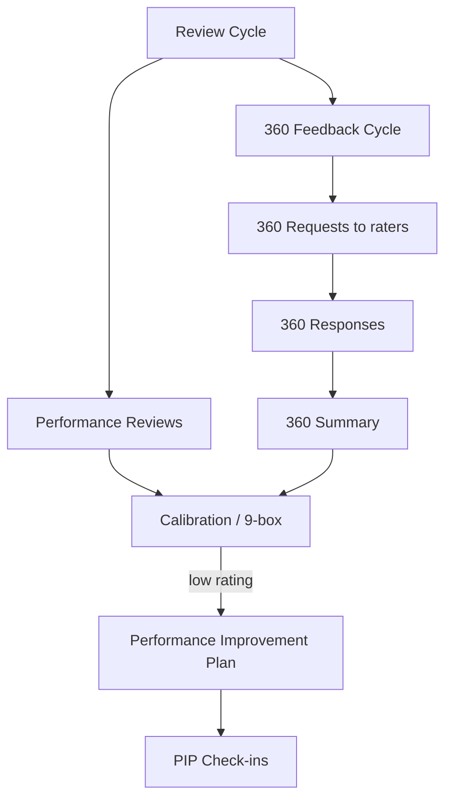
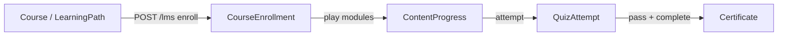

# NU-Grow — Performance, Learning & Engagement

> Sub-app deep dive. One of the four NU-AURA bundle apps (HRMS, Hire, **Grow**, Fluence).
> Every claim below is grounded in source files cited inline.

## 1. Purpose

NU-Grow is the **talent development and engagement** sub-app. It covers the
employee growth loop: setting goals (OKRs), running review cycles and 360°
feedback, holding 1-on-1s, learning (training + LMS), peer recognition,
engagement/pulse surveys, competency tracking, and wellness.

Its identity is defined in `frontend/lib/config/apps.ts`:

| Field | Value |
|-------|-------|
| `code` | `GROW` |
| `name` | NU-Grow |
| `description` | "Performance, learning & engagement" |
| `entryRoute` | `/performance` |
| `iconName` | `TrendingUp` |
| `order` | 3 |
| `available` | `true` |

The same file lists the **route prefixes** Grow owns and the **permission
prefixes** that grant access:

- `routePrefixes`: `/performance`, `/okr`, `/feedback360`, `/training`,
  `/learning`, `/recognition`, `/surveys`, `/wellness`, `/one-on-one`
- `permissionPrefixes`: `review`, `okr`, `feedback_360`, `training`, `lms`,
  `recognition`, `survey`, `wellness`, `goal`, `competency`, `meeting`

`getAppForRoute()` in the same file resolves a pathname to `GROW` by matching
those prefixes (checked before the HRMS catch-all). The Grow sidebar renders a
single section, `grow-hub` (`APP_SIDEBAR_SECTIONS.GROW`).

## 2. Frontend Routes

All Grow pages live directly under `frontend/app/` (flat App Router, no route
group). The sidebar entries are defined in
`frontend/components/layout/menuSections.tsx` under the `grow-hub` section
(lines ~654–753). Note that several growth surfaces are **nested under
`/performance/*`** rather than the top-level prefixes named in `apps.ts`; the
sidebar `href`s are the source of truth for what users actually click.

### 2.1 Performance & reviews (`/performance/*`)

| Route (`page.tsx`) | Purpose | Sidebar |
|--------------------|---------|---------|
| `performance/page.tsx` | Performance Hub landing — aggregates goals, active cycles, OKR summary, pending 360s | "Performance Hub" |
| `performance/revolution/page.tsx` | Continuous "Performance Revolution" view | "Revolution" |
| `performance/reviews/page.tsx` | Performance reviews list | — |
| `performance/cycles/page.tsx` | Review cycles | — |
| `performance/cycles/[id]/calibration/page.tsx` | Per-cycle calibration | — |
| `performance/cycles/[id]/nine-box/page.tsx` | Per-cycle 9-box grid | — |
| `performance/calibration/page.tsx` | Calibration | — |
| `performance/9box/page.tsx` | 9-box talent grid | — |
| `performance/feedback/page.tsx` | Continuous feedback | — |
| `performance/pip/page.tsx` | Performance Improvement Plans | — |
| `performance/goals/page.tsx` | Goals (within performance) | — |
| `performance/okr/page.tsx`, `performance/okrs/page.tsx` | OKRs (within performance) | "OKR" → `/performance/okr` |
| `performance/360-feedback/page.tsx` | 360° feedback | "360 Feedback" |
| `performance/competency-framework/page.tsx` | Competency framework | — |
| `performance/competency-matrix/page.tsx` | Competency matrix / skill-gap | "Competency Matrix" |

There are also standalone top-level surfaces that mirror some of the above:
`goals/page.tsx`, `okr/page.tsx`, `feedback360/page.tsx` (the `apps.ts` prefixes
`/okr`, `/feedback360`, `/goals` resolve here).

### 2.2 Learning & training

| Route | Purpose | Sidebar |
|-------|---------|---------|
| `training/page.tsx` | Training landing | "Training" |
| `training/catalog/page.tsx`, `training/catalog/[id]/page.tsx` | Program catalog + detail | — |
| `training/my-learning/page.tsx` | My enrolled training | — |
| `learning/page.tsx` | LMS dashboard | "Learning (LMS)" |
| `learning/courses/page.tsx`, `learning/courses/[id]/page.tsx` | Course list + detail | — |
| `learning/courses/[id]/play/page.tsx` | Course player | — |
| `learning/courses/[id]/quiz/[quizId]/page.tsx` | Quiz attempt | — |
| `learning/paths/page.tsx` | Learning paths | — |
| `learning/certificates/page.tsx` | Earned certificates | — |

### 2.3 Engagement, recognition, wellness

| Route | Purpose | Sidebar |
|-------|---------|---------|
| `one-on-one/page.tsx` | 1-on-1 meetings | "1-on-1 Meetings" |
| `recognition/page.tsx` | Peer recognition, badges, points, leaderboard | "Recognition" |
| `surveys/page.tsx` | Survey list ("My Surveys") | "Surveys" → "My Surveys" |
| `surveys/pulse/page.tsx` | Pulse surveys | "Pulse Surveys" |
| `surveys/[id]/page.tsx`, `surveys/[id]/respond/page.tsx`, `surveys/[id]/analytics/page.tsx` | Survey detail / respond / analytics | — |
| `wellness/page.tsx` | Wellness dashboard, challenges, health logs | "Wellness" |
| `wellness/admin/page.tsx` | Wellness program admin | — |

### 2.4 Frontend data layer

Pages are client components (`'use client'`) using TanStack Query hooks under
`frontend/lib/hooks/queries/` and thin service wrappers under
`frontend/lib/services/grow/`. Key mappings:

| Domain | Query hook(s) | Service | Types |
|--------|---------------|---------|-------|
| Performance/goals | `usePerformance.ts`, `useGoals.ts`, `useReviews.ts`, `useReviewCycles.ts`, `usePip.ts` | `performance.service.ts` | `types/grow/performance.ts` |
| OKR | `useOkr.ts` | `okr.service.ts` | `types/grow/performance.ts` |
| 360 feedback | `useFeedback360.ts`, `useFeedback.ts` | `feedback360.service.ts` | `types/grow/performance-360.ts` |
| Learning (LMS) | `useLearning.ts` | `lms.service.ts` | `types/grow/training.ts` |
| Training | `useTraining.ts` | `training.service.ts` | `types/grow/training.ts` |
| Recognition | `useRecognition.ts` | `recognition.service.ts` | `types/grow/recognition.ts` |
| Surveys | `useSurveys.ts`, `useSurveyQuestions.ts` | `survey.service.ts` | `types/grow/survey.ts` |
| Wellness | `useWellness.ts` | `wellness.service.ts` | `types/grow/wellness.ts` |
| 1-on-1 | `useOneOnOne.ts` | — | `types/hrms/meeting.ts` |
| Competency matrix | `useCompetency.ts` | `competencyService.ts` | `types/grow/competency.ts` |

The Performance Hub (`performance/page.tsx`) composes
`useAllGoals`, `useMyPending360Reviews`, `useOkrDashboardSummary`, and
`usePerformanceActiveCycles` from `lib/hooks/queries/usePerformance`.

Access is gated by `<PermissionGate>` + `usePermissions()`
(`frontend/lib/hooks/usePermissions.ts`). The Grow permission codes are:
`REVIEW:VIEW`, `OKR:VIEW` / `OKR:VIEW_ALL`, `FEEDBACK_360:VIEW`, `MEETING:VIEW`,
`TRAINING:VIEW`, `LMS:COURSE_VIEW`, `RECOGNITION:VIEW`, `SURVEY:VIEW`,
`WELLNESS:VIEW`.

## 3. Backend Domains & Controllers

Grow spans several bounded contexts under `backend/src/main/java/com/nulogic`.
Controllers (`api/`) and entities (`domain/`) map as follows.

| Frontend area | Controller (`api/…`) | Base path | Domain entities (`domain/…`) |
|---------------|----------------------|-----------|------------------------------|
| Goals | `performance/GoalController.java` | `/api/v1/goals` | `performance/Goal.java` |
| OKR | `performance/controller/OkrController.java` | `/api/v1/okr` | `performance/Objective.java`, `KeyResult.java`, `OkrCheckIn.java` |
| Reviews | `performance/PerformanceReviewController.java` | `/api/v1/reviews` | `performance/PerformanceReview.java`, `ReviewCompetency.java` |
| Review cycles | `performance/ReviewCycleController.java` | `/api/v1/review-cycles` | `performance/ReviewCycle.java` |
| Continuous feedback | `performance/FeedbackController.java` | `/api/v1/feedback` | `performance/Feedback.java` |
| 360 feedback | `performance/controller/Feedback360Controller.java` | `/api/v1/feedback360` | `performance/Feedback360Cycle.java`, `Feedback360Request.java`, `Feedback360Response.java`, `Feedback360Summary.java` |
| PIP | `performance/PIPController.java` | `/api/v1/performance/pip` | `performance/PerformanceImprovementPlan.java`, `PIPCheckIn.java` |
| Revolution | `performance/controller/PerformanceRevolutionController.java` | `/api/v1/performance/revolution` | (performance domain) |
| LMS | `lms/controller/LmsController.java`, `lms/CourseEnrollmentController.java` | `/api/v1/lms` | `lms/Course.java`, `CourseModule.java`, `ModuleContent.java`, `CourseEnrollment.java`, `ContentProgress.java`, `LearningPath.java`, `LearningPathCourse.java`, `Certificate.java` |
| Quizzes | `lms/controller/QuizController.java` | `/api/v1/lms/quizzes` | `lms/Quiz.java`, `QuizQuestion.java`, `QuizAttempt.java` |
| Training | `training/controller/TrainingManagementController.java` | `/api/v1/training` | `training/TrainingProgram.java`, `TrainingEnrollment.java`, `TrainingSkillMapping.java` |
| Recognition | `recognition/controller/RecognitionController.java` | `/api/v1/recognition` | `recognition/Recognition.java`, `PeerRecognition.java`, `RecognitionBadge.java`, `RecognitionReaction.java`, `EmployeePoints.java`, `Milestone.java` |
| Surveys (mgmt) | `survey/controller/SurveyManagementController.java` | `/api/v1/survey-management` | `survey/Survey.java`, `SurveyQuestion.java`, `SurveyResponse.java`, `SurveyAnswer.java`, `SurveyInsight.java`, `EngagementScore.java` |
| Survey analytics | `survey/controller/SurveyAnalyticsController.java` | `/api/v1/survey-analytics` | (survey domain) |
| Pulse surveys | `engagement/controller/PulseSurveyController.java` | `/api/v1/surveys` | `engagement/PulseSurvey.java`, `PulseSurveyQuestion.java`, `PulseSurveyResponse.java`, `PulseSurveyAnswer.java` |
| 1-on-1 meetings | `meeting/controller/MeetingController.java` | `/api/v1/one-on-one` | `engagement/OneOnOneMeeting.java`, `MeetingAgendaItem.java`, `MeetingActionItem.java` |
| Meetings | `engagement/controller/OneOnOneMeetingController.java` | `/api/v1/meetings` | `engagement/OneOnOneMeeting.java` |
| Wellness | `wellness/controller/WellnessController.java` | `/api/v1/wellness` | `wellness/WellnessProgram.java`, `WellnessChallenge.java`, `ChallengeParticipant.java`, `HealthLog.java`, `WellnessPoints.java`, `PointsTransaction.java` |

> **Competency note:** there is **no** dedicated competency controller. The
> Competency Matrix page (`performance/competency-matrix/page.tsx`) is backed via
> `competencyService.ts`, which calls **employee-skill** endpoints
> (`/employees/skills`, `/employees/skills/{id}/verify`) and review-competency
> endpoints (`/reviews/competencies`). The matching entity is
> `performance/ReviewCompetency.java`; skill data comes from the HRMS
> `EmployeeSkill` model.

All entities extend the tenant-aware base (`tenant_id UUID NOT NULL` + RLS),
consistent with the platform-wide multi-tenancy model. Survey/LMS schema lands
in Flyway migrations such as `V11__mfa_quiz_learning_paths.sql` (learning paths,
quizzes), `V98__survey_template_support.sql`, and `V103__training_skill_mappings.sql`.

## 4. Key Flows

### 4.1 OKR lifecycle

`OkrController` (`/api/v1/okr`) exposes the full objective → key-result →
check-in cycle: create/list/get objectives (`/objectives`, `/objectives/my`,
`/objectives/{id}`), update status and approve (`/objectives/{id}/status`,
`/objectives/{id}/approve`), manage key results
(`/objectives/{objectiveId}/key-results`, `/key-results/{id}/progress`), log
check-ins (`/check-ins`), and read rollups (`/dashboard/summary`,
`/company/objectives`).

```mermaid
flowchart LR
  U[Employee/Manager] -->|POST /okr/objectives| O[Objective draft]
  O -->|POST /objectives/{id}/approve| OA[Approved objective]
  OA -->|POST /objectives/{id}/key-results| KR[Key Results]
  KR -->|PUT /key-results/{id}/progress| KP[Progress updated]
  KP -->|POST /okr/check-ins| CI[Check-in logged]
  CI -->|GET /okr/dashboard/summary| D[Performance Hub summary]
```

### 4.2 Performance review + 360 feedback

A `ReviewCycle` (`/api/v1/review-cycles`) frames a window in which
`PerformanceReview`s are created (`/api/v1/reviews`). In parallel, a
`Feedback360Cycle` issues `Feedback360Request`s to raters who submit
`Feedback360Response`s, aggregated into a `Feedback360Summary`
(`/api/v1/feedback360`). Calibration and 9-box views consume cycle data
(`performance/cycles/[id]/calibration`, `.../nine-box`). Under-performers move
into a PIP (`/api/v1/performance/pip`) with `PIPCheckIn`s.



### 4.3 Learning: enroll → consume → certify

`LmsController` / `CourseEnrollmentController` (`/api/v1/lms`) manage `Course`,
`CourseModule`, `ModuleContent`, `LearningPath`, and `CourseEnrollment`.
`QuizController` (`/api/v1/lms/quizzes`) drives `Quiz` / `QuizAttempt`. Course
completion + passing quizzes yields a `Certificate`. The frontend `learning`
pages walk this path: courses list → detail → play → quiz → certificate.
`TrainingManagementController` (`/api/v1/training`) is the parallel
instructor-led/program track (`/programs`, `/enrollments`,
`/enrollments/{id}/complete`, `/enrollments/{id}/generate-certificate`), with
`TrainingSkillMapping` linking programs to skills.



### 4.4 Recognition & wellness gamification

`RecognitionController` (`/api/v1/recognition`) supports giving recognition
(`POST /`), feeds (`/feed`, `/received`, `/given`), reactions
(`/{id}/react`), badges (`/badges`), points (`/points`), leaderboard
(`/leaderboard`), and upcoming milestones (`/milestones/upcoming`).
`WellnessController` (`/api/v1/wellness`) mirrors the gamified model:
programs/challenges (`/programs`, `/challenges`, `/challenges/{id}/join`),
health logs (`/health-logs`), points and leaderboards (`/points`,
`/leaderboard`, `/challenges/{id}/leaderboard`). Both award points
(`EmployeePoints` / `WellnessPoints` + `PointsTransaction`).

### 4.5 Engagement: surveys & 1-on-1s

Two survey surfaces exist: full-lifecycle org surveys via
`SurveyManagementController` (`/api/v1/survey-management`) +
`SurveyAnalyticsController` (`/api/v1/survey-analytics`), and lightweight
`PulseSurveyController` (`/api/v1/surveys`, surfaced at `/surveys/pulse`).
1-on-1s run through `MeetingController` (`/api/v1/one-on-one`) backed by
`OneOnOneMeeting` with `MeetingAgendaItem` and `MeetingActionItem`.

## 5. Cross-References

- App registry: `frontend/lib/config/apps.ts` (`PLATFORM_APPS.GROW`)
- Sidebar: `frontend/components/layout/menuSections.tsx` (`grow-hub`)
- Permissions: `frontend/lib/hooks/usePermissions.ts`
- Backend contexts: `com.nulogic.{performance, lms, training, recognition, survey, engagement, meeting, wellness}`
- Tenancy/RLS baseline applies to all Grow tables (see platform DB docs).

## Related

- [[docs/Home|Home MoC]] — vault entry point
- [[docs/architecture/README|Architecture Overview]] — platform-level context
- [[docs/architecture/backend|Backend Architecture]] — shared backend layers and modules
- [[docs/architecture/frontend|Frontend Architecture]] — App Router and RBAC wiring
- [[docs/reference/api|API Reference]] — performance and learning endpoint catalog
- [[docs/reference/database|Database Reference]] — schema for grow domain tables
- [[docs/apps/nu-hrms|NU-HRMS]] — adjacent sub-app (core HR)
- [[docs/apps/nu-hire|NU-Hire]] — adjacent sub-app (recruitment)
- [[docs/apps/nu-fluence|NU-Fluence]] — adjacent sub-app (knowledge)
