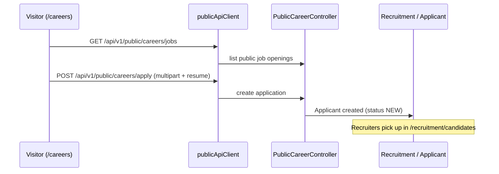

# NU-Hire — Recruitment Sub-App

> Deep dive into the NU-Hire bundle app: applicant tracking (ATS), public careers,
> hiring pipeline, scorecards, onboarding, preboarding, and e-signature. Every claim
> below is grounded in source files cited inline.

## 1. Purpose

NU-Hire is the recruitment and joining sub-application within the NU-AURA platform. It
covers the full talent funnel — from a public job posting to an accepted offer to a
new-joiner who is onboarded and converted into an employee. The frontend hub is
declared as "NU-Hire" in the sidebar
(`frontend/components/layout/menuSections.tsx:495-652`) and the dashboard header
(`frontend/app/recruitment/page.tsx:233-235`).

Functional pillars (each maps to backend domains + frontend routes documented below):

| Pillar | What it does |
|--------|--------------|
| Requisitions & Job Openings | Create/manage open roles, statuses, applicant counts |
| Candidate Pipeline (ATS) | Move candidates/applicants through stages, kanban |
| Interviews & Scorecards | Schedule rounds, structured evaluation rubrics |
| Public Careers | External job board + multipart resume application |
| Agencies & Job Boards | Partner-agency submissions, external board syndication |
| AI Recruitment | Resume parsing, match scoring, JD generation, ranking |
| Preboarding | Pre-join candidate portal (info, docs, offer e-sign) |
| Onboarding | Process + template-driven task checklists for new hires |
| E-Signature | Offer/contract signing (internal + external token flow) |
| Referrals | Employee referral submissions and bonus tracking |

## 2. Frontend Routes

All NU-Hire pages are App Router `page.tsx` files. The primary route group is
`frontend/app/recruitment/*`; joining-adjacent surfaces live at top-level routes
(`careers`, `sign`, `onboarding`, `offboarding`, `referrals`).

### Recruitment route group (`frontend/app/recruitment/`)

| Route | File | Purpose |
|-------|------|---------|
| `/recruitment` | `page.tsx` | Dashboard: stats, bento nav, candidates-needing-attention, interviews-this-week |
| `/recruitment/jobs` | `jobs/page.tsx` | Job openings / requisitions |
| `/recruitment/candidates` | `candidates/page.tsx` | Candidate list (supports `?id=`, `?status=` query state) |
| `/recruitment/candidates/[id]` | `candidates/[id]/page.tsx` | Candidate detail |
| `/recruitment/candidates/[id]/offer` | `candidates/[id]/offer/page.tsx` | Full-page offer-letter creation |
| `/recruitment/pipeline` | `pipeline/page.tsx` | Pipeline view |
| `/recruitment/kanban` | `kanban/page.tsx` | Drag-and-drop board |
| `/recruitment/[jobId]/kanban` | `[jobId]/kanban/page.tsx` | Per-job kanban board |
| `/recruitment/interviews` | `interviews/page.tsx` | Interview scheduling & feedback |
| `/recruitment/scorecards` | `scorecards/page.tsx` | Scorecard template CRUD |
| `/recruitment/agencies` | `agencies/page.tsx` | Partner agencies list |
| `/recruitment/agencies/[id]` | `agencies/[id]/page.tsx` | Agency detail + submissions |
| `/recruitment/job-boards` | `job-boards/page.tsx` | External job-board syndication |
| `/recruitment/career-page` | `career-page/page.tsx` | Career-page management (internal) |

### Joining-adjacent routes (top-level, grouped under NU-Hire in the menu)

| Route | File | Purpose | Auth |
|-------|------|---------|------|
| `/careers` | `careers/page.tsx` | Public job listings + application form | Public (uses `publicApiClient`) |
| `/sign/[token]` | `sign/[token]/page.tsx` | External e-signature signing flow | Public (token-scoped) |
| `/onboarding` | `onboarding/page.tsx` | Onboarding process overview | Authenticated |
| `/onboarding/new` | `onboarding/new/page.tsx` | Start a new onboarding process | Authenticated |
| `/onboarding/[id]` | `onboarding/[id]/page.tsx` | Onboarding process detail | Authenticated |
| `/onboarding/templates` | `onboarding/templates/page.tsx` | Checklist templates | Authenticated |
| `/onboarding/templates/[id]` `/new` | `templates/[id]/page.tsx`, `templates/new/page.tsx` | Template CRUD | Authenticated |
| `/offboarding` (+ `/[id]`, `/fnf`, `/exit`) | `offboarding/*` | Exit interview, full-and-final | Authenticated |
| `/referrals` | (menu `referrals-hire`) | Employee referral submissions | `REFERRAL_VIEW` |
| `/offer-portal` | (menu `offer-portal-hire`) | Offer portal | `RECRUITMENT_VIEW` |

Note: the menu groups `careers`, `offer-portal`, and `referrals` under the NU-Hire hub
(`menuSections.tsx:631-651`), even though they are top-level routes rather than under
`/recruitment`.

### Access control

The recruitment dashboard gates on roles and permissions. Allowed roles are
`SUPER_ADMIN, TENANT_ADMIN, HR_ADMIN, HR_MANAGER, RECRUITMENT_ADMIN`
(`recruitment/page.tsx:40`), and the page wraps content in a `PermissionGate` for
`RECRUITMENT_VIEW` / `RECRUITMENT_VIEW_ALL` (`recruitment/page.tsx:175-182`). Action
buttons gate further on `CANDIDATE_VIEW` and `RECRUITMENT_CREATE`
(`recruitment/page.tsx:243-254`).

## 3. Backend Domains & Controllers

Controllers live under `backend/src/main/java/com/nulogic/api/<domain>/controller/`;
entities under `com/nulogic/domain/<domain>/`.

### Recruitment (`api/recruitment/controller/`)

| Controller | Base path | Key endpoints |
|------------|-----------|---------------|
| `RecruitmentController` | `/api/v1/recruitment` | `/job-openings` CRUD + `/status/{status}`; `/candidates` CRUD + `/{id}/stage`, `/{id}/offer`, `/{id}/accept-offer`, `/{id}/decline-offer`; `/interviews` CRUD; `/offers` |
| `ApplicantController` | `/api/v1/recruitment/applicants` | create, `/{id}`, list, `/{id}/status`, `/pipeline/{jobOpeningId}`, `/{id}/rating`, delete |
| `AgencyController` | `/api/v1/recruitment/agencies` | CRUD; `/{id}/submissions` (GET/POST), `/submissions/{submissionId}/status`, `/{id}/performance`, `/submissions/job/{jobOpeningId}` |
| `ScorecardController` | `/api/v1/recruitment/scorecards` | CRUD + `/{id}/submit` |
| `JobBoardController` | `/api/v1/recruitment/job-boards` | `/post`, `/{postingId}/pause`, `/job/{jobOpeningId}`, list, `/status/{status}` |
| `AIRecruitmentController` | `/api/v1/recruitment/ai` | `/parse-resume`, `/parse-resume/upload`, `/match-score`, `/screening-summary`, `/ranked-candidates/{jobOpeningId}`, `/generate-job-description`, `/interview-questions/{jobOpeningId}`, `/synthesize-feedback` |

Recruitment domain entities (`domain/recruitment/`): `JobOpening`, `Candidate`,
`Applicant`, `Interview`, `InterviewScorecard`, `ScorecardTemplate`,
`ScorecardTemplateCriterion`, `ScorecardCriterion`, `RecruitmentAgency`,
`AgencySubmission`, `JobBoardPosting`, plus enums `ApplicationStatus`,
`ApplicationSource`. A `RecruitmentManagementController.java.disabled` exists but is
not active.

### Public Careers (`api/publicapi/controller/PublicCareerController`)

Base path `/api/v1/public/careers` — unauthenticated:

- `GET /jobs` — list public job openings
- `GET /jobs/{jobId}` — public job detail
- `POST /apply` — `multipart/form-data` application (resume upload)
- `GET /filters` — available filter facets

### Preboarding (`api/preboarding/controller/PreboardingController`)

Base path `/api/v1/preboarding`. Manages pre-join candidates and a token-scoped
candidate portal:

- Management: `POST /candidates`, `GET /candidates`, `/candidates/status/{status}`,
  `/candidates/upcoming`, `/candidates/{id}/cancel`, `/candidates/{id}/resend`,
  `/candidates/{id}/convert`
- Portal (token): `GET /portal/{token}`, `PUT /portal/{token}/personal-info`,
  `PUT /portal/{token}/bank-details`, `POST /portal/{token}/documents/{documentType}`,
  `POST /portal/{token}/sign-offer`

Entity: `domain/preboarding/PreboardingCandidate`. The `/convert` endpoint is the
bridge from preboarding to an actual employee.

### Onboarding (`api/onboarding/controller/OnboardingManagementController`)

Base path `/api/v1/onboarding`:

- Processes: `POST /processes`, `/{processId}` (PUT/GET/DELETE), `/{processId}/status`,
  `/{processId}/progress`, `/processes/employee/{employeeId}`,
  `/processes/status/{status}`, `/processes/buddy/{buddyId}`, `/processes/{processId}/tasks`
- Templates: `POST/GET /templates`, `/templates/{templateId}` CRUD,
  `/templates/{templateId}/tasks` CRUD
- Tasks: `PATCH /tasks/{taskId}/status`

Entities (`domain/onboarding/`): `OnboardingProcess`, `OnboardingTask`,
`OnboardingDocument`, `OnboardingChecklistTemplate`, `OnboardingTaskTemplate`,
`OnboardingTemplateTask`.

### E-Signature (`api/esignature/controller/ESignatureController`)

Base path `/api/v1/esignature`. Powers offer/contract signing:

- Requests: `POST /requests`, `PUT /requests/{id}`, `PATCH /requests/{id}/send`,
  `PATCH /requests/{id}/cancel`, GET variants (`/{id}`, list, `/creator/{creatorId}`,
  `/status/{status}`, `/templates`), delete, `POST /requests/{requestId}/signers`
- Approvals (internal signers): `POST /approvals/{approvalId}/sign`, `/decline`,
  `GET /requests/{requestId}/approvals`, `/approvals/signer/{signerId}/pending`
- External (token): `GET /external/{token}`, `POST /external/{token}/sign`,
  `POST /external/{token}/decline`

Entities (`domain/esignature/`): `SignatureRequest`, `SignatureApproval`. The frontend
`/sign/[token]` page consumes the external endpoints via `useEsignPublic` hooks
(`sign/[token]/page.tsx:6`).

### Referrals (`api/referral/controller/ReferralController`)

Base path `/api/v1/referrals` — submission and bonus lifecycle: create, `/my-referrals`,
`/{id}/status`, `/{id}/reject`, `/{id}/link-employee`, `/bonus-eligible`,
`/{id}/process-bonus`, `/{id}/mark-bonus-paid`, `/check-bonus-eligibility`, `/policies`
CRUD + `/policies/{id}/toggle`, `/dashboard`. Entities: `EmployeeReferral`,
`ReferralPolicy`.

### Joining-adjacent backend domains

`domain/probation/` (`ProbationPeriod`, `ProbationEvaluation`) and `domain/bgv/`
(`BackgroundVerification`, `VerificationCheck`) extend the joining lifecycle
(probation, background verification) and are part of the broader Hire-to-employee flow.

## 4. Frontend Data Layer

The recruitment dashboard uses hand-written React Query hooks in
`frontend/lib/hooks/queries/useRecruitment.ts`: `useJobOpenings`,
`useJobOpeningsByStatus`, `useJobOpening`, `useCreateJobOpening`, `useUpdateJobOpening`,
`useDeleteJobOpening`, `useCandidates`, `useCandidatesByJob`, `useCandidate`,
`useCreateCandidate`, `useUpdateCandidate`, `useDeleteCandidate`,
`useMoveCandidateStage`, `useCreateOffer`, `useAllInterviews`,
`useInterviewsByCandidate`, `useScheduleInterview`, `useUpdateInterview`,
`useDeleteInterview`, plus AI hooks (`useParseResume`, `useParseResumeFromUpload`,
`useCalculateMatchScore`, `useGenerateScreeningSummary`, `useRankedCandidates`,
`useGenerateJobDescription`, `useGenerateInterviewQuestions`, `useInterviewQuestions`,
`useSynthesizeFeedback`).

Other surfaces use distinct hooks/clients:

- Scorecards uses **Orval-generated** hooks: `useListTemplates1`, `useCreateTemplate`,
  `useUpdateTemplate`, `useDeleteTemplate` from
  `lib/generated/api/scorecard-controller/` (`scorecards/page.tsx:13-19`).
- Careers uses the **public** client: `usePublicJobs` over `publicApiClient`
  (`careers/page.tsx:7-8`).
- The offer page composes `useApplicant`, `useActiveLetterTemplates`,
  `letterService.generateOfferLetter`, and `applicantService.updateStatus`
  (`candidates/[id]/offer/page.tsx:24-28`).

Types are split: `lib/types/hire/recruitment` (`Candidate`, `CandidateStatus`,
`Interview` — `recruitment/page.tsx:33`) and `lib/types/hire/applicant`
(`ApplicationStatus`).

## 5. Key Flows

### 5.1 Public application → pipeline



### 5.2 Candidate stage progression → offer → sign

```mermaid
sequenceDiagram
    participant R as Recruiter
    participant RC as RecruitmentController
    participant OFF as Offer letter (letterService)
    participant ES as ESignatureController
    participant C as Candidate
    R->>RC: PUT /recruitment/candidates/{id}/stage (NEW→SCREENING→INTERVIEW→SELECTED)
    R->>OFF: /recruitment/candidates/{id}/offer (generateOfferLetter)
    R->>RC: POST /recruitment/candidates/{id}/offer (status OFFER_EXTENDED)
    R->>ES: POST /esignature/requests + /send
    ES-->>C: signing link /sign/{token}
    C->>ES: POST /esignature/external/{token}/sign
    C->>RC: POST /recruitment/candidates/{id}/accept-offer
```

Candidate status enum (`recruitment/page.tsx:44-55`): `NEW`, `SCREENING`, `INTERVIEW`,
`SELECTED`, `OFFER_EXTENDED`, `OFFER_ACCEPTED`, `OFFER_DECLINED`, `REJECTED`,
`WITHDRAWN`. The dashboard derives pipeline counts and an "offers awaiting response"
alert from these (`recruitment/page.tsx:85-104, 594-618`).

### 5.3 Offer → preboarding → onboarding → employee


The preboarding `/convert` endpoint promotes a `PreboardingCandidate` into an employee,
after which an `OnboardingProcess` (template-driven `OnboardingTask` checklist) is run
to completion, feeding into probation and background verification.

### 5.4 AI assist (optional augmentation)

`AIRecruitmentController` (`/api/v1/recruitment/ai`) augments the pipeline: parse resume
(raw or upload), compute match score, generate screening summary, rank candidates per
job, generate job descriptions and interview questions, and synthesize interview
feedback. These are surfaced via the AI hooks in `useRecruitment.ts`.

## 6. Source Map

| Layer | Path |
|-------|------|
| Recruitment routes | `frontend/app/recruitment/` |
| Public careers | `frontend/app/careers/page.tsx` |
| E-sign signing | `frontend/app/sign/[token]/page.tsx` |
| Onboarding routes | `frontend/app/onboarding/` |
| Recruitment hooks | `frontend/lib/hooks/queries/useRecruitment.ts` |
| Scorecard hooks (Orval) | `frontend/lib/generated/api/scorecard-controller/` |
| Hire types | `frontend/lib/types/hire/` |
| Menu (NU-Hire hub) | `frontend/components/layout/menuSections.tsx:495-652` |
| Recruitment controllers | `backend/src/main/java/com/nulogic/api/recruitment/controller/` |
| Public careers controller | `backend/src/main/java/com/nulogic/api/publicapi/controller/PublicCareerController.java` |
| Preboarding controller | `backend/src/main/java/com/nulogic/api/preboarding/controller/PreboardingController.java` |
| Onboarding controller | `backend/src/main/java/com/nulogic/api/onboarding/controller/OnboardingManagementController.java` |
| E-signature controller | `backend/src/main/java/com/nulogic/api/esignature/controller/ESignatureController.java` |
| Referral controller | `backend/src/main/java/com/nulogic/api/referral/controller/ReferralController.java` |
| Domain entities | `backend/src/main/java/com/nulogic/domain/{recruitment,onboarding,preboarding,esignature,referral,probation,bgv}/` |
