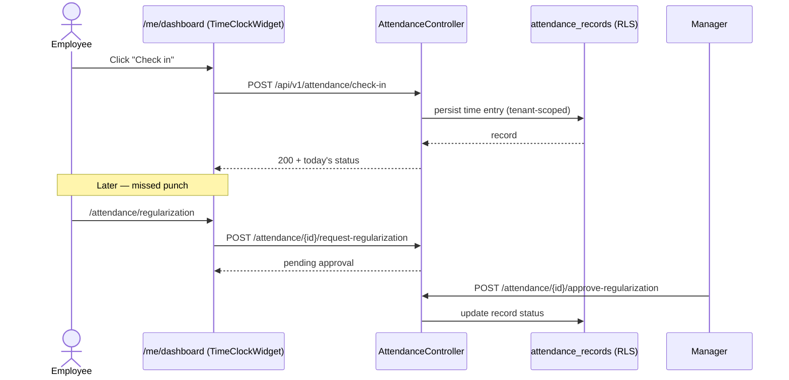
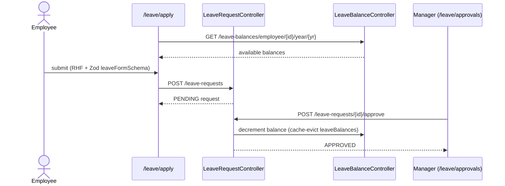
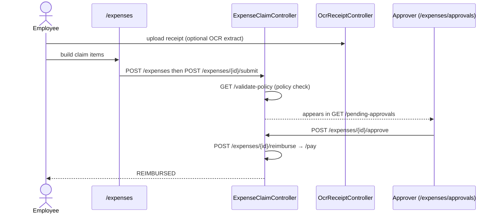
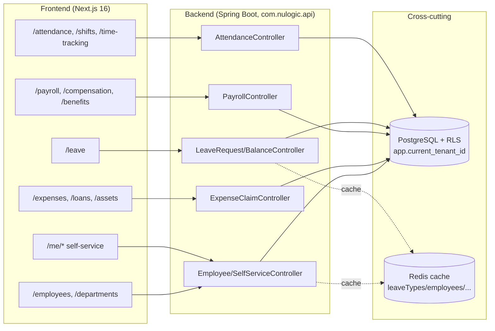

# NU-HRMS — Core HR Sub-App Deep Dive

> Evidence-based documentation. Every route, controller, and endpoint cited below
> was read from source. Paths are relative to the repo root
> `/Users/fayaz.m/IdeaProjects/nulogic/nu-aura`.

## 1. Purpose

NU-HRMS is the **core HR sub-application** within the NU-AURA bundle platform. NU-AURA
hosts four sub-apps that share one Next.js frontend and one Spring Boot backend;
NU-HRMS is the largest and the default landing experience. It owns the central HR
record-of-truth and the day-to-day employee lifecycle: employee master data, the
self-service portal, attendance and time tracking, leave, payroll and compensation,
benefits, expenses, loans, assets, statutory/tax handling, and the organization
structure.

The sub-app boundary is **declared explicitly** in
`frontend/lib/config/apps.ts` via the `PLATFORM_APPS.HRMS` entry, not inferred. Routes
are flat (e.g. `/leave`, `/payroll`) and mapped to the HRMS app at runtime by
pathname-prefix matching against `routePrefixes`, with RBAC gating via
`permissionPrefixes`.

```ts
// frontend/lib/config/apps.ts — PLATFORM_APPS.HRMS
HRMS: {
  code: 'HRMS', name: 'NU-HRMS', shortName: 'HRMS',
  description: 'Core HR management',
  entryRoute: '/me/dashboard',
  permissionPrefixes: [ 'employee','department','leave','attendance','payroll',
    'compensation','benefit','expense','loan','travel','asset','letter',
    'statutory','lwf','tax','helpdesk','overtime','probation','dashboard',
    'self_service','document','calendar','announcement','workflow',
    'org_structure','report','analytics','settings','role','permission',
    'integration','timesheet','project','resource','email','shift' ],
  available: true, order: 1,
}
```

The app icon entry point is `/me/dashboard` — the personal self-service home.

## 2. Frontend Routes & Pages

All routes live under `frontend/app/` (Next.js 16 App Router). The table groups the
HRMS-owned `page.tsx` routes by functional area. Routes were enumerated directly from
the filesystem; the app→route mapping is authoritative per `HRMS.routePrefixes`.

| Area | Route (`frontend/app/...`) | Notes |
|------|----------------------------|-------|
| **Self-service (`/me`)** | `/me/dashboard`, `/me/profile`, `/me/leaves`, `/me/attendance`, `/me/payslips`, `/me/documents`, `/me/assets`, `/me/skills` | Personal employee portal; HRMS entry route is `/me/dashboard` |
| **Attendance** | `/attendance`, `/attendance/my-attendance`, `/attendance/team`, `/attendance/regularization`, `/attendance/comp-off`, `/attendance/shift-swap` | Check-in/out, team view, regularization workflow |
| **Shifts** | `/shifts`, `/shifts/definitions`, `/shifts/patterns`, `/shifts/my-schedule`, `/shifts/swaps` | Shift definitions, rosters, swap requests |
| **Time tracking** | `/time-tracking`, `/time-tracking/new`, `/time-tracking/[id]`, `/time-tracking/[id]/edit`, `/timesheets` | Timesheet entry & approval |
| **Overtime** | `/overtime` | Overtime management |
| **Leave** | `/leave`, `/leave/apply`, `/leave/my-leaves`, `/leave/team`, `/leave/approvals`, `/leave/calendar`, `/leave/encashment`, `/leave/admin/carry-forward` | Apply, approve, encash, carry-forward |
| **Employees** | `/employees`, `/employees/directory`, `/employees/[id]`, `/employees/[id]/edit`, `/employees/[id]/compensation`, `/employees/change-requests`, `/employees/import` | Employee master, directory, bulk import |
| **Departments / Org** | `/departments` | Org structure |
| **Payroll** | `/payroll`, `/payroll/runs`, `/payroll/runs/[id]`, `/payroll/bulk-processing`, `/payroll/payslips`, `/payroll/components`, `/payroll/salary-structures`, `/payroll/salary-structures/create`, `/payroll/structures`, `/payroll/statutory` | Run lifecycle, payslips, salary structures |
| **Compensation / Benefits** | `/compensation`, `/benefits` | Comp review, benefit plans |
| **Expenses** | `/expenses`, `/expenses/[id]`, `/expenses/approvals`, `/expenses/reports`, `/expenses/mileage`, `/expenses/settings` | Claims, approvals, mileage, OCR receipts |
| **Loans** | `/loans`, `/loans/new`, `/loans/[id]` | Employee loans |
| **Assets** | `/assets` | Asset assignment & recovery |
| **Statutory / Tax / LWF** | `/statutory`, `/statutory/filings`, `/tax`, `/tax/declarations`, `/lwf` | Indian statutory engine |
| **Letters** | `/letters`, `/letters/templates` | Letter generation |
| **Helpdesk** | `/helpdesk`, `/helpdesk/tickets`, `/helpdesk/tickets/[id]`, `/helpdesk/sla`, `/helpdesk/knowledge-base` | HR helpdesk / ticketing |
| **Cross-cutting** | `/dashboard`, `/dashboards`, `/approvals`, `/announcements`, `/calendar`, `/reports`, `/analytics`, `/settings`, `/admin`, `/workflows`, `/import-export` | Shared HRMS surfaces (see `routePrefixes`) |

> Note on `app/recruitment`, `app/fluence`, `app/performance`, `app/okr`,
> `app/training`, `app/learning`, `app/recognition`, `app/surveys`, `app/wellness`,
> `app/onboarding`, `app/offboarding`, `app/careers`, `app/referrals`: these belong to
> the **sibling** sub-apps NU-Hire and NU-Grow per their own `routePrefixes` in
> `frontend/lib/config/apps.ts`, and are intentionally excluded from NU-HRMS above.

### Frontend data wiring (representative)

- `app/me/dashboard/page.tsx` — composes self-service widgets (`TimeClockWidget`,
  `LeaveBalanceWidget`, `HolidayCarousel`, presence cards) and pulls data via
  `useSelfServiceDashboard(employeeId)` plus `attendanceService`.
- `app/leave/apply/page.tsx` — React Hook Form + Zod (`leaveFormSchema`), gated by
  `PermissionGate` / `Permissions`, using `useActiveLeaveTypes`,
  `useEmployeeBalancesForYear`, and `useCreateLeaveRequest` query hooks.

## 3. Backend Domains Used

NU-HRMS maps to many `com.nulogic` bounded contexts. Controllers below were read from
`backend/src/main/java/com/nulogic/api/<domain>/controller/`.

| Domain | Key controllers | Responsibility |
|--------|-----------------|----------------|
| `attendance` | `AttendanceController`, `MobileAttendanceController`, `CompOffController`, `BiometricDeviceController`, `HolidayController`, `RestrictedHolidayController`, `OfficeLocationController` | Check-in/out, regularization, comp-off, biometric sync, holidays |
| `timetracking` | `TimeTrackingController` | Timesheets |
| `shift` | `ShiftManagementController`, `ShiftSwapController` | Shift definitions, rosters, swaps |
| `overtime` | `OverTimeManagementController` | Overtime |
| `leave` | `LeaveRequestController`, `LeaveBalanceController`, `LeaveTypeController` | Leave requests, balances, types, encashment, carry-forward |
| `payroll` | `PayrollController`, `GlobalPayrollController`, `BonusController`, `PayrollStatutoryController`, `StatutoryFilingController` | Payroll runs, payslips, salary structures, bonuses |
| `compensation` | `CompensationController` | Compensation review |
| `benefits` | `BenefitManagementController`, `BenefitEnhancedController` | Benefit plans & enrollment |
| `expense` | `ExpenseClaimController`, `ExpenseItemController`, `ExpenseCategoryController`, `ExpensePolicyController`, `ExpenseReportController`, `ExpenseAdvanceController`, `MileageController`, `MileagePolicyController`, `OcrReceiptController` | Expense claims, mileage, receipt OCR |
| `loan` | `LoanController` | Employee loans |
| `asset` | `AssetController` (asset assignment/recovery) | Asset lifecycle |
| `employee` | `EmployeeController`, `EmployeeDirectoryController`, `EmployeeImportController`, `EmployeeDocumentController`, `EmployeeSkillController`, `TalentProfileController` | Employee master & directory |
| `selfservice` | `SelfServiceController` | Profile-update & document requests, self-service dashboard |
| `organization` | `OrganizationController`, `DepartmentController`, `DesignationController` | Org structure |
| `statutory` / `tax` | `PayrollStatutoryController`, `StatutoryFilingController`, `TDSController`, `ProfessionalTaxController`, `ProvidentFundController`, `ESIController`, `LWFController`, `TaxDeclarationController` | Indian statutory deductions & filings |
| `letter` | `LetterController` / templates | Letter generation |
| `helpdesk` | `HelpDeskController`, `HelpDeskSLAController` | HR ticketing |

All HRMS data is multi-tenant isolated: the request passes through `TenantFilter` →
`TenantContext` (ThreadLocal) and PostgreSQL Row-Level Security via
`TenantRlsTransactionManager` (`SET LOCAL app.current_tenant_id`). Hot reference data
(`leaveTypes`, `departments`, `designations`, `employees`, `leaveBalances`) is cached
in Redis with tiered TTLs (`CacheConfig`).

## 4. Key User Flows

### 4.1 Attendance — check-in / check-out / regularization

Endpoints from `attendance/controller/AttendanceController.java`
(`@RequestMapping("/api/v1/attendance")`):
`POST /check-in`, `POST /check-out`, `GET /today`, `GET /my-attendance`,
`POST /{id}/request-regularization`, `POST /{id}/approve-regularization`,
`POST /{id}/reject-regularization`.



### 4.2 Leave — apply → approve → balance update

Endpoints from `leave/controller/LeaveRequestController.java`
(`@RequestMapping("/api/v1/leave-requests")`): `POST` (create), `POST /{id}/approve`,
`POST /{id}/reject`, `POST /{id}/cancel`, `GET /employee/{employeeId}`. Balances from
`LeaveBalanceController` (`/api/v1/leave-balances`): `GET /employee/{employeeId}/year/{year}`,
`POST /encash`, `POST /admin/carry-forward`.



### 4.3 Expense claim — submit → approve → reimburse

Endpoints from `expense/controller/ExpenseClaimController.java`
(`@RequestMapping("/api/v1/expenses")`): `POST` (create), `POST /{claimId}/submit`,
`POST /{claimId}/approve`, `POST /{claimId}/reject`, `POST /{claimId}/reimburse`,
`POST /{claimId}/pay`, `GET /pending-approvals`, `GET /validate-policy`. Receipts can be
parsed via `OcrReceiptController`; mileage via `MileageController`.



### 4.4 Payroll run (admin) — supporting flow

From `payroll/controller/PayrollController.java` (`/api/v1/payroll`):
`POST /runs` → `POST /runs/{id}/process` → `POST /runs/{id}/approve` →
`POST /runs/{id}/lock`; payslips via `GET /payslips/employee/{employeeId}/year/{year}`,
surfaced to employees at `/me/payslips`.

## 5. Architecture at a Glance



## 6. Source References

- `frontend/lib/config/apps.ts` — `PLATFORM_APPS.HRMS` (route & permission mapping)
- `frontend/app/me/dashboard/page.tsx`, `frontend/app/leave/apply/page.tsx`
- `backend/.../api/attendance/controller/AttendanceController.java`
- `backend/.../api/leave/controller/{LeaveRequestController,LeaveBalanceController}.java`
- `backend/.../api/payroll/controller/PayrollController.java`
- `backend/.../api/expense/controller/ExpenseClaimController.java`
- `backend/.../api/selfservice/controller/SelfServiceController.java`
