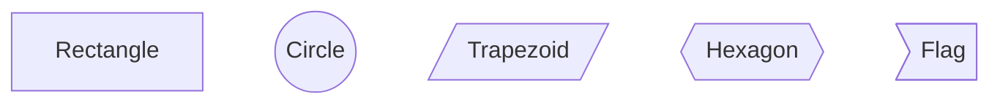
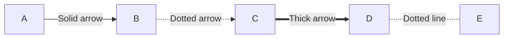
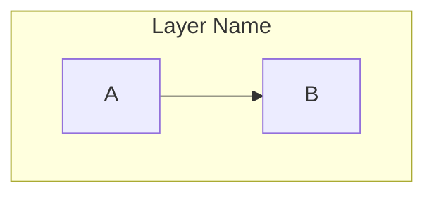

# NU-AURA HRMS - Architecture Diagrams

## 📋 Overview

This directory contains comprehensive architecture diagrams for the NU-AURA HRMS platform, designed specifically for **business stakeholder presentations**.

All diagrams are created using **Mermaid** syntax and can be rendered as high-quality images (PNG/SVG) for PowerPoint, Google Slides, or Confluence.

---

## 📂 Available Diagrams

| # | Diagram | Audience | Purpose |
|---|---------|----------|---------|
| **01** | [System Context](./01-SYSTEM-CONTEXT.mmd) | Executives, C-Suite | High-level overview of the entire system |
| **02** | [Container Architecture](./02-CONTAINER-ARCHITECTURE.mmd) | CTO, VP Engineering | Technology stack & deployment components |
| **03** | [Business Modules](./03-BUSINESS-MODULES.mmd) | Product, Business Teams | Complete feature set (60+ modules) |
| **04** | [Multi-Tenant Flow](./04-MULTI-TENANT-FLOW.mmd) | Security, Compliance | Tenant isolation & data security |
| **05** | [Auth & Authorization](./05-AUTH-AUTHORIZATION-FLOW.mmd) | Security, IT Teams | Login, MFA, JWT, RBAC flow |
| **06** | [Payroll Workflow](./06-PAYROLL-WORKFLOW.mmd) | Finance, HR Teams | Payroll processing with Saga pattern |
| **07** | [Deployment Architecture](./07-DEPLOYMENT-ARCHITECTURE.mmd) | DevOps, Infrastructure | Kubernetes, auto-scaling, HA setup |
| **08** | [Integration Architecture](./08-INTEGRATION-ARCHITECTURE.mmd) | Integration, Sales | External system integrations (30+ systems) |
| **09** | [Data Model Overview](./09-DATA-MODEL-OVERVIEW.mmd) | Data, Engineering | Core entities & relationships (40+ tables) |

---

## 🎨 How to Render Diagrams

### Method 1: Mermaid Live Editor (Recommended for Business)

1. **Go to**: https://mermaid.live
2. **Copy** the content of any `.mmd` file (e.g., `01-SYSTEM-CONTEXT.mmd`)
3. **Paste** into the left panel
4. **View** the rendered diagram on the right
5. **Export** as:
   - **PNG** (for PowerPoint/Google Slides)
   - **SVG** (for Confluence/high-quality prints)
   - **PDF** (for documents)

**Example**: For System Context diagram:
```bash
# Copy this file
cat 01-SYSTEM-CONTEXT.mmd | pbcopy

# Or open directly
open https://mermaid.live
```

### Method 2: VS Code Extension

1. Install **Mermaid Preview** extension
2. Open any `.mmd` file in VS Code
3. Press `Cmd+Shift+P` → Type "Mermaid: Preview"
4. Right-click diagram → "Export as PNG/SVG"

### Method 3: Command Line (For Developers)

```bash
# Install Mermaid CLI
npm install -g @mermaid-js/mermaid-cli

# Render a diagram
mmdc -i 01-SYSTEM-CONTEXT.mmd -o system-context.png -w 3000

# Render all diagrams
for file in *.mmd; do
  mmdc -i "$file" -o "${file%.mmd}.png" -w 3000
done
```

### Method 4: Confluence Integration

1. Install **Mermaid Diagrams for Confluence** plugin
2. Create a new page
3. Add **Mermaid Diagram** macro
4. Paste `.mmd` content
5. Diagram renders automatically

---

## 🎯 Diagram Usage Guide

### For Business Presentations

| Use Case | Recommended Diagrams | Talking Points |
|----------|---------------------|----------------|
| **Executive Overview** | 01, 03 | "60+ integrated HR modules, 10+ external integrations" |
| **Security & Compliance** | 04, 05 | "Multi-tenant isolation, JWT+MFA, RBAC with 300+ permissions" |
| **Feature Deep-Dive** | 03 | "Core HR, Payroll, Performance, Recruitment, Learning" |
| **Technical Architecture** | 02, 07 | "Kubernetes, auto-scaling, 99.9% uptime SLA" |
| **Integration Capabilities** | 08 | "LinkedIn, Slack, SSO providers, Payment gateways" |
| **Competitive Analysis** | 01, 03, 08 | "95% feature parity with Workday/SAP at 1/10th cost" |

### For Technical Discussions

| Use Case | Recommended Diagrams | Audience |
|----------|---------------------|----------|
| **System Design Review** | 02, 07, 09 | Engineering team |
| **Security Audit** | 04, 05 | Security team, auditors |
| **Performance Optimization** | 02, 07 | DevOps, SRE team |
| **API Integration** | 08 | Integration partners |
| **Data Migration Planning** | 09 | Data engineering team |

---

## 📊 Diagram Statistics

| Metric | Count |
|--------|-------|
| **Total Diagrams** | 9 |
| **Business Modules Documented** | 60+ |
| **External Integrations** | 30+ |
| **Database Tables** | 40+ core entities |
| **Technology Components** | 15+ (Spring Boot, Next.js, PostgreSQL, Redis, Kafka, etc.) |
| **Deployment Components** | 10+ (K8s pods, services, managed services) |

---

## 🔄 Update Frequency

| Diagram | Update Frequency | Last Updated |
|---------|-----------------|--------------|
| 01-03 (Business) | Quarterly | 2026-03-11 |
| 04-05 (Security) | After security changes | 2026-03-11 |
| 02, 07 (Infrastructure) | After major deployments | 2026-03-11 |
| 06 (Workflows) | After process changes | 2026-03-11 |
| 08 (Integrations) | After new integrations | 2026-03-11 |
| 09 (Data Model) | After schema changes | 2026-03-11 |

---

## 🎨 Customization Guide

### Changing Colors

Edit the `classDef` sections in any `.mmd` file:

```mermaid
classDef primaryStyle fill:#465fff,stroke:#2a31d8,stroke-width:2px,color:#fff
class COMPONENT_NAME primaryStyle
```

**Color Palette (Current)**:
- **Primary Blue**: `#465fff` (Core features)
- **Success Green**: `#12b76a` (Backend, completed states)
- **Warning Orange**: `#f79009` (Data layer, warnings)
- **Info Purple**: `#7886ff` (Monitoring, analytics)
- **Error Red**: `#f04438` (Failures, critical)
- **Neutral Gray**: `#667085` (External systems)

### Adding New Diagrams

1. Create `10-YOUR-DIAGRAM-NAME.mmd`
2. Follow the header format:
```mermaid
%% ============================================================================
%% NU-AURA HRMS - Your Diagram Title
%% SHORT DESCRIPTION
%%
%% Render at: https://mermaid.live
%% ============================================================================
```
3. Add to this README under "Available Diagrams"

---

## 📖 Mermaid Syntax Reference

### Graph Types

- **`graph TB`**: Top to bottom (system context, architecture)
- **`graph LR`**: Left to right (workflows, timelines)
- **`sequenceDiagram`**: Sequence flows (authentication, API calls)
- **`erDiagram`**: Entity relationships (data model)
- **`stateDiagram`**: State machines (workflow states)

### Common Shapes



### Connectors



### Subgraphs



### Full Reference

- **Official Docs**: https://mermaid.js.org/intro/
- **Live Editor**: https://mermaid.live
- **Syntax Guide**: https://mermaid.js.org/syntax/

---

## 🚀 Quick Start for Business Teams

### Scenario 1: Board Meeting Presentation

**Goal**: Show executive overview of HRMS platform

**Steps**:
1. Open `01-SYSTEM-CONTEXT.mmd` in Mermaid Live
2. Export as PNG (3000px width)
3. Insert into PowerPoint slide
4. Add title: "NU-AURA HRMS - Complete HR Platform"

**Talking Points**:
- "Single platform for 60+ HR modules"
- "Integrated with 30+ external systems"
- "Multi-tenant SaaS architecture serving 100+ companies"

### Scenario 2: Sales Demo

**Goal**: Showcase feature richness vs competitors

**Steps**:
1. Open `03-BUSINESS-MODULES.mmd`
2. Export as PNG
3. Create side-by-side comparison slide: "NU-AURA vs Workday"

**Talking Points**:
- "60+ modules vs 45 in Workday"
- "AI-powered recruitment vs manual screening"
- "1/10th the cost, 95% feature parity"

### Scenario 3: Security Audit

**Goal**: Demonstrate multi-tenant isolation

**Steps**:
1. Open `04-MULTI-TENANT-FLOW.mmd`
2. Export as PDF for audit report
3. Highlight red "Security Scenario" section

**Talking Points**:
- "Row-level security (RLS) enforced at database"
- "ThreadLocal tenant context propagation"
- "Cross-tenant access blocked by design"

---

## 🛠️ Troubleshooting

### Diagram Not Rendering

**Problem**: Syntax error in Mermaid code

**Solution**:
1. Open Mermaid Live Editor
2. Check the error panel (bottom)
3. Common issues:
   - Missing closing `end` tag in subgraphs
   - Unmatched quotes in labels
   - Invalid characters in node IDs

### Export Quality Low

**Problem**: Exported PNG looks pixelated

**Solution**:
- Use `mmdc` CLI with `-w 3000` (width 3000px)
- Or export SVG for vector graphics (infinite zoom)

### Colors Not Working

**Problem**: Custom colors not showing

**Solution**:
- Ensure `classDef` is defined BEFORE `class` statement
- Check hex color codes are valid (6 digits, no typos)

---

## 📞 Support

**For diagram questions**:
- Engineering Team: Slack `#engineering-architecture`
- Documentation: This README
- Mermaid Help: https://mermaid.js.org/intro/

**For presentation help**:
- Marketing Team: Slack `#marketing`
- Sales Enablement: Slack `#sales`

---

## 📝 License & Usage

- **Internal Use Only**: These diagrams are proprietary to NU-AURA HRMS
- **External Sharing**: Requires approval from Product/Engineering leadership
- **Modification**: Feel free to customize for your presentations
- **Attribution**: When sharing externally, credit "NU-AURA HRMS Engineering Team"

---

**Last Updated**: 2026-03-11
**Maintained By**: Architecture Team
**Version**: 1.0
