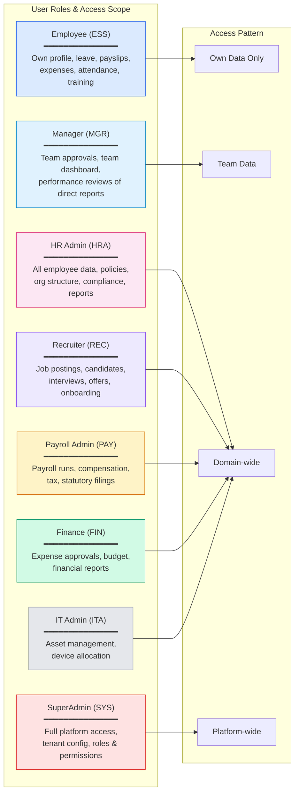
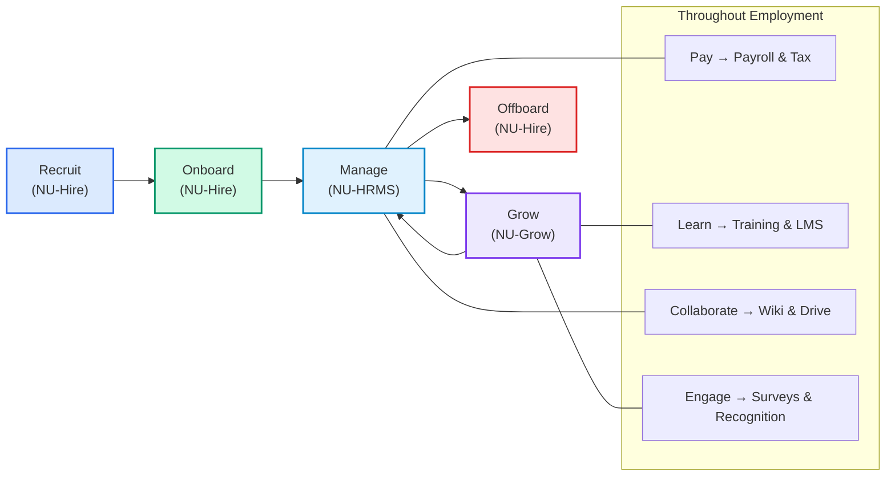
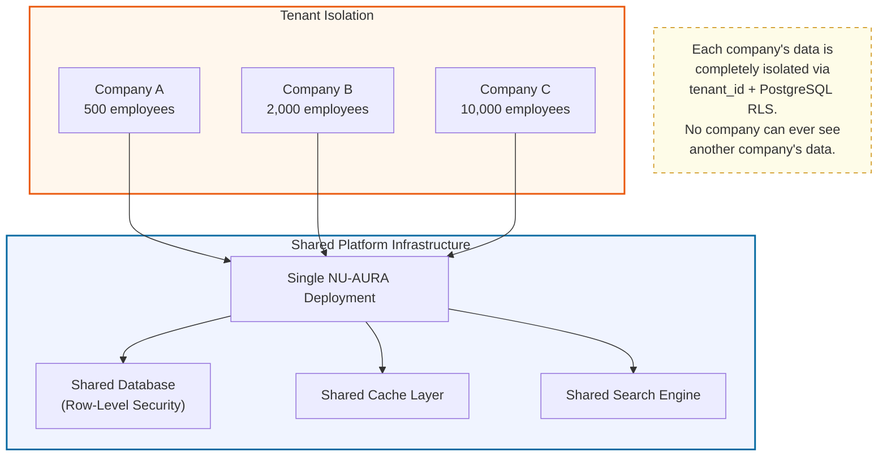
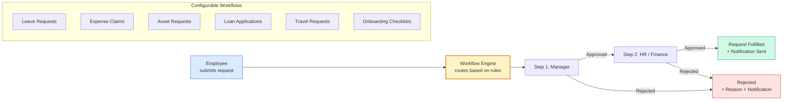

# NU-AURA Platform — Business Architecture

> For executives, product stakeholders, and business teams.
> Shows WHAT the platform does, WHO uses it, and HOW value flows.

---

## Platform Overview

```mermaid
graph TB
    subgraph PLATFORM["NU-AURA — Unified People Operations Platform"]
        direction TB

        subgraph ENTRY["Single Sign-On Entry Point"]
            LOGIN["Secure Login<br/>(Email / Google SSO / MFA)"]
            SWITCHER["App Switcher<br/>(Google-style Waffle Grid)"]
        end

        subgraph APPS["4 Sub-Applications"]
            direction LR

            subgraph HRMS["NU-HRMS<br/>Core HR Management"]
                direction TB
                H1["Employee Lifecycle<br/>Hire → Retire"]
                H2["Leave & Attendance<br/>Policies, Tracking, Regularization"]
                H3["Payroll & Compensation<br/>Formula Engine, Payslips, Tax"]
                H4["Benefits & Expenses<br/>Claims, Loans, Travel, Assets"]
                H5["Org Structure<br/>Departments, Org Chart, Shifts"]
                H6["Compliance<br/>Statutory, LWF, PF, ESI, Tax Filings"]
            end

            subgraph HIRE["NU-Hire<br/>Talent Acquisition"]
                direction TB
                R1["Job Postings<br/>Career Page, Job Board Sync"]
                R2["Candidate Pipeline<br/>Screening → Interview → Offer"]
                R3["Onboarding<br/>Pre-boarding, Day-1, Checklists"]
                R4["Offboarding<br/>Exit Interview, Clearance, KT"]
                R5["Referrals<br/>Employee Referral Program"]
            end

            subgraph GROW["NU-Grow<br/>Performance & Learning"]
                direction TB
                G1["Performance Reviews<br/>Annual, Mid-Year, Continuous"]
                G2["OKRs & Goals<br/>Cascading Objectives"]
                G3["360 Feedback<br/>Multi-rater Assessment"]
                G4["Training & LMS<br/>Course Catalog, Certifications"]
                G5["Recognition & Wellness<br/>Kudos, Surveys, Wellness Programs"]
            end

            subgraph FLUENCE["NU-Fluence<br/>Knowledge & Collaboration"]
                direction TB
                F1["Wiki<br/>Company Knowledge Base"]
                F2["Blogs<br/>Internal Communications"]
                F3["Templates<br/>Document Templates Library"]
                F4["Drive<br/>File Storage & Sharing"]
                F5["Social Wall<br/>Company Feed & Updates"]
            end
        end

        subgraph CROSS["Cross-Cutting Platform Capabilities"]
            direction LR
            C1["Approval Workflows<br/>Configurable Multi-step Approvals"]
            C2["Notifications<br/>In-app, Email, SMS, Real-time"]
            C3["Reports & Analytics<br/>Dashboards, Exports, Predictive"]
            C4["Document Generation<br/>Letters, Offer Letters, Payslips"]
            C5["Helpdesk<br/>Employee Support Tickets"]
            C6["Calendar & Scheduling<br/>Company Calendar, Holidays"]
        end
    end

    LOGIN --> SWITCHER
    SWITCHER --> HRMS
    SWITCHER --> HIRE
    SWITCHER --> GROW
    SWITCHER --> FLUENCE

    HRMS ~~~ CROSS
    HIRE ~~~ CROSS
    GROW ~~~ CROSS
    FLUENCE ~~~ CROSS

    style PLATFORM fill:#f0f4ff,stroke:#0369a1,stroke-width:3px
    style HRMS fill:#e0f2fe,stroke:#0284c7,stroke-width:2px
    style HIRE fill:#dbeafe,stroke:#2563eb,stroke-width:2px
    style GROW fill:#ede9fe,stroke:#7c3aed,stroke-width:2px
    style FLUENCE fill:#fef3c7,stroke:#d97706,stroke-width:2px
    style CROSS fill:#f0fdf4,stroke:#16a34a,stroke-width:2px
    style ENTRY fill:#fff7ed,stroke:#ea580c,stroke-width:2px
```

---

## Who Uses the Platform — Role-Based Access

---

## Employee Lifecycle Journey

---

## Multi-Tenant SaaS Model

---

## Approval Workflow Engine (Business View)

---

## Business Value Summary

| Capability | Business Impact |
|---|---|
| **Single Platform** | One login for all HR operations — no tool-switching |
| **Multi-Tenant SaaS** | Serve unlimited companies from one deployment |
| **Configurable Workflows** | No code changes needed for new approval chains |
| **Role-Based Access** | 9 roles with granular permissions (500+ permission rules) |
| **Real-Time Notifications** | Instant alerts via in-app, email, and SMS |
| **Compliance Built-In** | Statutory filings, PF, ESI, LWF, tax — India-ready |
| **Full Employee Lifecycle** | Recruit → Onboard → Manage → Grow → Offboard |
| **Analytics & Predictive** | Dashboards, exportable reports, ML-powered insights |
| **Knowledge Management** | Wiki, blogs, templates, drive — company brain |
