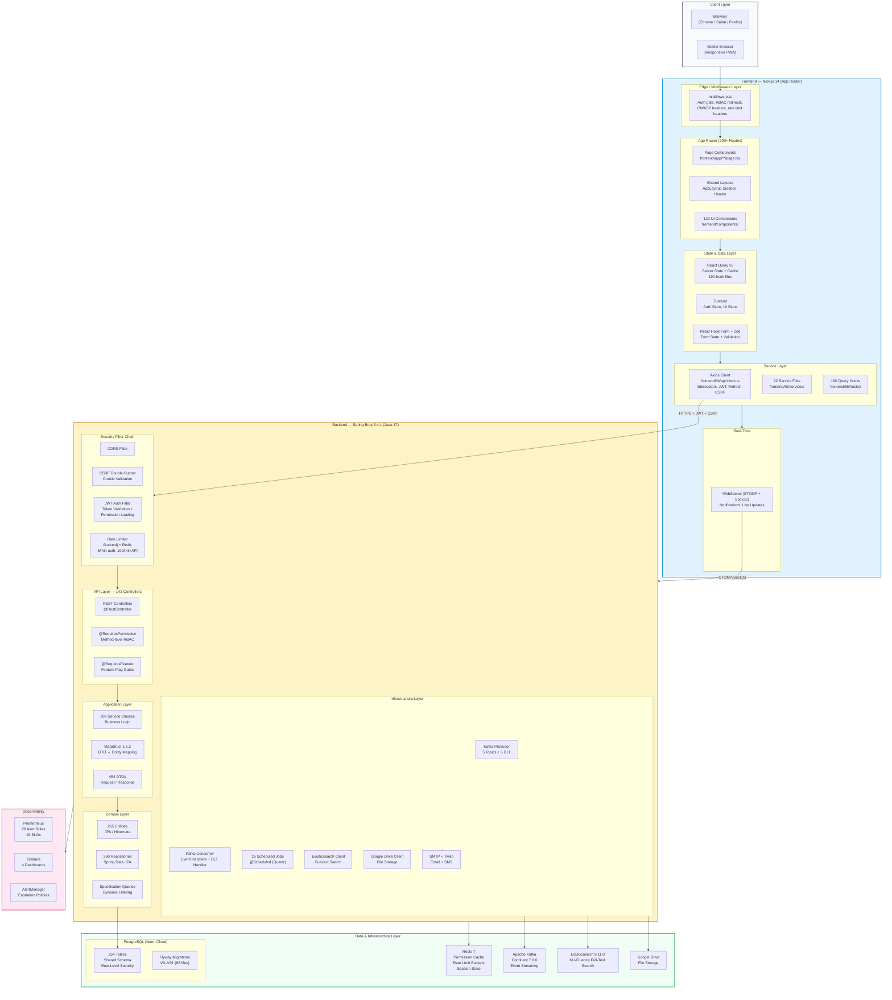
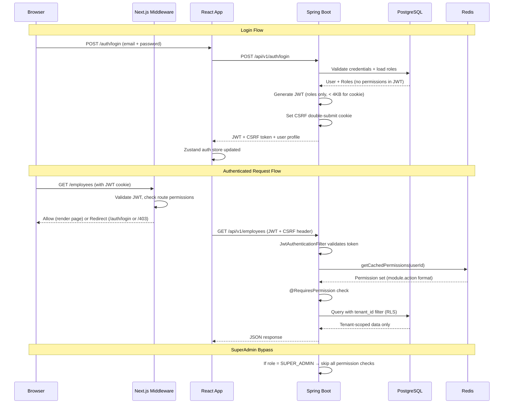
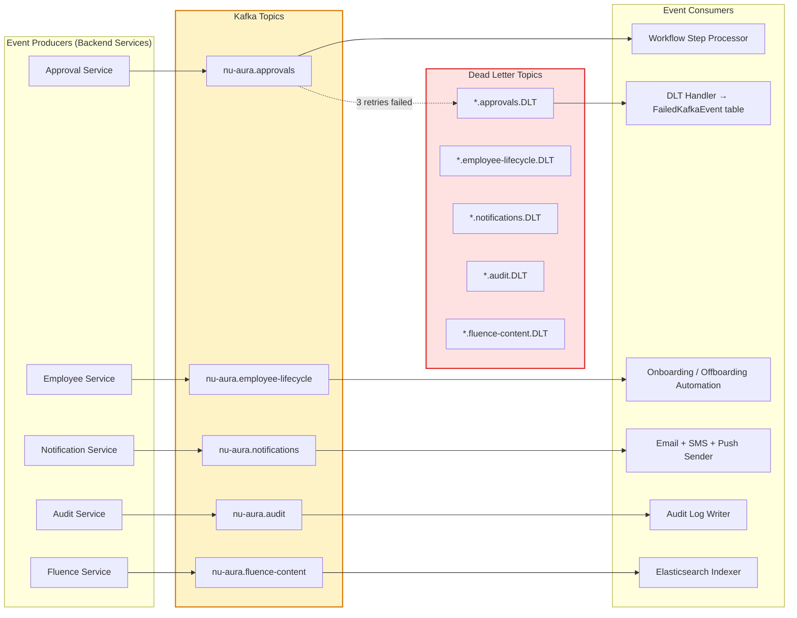
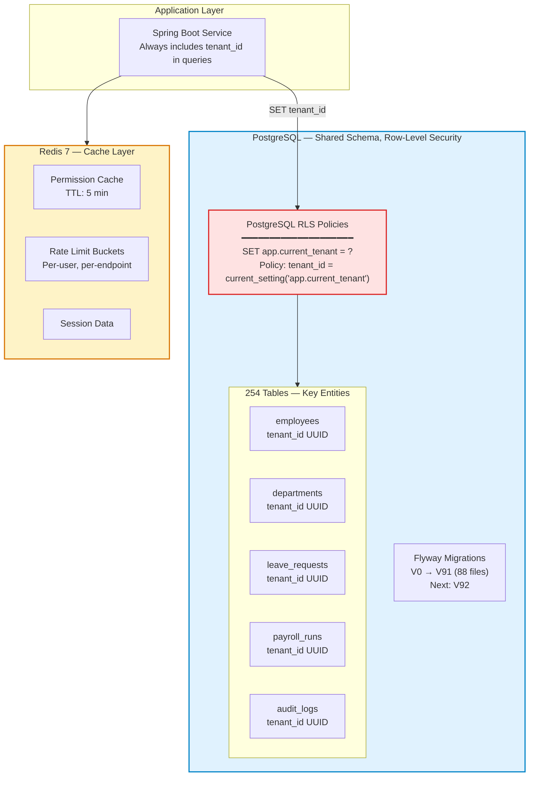
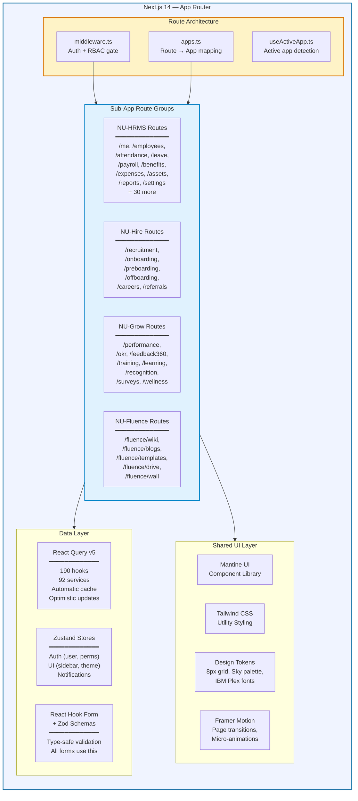
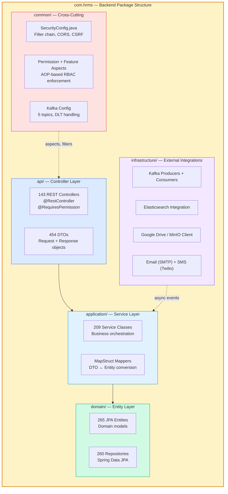
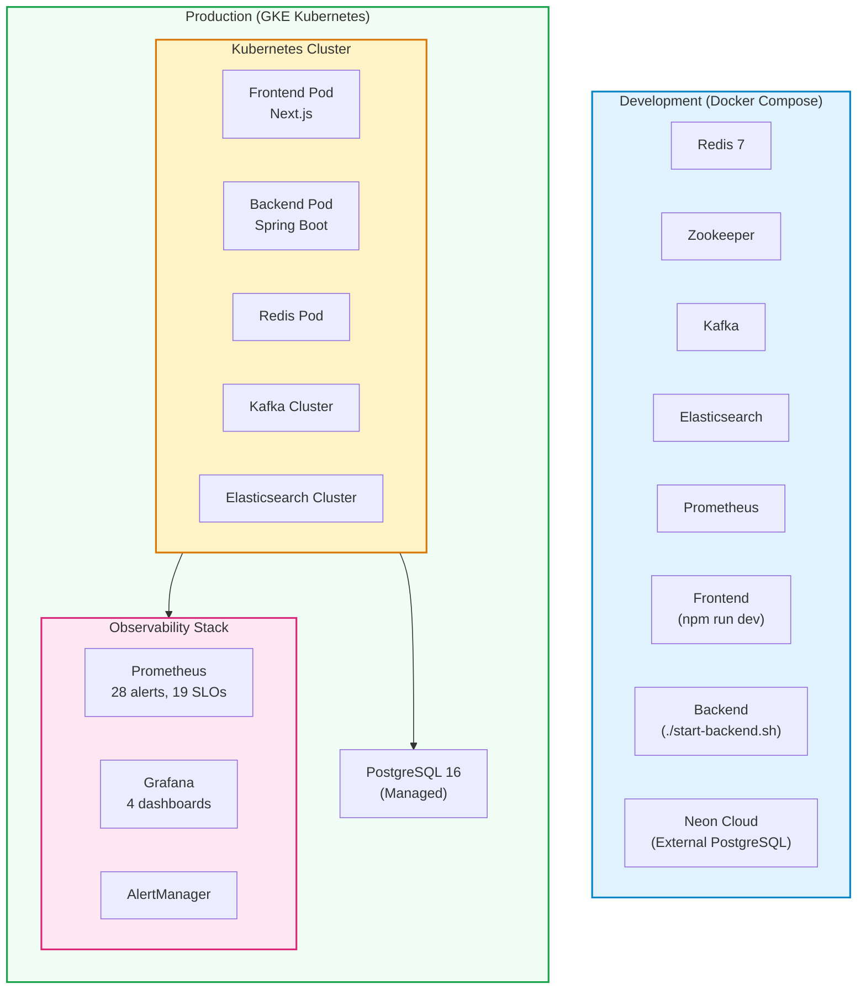

# NU-AURA Platform — Technical Architecture

> For developers, architects, and engineering teams.
> Shows HOW the platform is built, the data flow, and system boundaries.

---

## System Architecture — Full Stack Overview

---

## Authentication & Authorization Flow

---

## Data Flow — Kafka Event Architecture

---

## Database Architecture — Multi-Tenant Isolation

---

## Frontend Architecture — Module Structure

---

## Backend Architecture — Layered Package Structure

---

## Infrastructure — Docker + Kubernetes

---

## Quick Reference — Codebase Scale

| Metric | Count |
|---|---|
| Frontend page routes | 200+ |
| Frontend components | 123 |
| React Query hooks | 190 |
| Service files | 92 |
| Backend controllers | 143 |
| Backend services | 209 |
| JPA entities | 265 |
| Repositories | 260 |
| DTOs | 454 |
| Database tables | 254 |
| Flyway migrations | 88 (V0–V91) |
| Kafka topics | 5 + 5 DLT |
| Scheduled jobs | 25 |
| RBAC permissions | 500+ |
| K8s manifests | 10 |
| Prometheus alert rules | 28 |
| Grafana dashboards | 4 |

---

## Key File Locations for Developers

| What | Where |
|---|---|
| Route → App mapping | `frontend/lib/config/apps.ts` |
| Auth middleware | `frontend/middleware.ts` |
| API client (Axios) | `frontend/lib/api/client.ts` |
| Zustand auth store | `frontend/lib/stores/auth-store.ts` |
| Design tokens | `frontend/styles/design-tokens.css` |
| Security config | `backend/.../common/config/SecurityConfig.java` |
| Permission aspect | `backend/.../common/aspect/PermissionAspect.java` |
| Kafka config | `backend/.../common/config/KafkaConfig.java` |
| Flyway migrations | `backend/src/main/resources/db/migration/V*.sql` |
| Docker Compose | `docker-compose.yml` (repo root) |
| K8s manifests | `deployment/kubernetes/` |
| Monitoring | `deployment/monitoring/` |
