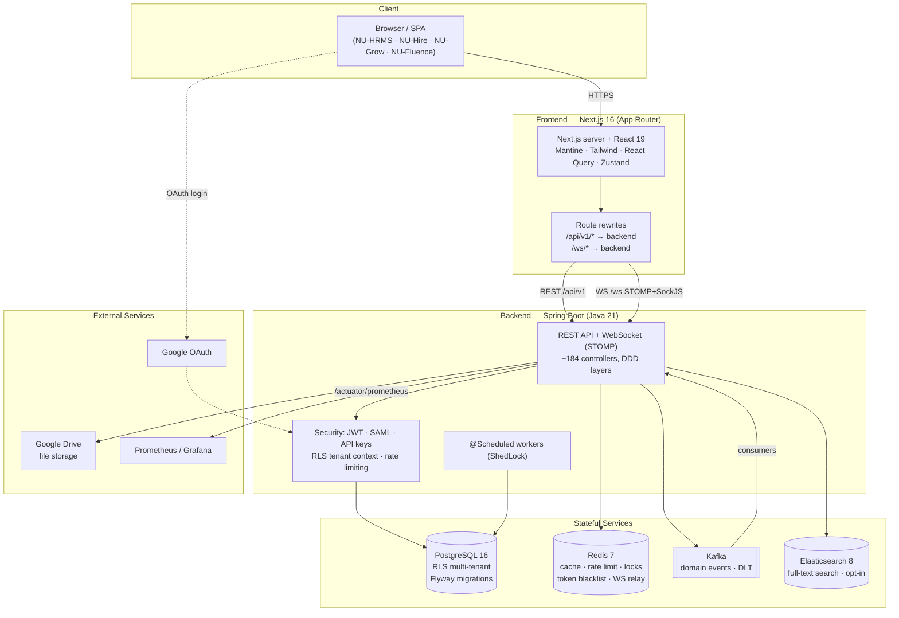
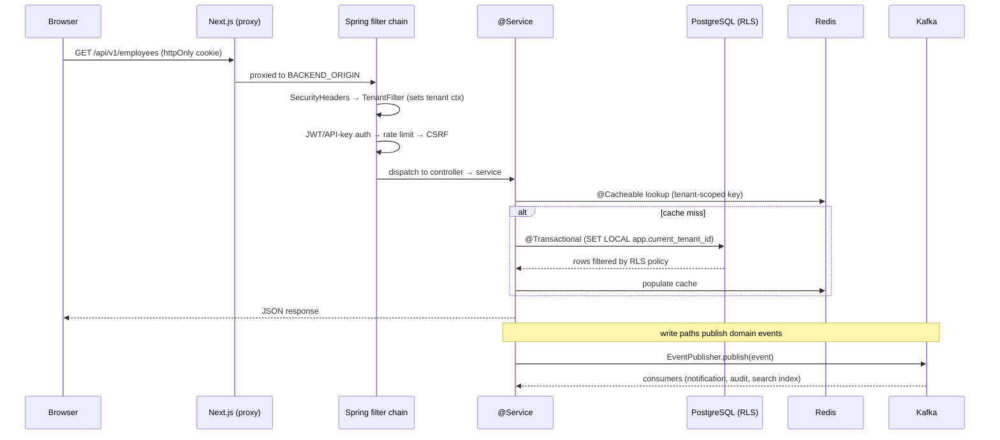

# NU-AURA — System Architecture Overview

> System-context view of the NU-AURA platform: what it is, the top-level
> components, the technology stack, and how the pieces connect. For deeper dives
> see the sibling docs in `docs/architecture/` and the doc index at
> `docs/README.md`.

---

## 1. What NU-AURA Is

NU-AURA is a **multi-tenant HR-management platform** delivered as a **bundle of
four sub-applications** behind a single shell. Tenants (companies) share one
PostgreSQL database and schema; isolation is enforced at the row level (see
§5 and `docs/architecture` RLS deep-dives).

| Sub-App         | Domain                          | Frontend route group |
|-----------------|---------------------------------|----------------------|
| **NU-HRMS**     | Core HR: employees, payroll, attendance, leave, performance, benefits, compliance | `frontend/app/{employees,payroll,attendance,leave,performance,...}` |
| **NU-Hire**     | Recruitment, agencies, scorecards, onboarding, career page, e-sign | `frontend/app/recruitment/*` |
| **NU-Grow**     | Reviews, OKRs, 360 feedback, LMS, training, surveys, wellness | served via core HRMS routes + performance/training modules |
| **NU-Fluence**  | Knowledge base, wiki, blogs, templates, search, AI chat, social wall | `frontend/app/fluence/*` |

A personal employee portal (`frontend/app/me/*`) cuts across all four.

The frontend is a single Next.js App Router application; the backend is a single
Spring Boot modular monolith organized by DDD bounded context. All sub-apps are
served by the same deployable units and share the same auth, tenancy, and
infrastructure layers.

---

## 2. System-Context Diagram



---

## 3. Top-Level Components

### Frontend — Next.js (App Router)
`frontend/` — Next.js 16, React 19, TypeScript (strict), Mantine UI + Tailwind,
React Query (TanStack v5) for server state, Zustand for client/auth state, Axios
HTTP client with httpOnly-cookie auth. API hooks are generated by **Orval** from
the backend OpenAPI spec into `frontend/lib/generated/api/`. The Next server
also acts as a reverse proxy: `next.config.js` rewrites `/api/v1/*` and `/ws/*`
to `BACKEND_ORIGIN`, so the browser sees a single origin (clean cookies, no CORS
in production). Provider stack and auth wiring live in `frontend/app/providers.tsx`.

### Backend — Spring Boot (modular monolith)
`backend/` — Java 21, Spring Boot (BOM **3.5.14**), packaged as a single
deployable. Code follows DDD layering under `com.nulogic`:

```
api/            @RestController + request/response DTOs + MapStruct mappers
application/    @Service orchestration, transactions, cache invalidation, schedulers
domain/         JPA entities (@Entity) organized by bounded context
infrastructure/ repositories, Kafka, websocket, search, tenant data-source plumbing
common/         cross-cutting config, security filters, exceptions, utilities
```

Exposes REST under `/api/v1/*` and WebSocket (STOMP over SockJS) under `/ws/*`.
Key config classes verified in `backend/.../common/config/`: `SecurityConfig`,
`TenantRlsTransactionManager`, `TenantAwareDataSourceConfig`, `CacheConfig`,
`RedisConfig`, `ElasticsearchConfig`, `GoogleDriveConfig`, `SamlSecurityConfig`.

### PostgreSQL — system of record
PostgreSQL 16 (Neon in dev, self-hosted PG 16 in prod). ~342 tables, all
tenant-aware tables carry `tenant_id UUID NOT NULL`. Schema is managed by
**Flyway** (`backend/src/main/resources/db/migration/`, V0 → V294+). Row-Level
Security policies provide defence-in-depth tenant isolation (see §5).

### Redis — caching & coordination
Redis 7 backs many cross-cutting concerns (`backend/.../common/config/CacheConfig.java`,
`RedisConfig.java` and infrastructure services):

| Concern              | Mechanism |
|----------------------|-----------|
| Caching              | 20+ named caches, tenant-scoped keys, tiered TTLs (5min–24h) |
| Distributed rate limiting | `DistributedRateLimiter` (Redis Lua + Bucket4j fallback) |
| Token blacklist      | `TokenBlacklistService` (logout/password-change revocation) |
| Distributed locks    | edit locks, account lockout, idempotency (SETNX) |
| WebSocket relay      | `RedisWebSocketRelay` Pub/Sub for multi-pod fan-out |

### Kafka — domain events
Confluent Kafka for asynchronous domain events (approval, notification, audit,
employee-lifecycle, Fluence content, payroll). Producers via `EventPublisher`;
consumers under `infrastructure/kafka/`; dead-letter handling and `IdempotencyService`
for exactly-once processing; tenant context propagated onto records.

### Elasticsearch — full-text search (opt-in)
Elasticsearch 8 powers full-text search (Fluence knowledge base, employees,
documents). Activated via `app.elasticsearch.enabled=true`
(`ElasticsearchConfig.java`); the platform degrades gracefully when disabled.

### Google Drive — file storage
File/document storage (contracts, receipts, employee documents) goes to Google
Drive via a service-account integration (`GoogleDriveConfig.java`) behind a
`StorageProvider` abstraction, with a mock provider fallback for local dev.

---

## 4. How the Pieces Connect — Request Flow



**Key connection facts (evidence-grounded):**

- **Single origin** — the browser only talks to the Next.js server; it proxies
  REST and WebSocket to the backend (`frontend/next.config.js` rewrites for
  `/api/v1/:path*` and `/ws/:path*`).
- **Cookie-based auth** — JWT lives in an httpOnly cookie; no tokens in
  localStorage. CSRF uses a double-submit cookie pattern.
- **Tenant context** — set per-request by `TenantFilter`, pushed into the DB
  session by `TenantRlsTransactionManager` / `TenantAwareDataSourceConfig` so
  RLS policies evaluate `current_setting('app.current_tenant_id')`.
- **Cache-aside** — reads hit Redis first via `@Cacheable`; writes evict.
- **Event-driven side effects** — writes publish to Kafka; consumers handle
  notifications, audit, and search indexing asynchronously.
- **Generated API contract** — frontend hooks are generated from the backend's
  SpringDoc OpenAPI spec (Orval), keeping client/server types in sync.

---

## 5. Multi-Tenancy & Security (summary)

- **Model:** shared-database / shared-schema; every tenant-aware table has
  `tenant_id UUID NOT NULL`.
- **Layer 1 (application):** `TenantContext` ThreadLocal + `TenantFilter`
  validating the tenant on each request; JPA queries scoped by tenant.
- **Layer 2 (database):** PostgreSQL RLS policies, hardened to **fail-closed**
  (V177 strict policies, V254 NOBYPASSRLS runtime role + `RlsStartupProbe`
  canary). Flyway runs under a separate BYPASSRLS migration role.
- **AuthN:** JWT (httpOnly cookie) + optional SAML 2.0 SSO + API keys for
  integrations. **AuthZ:** DB-backed role/permission model, cached in Redis.
- **Hardening:** BCrypt cost 12, password policy + lockout, OWASP security
  headers at both the Next.js edge and Spring Security, per-scope rate limiting.

See `docs/architecture/data-flow.md` (tenancy/RLS flow) and the RLS migrations for full detail.

---

## 6. Technology Stack

| Layer          | Technology | Version / Notes |
|----------------|-----------|-----------------|
| Frontend FW    | Next.js (App Router) | 16 (`frontend/package.json`) |
| UI runtime     | React | 19 |
| Language (FE)  | TypeScript | strict mode |
| UI libs        | Mantine UI 9, Tailwind CSS, Radix UI, Framer Motion 12 | |
| Server state   | TanStack React Query | v5 |
| Client state   | Zustand | auth + UI stores |
| HTTP / codegen | Axios, Orval (OpenAPI → React Query hooks) | |
| Realtime (FE)  | STOMP + SockJS (`@stomp/stompjs`) | |
| Rich content   | Tiptap, ExcelJS, DOMPurify | |
| Backend FW     | Spring Boot | BOM **3.5.14** (`backend/pom.xml`) |
| Language (BE)  | Java | 21 |
| Persistence    | Spring Data JPA / Hibernate 6 | `@SQLRestriction` soft-delete |
| Migrations     | Flyway | V0 → V294+ |
| Database       | PostgreSQL | 16 (Neon dev / PG16 prod), RLS |
| Cache / coord. | Redis | 7 + Bucket4j 8.x, ShedLock 7.7.0 |
| Messaging      | Kafka (Confluent) | domain events, DLT |
| Search         | Elasticsearch | 8 (opt-in) |
| File storage   | Google Drive | service account, v3 API |
| AuthN          | JJWT 0.13.0, Spring Security SAML2, API keys | |
| Mapping        | MapStruct | 1.6.3 |
| Docs / OpenAPI | SpringDoc OpenAPI | |
| Observability  | Micrometer + Prometheus + Grafana, OTLP tracing | |
| Deployment     | Docker Compose (dev), Kubernetes on GCP GKE (prod) | GitHub Actions CI/CD |

---

## 7. Deployment Topology (brief)

- **Local dev:** Frontend `:3000`, Backend `:8080`; Redis/Kafka/Elasticsearch/
  Prometheus/Grafana via `docker-compose.yml`. Database is Neon cloud (dev) or
  local PG 16.
- **Production:** Kubernetes (GCP GKE) — frontend and backend deployments behind
  an ingress that routes `/api/*` and `/ws/*` to the backend and everything else
  to the frontend. Scheduled jobs run on dedicated worker pods
  (`APP_SCHEDULING_ENABLED=true`) and are guarded by ShedLock for multi-pod
  safety. Images are signed (Cosign) in CI before staging/production deploys.

For local setup and build/test detail see `docs/setup/README.md` and the
Kubernetes manifests under `infra/deployment/kubernetes/`.

---

## Related

- [[docs/Home|Home MoC]] — vault entry point
- [[docs/architecture/backend|Backend Architecture]] — DDD layers, modules, Redis, Kafka, security
- [[docs/architecture/frontend|Frontend Architecture]] — App Router, RBAC, state, Orval codegen
- [[docs/architecture/data-flow|Data Flow & Request Lifecycle]] — end-to-end request path and RLS
- [[docs/reference/api|API Reference]] — endpoint catalog
- [[docs/reference/database|Database Reference]] — schema and RLS model
- [[docs/setup/README|Local Dev Setup]] — running the stack locally
