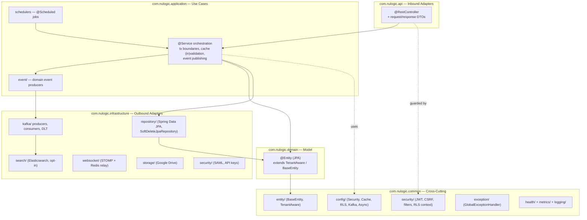
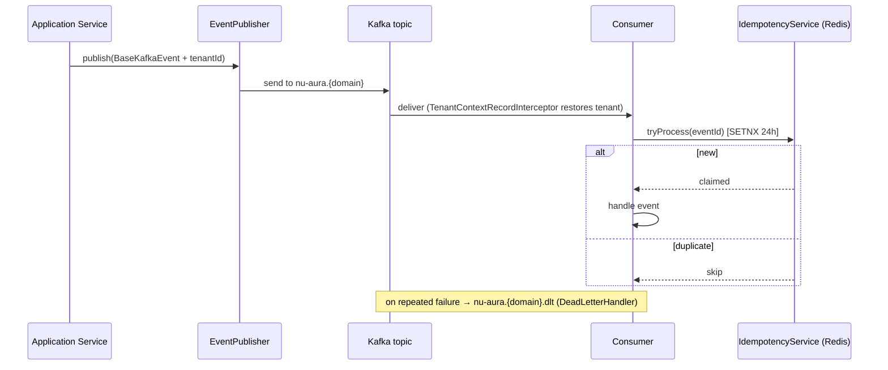
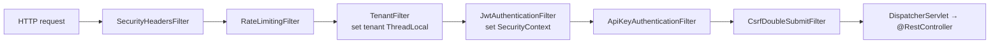

# NU-AURA Backend Architecture

Spring Boot 3.x application on Java 21, package root `com.nulogic`, organized around
Domain-Driven Design (DDD) layering. The backend serves all four sub-apps (NU-HRMS,
NU-Hire, NU-Grow, NU-Fluence) from a single deployable, with hard multi-tenant
isolation enforced at both the application and PostgreSQL layers.

**Verified scale (counts from source, 2026-06-16):**

| Metric | Count | Evidence |
|--------|-------|----------|
| `@RestController` classes | 179 | `grep -rl @RestController src/main/java/com/nulogic/api` |
| `@Service` (application layer) | 225 | `grep -rl @Service src/main/java/com/nulogic/application` |
| `@Entity` classes | 304 | `grep -rl @Entity src/main/java/com/nulogic/domain` |
| `@Scheduled` job sites | 17 | `grep -rl @Scheduled src/main/java` |
| Bounded-context packages | ~67 per layer | `src/main/java/com/nulogic/{api,application,domain,infrastructure}/*` |

---

## 1. DDD Layering

The codebase splits into five top-level packages. Each bounded context (e.g.
`employee`, `payroll`, `recruitment`) appears as a sub-package within `api`,
`application`, `domain`, and `infrastructure`, keeping vertical slices cohesive.

### Layer responsibilities

| Layer | Package | Responsibility | Depends on |
|-------|---------|----------------|------------|
| API | `com.nulogic.api.<ctx>` | `@RestController` request/response mapping, validation, OpenAPI annotations, DTOs | application |
| Application | `com.nulogic.application.<ctx>` | Use-case orchestration, `@Transactional` boundaries, cache put/evict, event publishing, schedulers | domain, infrastructure |
| Domain | `com.nulogic.domain.<ctx>` | JPA `@Entity` model; extends `TenantAware`/`BaseEntity` (`common/entity/`) | common/entity |
| Infrastructure | `com.nulogic.infrastructure.<ctx>` | Spring Data repositories, Kafka, Elasticsearch, WebSocket, Google Drive, SAML/API-key adapters | domain |
| Common | `com.nulogic.common.*` | Config, security filters, base entities, exception handling, metrics, health, export | — |

**Base entities** (`com.nulogic.common.entity/`): `BaseEntity` (UUID id + audit
columns + optimistic `version`), `TenantAware` (adds immutable `tenantId`), and
`TenantEntityListener`. Repositories extend `SoftDeleteJpaRepository`
(`com.nulogic.infrastructure.persistence/SoftDeleteJpaRepository.java`).

**API conventions** (`com.nulogic.common.api/`): `ApiResponses`, `ApiVersion` +
`ApiVersionInterceptor` for versioning. Errors flow through
`com.nulogic.common.exception/GlobalExceptionHandler.java` (`@RestControllerAdvice`)
returning `ErrorResponse`, with typed domain exceptions (`BusinessException`,
`ResourceNotFoundException`, `UnauthorizedException`, `FeatureDisabledException`).

---

## 2. Bounded-Context / Module Catalog

Contexts span all four sub-apps. Each row exists as a vertical slice across the
four layers (`api`/`application`/`domain`/`infrastructure`).

| Domain area | Contexts (packages) | Sub-app |
|-------------|---------------------|---------|
| Core HR | `employee`, `organization`, `user`, `tenant`, `customfield`, `selfservice` | NU-HRMS |
| Time & attendance | `attendance`, `timetracking`, `shift`, `overtime` | NU-HRMS |
| Leave | `leave` | NU-HRMS |
| Payroll & comp | `payroll`, `compensation`, `loan`, `payment`, `tax`, `statutory`, `budget` | NU-HRMS |
| Benefits & wellness | `benefits`, `wellness` | NU-HRMS / NU-Grow |
| Assets & expense | `asset`, `expense`, `travel` | NU-HRMS |
| Recruitment & onboarding | `recruitment`, `preboarding`, `onboarding`, `probation`, `referral`, `bgv` (domain), `exit` | NU-Hire |
| Performance & learning | `performance`, `lms`, `training`, `survey`, `recognition`, `engagement` | NU-Grow |
| Knowledge & content | `knowledge`, `wall` | NU-Fluence |
| Contracts & e-sign | `contract`, `esignature`, `letter` | NU-HRMS / NU-Hire |
| Governance | `compliance`, `audit`, `workflow` | platform-wide |
| Analytics | `analytics`, `dashboard`, `report`, `home` | platform-wide |
| Communication | `notification`, `announcement`, `meeting`, `calendar`, `helpdesk` | platform-wide |
| Platform & admin | `admin`, `platform`, `featureflag`, `integration`, `webhook`, `monitoring`, `migration`, `dataimport` | platform-wide |
| Project / PSA | `project`, `psa`, `resourcemanagement` | NU-HRMS |
| AI | `ai` (application/domain/infrastructure) | NU-Fluence / NU-Hire |
| Channels | `mobile` (api/application), `publicapi`, `document`, `export` | platform-wide |

> Full package listing verified via `find src/main/java/com/nulogic/{api,application,domain,infrastructure} -maxdepth 1 -type d`.

---

## 3. Key Infrastructure Services

### 3.1 Redis caching — `common/config/CacheConfig.java`

`@EnableCaching` `CachingConfigurer` backing onto Redis. The cache manager is
`@ConditionalOnBean(RedisConnectionFactory.class)`, so absence of Redis degrades
gracefully rather than failing startup.

- **Tenant-scoped keys**: `keyGenerator()` prefixes every key with
  `tenant:{tenantId}:{ClassName}:{method}:{params}` (falls back to `global` when no
  tenant is bound), preventing cross-tenant cache collisions.
- **Tiered TTLs** (25 named caches; representative set below):

  | TTL | Caches |
  |-----|--------|
  | 24h | `leaveTypes`, `designations`, `shiftPolicies`, `holidays`, `permissions`, `roles`, `upcomingBirthdays`, `upcomingAnniversaries` |
  | 4h | `departments`, `officeLocations`, `benefitPlans`, `tenantSettings`, `tenantAttendanceConfig`, `featureFlags` |
  | 15m | `employeeBasic`, `employees`, `rolePermissions` |
  | 10m | `employeeWithDetails` |
  | 5m | `leaveBalances`, `analyticsSummary`, `dashboardMetrics` |
  | 30s | `tenantStatus` (per-request JWT-filter check), `unreadCountByUser` (bell-icon poll) |
  | 1h / 30m | `webhooks` (1h), `activeWebhooks` (30m) |

- **Serialization**: `StringRedisSerializer` keys, `GenericJackson2JsonRedisSerializer` values, null values disabled.
- **Graceful degradation**: `errorHandler()` returns a `CacheErrorHandler` that logs and bypasses cache (GET/PUT/EVICT/CLEAR) so a Redis outage falls through to the database instead of throwing 500s.
- **Warm-up**: `common/config/CacheWarmUpService.java` pre-loads long-lived caches per tenant; `TenantCacheManager` and `CacheMetricsConfig` provide tenant-aware management and Micrometer hit/miss metrics.

### 3.2 Kafka — `infrastructure/kafka/`

Topics are centralized in `infrastructure/kafka/KafkaTopics.java` under the
`nu-aura.{domain}` convention, each with an auto-suffixed `.dlt` dead-letter topic.

| Topic | Event (`kafka/events/`) | Consumer (`kafka/consumer/`) | Group |
|-------|-------------------------|------------------------------|-------|
| `nu-aura.approvals` | `ApprovalEvent` | `ApprovalEventConsumer` | `nu-aura-approvals-service` |
| `nu-aura.notifications` | `NotificationEvent` | `NotificationEventConsumer` | `nu-aura-notifications-service` |
| `nu-aura.audit` | `AuditEvent` | `AuditEventConsumer` | `nu-aura-audit-service` |
| `nu-aura.employee-lifecycle` | `EmployeeLifecycleEvent` | `EmployeeLifecycleConsumer` | `nu-aura-employee-lifecycle-service` |
| `nu-aura.fluence-content` | `FluenceContentEvent` | `FluenceSearchConsumer` | `nu-aura-fluence-search-service` |
| `nu-aura.payroll-processing` | `PayrollProcessingEvent` | `PayrollProcessingConsumer` | `nu-aura-payroll-processing-service` |

- **Producer**: single `producer/EventPublisher.java`; all events extend `events/BaseKafkaEvent.java`.
- **DLT**: `consumer/DeadLetterHandler.java` (group `nu-aura-dlt-handler`).
- **Idempotency**: `kafka/IdempotencyService.java` dedupes via Redis SETNX (24h TTL); `kafka/FailedKafkaEvent.java` + `kafka/repository/` persist failures.
- **Tenant propagation**: `kafka/TenantContextKafkaAspect.java` and `kafka/TenantContextRecordInterceptor.java` carry tenant context across the produce/consume boundary so consumers run with the correct RLS scope.

### 3.3 Elasticsearch — `common/config/ElasticsearchConfig.java`

Opt-in full-text search for NU-Fluence, guarded by
`@ConditionalOnProperty("app.elasticsearch.enabled" = true)` (off by default for
backward compatibility). Connects to `spring.elasticsearch.uris`
(default `http://localhost:9200`) with 5s connect / 60s socket timeouts. Repositories
under `infrastructure/search/repository/` (`FluenceDocumentRepository`), document
model `search/document/FluenceDocument.java`, with `FluenceIndexingService` and
`FluenceSearchService`. Indexing is driven asynchronously by the
`FluenceSearchConsumer` off the `nu-aura.fluence-content` topic.

### 3.4 Security & JWT — `common/config/SecurityConfig.java`, `common/security/`

Stateless filter-chain security (`@EnableWebSecurity`, `@EnableMethodSecurity`).
Custom filters are registered into the Spring Security chain only; each has a
`FilterRegistrationBean(...).setEnabled(false)` to suppress Tomcat auto-registration
(avoids CGLIB proxy breakage from `@EnableAsync`).

- **JWT**: `security/JwtAuthenticationFilter.java` + `JwtTokenProvider.java`; secret strength enforced at startup by `JwtSecretValidator.java`. Token carries roles only — permissions are loaded from DB/Redis.
- **CSRF**: Spring's built-in CSRF is disabled in favor of `security/CsrfDoubleSubmitFilter.java` (non-httpOnly `XSRF-TOKEN` cookie + `X-XSRF-TOKEN` header; skips auth/public/webhook endpoints) — see the BUG-013 note in `SecurityConfig`.
- **Passwords**: `BCryptPasswordEncoder(12)` (M-8); cost is read from each stored hash so older cost-10 hashes still verify. Policy in `common/config/PasswordPolicyConfig.java` + `security/AccountLockoutService.java`.
- **Authorization**: `@RequiresPermission` / `PermissionAspect`, `CustomPermissionEvaluator`, `RoleHierarchy`, field-level `FieldPermission`, plus `@RequiresFeature`/`FeatureFlagAspect` and `@RequiresWebhookScope`/`WebhookScopeAspect`.
- **Alternative auth**: `security/ApiKeyAuthenticationFilter.java` (+ `ApiKeyService`, encrypted via `CryptoConverter`/`EncryptionService`); SAML 2.0 SSO via `SamlSecurityConfig`, `DynamicSamlRelyingPartyRegistrationRepository`, `SamlAuthenticationSuccessHandler`.
- **Hardening filters**: `RateLimitingFilter` (Bucket4j + `DistributedRateLimiter`), `SecurityHeadersFilter`, `XssRequestWrapperFilter`. Token revocation via `TokenBlacklistService` (Redis + in-memory fallback).
- **CORS**: origins from `app.cors.allowed-origins` (defaults to localhost 3000/3001/8080).

**Request filter order** (verified from `SecurityConfig` constructor + injected filters):

### 3.5 Multi-tenant RLS — `common/config/TenantRlsTransactionManager.java`

Two-layer isolation. **Layer 1 (application):** `security/TenantFilter.java` extracts
the tenant and binds it to `security/TenantContext.java` (ThreadLocal); repository
queries and the cache key generator are tenant-scoped. **Layer 2 (PostgreSQL RLS,
defence-in-depth):** `TenantRlsTransactionManager` (a `JpaTransactionManager`
registered as primary in `JpaConfig`) issues `SET LOCAL app.current_tenant_id = '<uuid>'`
after each transaction begins; `SET LOCAL` auto-resets on commit/rollback so no value
leaks across pooled connections. When no tenant is bound, the setting is explicitly
reset. `TenantAwareDataSourceConfig` covers non-JPA paths, `TenantRlsSessionSync` keeps
the GUC in sync, and `security/RlsStartupProbe.java` boots a canary that fails startup
if RLS regresses. Read-replica routing is handled by `RoutingDataSourceConfig` /
`ReplicaAwareTransactionManager` when a replica URL is configured.

### 3.6 Scheduled jobs — `common/config/SchedulingConfig.java` + `ShedLockConfig.java`

17 `@Scheduled` sites, made K8s-multi-pod-safe by ShedLock (JDBC provider,
`ShedLockConfig`). Scheduling is gated by `app.scheduling.enabled` so worker pods run
jobs while API pods do not. Verified job-bearing classes:

| Class | Domain |
|-------|--------|
| `AutoRegularizationScheduler` | attendance regularization |
| `LeaveAccrualScheduler` | leave accrual |
| `ContractLifecycleScheduler` | contract reminders / expiry |
| `ScheduledNotificationService`, `EmailSchedulerService` | birthdays, anniversaries, email digests |
| `ScheduledReportExecutionJob` | analytics report execution |
| `WebhookDeliveryService` | webhook retry delivery |
| `WorkflowEscalationScheduler`, `ApprovalEscalationJob` | workflow / approval escalation |
| `BiometricIntegrationService`, `JobBoardIntegrationService` | external polling integrations |
| `OrphanFileCleanupScheduler` | storage cleanup |
| `TokenBlacklistService`, `RateLimitingFilter`, `TenantFilter` | security/cache maintenance |

### 3.7 Other cross-cutting config (`common/config/`)

- **Async**: `AsyncConfig` (`@EnableAsync`) + `TenantAwareTaskDecorator` and `ContextPropagationConfig` propagate tenant + tracing context across async boundaries.
- **WebSocket**: `infrastructure/websocket/` — STOMP (`WebSocketConfig`) with `RedisWebSocketRelay`/`RedisWebSocketSubscriber` for multi-pod pub/sub fan-out.
- **Storage**: `GoogleDriveConfig` + `StorageProviderConfig` (`infrastructure/storage/`) for file storage with a pluggable provider abstraction.
- **Observability**: `MetricsConfig`/`CacheMetricsConfig` (Micrometer/Prometheus); health indicators in `common/health/` (`ApplicationHealthIndicator`, `DatabaseHealthIndicator`, `RedisHealthIndicator`, `WebhookHealthIndicator`).
- **Docs**: `OpenApiConfig` (SpringDoc); `ProductionReadinessValidator` asserts prod prerequisites at boot.

---

## 4. Key File Reference

| Concern | File |
|---------|------|
| Redis cache | `backend/src/main/java/com/nulogic/common/config/CacheConfig.java` |
| Security chain | `backend/src/main/java/com/nulogic/common/config/SecurityConfig.java` |
| RLS tx manager | `backend/src/main/java/com/nulogic/common/config/TenantRlsTransactionManager.java` |
| Tenant context | `backend/src/main/java/com/nulogic/common/security/TenantContext.java`, `TenantFilter.java` |
| RLS startup probe | `backend/src/main/java/com/nulogic/common/security/RlsStartupProbe.java` |
| Kafka topics | `backend/src/main/java/com/nulogic/infrastructure/kafka/KafkaTopics.java` |
| Kafka idempotency | `backend/src/main/java/com/nulogic/infrastructure/kafka/IdempotencyService.java` |
| Elasticsearch | `backend/src/main/java/com/nulogic/common/config/ElasticsearchConfig.java` |
| ShedLock | `backend/src/main/java/com/nulogic/common/config/ShedLockConfig.java` |
| Base entities | `backend/src/main/java/com/nulogic/common/entity/{BaseEntity,TenantAware}.java` |
| Global errors | `backend/src/main/java/com/nulogic/common/exception/GlobalExceptionHandler.java` |
