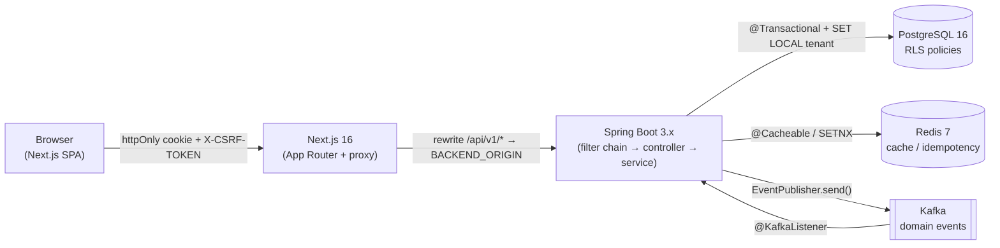
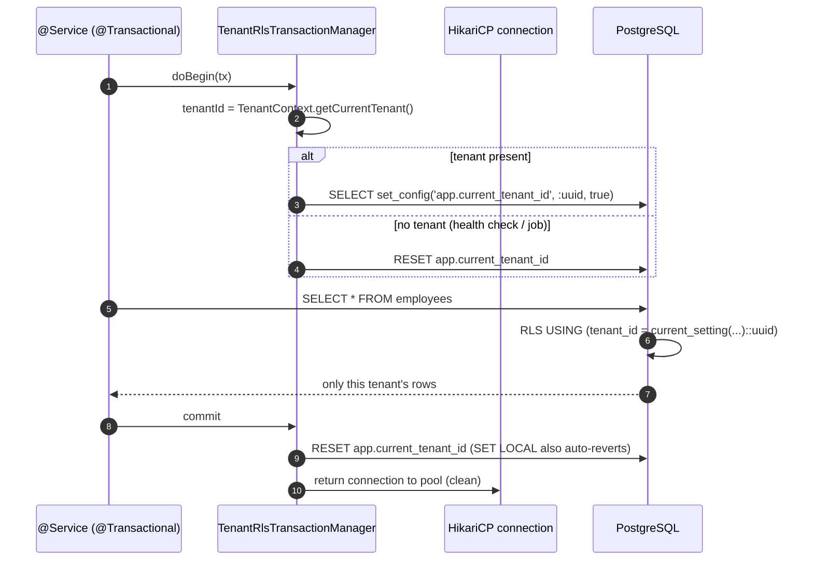
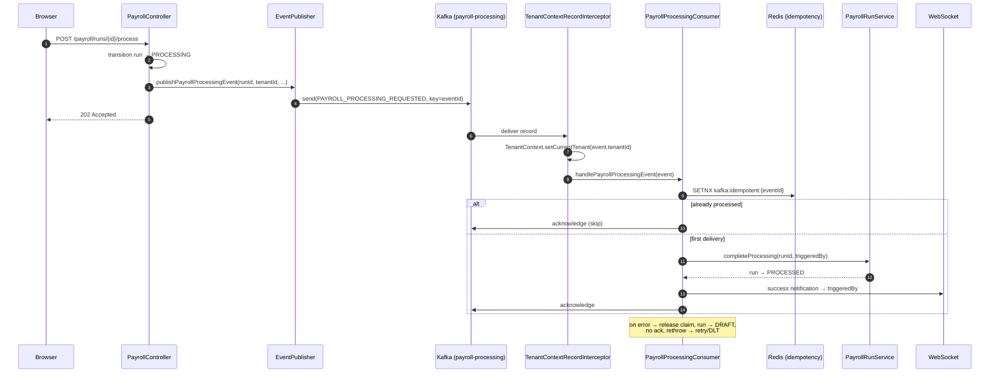

# NU-AURA — Data Flow & Request Lifecycle

This document traces how data moves through NU-AURA for the flows that matter most
to correctness and security: the authenticated API request path, the JWT-cookie
authentication flow, multi-tenant isolation via PostgreSQL Row Level Security
(RLS), and an asynchronous Kafka event flow.

Every claim below is grounded in source files cited inline. All paths are relative
to the repo root `/Users/fayaz.m/IdeaProjects/nulogic/nu-aura`.

---

## 1. High-Level Topology



Frontend never holds the JWT itself: tokens live only in httpOnly cookies. The
Next.js layer is a thin proxy — it rewrites `/api/v1/*` and `/ws/*` to the
backend origin (`frontend/next.config.js`, `rewrites()` at lines 158–170).

---

## 2. Authenticated API Request Path

### 2.1 Browser → Next.js

The Axios singleton (`frontend/lib/api/client.ts`) sends every request with
`withCredentials: true` (line 69) so the httpOnly auth cookie rides along. A
request interceptor injects the `X-Tenant-ID` header from localStorage when
present (lines 75–80). The browser hits the Next.js origin; `next.config.js`
rewrites `/api/v1/:path*` to `${backendOrigin}/api/v1/:path*` (lines 165–167).

### 2.2 Spring Boot filter chain

`SecurityConfig` (`backend/.../common/config/SecurityConfig.java`, lines 263–270)
registers the custom filters in this order, all before
`UsernamePasswordAuthenticationFilter`:

| Order | Filter | Responsibility |
|-------|--------|----------------|
| 1 | `RateLimitingFilter` | Token-bucket throttling (per IP/user/tenant) |
| 2 | `TenantFilter` | Validate/parse `X-Tenant-ID` (only honoured for unauthenticated public endpoints) |
| 3 | `ApiKeyAuthenticationFilter` | Service-to-service API-key auth |
| 4 | `JwtAuthenticationFilter` | Validate JWT cookie, hydrate authorities, set tenant context |
| 5 (after) | `CsrfDoubleSubmitFilter` | Double-submit CSRF check for state-changing requests |

`TenantFilter` deliberately ignores `X-Tenant-ID` once an access-token cookie is
present — the JWT claim is authoritative and the header is logged-and-dropped to
prevent tenant spoofing (`TenantFilter.java`, lines 107–126).

### 2.3 Full request sequence

```mermaid
sequenceDiagram
    autonumber
    participant B as Browser (Axios)
    participant N as Next.js proxy
    participant RL as RateLimitingFilter
    participant TF as TenantFilter
    participant JF as JwtAuthenticationFilter
    participant CF as CsrfDoubleSubmitFilter
    participant C as @RestController
    participant S as @Service (@Transactional)
    participant TM as TenantRlsTransactionManager
    participant PG as PostgreSQL (RLS)

    B->>N: GET /api/v1/employees (cookie + X-CSRF-TOKEN)
    N->>RL: rewrite → backend /api/v1/employees
    RL->>TF: within rate budget
    TF->>JF: cookie present → header ignored, JWT authoritative
    JF->>JF: validateToken(jwt); getTenantIdFromToken(jwt)
    JF->>JF: tenant ACTIVE? (TenantStatusCache, 30s Redis)
    JF->>JF: TenantContext.setCurrentTenant(tenantId)
    JF->>JF: hydrate authorities (JWT claims or DB-cached perms)
    JF->>CF: SecurityContext populated
    CF->>C: CSRF ok (or skipped for safe method)
    C->>S: call service method
    S->>TM: @Transactional begin
    TM->>PG: SELECT set_config('app.current_tenant_id', :uuid, true)
    S->>PG: SELECT ... FROM employees
    PG-->>S: rows filtered by RLS policy
    S-->>C: result
    TM->>PG: commit → RESET app.current_tenant_id
    C-->>B: 200 JSON (via Next.js)
    Note over JF: finally → SecurityContext.clear() + TenantContext.clear()
```

After the chain completes, `JwtAuthenticationFilter` clears both
`SecurityContext` and `TenantContext` in a `finally` block (lines 270–276),
guaranteeing no ThreadLocal leakage onto a reused request thread.

---

## 3. JWT-Cookie Authentication Flow

### 3.1 Login and cookie issuance

`AuthController` (`backend/.../api/auth/controller/AuthController.java`) exposes
`POST /login` (lines 105–122). On success it sets secure httpOnly cookies and
**strips the tokens from the response body** so they live only in the cookie jar
(lines 112–116). `POST /google`, `POST /mfa-login`, and `POST /refresh` follow
the same set-cookie-then-clear-body pattern.

Cookie hardening is centralized in `CookieConfig`
(`backend/.../common/config/CookieConfig.java`):

- `HttpOnly` — blocks JavaScript access (XSS defense; line 13).
- `Secure` + `SameSite` — `SameSite=Lax` on auth tokens (lines 16–20).
- `__Host-` name prefix variant: `__Host-hrms-access` / `__Host-hrms-refresh`
  (lines 85–90), which the browser only accepts with `Secure`, `Path=/`, and no
  `Domain` — preventing a sibling subdomain from planting the cookie.
- Legacy names `access_token` / `refresh_token` (lines 66–71) are accepted during
  the `__Host-` rollover window; the hardened name wins when both are present.

### 3.2 Token extraction and validation

`JwtAuthenticationFilter.getJwtFromRequest` reads the cookie first, scanning for
the hardened `__Host-hrms-access` name (which wins) then the legacy
`access_token` (lines 333–354). The `Authorization: Bearer` header fallback is
**off by default in prod** and gated behind `app.security.allow-bearer-header`
(lines 54–55, 311–318).

On a validated token the filter:
1. Reads `username` and `tenantId` from JWT claims (lines 85–86).
2. Rejects the request with `403` if the tenant is not `ACTIVE`, using the 30-second
   `TenantStatusCache` to avoid a PG round-trip on the hot path (lines 94–110).
3. Hydrates authorities — preferring roles/permissions embedded in the JWT, else
   loading DB-cached permissions by role (BUG-012: permissions were moved out of
   the JWT to keep the cookie under 4096 bytes; lines 131–172).
4. Populates `SecurityContext` (user, employee, roles, permission scopes, org
   context) and re-asserts `TenantContext` (lines 244–264).

### 3.3 Silent refresh on 401

The Axios response interceptor catches `401`, and a shared `refreshPromise` mutex
(P0-SESSION-FIX) serializes concurrent refreshes through `POST /auth/refresh`
(`frontend/lib/api/client.ts`, lines 116–128). On the backend, `/refresh`
mints new tokens **before** revoking the old refresh token (rotation;
`AuthController.java`, lines 229–233).

```mermaid
sequenceDiagram
    autonumber
    participant B as Browser (Axios)
    participant AC as AuthController
    participant AS as AuthService
    participant TP as JwtTokenProvider

    B->>AC: POST /login {credentials}
    AC->>AS: authService.login(request)
    AS-->>AC: AuthResponse (access + refresh tokens)
    AC-->>B: Set-Cookie: __Host-hrms-access (HttpOnly); body cleared

    Note over B,AC: ...later, access token expires...
    B->>AC: GET /api/v1/... → 401
    B->>AC: POST /auth/refresh (refresh cookie, mutex-guarded)
    AC->>AS: authService.refresh(refreshToken)
    AS-->>AC: new token pair
    AC->>TP: tokenProvider.revokeToken(old refresh)
    AC-->>B: Set-Cookie: rotated tokens
    B->>AC: retry original request → 200
```

---

## 4. Multi-Tenant Isolation via RLS

NU-AURA is shared-database / shared-schema: every tenant-aware table carries
`tenant_id UUID NOT NULL`. Isolation is enforced in two layers — application
ThreadLocal context plus PostgreSQL RLS as defense-in-depth.

### 4.1 Where the tenant variable is set

The PostgreSQL session variable `app.current_tenant_id` is what RLS policies read
(`current_setting('app.current_tenant_id', true)::uuid`). It is set on two paths:

- **JPA transactions** — `TenantRlsTransactionManager`
  (`backend/.../common/config/TenantRlsTransactionManager.java`) overrides
  `doBegin()` to run `SELECT set_config('app.current_tenant_id', ?, true)` after
  the transaction starts (lines 76, 79–91). The third arg `true` makes it
  **transaction-local** (`SET LOCAL`), so it auto-reverts on commit/rollback. If
  no tenant is in context it explicitly RESETs to prevent stale inheritance
  (lines 84–88). `doCleanupAfterCompletion` RESETs again for defense-in-depth
  before the connection returns to the pool (lines 105–109).

- **Non-JPA / autocommit paths** — `TenantAwareDataSourceConfig`
  (`backend/.../common/config/TenantAwareDataSourceConfig.java`) is a
  `BeanPostProcessor` that wraps the HikariCP `DataSource` (lines 84–93). On every
  `getConnection()` it RESETs, then sets `app.current_tenant_id` session-scoped
  (`set_config(..., false)`) when a tenant is present (lines 145–154). The
  returned connection is proxied so `close()` RESETs the variable before pool
  return — closing the cross-request leak vector twice over (lines 162–194).

Both use a **bind parameter** for the tenant UUID rather than string
concatenation (CRIT-002), preventing SQL injection into the `set_config` call.

### 4.2 RLS isolation sequence



### 4.3 Fail-closed enforcement

The RLS model evolved from permissive allow-all fallbacks to strict fail-closed
semantics. By migration `V254__enforce_runtime_rls_fail_closed.sql`
(`backend/src/main/resources/db/migration/`):

- The runtime DB role is `NOBYPASSRLS` — even an unset/empty `app.current_tenant_id`
  rejects all rows (a `NULL` tenant no longer reads everything).
- Flyway DDL runs under a separate `BYPASSRLS` migration role.
- A startup canary (`RlsStartupProbe`) opens a connection without tenant context
  and asserts `SELECT COUNT(*) FROM employees` returns 0; boot fails if the policy
  regresses.

Because PostgreSQL superusers bypass RLS, the connection-pool user must be a
non-superuser (or tables must use `FORCE ROW LEVEL SECURITY`) — see the warning in
`TenantRlsTransactionManager.java` (lines 55–65).

---

## 5. Asynchronous Event Flow (Kafka)

Heavy or fan-out work is offloaded to Kafka. The canonical example is async
payroll processing: the HTTP request returns `202 Accepted` immediately and the
per-employee computation runs in a consumer.

### 5.1 Publishing

`EventPublisher` (`backend/.../infrastructure/kafka/producer/EventPublisher.java`)
is the single typed producer. Each method builds a `BaseKafkaEvent` subtype with:
- a fresh `eventId` (UUID) for idempotency,
- the `tenantId` for downstream context propagation,
- a tenant-zoned `timestamp` from `TenantTimeService.now(tenantId)`.

For payroll, `publishPayrollProcessingEvent` emits a
`PAYROLL_PROCESSING_REQUESTED` event keyed by `eventId` to
`KafkaTopics.PAYROLL_PROCESSING` (lines 258–278). The private `sendEvent`
(lines 328–350) propagates Kafka failures to the caller's `CompletableFuture`
via `handle(...)` rather than swallowing them (R2-004 fix).

### 5.2 Consuming with tenant propagation and idempotency

`TenantContextRecordInterceptor`
(`backend/.../infrastructure/kafka/TenantContextRecordInterceptor.java`) runs
before every listener: it reads `tenantId` off the `BaseKafkaEvent` payload and
sets `TenantContext`, then clears it on success/failure (lines 32–56). This
centralizes propagation so a forgotten manual set-call cannot cause silent
cross-tenant access.

`PayrollProcessingConsumer`
(`backend/.../infrastructure/kafka/consumer/PayrollProcessingConsumer.java`)
demonstrates the consumer contract:
- Atomic idempotency claim via Redis SETNX — `idempotencyService.tryProcess(eventId)`
  (lines 76–81); duplicate at-least-once deliveries are acknowledged and skipped.
- On success → run transitions to `PROCESSED`, ack, WebSocket success notification
  (lines 83–86, 162–185).
- On failure → release the idempotency claim so retries can re-enter, roll the run
  back to `DRAFT`, do **not** ack, and rethrow so Kafka retry / DLT applies
  (lines 88–105).

### 5.3 Async payroll sequence



---

## 6. Cross-Cutting Guarantees

| Concern | Mechanism | Evidence |
|---------|-----------|----------|
| Token never in JS | httpOnly cookie, body cleared after auth | `AuthController.java` 112–116; `CookieConfig.java` 13 |
| Cookie can't be planted cross-subdomain | `__Host-` prefix (Secure, Path=/, no Domain) | `CookieConfig.java` 85–90 |
| Tenant header can't spoof tenant | JWT claim wins when cookie present | `TenantFilter.java` 107–126 |
| Suspended tenant blocked | ACTIVE check before context set | `JwtAuthenticationFilter.java` 94–110 |
| No tenant leak across requests | ThreadLocal clear + connection RESET on close | `JwtAuthenticationFilter.java` 270–276; `TenantAwareDataSourceConfig.java` 162–194 |
| DB-level isolation | RLS `set_config('app.current_tenant_id', ?, true)` | `TenantRlsTransactionManager.java` 76, 79–91 |
| Fail-closed RLS | `NOBYPASSRLS` runtime role + startup canary | `V254__enforce_runtime_rls_fail_closed.sql`; `RlsStartupProbe` |
| Event dedup | Redis SETNX, 24h TTL | `PayrollProcessingConsumer.java` 76–81 |
| Event tenant propagation | RecordInterceptor sets context per record | `TenantContextRecordInterceptor.java` 32–46 |
| Kafka failures surfaced | `handle(...)` propagates to CompletableFuture | `EventPublisher.java` 328–350 |

---

## 7. Key Files

- `frontend/lib/api/client.ts` — Axios singleton, tenant header, 401 refresh mutex
- `frontend/next.config.js` — `/api/v1/*` and `/ws/*` proxy rewrites
- `backend/.../common/config/SecurityConfig.java` — filter chain ordering
- `backend/.../common/security/TenantFilter.java` — tenant header handling
- `backend/.../common/security/JwtAuthenticationFilter.java` — JWT validation, auth context
- `backend/.../api/auth/controller/AuthController.java` — login / refresh / logout endpoints
- `backend/.../common/config/CookieConfig.java` — cookie hardening
- `backend/.../common/config/TenantRlsTransactionManager.java` — `SET LOCAL` tenant per tx
- `backend/.../common/config/TenantAwareDataSourceConfig.java` — non-JPA connection tenant set
- `backend/.../infrastructure/kafka/producer/EventPublisher.java` — typed event producer
- `backend/.../infrastructure/kafka/TenantContextRecordInterceptor.java` — consumer tenant propagation
- `backend/.../infrastructure/kafka/consumer/PayrollProcessingConsumer.java` — idempotent async consumer

---

## Related

- [[docs/architecture/README|Architecture Overview]] — system-context map
- [[docs/architecture/backend|Backend Architecture]] — security filter chain and tenant configuration detail
- [[docs/architecture/frontend|Frontend Architecture]] — Axios client and auth-store detail
- [[docs/reference/database|Database Reference]] — RLS policy schema
- [[docs/reference/migrations|Migrations Reference]] — RLS migration history (V24, V177, V254)
- [[docs/patterns/README|Code Patterns]] — RLS and Kafka idempotency patterns
- [[docs/Home|Home MoC]] — vault entry point
