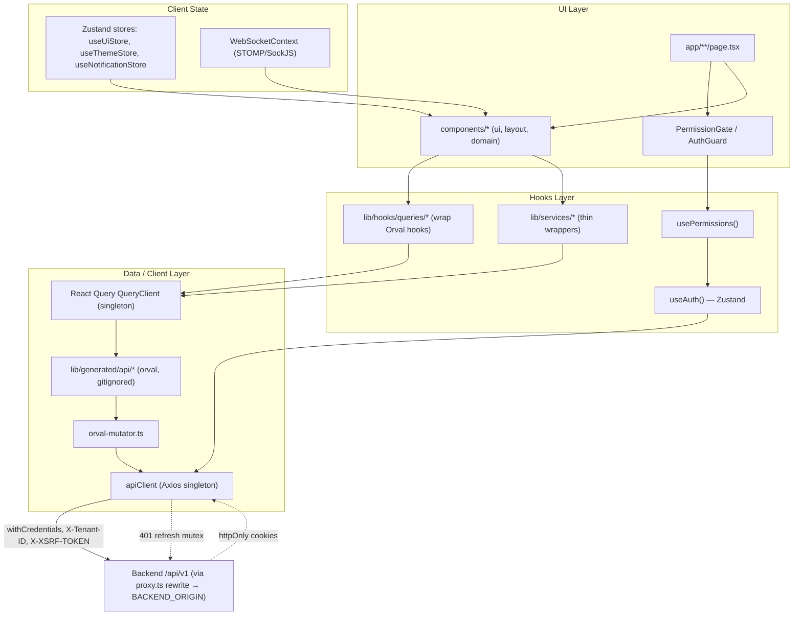
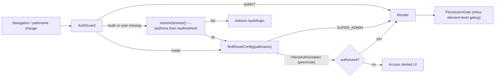

# NU-AURA Frontend Architecture

> Evidence-based reference for the Next.js frontend at `frontend/`. Every claim
> below is grounded in files cited by path. Verify against source before
> relying on a detail for a security- or correctness-sensitive change.

## 1. Stack and Tooling

| Concern | Choice | Evidence |
|---------|--------|----------|
| Framework | Next.js (App Router) `^16.2.7`, React `19.2.7` | `frontend/package.json` |
| Language | TypeScript (strict) | `frontend/tsconfig.json` |
| UI libraries | Mantine `@mantine/core ^9.3.0` + Tailwind CSS `3.4.19` | `frontend/package.json`, `frontend/tailwind.config.js` |
| Server state | TanStack React Query `^5.100.14` | `frontend/lib/queryClient.ts` |
| Client state | Zustand `^5.0.14` | `frontend/lib/hooks/useAuth.ts`, `frontend/lib/stores/*` |
| HTTP | Axios `^1.15.2` | `frontend/lib/api/client.ts` |
| API codegen | Orval `^7.21.0` (`react-query` client, `axios` httpClient) | `frontend/orval.config.ts` |
| Forms / validation | React Hook Form `^7.49.2` + Zod `3.23.8` | `frontend/package.json` |
| Motion | Framer Motion `^12.40.0` | `frontend/components/motion`, `AppLayout.tsx` |
| OAuth | `@react-oauth/google ^0.12.2` | `frontend/app/providers.tsx` |
| Realtime | STOMP (`@stomp/stompjs`) over SockJS | `frontend/lib/contexts/WebSocketContext.tsx` |

> Note: the build script pins the legacy bundler (`next dev --webpack`,
> `next build --webpack` in `frontend/package.json`), even though Turbopack is
> available.

## 2. App Router Structure and Sub-App Organization

The app uses a **flat route layout** under `frontend/app/` — there are no
`(group)` segments. Each top-level directory is a route; sub-apps are not nested
folders but logical groupings mapped from pathname prefixes in
`frontend/lib/config/apps.ts`.

NU-AURA is a **bundle platform of four sub-apps**, defined as `PLATFORM_APPS` in
`frontend/lib/config/apps.ts` (`AppCode = 'HRMS' | 'HIRE' | 'GROW' | 'FLUENCE'`):

| Sub-app | Code | Entry route | Permission prefixes (sample) | Route prefixes (sample) |
|---------|------|-------------|------------------------------|--------------------------|
| NU-HRMS (core HR, catch-all) | `HRMS` | `/me/dashboard` | `employee`, `leave`, `payroll`, `attendance`, `report`, `settings`, `admin` | `/me`, `/employees`, `/payroll`, `/leave`, `/attendance`, `/settings`, `/admin` |
| NU-Hire (recruitment) | `HIRE` | `/recruitment` | `recruitment`, `candidate`, `onboarding`, `preboarding`, `referral`, `agency` | `/recruitment`, `/onboarding`, `/preboarding`, `/offboarding`, `/careers` |
| NU-Grow (perf/learning/engagement) | `GROW` | `/performance` | `review`, `okr`, `feedback_360`, `training`, `lms`, `recognition`, `survey`, `wellness` | `/performance`, `/okr`, `/feedback360`, `/training`, `/recognition`, `/surveys` |
| NU-Fluence (knowledge/collab) | `FLUENCE` | `/fluence/wiki` | `knowledge` | `/fluence/wiki`, `/fluence/blogs`, `/fluence/drive`, `/fluence/wall`, `/fluence/search` |

Routing helpers in `frontend/lib/config/apps.ts`:

- `getAppForRoute(pathname)` — checks HIRE / GROW / FLUENCE prefixes first, then
  defaults to `HRMS` as the catch-all.
- `APP_SIDEBAR_SECTIONS` — maps each `AppCode` to the sidebar section IDs to
  render (e.g. `HRMS → ['home','my-space','people','hr-ops','finance',...]`).
- `useActiveApp()` (`frontend/lib/hooks/useActiveApp.ts`) derives the active app
  from `usePathname()` and provides `hasAppAccess(code)` RBAC gating by matching
  a user's permission module prefixes against `permissionPrefixes`.

### Directory examples (verified on disk)

- `frontend/app/me/` — personal portal: `dashboard`, `profile`, `leaves`,
  `attendance`, `payslips`, `documents`, `assets`, `skills` (+ `layout.tsx`,
  `error.tsx`, `loading.tsx`).
- `frontend/app/fluence/` — `wiki`, `blogs`, `drive`, `wall`, `search`,
  `templates`, `my-content`, `analytics`, `dashboard`.
- `frontend/app/recruitment/` — `jobs`, `candidates`, `interviews`, `pipeline`,
  `agencies`, `career-page`, `job-boards`, `kanban`, `scorecards`, `[jobId]`.

Each sub-app folder carries its own `layout.tsx`, `error.tsx`, and
`loading.tsx` for segment-scoped shells, boundaries, and suspense.

## 3. Root Layout and Provider Stack

`frontend/app/layout.tsx` (server component) sets `metadataBase`, title
template `'%s | NU-AURA'`, viewport theme color, a skip link, and injects two
inline scripts (theme FOUC prevention via `getThemeScript()` and Mantine
`ColorSchemeScript`). Both inline scripts are stamped with a per-request CSP
**nonce** read from the `x-nonce` request header (set by `frontend/proxy.ts`
middleware) — only in production, since dev CSP uses `'unsafe-inline'`.

The client provider stack is assembled in `frontend/app/providers.tsx`:

```
ErrorBoundary
└─ GoogleOAuthProvider (sentinel client id when OAuth disabled)
   └─ QueryClientProvider (singleton from getQueryClient())
      └─ ToastProvider (ui)
         └─ ToastProvider (notifications)
            └─ DarkModeProvider
               └─ MantineThemeProvider
                  └─ <Notifications position="top-right" />
                     └─ WebSocketProvider (STOMP/SockJS)
                        └─ TokenRefreshManager (useTokenRefresh + useSessionTimeout)
                           └─ AuthGuard
                              └─ {children}
```

`TokenRefreshManager` wires proactive token refresh (`useTokenRefresh`) and
inactivity logout (`useSessionTimeout`), both keyed on `isAuthenticated`.

## 4. State and Data Layer

### 4.1 Component / data-flow diagram



### 4.2 React Query

`frontend/lib/queryClient.ts` exposes a lazily-created **singleton**
(`getQueryClient()`) with defaults: `staleTime` 5 min, `gcTime` 10 min,
`retry: 1`, `refetchOnWindowFocus: false` for queries; **`retry: false` for
mutations** (writes are not safely repeatable — a timed-out POST may still
commit server-side). A `MutationCache.onError` routes all mutation errors
through `createQueryErrorHandler()`. The instance is exported so logout can call
`queryClient.clear()` to wipe cached server state.

### 4.3 Orval-generated clients

`frontend/orval.config.ts` generates a typed React Query client:

- Input: `API_DOCS_URL` env var or `http://localhost:8080/v3/api-docs` (a
  committed `frontend/openapi-snapshot.json` is used in CI).
- Output: `frontend/lib/generated/api/` (**gitignored**, regenerated via
  `npm run api:generate`), `mode: 'tags-split'` (one file per OpenAPI tag),
  `client: 'react-query'`, `httpClient: 'axios'`, query options
  `useQuery`/`useMutation`/`signal` enabled.
- **Custom mutator**: every generated call routes through
  `frontend/lib/api/orval-mutator.ts → orvalMutator()`, which delegates to the
  hand-rolled `apiClient` so cookie auth, CSRF, the 401 refresh mutex, tenant
  headers, and `/api/v1` URL normalization are preserved. Generated code stays
  thin and type-safe while the auth contract is untouched.

`frontend/lib/hooks/queries/` (93 files) wrap the generated hooks per domain
(`useEmployees`, `useApprovals`, `useDashboards`, etc.).
`frontend/lib/services/` (115 files) are thin domain wrappers — not a separate
data-access layer.

### 4.4 Axios client (`frontend/lib/api/client.ts`)

A singleton `ApiClient` class with:

- `withCredentials: true` (httpOnly cookie auth — **no tokens in localStorage**,
  XSS protection).
- Request interceptor: injects `X-Tenant-ID` (from `safeStorage`) and, for
  non-GET methods, `X-XSRF-TOKEN` read from the `XSRF-TOKEN` cookie
  (double-submit CSRF). GET timeout 30 s; writes 120 s (bcrypt/Neon/audit
  latency).
- Response 401 interceptor: a **shared refresh mutex** (`refreshPromise`,
  exported via `getSharedRefreshPromise` / `setSharedRefreshPromise`) ensures
  concurrent 401s and `useAuth.restoreSession()` share a single
  `/auth/refresh` call (SEC-F06 / P0-SESSION-FIX) — preventing refresh-token
  revocation races. After silent refresh, `onSessionRefreshed` updates the
  Zustand store, then the original request is retried. On refresh failure a
  debounced hard redirect to `/auth/login?reason=expired` fires (auto-resets
  after 5 s).
- `getPermissive<T>()` treats 403/404 as non-errors (`validateStatus: s < 500`)
  for endpoints where the current role may legitimately lack access.

### 4.5 Zustand stores

- `frontend/lib/hooks/useAuth.ts` — primary auth store (`persist` middleware).
  Holds `user`, `isAuthenticated`, `isLoading`, `hasHydrated`. Actions:
  `login` (returns `MfaChallenge | null`), `googleLogin`, `logout`,
  `restoreSession`. The `user` object is persisted to a **separate**
  `sessionStorage` key `nu-aura-user` (and rehydrated via `onRehydrateStorage`)
  because the Zustand `partialize` output would otherwise overwrite injected
  user data on every `set()`. `login` rejects responses missing roles
  (`CRIT-001`: roles/permissions must come from the auth response — no JWT
  fallback decode). An E2E mode (`NEXT_PUBLIC_E2E_AUTH_STORAGE=localStorage`)
  reads deterministic auth state from `localStorage` for Playwright.
- `frontend/lib/stores/useUiStore.ts` — sidebar/modal UI state.
- `frontend/lib/stores/useThemeStore.ts` — dark mode.
- `frontend/lib/stores/useNotificationStore.ts` — in-app notifications.

Server state stays in React Query; client/identity/UI state in Zustand — the two
are kept distinct.

### 4.6 Realtime

`frontend/lib/contexts/WebSocketContext.tsx` opens a STOMP-over-SockJS
connection keyed on `isAuthenticated`/`user`, exposing `notifications`,
`unreadCount`, `markAsRead`, and approval-task callbacks.

## 5. RBAC Wiring

Permissions and roles originate from the login / `/auth/me` response (stored as
`Role[]` with nested permissions on the Zustand `user`). The frontend mirrors
the backend permission model.

### 5.1 Permission catalog and checks (`frontend/lib/hooks/usePermissions.ts`)

- `Permissions` constant: `MODULE:ACTION` codes (e.g. `EMPLOYEE:READ`,
  `PAYROLL:APPROVE`) plus field-level codes (e.g.
  `FIELD:EMPLOYEE:BANK:VIEW`) matching backend `Permission.java` /
  `FieldPermission`.
- `Roles` constant includes `SUPER_ADMIN`, `TENANT_ADMIN`, HR/finance/manager
  roles.
- `usePermissions()` derives a normalized permission set, handling three input
  shapes: canonical `MODULE:ACTION`, legacy dot form `employee.read` (→
  `EMPLOYEE:READ`), and app-prefixed `APP:MODULE:ACTION` (→ `MODULE:ACTION`).
- `hasPermission` honors a hierarchy: `MODULE:MANAGE` implies all actions in
  that module. `isAdmin` bypass is granted only for `SUPER_ADMIN` role or a
  `SYSTEM:ADMIN`-equivalent permission — **`TENANT_ADMIN` is intentionally
  additive** and must rely on its explicit permissions (mirrors backend
  `SecurityContext.isSuperAdmin()`).
- `isReady` guards the post-refresh window: when `isAuthenticated && !user`,
  `isReady` stays `false` so gates show loading instead of denying access
  (BUG-011/014/020).

### 5.2 Route-level guard (`frontend/components/auth/AuthGuard.tsx`)

Wraps the app under the provider stack. On each navigation it:

1. Waits for Zustand hydration (`hasHydrated`).
2. Allows public routes (`isPublicRoute` from `frontend/lib/config/routes.ts`,
   e.g. `/auth/login`, `/careers`, `/sign/[token]`, `/`).
3. If unauthenticated **or** authenticated-but-`user`-missing, calls
   `restoreSession()` (cookie-based) before redirecting — using ref mirrors
   (`isRestoringRef`, `restoreAttemptedRef`) to survive React 18 StrictMode
   double-fires and avoid premature redirects.
4. Once `isReady`, looks up `findRouteConfig(pathname)` in `PROTECTED_ROUTES`
   and evaluates `permission` / `anyPermission` / `allPermissions` /
   `adminOnly` / `hrOnly` / `managerOnly`. `SUPER_ADMIN` bypasses all
   route-level checks.

`frontend/lib/config/routes.ts` declares `PUBLIC_ROUTES` and `PROTECTED_ROUTES`
(a `RouteConfig[]`, most-specific paths first).

### 5.3 Inline gate (`frontend/components/auth/PermissionGate.tsx`)

Conditional rendering for buttons, menus, and page shells via
`permission` / `anyOf` / `allOf` / `role` / `anyRole` / `allRoles` props.
Renders a visible `Loading...` placeholder while `!isReady` (so smoke tests and
assistive tech see the page mounted), `isAdmin` bypasses all gates, and a
`PageDeniedFallback` export provides a visible page-level denial state (inline
gates use the default `null` fallback to hide silently).

### 5.4 Sub-app gating

`useActiveApp()` exposes `hasAppAccess(code)` (matches permission module
prefixes vs `permissionPrefixes`; `SUPER_ADMIN` short-circuits) and
`getAppEntryRoute(code)`. `AppLayout` (`frontend/components/layout/AppLayout.tsx`)
builds the sidebar from `buildMenuSections` filtered by
`APP_SIDEBAR_SECTIONS[appCode]`.

### 5.5 RBAC verification harness

`frontend/nu-rbac.config.ts` is a standalone Playwright config that runs only
`e2e/nu-rbac.spec.ts` against the running dev server on `:3000` (no auth-setup
project, single chromium). The spec drives a role × route catalog
(`SUPER_ADMIN`, `TENANT_ADMIN`, `HR_ADMIN`, ... `EMPLOYEE`) asserting
`render` / `redirect` / `render_scoped` per use case, and fails soft if the
optional `nu-chrome-e2e` catalog is absent.



## 6. Shared Components and `lib/` Conventions

### Components (`frontend/components/`)

Organized by surface area, not file type:

- `layout/` — `AppLayout.tsx` (shell: rail, nav panel, top bar; lazy-loads
  `CommandPalette` and `FluenceChatWidget`), `Header.tsx`, `GlobalSearch.tsx`,
  `NotificationDropdown.tsx`, `UserMenu.tsx`, `menuSections.tsx`,
  `Breadcrumbs.tsx`, `DarkModeProvider.tsx`, `MantineThemeProvider.tsx`,
  and a `shell/` subfolder.
- `auth/` — `AuthGuard.tsx`, `PermissionGate.tsx`, MFA + feature-gate
  components.
- `ui/` — shared primitives (tables, modals, cards, form inputs, feedback,
  accessibility helpers).
- Domain folders — `dashboard/`, `fluence/`, `recruitment/`, `payroll/`,
  `performance/`, `projects/`, `wall/`, `charts/`, `errors/`, `motion/`, etc.

### `lib/` layout

| Dir | Role |
|-----|------|
| `lib/api/` | Axios `client.ts`, `orval-mutator.ts`, `public-client.ts`, hand-written endpoint modules (`auth.ts`, `mfa.ts`, `roles.ts`, `users.ts`) |
| `lib/generated/api/` | Orval output (gitignored) |
| `lib/hooks/` + `lib/hooks/queries/` | auth/permission/UI hooks + per-domain query hooks |
| `lib/stores/` | Zustand UI/theme/notification stores |
| `lib/services/` | thin domain service wrappers |
| `lib/config/` | `env.ts` (Zod-validated), `routes.ts`, `apps.ts`, `index.ts` |
| `lib/contexts/` | `WebSocketContext.tsx` |
| `lib/theme/` | `theme-script.ts` FOUC prevention; CSS-var fonts |
| `lib/types/` | hand-written domain types |
| `lib/utils/` | `error-handler.ts`, `logger.ts`, `safeStorage.ts`, `googleToken.ts`, formatters |
| `queryClient.ts` | React Query singleton |

### Configuration and environment

`frontend/lib/config/env.ts` validates env vars with Zod (`NEXT_PUBLIC_API_URL`
required and URL-shaped; `NEXT_PUBLIC_GOOGLE_CLIENT_ID` optional; loopback /
placeholder URL detection helpers). `frontend/proxy.ts` (middleware) rewrites
`/api/v1` and WebSocket traffic to `BACKEND_ORIGIN` (default
`http://localhost:8080/api/v1`) and emits the per-request CSP nonce
(`x-nonce`) plus the `Content-Security-Policy` header (production uses
`'nonce-…' 'strict-dynamic'`; dev uses `'unsafe-inline'`).

## 7. Key File Reference

| Concern | File |
|---------|------|
| Sub-app definitions / route mapping | `frontend/lib/config/apps.ts` |
| Route protection config | `frontend/lib/config/routes.ts` |
| Env validation | `frontend/lib/config/env.ts` |
| Auth store | `frontend/lib/hooks/useAuth.ts` |
| Permission hook + constants | `frontend/lib/hooks/usePermissions.ts` |
| Route guard | `frontend/components/auth/AuthGuard.tsx` |
| Inline permission gate | `frontend/components/auth/PermissionGate.tsx` |
| Axios client | `frontend/lib/api/client.ts` |
| Orval mutator | `frontend/lib/api/orval-mutator.ts` |
| Orval config | `frontend/orval.config.ts` |
| React Query singleton | `frontend/lib/queryClient.ts` |
| Provider stack | `frontend/app/providers.tsx` |
| Root layout | `frontend/app/layout.tsx` |
| App shell | `frontend/components/layout/AppLayout.tsx` |
| Active sub-app hook | `frontend/lib/hooks/useActiveApp.ts` |
| Realtime context | `frontend/lib/contexts/WebSocketContext.tsx` |
| Proxy / CSP middleware | `frontend/proxy.ts` |
| RBAC sweep config | `frontend/nu-rbac.config.ts` (spec: `frontend/e2e/nu-rbac.spec.ts`) |

## Related

- [[docs/architecture/README|Architecture Overview]] — system-context map
- [[docs/architecture/data-flow|Data Flow & Request Lifecycle]] — auth cookie flow and silent refresh
- [[docs/reference/api|API Reference]] — endpoint catalog consumed by the frontend
- [[docs/setup/README|Local Dev Setup]] — running the frontend locally
- [[docs/patterns/README|Code Patterns]] — backend patterns the frontend coordinates with
- [[docs/Home|Home MoC]] — vault entry point
