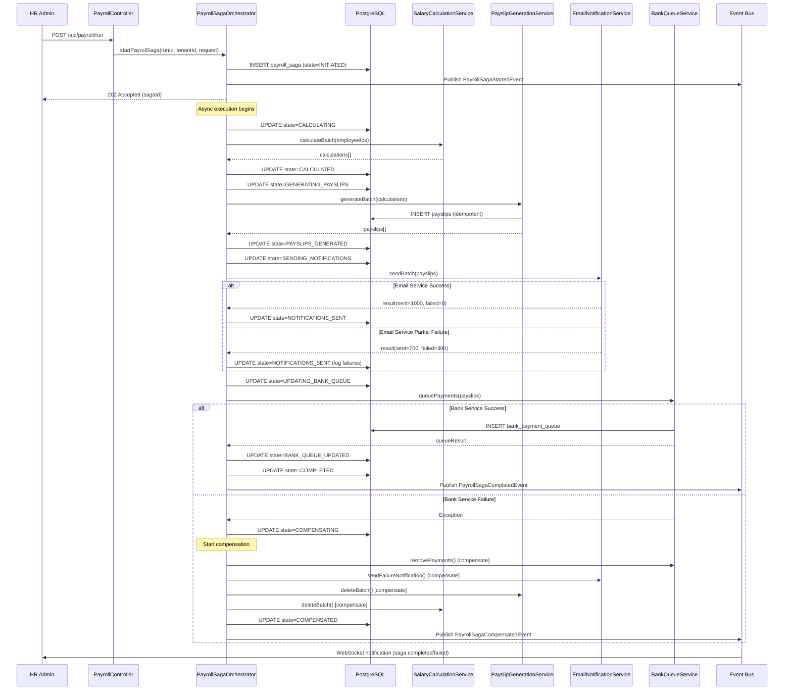

# ADR-003: Saga Pattern for Payroll Processing

**Status:** Proposed
**Date:** 2026-03-11
**Decision Makers:** Backend Architecture Team
**Priority:** High (Data Consistency Critical)

---

## Context

The payroll processing workflow is a **long-running, multi-step business transaction** involving multiple services and external systems. Currently implemented as a monolithic transaction in `PayrollRunService.java`, it lacks fault tolerance and compensating transaction capabilities.

### Current Payroll Workflow

From analysis of `PayrollRunService.java` and related services:

**Current Flow (Synchronous, Single Transaction):**

```
1. Calculate Salary (SalaryStructureService)
   ↓
2. Apply Deductions (StatutoryDeductionService)
   ↓
3. Generate Payslip (PayslipService)
   ↓
4. Send Email Notification (EmailService)
   ↓
5. Update Bank Queue (BankIntegrationService)
   ↓
6. Lock Payroll Run (PayrollRunService)
```

**Problems with Current Approach:**

1. **All-or-Nothing Transaction**: If email sending fails (step 4), entire payroll rollback occurs
2. **Long Transaction Locks**: Database locked for entire workflow duration (30-60s for 1000 employees)
3. **No Partial Recovery**: Can't resume from failure point
4. **External Service Failures**: Email/bank API failures shouldn't rollback salary calculations
5. **No Retry Logic**: Transient failures cause complete re-run
6. **Scalability Issues**: Can't parallelize employee payslip generation

### Real-World Scenario

**Payroll Run for 1000 Employees:**

- **Step 1-3**: Salary calculation + payslip generation (20 seconds)
- **Step 4**: Email service times out after 500 emails sent (30 seconds)
- **Result**: Entire payroll run rollback, 500 generated payslips discarded

**Desired Behavior:**
- Keep calculated payslips
- Retry email sending for failed 500 employees
- Mark payroll as "Partially Completed"
- Resume from failure point

---

## Decision

Implement **Orchestration-Based Saga Pattern** for payroll processing using:
- **Saga Orchestrator**: Coordinates workflow steps
- **Compensating Transactions**: Rollback steps on failure
- **Idempotent Operations**: Safe retries
- **Event Sourcing**: Audit trail of all steps

### Why Orchestration Over Choreography?

| Aspect | Orchestration | Choreography |
|--------|--------------|--------------|
| **Complexity** | Centralized logic | Distributed logic |
| **Debugging** | Easy (single point) | Hard (trace across services) |
| **Workflow Visibility** | Clear in orchestrator | Implicit in events |
| **Transaction Order** | Guaranteed | Eventually consistent |
| **Error Handling** | Centralized | Per-service handling |

**Decision**: Orchestration (centralized) is better for critical financial workflows like payroll.

---

## Architecture Design

### 1. Saga State Machine

Define payroll saga states:

```java
public enum PayrollSagaState {
    INITIATED,              // Saga started
    CALCULATING,            // Step 1: Salary calculation in progress
    CALCULATED,             // Step 1: Completed
    GENERATING_PAYSLIPS,    // Step 2: Payslip generation in progress
    PAYSLIPS_GENERATED,     // Step 2: Completed
    SENDING_NOTIFICATIONS,  // Step 3: Email notifications in progress
    NOTIFICATIONS_SENT,     // Step 3: Completed
    UPDATING_BANK_QUEUE,    // Step 4: Bank payment queue update in progress
    BANK_QUEUE_UPDATED,     // Step 4: Completed
    COMPLETED,              // All steps successful
    COMPENSATING,           // Rollback in progress
    COMPENSATED,            // Rollback completed
    FAILED                  // Saga failed permanently
}
```

### 2. Saga Orchestrator Implementation

Create `PayrollSagaOrchestrator.java`:

```java
@Service
@RequiredArgsConstructor
@Slf4j
public class PayrollSagaOrchestrator {

    private final PayrollSagaRepository sagaRepository;
    private final SalaryCalculationService salaryCalculationService;
    private final PayslipGenerationService payslipGenerationService;
    private final EmailNotificationService emailNotificationService;
    private final BankQueueService bankQueueService;
    private final DomainEventPublisher eventPublisher;

    /**
     * Start a new payroll saga
     */
    @Transactional
    public PayrollSaga startPayrollSaga(UUID payrollRunId, UUID tenantId, PayrollRunRequest request) {
        log.info("Starting payroll saga for payrollRunId={}, tenantId={}", payrollRunId, tenantId);

        PayrollSaga saga = PayrollSaga.builder()
                .id(UUID.randomUUID())
                .payrollRunId(payrollRunId)
                .tenantId(tenantId)
                .state(PayrollSagaState.INITIATED)
                .totalEmployees(request.getEmployeeIds().size())
                .employeeIds(request.getEmployeeIds())
                .metadata(request.getMetadata())
                .startedAt(Instant.now())
                .build();

        saga = sagaRepository.save(saga);

        // Publish saga started event
        eventPublisher.publish(new PayrollSagaStartedEvent(saga));

        // Execute first step asynchronously
        executeNextStep(saga.getId());

        return saga;
    }

    /**
     * Execute the next step in the saga
     */
    @Async("sagaExecutor")
    @Transactional
    public void executeNextStep(UUID sagaId) {
        PayrollSaga saga = sagaRepository.findById(sagaId)
                .orElseThrow(() -> new ResourceNotFoundException("Saga not found: " + sagaId));

        try {
            switch (saga.getState()) {
                case INITIATED:
                    executeStep1_CalculateSalaries(saga);
                    break;
                case CALCULATED:
                    executeStep2_GeneratePayslips(saga);
                    break;
                case PAYSLIPS_GENERATED:
                    executeStep3_SendNotifications(saga);
                    break;
                case NOTIFICATIONS_SENT:
                    executeStep4_UpdateBankQueue(saga);
                    break;
                case BANK_QUEUE_UPDATED:
                    completeSaga(saga);
                    break;
                default:
                    log.warn("Saga {} in unexpected state: {}", sagaId, saga.getState());
            }
        } catch (Exception e) {
            handleStepFailure(saga, e);
        }
    }

    /**
     * Step 1: Calculate salaries for all employees
     */
    private void executeStep1_CalculateSalaries(PayrollSaga saga) {
        log.info("Executing Step 1: Calculate salaries for saga {}", saga.getId());

        saga.setState(PayrollSagaState.CALCULATING);
        saga.setCurrentStep("CALCULATE_SALARIES");
        sagaRepository.save(saga);

        try {
            // Calculate salaries for all employees (can be parallelized)
            List<SalaryCalculation> calculations = salaryCalculationService
                    .calculateBatch(saga.getPayrollRunId(), saga.getEmployeeIds());

            // Store calculation results in saga
            saga.setCalculationResults(calculations);
            saga.setState(PayrollSagaState.CALCULATED);
            saga.setCompletedSteps(saga.getCompletedSteps() + 1);
            sagaRepository.save(saga);

            log.info("Step 1 completed: {} salaries calculated", calculations.size());

            // Execute next step
            executeNextStep(saga.getId());

        } catch (Exception e) {
            log.error("Step 1 failed for saga {}: {}", saga.getId(), e.getMessage(), e);
            throw new SagaStepException("Salary calculation failed", e);
        }
    }

    /**
     * Step 2: Generate payslips
     */
    private void executeStep2_GeneratePayslips(PayrollSaga saga) {
        log.info("Executing Step 2: Generate payslips for saga {}", saga.getId());

        saga.setState(PayrollSagaState.GENERATING_PAYSLIPS);
        saga.setCurrentStep("GENERATE_PAYSLIPS");
        sagaRepository.save(saga);

        try {
            List<Payslip> payslips = payslipGenerationService
                    .generateBatch(saga.getPayrollRunId(), saga.getCalculationResults());

            saga.setGeneratedPayslips(payslips.stream()
                    .map(Payslip::getId)
                    .collect(Collectors.toList()));
            saga.setState(PayrollSagaState.PAYSLIPS_GENERATED);
            saga.setCompletedSteps(saga.getCompletedSteps() + 1);
            sagaRepository.save(saga);

            log.info("Step 2 completed: {} payslips generated", payslips.size());

            executeNextStep(saga.getId());

        } catch (Exception e) {
            log.error("Step 2 failed for saga {}: {}", saga.getId(), e.getMessage(), e);
            throw new SagaStepException("Payslip generation failed", e);
        }
    }

    /**
     * Step 3: Send email notifications (eventual consistency acceptable)
     */
    private void executeStep3_SendNotifications(PayrollSaga saga) {
        log.info("Executing Step 3: Send email notifications for saga {}", saga.getId());

        saga.setState(PayrollSagaState.SENDING_NOTIFICATIONS);
        saga.setCurrentStep("SEND_NOTIFICATIONS");
        sagaRepository.save(saga);

        try {
            // Send emails with retry logic (best effort)
            EmailNotificationResult result = emailNotificationService
                    .sendPayslipNotificationsBatch(saga.getPayrollRunId(), saga.getGeneratedPayslips());

            saga.setEmailsSent(result.getSuccessCount());
            saga.setEmailsFailed(result.getFailureCount());
            saga.setFailedEmails(result.getFailedRecipients());

            // Even if some emails fail, mark as completed (eventual consistency)
            // Failed emails will be retried by background job
            saga.setState(PayrollSagaState.NOTIFICATIONS_SENT);
            saga.setCompletedSteps(saga.getCompletedSteps() + 1);
            sagaRepository.save(saga);

            log.info("Step 3 completed: {}/{} emails sent successfully",
                     result.getSuccessCount(), saga.getTotalEmployees());

            executeNextStep(saga.getId());

        } catch (Exception e) {
            // Email failure is non-critical - log and continue
            log.warn("Step 3 partially failed for saga {}: {}", saga.getId(), e.getMessage());
            saga.setState(PayrollSagaState.NOTIFICATIONS_SENT); // Continue anyway
            saga.setCompletedSteps(saga.getCompletedSteps() + 1);
            sagaRepository.save(saga);
            executeNextStep(saga.getId());
        }
    }

    /**
     * Step 4: Update bank payment queue
     */
    private void executeStep4_UpdateBankQueue(PayrollSaga saga) {
        log.info("Executing Step 4: Update bank queue for saga {}", saga.getId());

        saga.setState(PayrollSagaState.UPDATING_BANK_QUEUE);
        saga.setCurrentStep("UPDATE_BANK_QUEUE");
        sagaRepository.save(saga);

        try {
            BankQueueResult result = bankQueueService
                    .queuePayments(saga.getPayrollRunId(), saga.getGeneratedPayslips());

            saga.setBankQueueEntries(result.getQueuedPayments());
            saga.setState(PayrollSagaState.BANK_QUEUE_UPDATED);
            saga.setCompletedSteps(saga.getCompletedSteps() + 1);
            sagaRepository.save(saga);

            log.info("Step 4 completed: {} payments queued for bank transfer", result.getQueuedPayments().size());

            executeNextStep(saga.getId());

        } catch (Exception e) {
            log.error("Step 4 failed for saga {}: {}", saga.getId(), e.getMessage(), e);
            throw new SagaStepException("Bank queue update failed", e);
        }
    }

    /**
     * Complete the saga successfully
     */
    private void completeSaga(PayrollSaga saga) {
        log.info("Completing saga {}", saga.getId());

        saga.setState(PayrollSagaState.COMPLETED);
        saga.setCompletedAt(Instant.now());
        saga.setDurationMs(Duration.between(saga.getStartedAt(), Instant.now()).toMillis());
        sagaRepository.save(saga);

        eventPublisher.publish(new PayrollSagaCompletedEvent(saga));

        log.info("Saga {} completed successfully in {} ms", saga.getId(), saga.getDurationMs());
    }

    /**
     * Handle step failure - initiate compensation
     */
    private void handleStepFailure(PayrollSaga saga, Exception exception) {
        log.error("Saga {} failed at step {}: {}",
                  saga.getId(), saga.getCurrentStep(), exception.getMessage(), exception);

        saga.setState(PayrollSagaState.COMPENSATING);
        saga.setFailureReason(exception.getMessage());
        saga.setFailedAt(Instant.now());
        sagaRepository.save(saga);

        // Start compensation (rollback)
        compensate(saga);
    }

    /**
     * Compensate (rollback) completed steps in reverse order
     */
    @Transactional
    public void compensate(PayrollSaga saga) {
        log.info("Starting compensation for saga {}", saga.getId());

        try {
            // Compensate in reverse order
            switch (saga.getState()) {
                case BANK_QUEUE_UPDATED:
                    compensateStep4_RemoveFromBankQueue(saga);
                    // Fall through
                case NOTIFICATIONS_SENT:
                    compensateStep3_NotifyFailure(saga);
                    // Fall through
                case PAYSLIPS_GENERATED:
                    compensateStep2_DeletePayslips(saga);
                    // Fall through
                case CALCULATED:
                    compensateStep1_ClearCalculations(saga);
                    break;
            }

            saga.setState(PayrollSagaState.COMPENSATED);
            saga.setCompensatedAt(Instant.now());
            sagaRepository.save(saga);

            eventPublisher.publish(new PayrollSagaCompensatedEvent(saga));

            log.info("Saga {} compensated successfully", saga.getId());

        } catch (Exception e) {
            log.error("Compensation failed for saga {}: {}", saga.getId(), e.getMessage(), e);
            saga.setState(PayrollSagaState.FAILED);
            sagaRepository.save(saga);
        }
    }

    // ==================== Compensating Transactions ====================

    private void compensateStep1_ClearCalculations(PayrollSaga saga) {
        log.info("Compensating Step 1: Clearing salary calculations");
        salaryCalculationService.deleteBatch(saga.getPayrollRunId());
    }

    private void compensateStep2_DeletePayslips(PayrollSaga saga) {
        log.info("Compensating Step 2: Deleting generated payslips");
        payslipGenerationService.deleteBatch(saga.getGeneratedPayslips());
    }

    private void compensateStep3_NotifyFailure(PayrollSaga saga) {
        log.info("Compensating Step 3: Sending failure notifications");
        // Send notification to HR team about payroll failure
        emailNotificationService.sendPayrollFailureNotification(saga.getPayrollRunId(), saga.getFailureReason());
    }

    private void compensateStep4_RemoveFromBankQueue(PayrollSaga saga) {
        log.info("Compensating Step 4: Removing payments from bank queue");
        bankQueueService.removePayments(saga.getBankQueueEntries());
    }
}
```

### 3. Saga State Persistence

Create `PayrollSaga` entity:

```java
@Entity
@Table(name = "payroll_sagas", indexes = {
    @Index(name = "idx_payroll_saga_run", columnList = "payroll_run_id"),
    @Index(name = "idx_payroll_saga_state", columnList = "state"),
    @Index(name = "idx_payroll_saga_tenant", columnList = "tenant_id")
})
@Getter
@Setter
@Builder
@NoArgsConstructor
@AllArgsConstructor
public class PayrollSaga extends BaseEntity {

    @Column(name = "payroll_run_id", nullable = false)
    private UUID payrollRunId;

    @Column(name = "tenant_id", nullable = false)
    private UUID tenantId;

    @Enumerated(EnumType.STRING)
    @Column(name = "state", nullable = false, length = 30)
    private PayrollSagaState state;

    @Column(name = "current_step", length = 50)
    private String currentStep;

    @Column(name = "completed_steps")
    private Integer completedSteps = 0;

    @Column(name = "total_employees")
    private Integer totalEmployees;

    @Column(name = "employee_ids", columnDefinition = "jsonb")
    @Convert(converter = UUIDListConverter.class)
    private List<UUID> employeeIds;

    @Column(name = "calculation_results", columnDefinition = "jsonb")
    @Convert(converter = JsonbConverter.class)
    private List<SalaryCalculation> calculationResults;

    @Column(name = "generated_payslips", columnDefinition = "jsonb")
    @Convert(converter = UUIDListConverter.class)
    private List<UUID> generatedPayslips;

    @Column(name = "emails_sent")
    private Integer emailsSent;

    @Column(name = "emails_failed")
    private Integer emailsFailed;

    @Column(name = "failed_emails", columnDefinition = "jsonb")
    @Convert(converter = JsonbConverter.class)
    private List<String> failedEmails;

    @Column(name = "bank_queue_entries", columnDefinition = "jsonb")
    @Convert(converter = UUIDListConverter.class)
    private List<UUID> bankQueueEntries;

    @Column(name = "metadata", columnDefinition = "jsonb")
    @Convert(converter = JsonbConverter.class)
    private Map<String, Object> metadata;

    @Column(name = "failure_reason", columnDefinition = "TEXT")
    private String failureReason;

    @Column(name = "started_at")
    private Instant startedAt;

    @Column(name = "completed_at")
    private Instant completedAt;

    @Column(name = "failed_at")
    private Instant failedAt;

    @Column(name = "compensated_at")
    private Instant compensatedAt;

    @Column(name = "duration_ms")
    private Long durationMs;

    @Version
    @Column(name = "version")
    private Long version; // Optimistic locking
}
```

### 4. Idempotency Keys

Ensure all operations are idempotent:

```java
@Service
public class PayslipGenerationService {

    /**
     * Idempotent payslip generation using composite key (payrollRunId + employeeId)
     */
    @Transactional
    public List<Payslip> generateBatch(UUID payrollRunId, List<SalaryCalculation> calculations) {
        List<Payslip> payslips = new ArrayList<>();

        for (SalaryCalculation calc : calculations) {
            // Check if payslip already exists (idempotency)
            Optional<Payslip> existing = payslipRepository
                    .findByPayrollRunIdAndEmployeeId(payrollRunId, calc.getEmployeeId());

            if (existing.isPresent()) {
                log.debug("Payslip already exists for employee {} in run {}", calc.getEmployeeId(), payrollRunId);
                payslips.add(existing.get());
                continue;
            }

            // Generate new payslip
            Payslip payslip = createPayslip(payrollRunId, calc);
            payslips.add(payslipRepository.save(payslip));
        }

        return payslips;
    }
}
```

---

## Sequence Diagram



---

## Benefits

1. **Fault Tolerance**: System recovers from partial failures
2. **Eventual Consistency**: Email failures don't block payroll completion
3. **Audit Trail**: Every step recorded in saga state
4. **Resumability**: Can resume from last successful step
5. **Idempotency**: Safe retries without duplicate payslips
6. **Observability**: Clear visibility into workflow progress
7. **Testability**: Each step can be unit tested independently

---

## Implementation Plan

### Phase 1: Foundation (Week 1, 16 hours)
- [ ] Create `PayrollSaga` entity and repository
- [ ] Implement `PayrollSagaState` enum
- [ ] Create `PayrollSagaOrchestrator` skeleton
- [ ] Set up async executor configuration
- [ ] Write unit tests for state transitions

### Phase 2: Step Implementation (Week 2, 24 hours)
- [ ] Implement Step 1: Salary calculation
- [ ] Implement Step 2: Payslip generation with idempotency
- [ ] Implement Step 3: Email notifications with retry
- [ ] Implement Step 4: Bank queue updates
- [ ] Add saga progress tracking

### Phase 3: Compensation (Week 3, 16 hours)
- [ ] Implement compensating transactions for each step
- [ ] Add rollback orchestration
- [ ] Test compensation scenarios
- [ ] Add compensation audit logging

### Phase 4: Integration (Week 4, 16 hours)
- [ ] Update `PayrollController` to use saga orchestrator
- [ ] Add saga status endpoints (GET /api/payroll/sagas/{id})
- [ ] Implement WebSocket notifications for saga events
- [ ] Add monitoring dashboards (Grafana)

### Phase 5: Migration (Week 5, 8 hours)
- [ ] Run parallel execution (old + new) for validation
- [ ] Compare results and performance
- [ ] Feature flag rollout (10% → 50% → 100%)
- [ ] Decommission old synchronous flow

---

## Monitoring & Alerts

**Key Metrics:**

```promql
# Saga success rate
rate(payroll_saga_completed_total[5m]) / rate(payroll_saga_started_total[5m])

# Saga duration distribution
histogram_quantile(0.95, rate(payroll_saga_duration_seconds_bucket[5m]))

# Compensation rate (should be < 1%)
rate(payroll_saga_compensated_total[5m]) / rate(payroll_saga_started_total[5m])

# Step failure rate by step
sum(rate(payroll_saga_step_failed_total[5m])) by (step)
```

**Alerts:**

- Saga compensation rate > 5% → Alert HR Ops team
- Saga duration > 300s → Performance investigation
- Step failure rate > 10% → Service health check

---

## Decision

**Approved for Implementation**: Orchestration-Based Saga Pattern for Payroll Processing

**Responsible Team**: Backend Core Team
**Implementation Start**: Week 3
**Review Date**: After Phase 5 (parallel execution validation)
**Feature Flag**: `feature.payroll_saga.enabled`

---

## References

- [Saga Pattern - Microservices.io](https://microservices.io/patterns/data/saga.html)
- [Orchestration vs Choreography](https://docs.microsoft.com/en-us/azure/architecture/patterns/saga)
- [Idempotency in Distributed Systems](https://aws.amazon.com/builders-library/making-retries-safe-with-idempotent-APIs/)
- [Spring Async Configuration](https://spring.io/guides/gs/async-method/)
