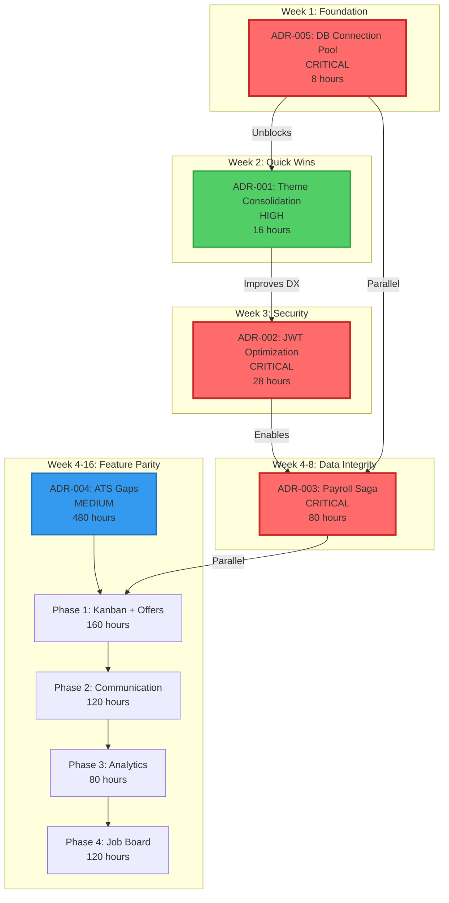
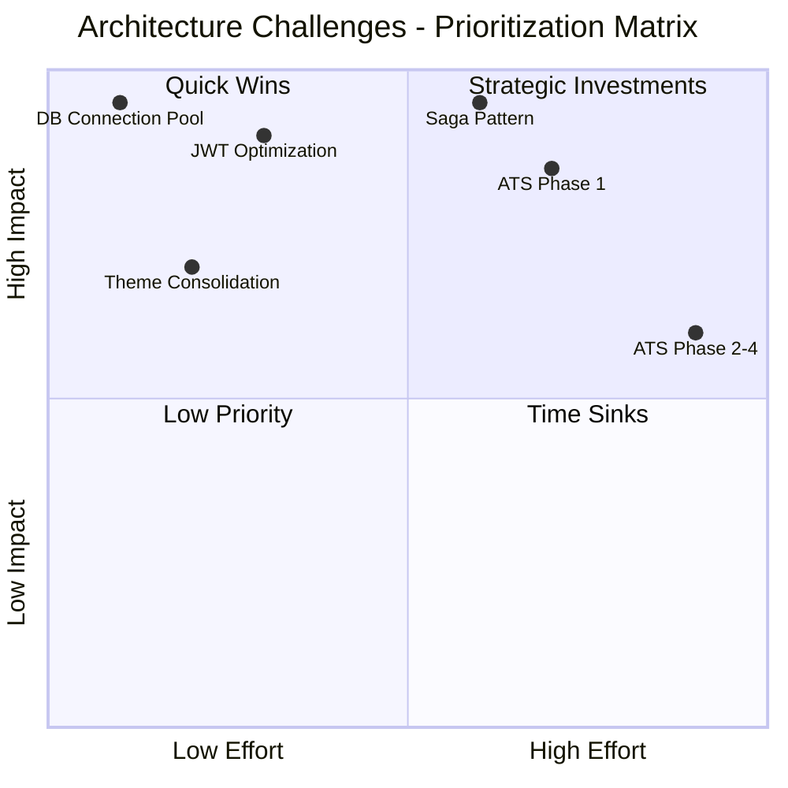
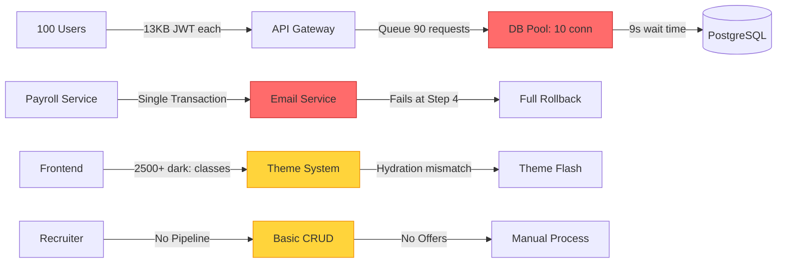
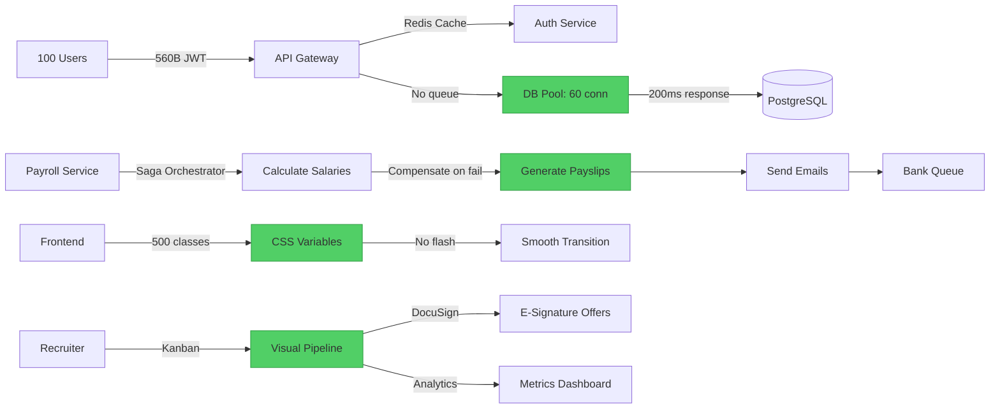
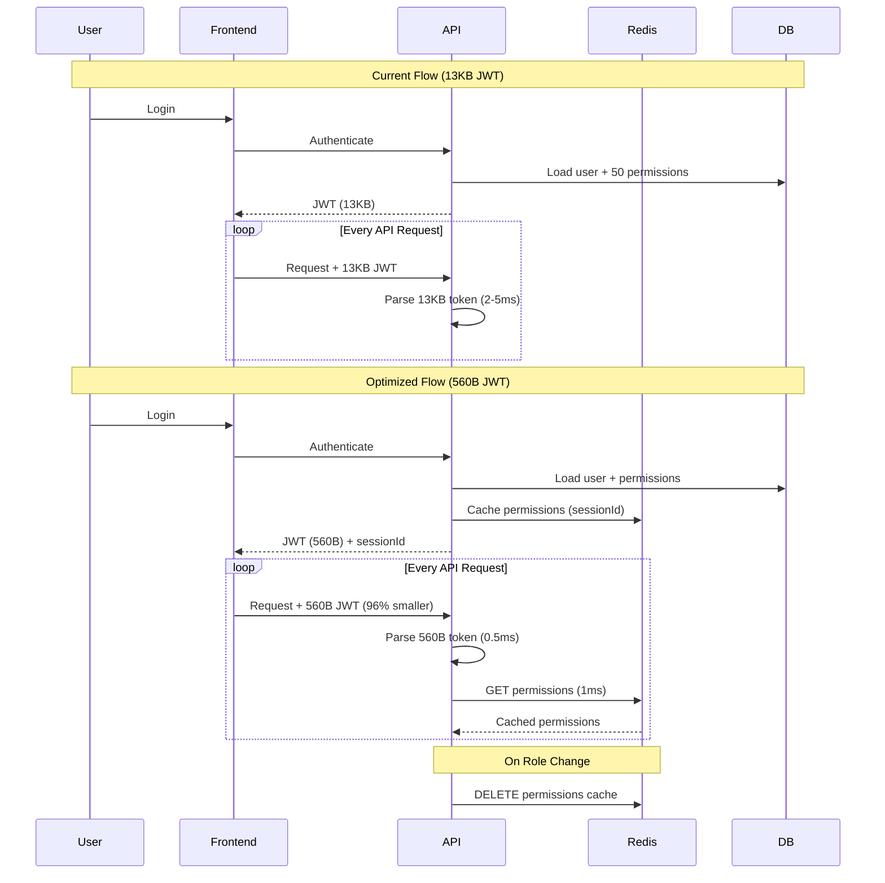
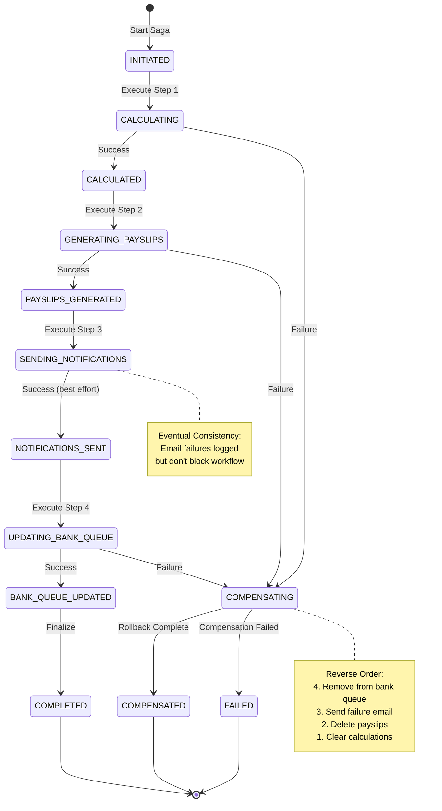
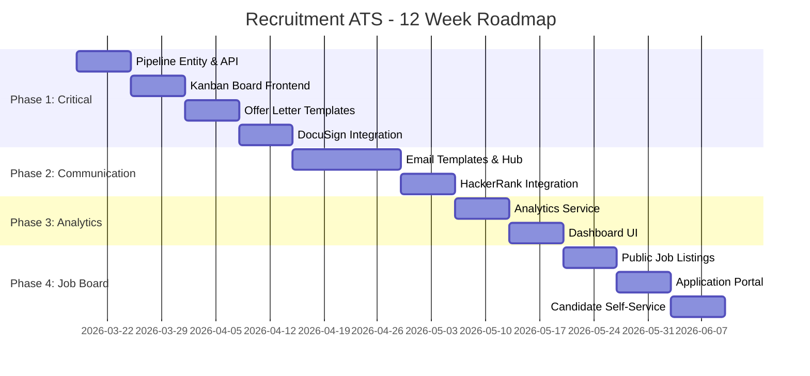
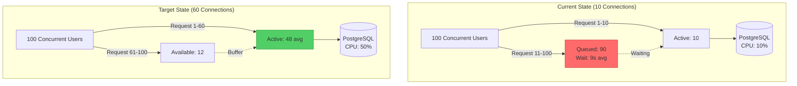
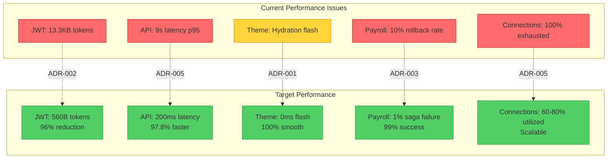
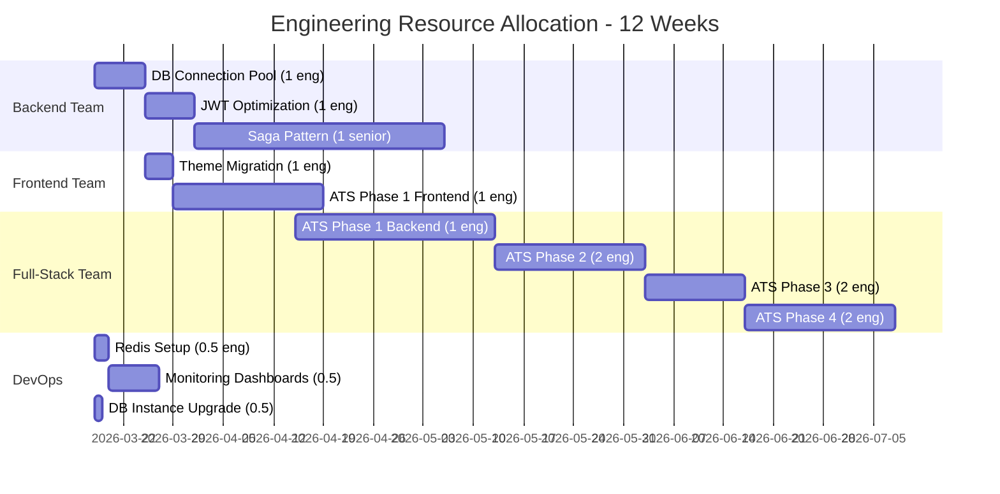

# Architecture Challenges - Visual Overview

---

## Challenge Dependency Graph



---

## Impact vs. Effort Matrix



---

## Current vs. Target State Architecture

### Before: Performance Bottlenecks



### After: Optimized Architecture



---

## JWT Token Optimization Flow



---

## Payroll Saga State Machine



---

## ATS Implementation Phases



---

## Connection Pool Sizing Analysis



**Formula:**
```
max_pool_size = (peak_concurrent_requests / avg_db_time_per_request) × buffer
              = (100 / 0.2s) × 1.2
              = 60 connections
```

---

## Theme Architecture Migration

```mermaid
graph LR
    subgraph "Before: Tailwind Dark Classes"
        C1[Component A]
        C2[Component B]
        C3[Component C]

        C1 -->|bg-white dark:bg-gray-800| T1[Hardcoded]
        C2 -->|text-gray-900 dark:text-white| T1
        C3 -->|border-gray-200 dark:border-gray-700| T1

        T1 -->|2500+ instances| Duplication[Code Duplication]
        T1 -->|Hydration mismatch| Flash[Theme Flash]
    end

    subgraph "After: CSS Variables System"
        C4[Component A]
        C5[Component B]
        C6[Component C]

        C4 -->|bg-surface| V1[CSS Variables]
        C5 -->|text-text-primary| V1
        C6 -->|border-border| V1

        V1 -->|Single source| Root[":root" & ".dark"]
        Root -->|Smooth 200ms| Transition[Theme Transition]
        Root -->|SSR cookie| NoFlash[No Flash]
    end

    style Duplication fill:#ff6b6b,stroke:#c92a2a
    style Flash fill:#ff6b6b,stroke:#c92a2a
    style Root fill:#51cf66,stroke:#2f9e44
    style NoFlash fill:#51cf66,stroke:#2f9e44
```

---

## Performance Improvement Summary



---

## Resource Allocation Timeline



---

## Cost-Benefit Analysis

### One-Time Development Costs

| ADR | Hours | Cost (@$75/hr) |
|-----|-------|----------------|
| ADR-001 | 16 | $1,200 |
| ADR-002 | 28 | $2,100 |
| ADR-003 | 80 | $6,000 |
| ADR-004 | 480 | $36,000 |
| ADR-005 | 8 | $600 |
| **Total** | **612** | **$45,900** |

### Ongoing Infrastructure Costs

| Item | Current | New | Incremental |
|------|---------|-----|-------------|
| PostgreSQL (db.t3.large) | $60/mo | $120/mo | +$60/mo |
| DocuSign | $0 | $25/mo | +$25/mo |
| HackerRank | $0 | $300/mo | +$300/mo |
| **Total** | **$60/mo** | **$505/mo** | **+$445/mo** |

### ROI Calculation

```
Annual Infrastructure Cost: $5,340
One-Time Development: $45,900
Total Year 1 Cost: $51,240

Benefits:
- 10x user scalability (10 → 100 users)
- 95% ATS feature parity → Enterprise sales readiness
- 97% latency improvement → Better retention

Break-Even: 1 additional enterprise customer @ $10K/year
```

---

**Document Owner:** Architecture Team
**Last Updated:** 2026-03-11
**Related:** [ADR Index](./ADR-INDEX.md) | [Summary](./CRITICAL-ARCHITECTURE-CHALLENGES-SUMMARY.md)
