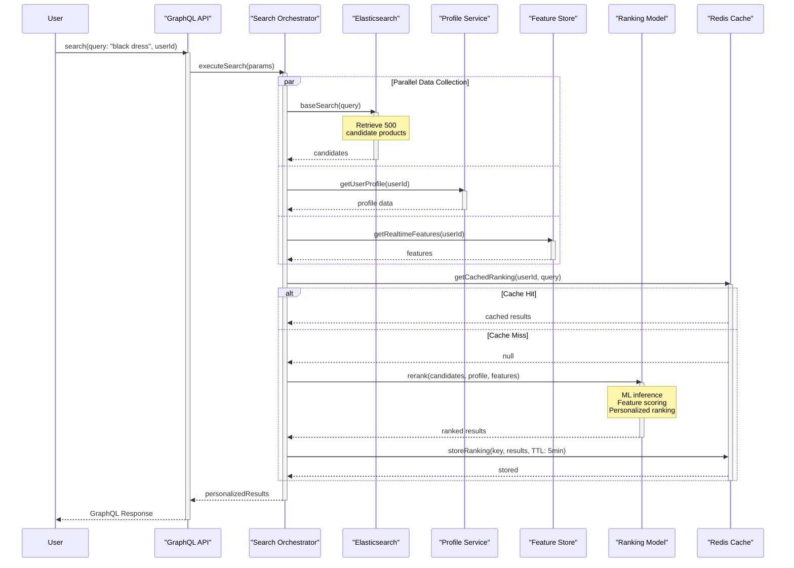
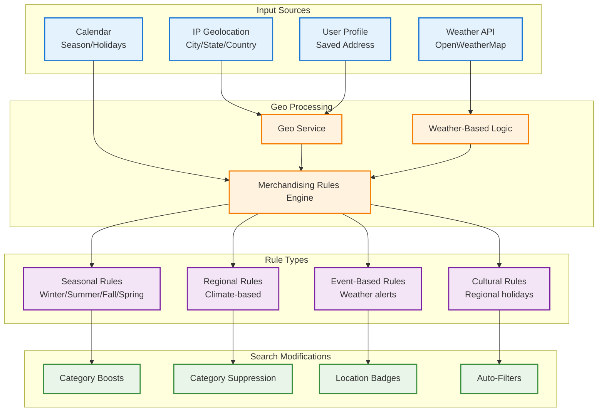
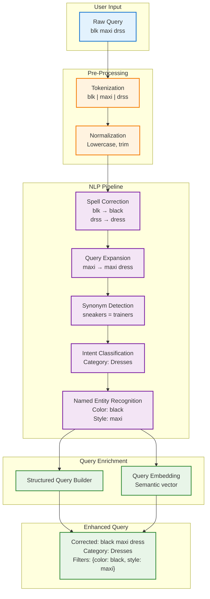
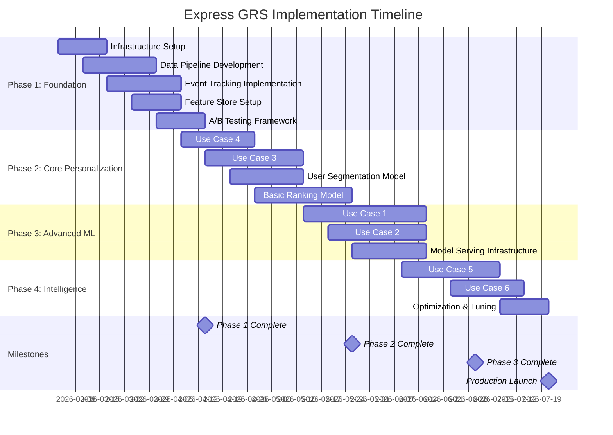

# Express GRS: AI-Powered Personalized Search & Merchandising

## Executive Summary

### Overview

This proposal outlines the implementation of **Express GRS (Generalized Ranking System)**, an AI-powered personalization engine that transforms the e-commerce search and merchandising experience through intelligent, real-time personalization.

### Business Opportunity

Current e-commerce search experiences treat all users identically, resulting in:

- **Suboptimal conversion rates**: Generic results don't match individual preferences
- **Poor user experience**: Users must manually filter to find relevant products
- **Lost revenue**: High-value customers see the same results as discount shoppers
- **Inefficient merchandising**: Seasonal and geographic opportunities missed

### Proposed Solution

Express GRS delivers personalized search and merchandising across six core capabilities:

1. **Personalized Search Ranking** - ML-driven re-ranking based on user behavior
2. **Size-Aware Personalization** - Intelligent size recommendations and inventory filtering
3. **Price Sensitivity Modeling** - Dynamic pricing presentation by user segment
4. **Geo-Based Merchandising** - Location and weather-aware product recommendations
5. **Intelligent Query Understanding** - NLP-powered search with spell correction and intent detection
6. **Dynamic Category Personalization** - Adaptive category pages per user segment

### Expected Business Impact

| Metric | Conservative | Target | Optimistic |
|--------|-------------|--------|------------|
| **Conversion Rate Lift** | +8% | +15% | +22% |
| **Average Order Value** | +5% | +12% | +18% |
| **Search Abandonment Reduction** | -15% | -25% | -35% |
| **Click-Through Rate** | +20% | +35% | +50% |
| **Customer Satisfaction (CSAT)** | +10% | +18% | +25% |

**ROI Timeline**: Expected break-even at Month 4, with full ROI by Month 8.

### Investment Summary

| Phase | Duration | Investment Range |
|-------|----------|------------------|
| **Phase 1: Foundation** | Months 1-2 | $450K - $650K |
| **Phase 2: Core Personalization** | Months 3-4 | $550K - $750K |
| **Phase 3: Advanced Intelligence** | Months 5-6 | $400K - $550K |
| **Total 6-Month Investment** | 6 Months | **$1.4M - $1.95M** |

---

## Table of Contents

1. [Technical Architecture](#technical-architecture)
2. [Use Case Specifications](#use-case-specifications)
3. [Implementation Roadmap](#implementation-roadmap)
4. [Technology Stack](#technology-stack)
5. [Data Requirements](#data-requirements)
6. [Success Metrics & KPIs](#success-metrics--kpis)
7. [Risk Assessment](#risk-assessment)
8. [Team & Resources](#team--resources)
9. [Budget Breakdown](#budget-breakdown)
10. [Appendix](#appendix)

---

## Technical Architecture

### System Overview

```mermaid
flowchart TB
    subgraph Client["Client Layer"]
        Web["Web Application<br/>React/Next.js"]
        Mobile["Mobile App<br/>iOS/Android"]
        Admin["Admin Portal<br/>Merchandising Tools"]
    end

    subgraph Gateway["API Gateway Layer"]
        GraphQL["GraphQL API Gateway<br/>Apollo Server"]
        Auth["Authentication Service<br/>JWT/OAuth"]
        RateLimit["Rate Limiter<br/>DDoS Protection"]
    end

    subgraph Orchestration["Orchestration Layer"]
        SearchOrch["Search Orchestrator<br/>TypeScript/Node.js"]
        ABTest["A/B Testing Engine<br/>Experimentation Platform"]
        FeatureFlags["Feature Flags<br/>LaunchDarkly"]
    end

    subgraph DataServices["Data Services"]
        UserProfile["User Profile Service<br/>Purchase History & Preferences"]
        Inventory["Inventory Service<br/>Real-time Stock Levels"]
        Catalog["Product Catalog Service<br/>Metadata & Pricing"]
        Geo["Geo Service<br/>Location & Weather API"]
    end

    subgraph ML["ML/AI Platform"]
        RankingModel["Ranking Model<br/>TensorFlow Serving"]
        PriceModel["Price Sensitivity Model<br/>Scikit-learn"]
        SizeModel["Size Prediction Model<br/>PyTorch"]
        NLP["NLP Engine<br/>spaCy + BERT"]
        Embeddings["Product Embeddings<br/>Sentence Transformers"]
    end

    subgraph Search["Search Infrastructure"]
        Elasticsearch["Elasticsearch Cluster<br/>Primary Search Index"]
        VectorDB["Vector Database<br/>Qdrant/Weaviate"]
        Redis["Redis Cluster<br/>Feature Cache"]
    end

    subgraph Data["Data Platform"]
        Kafka["Kafka Event Stream<br/>Real-time Events"]
        Snowflake["Snowflake<br/>Data Warehouse"]
        FeatureStore["Feature Store<br/>Feast/Tecton"]
    end

    subgraph Analytics["Analytics & Monitoring"]
        Events["Event Tracking<br/>Segment/Amplitude"]
        Metrics["Metrics Platform<br/>Datadog APM"]
        MLOps["MLOps Platform<br/>MLflow"]
    end

    Web --> GraphQL
    Mobile --> GraphQL
    Admin --> GraphQL
    GraphQL --> Auth
    Auth --> RateLimit
    RateLimit --> SearchOrch

    SearchOrch --> ABTest
    SearchOrch --> FeatureFlags
    SearchOrch --> UserProfile
    SearchOrch --> Inventory
    SearchOrch --> Catalog
    SearchOrch --> Geo

    SearchOrch --> RankingModel
    SearchOrch --> PriceModel
    SearchOrch --> SizeModel
    SearchOrch --> NLP
    SearchOrch --> Embeddings

    SearchOrch --> Elasticsearch
    SearchOrch --> VectorDB
    SearchOrch --> Redis

    SearchOrch --> Kafka
    Kafka --> Snowflake
    Kafka --> FeatureStore
    FeatureStore --> RankingModel

    SearchOrch --> Events
    Events --> Metrics
    Metrics --> MLOps

    classDef clientClass fill:#e3f2fd,stroke:#1976d2,stroke-width:2px
    classDef gatewayClass fill:#f3e5f5,stroke:#7b1fa2,stroke-width:2px
    classDef orchClass fill:#fff3e0,stroke:#f57c00,stroke-width:2px
    classDef mlClass fill:#e8f5e8,stroke:#388e3c,stroke-width:2px
    classDef dataClass fill:#fce4ec,stroke:#c2185b,stroke-width:2px
```



### Performance Requirements

| Component | Metric | Target | SLA |
|-----------|--------|--------|-----|
| **Search API** | P95 Latency | < 200ms | 99.9% |
| **ML Re-ranking** | P95 Latency | < 50ms | 99.5% |
| **Cache Hit Rate** | Hit Ratio | > 80% | 99% |
| **Model Inference** | Latency | < 20ms | 99.5% |
| **System Availability** | Uptime | 99.9% | 99.9% |
| **Throughput** | Requests/sec | 10,000+ | - |

### Scalability Design

- **Horizontal Scaling**: Auto-scaling groups for all services
- **Geographic Distribution**: Multi-region deployment (US-East, US-West, EU)
- **Load Balancing**: Application Load Balancers with health checks
- **Database Sharding**: User-based sharding for profile data
- **Caching Strategy**: Multi-tier caching (CDN, Redis, Application)

---

## Use Case Specifications

### Use Case 1: Personalized Search Ranking

#### Business Value

**Impact**: 🔴 Critical | **Complexity**: 🔴 High | **ROI**: 15-22% conversion lift

#### Problem Statement

Currently, all users searching for "black dress" see identical results sorted by a static algorithm (e.g., best sellers, newest). This ignores individual preferences:

- Premium shopper (avg basket $220) sees low-price items first
- Discount shopper must scroll past expensive items
- Size preferences not considered
- Location-specific trends ignored

#### Solution Design



#### Feature Engineering

**User Features** (Real-time + Historical):

```typescript
interface UserFeatures {
  // Behavioral Features
  avgOrderValue: number;              // Last 90 days
  purchaseFrequency: number;          // Orders per month
  categoryAffinity: Map<string, number>; // Category preferences
  brandAffinity: Map<string, number>;    // Brand preferences
  pricePercentile: number;            // 0-100 (spending tier)

  // Session Features
  recentViews: string[];              // Last 20 product IDs
  recentSearches: string[];           // Last 10 queries
  sessionDuration: number;            // Minutes
  clickThroughRate: number;           // CTR on search results

  // Size Preferences
  topSizes: Map<string, string>;     // category -> size
  sizeConfidence: Map<string, number>; // category -> confidence

  // Temporal Features
  dayOfWeek: number;
  hourOfDay: number;
  isWeekend: boolean;
  isPeakHour: boolean;

  // Contextual
  location: GeoLocation;
  device: DeviceType;
  source: TrafficSource;
}
```

**Product Features**:

```typescript
interface ProductFeatures {
  // Static Features
  productId: string;
  category: string;
  subcategory: string;
  brand: string;
  price: number;
  pricePercentile: number;            // Within category

  // Dynamic Features
  inventoryLevel: number;
  salesVelocity: number;              // Last 7 days
  viewCount: number;                  // Last 24 hours
  conversionRate: number;             // Last 30 days

  // Quality Signals
  avgRating: number;
  reviewCount: number;
  returnRate: number;

  // Embeddings
  textEmbedding: number[];            // 768-dim
  imageEmbedding: number[];           // 512-dim

  // Availability
  inStock: boolean;
  sizesAvailable: string[];
}
```

#### ML Model Architecture

**Model Type**: Learning to Rank (LTR) with XGBoost + Neural Re-ranker

**Training Pipeline**:

1. **Data Collection**: Click, purchase, dwell time events
2. **Feature Generation**: User + Product + Context features
3. **Label Creation**: Implicit feedback (clicks, purchases, time-on-page)
4. **Model Training**:
   - Stage 1: XGBoost LTR (Pairwise ranking)
   - Stage 2: Neural re-ranker (Top 100 candidates)
5. **Offline Evaluation**: NDCG@10, MRR, MAP
6. **Online A/B Test**: Conversion rate, revenue per user

**Model Serving**:

- **Latency**: < 20ms p95
- **Throughput**: 5,000 requests/second
- **Infrastructure**: TensorFlow Serving on Kubernetes
- **Autoscaling**: CPU-based with min 3 pods, max 50 pods

#### Implementation Timeline

- **Month 1**: Data pipeline setup, feature engineering
- **Month 2**: Model training, offline evaluation
- **Month 3**: Model serving infrastructure, integration
- **Month 4**: A/B testing, optimization, rollout

#### Success Metrics

- **Primary**: Conversion rate +15%
- **Secondary**: CTR +35%, Revenue per user +12%
- **Guardrail**: Search latency < 200ms, error rate < 0.1%

---

### Use Case 2: Size-Aware Personalization

#### Business Value

**Impact**: 🟡 High | **Complexity**: 🟡 Medium | **ROI**: 8-12% conversion lift

#### Problem Statement

- Users repeatedly purchase same sizes but must filter manually
- Out-of-stock sizes shown prominently, causing frustration
- Multi-brand sizing inconsistencies (Size M varies by brand)
- Gift purchases incorrectly influence size predictions

#### Solution Design

**Size Prediction Model**:

```typescript
interface SizeProfile {
  userId: string;

  // Size History by Category
  categorySize: Map<string, SizeDistribution>;
  // Example: { "tops": { "M": 0.7, "L": 0.3 }, "shoes": { "8": 1.0 } }

  // Brand-Specific Sizing
  brandSize: Map<string, Map<string, SizeDistribution>>;
  // Example: { "Nike": { "tops": { "M": 0.8 } } }

  // Confidence Scores
  confidence: Map<string, number>;  // category -> 0.0-1.0

  // Temporal Features
  lastPurchaseDate: Map<string, Date>;
  purchaseCount: Map<string, number>;

  // Gift Detection
  giftPurchases: Set<string>;  // Order IDs likely gifts

  // Return Data
  returnReasons: Map<string, Map<string, number>>;
  // Example: { "tops": { "too_small": 0.1, "too_large": 0.05 } }
}

interface SizeDistribution {
  [size: string]: number;  // Probability distribution
}
```

**Size Normalization Table**:

```typescript
interface SizeNormalization {
  brand: string;
  category: string;
  originalSize: string;
  normalizedSize: string;
  conversionFactor: number;  // e.g., 1.0 (true to size), 0.95 (runs small)
}

// Example: Zara runs small
const zaraNormalization: SizeNormalization = {
  brand: "Zara",
  category: "tops",
  originalSize: "M",
  normalizedSize: "S",  // Zara M fits like standard S
  conversionFactor: 0.95
};
```

**Gift Purchase Detection**:

```typescript
interface GiftDetectionSignals {
  // Strong Signals
  giftWrapSelected: boolean;
  shippingAddressDifferent: boolean;
  occasionTag: string | null;  // "birthday", "holiday", etc.
  giftMessageIncluded: boolean;

  // Weak Signals
  sizeDifferentFromHistory: boolean;
  firstTimeBrand: boolean;
  pricePointDifferent: boolean;
  categoryOutOfNorm: boolean;

  // Composite Score
  giftProbability: number;  // 0.0 - 1.0
}

// Rule: If giftProbability > 0.7, exclude from size profile
```

#### Search Result Modifications

**Boosting Strategy**:

1. **Available in Your Size**: +50% boost score
2. **Likely Your Size** (confidence > 0.8): +30% boost
3. **Similar Sizes Available**: +10% boost
4. **Out of Stock in Your Size**: -80% penalty

**UI Enhancements**:

- Badge: "Available in Medium" (your size)
- Badge: "Only 2 left in Medium"
- Suppress: Products only available in unlikely sizes
- Sort filter: "Show my sizes first"

#### Implementation Timeline

- **Month 2**: Size profile data model, historical analysis
- **Month 3**: Size normalization table, gift detection
- **Month 4**: Integration with search, A/B testing
- **Month 5**: Multi-brand optimization, refinement

#### Success Metrics

- **Primary**: Size-related returns -20%
- **Secondary**: "Filter by size" usage -40%
- **Tertiary**: Time to purchase -15%

---

### Use Case 3: Price Sensitivity Modeling

#### Business Value

**Impact**: 🟡 High | **Complexity**: 🟡 Medium | **ROI**: 10-15% revenue lift

#### Problem Statement

Current merchandising treats all users equally:

- Premium shoppers (avg $220 basket) see discounted items first
- Value shoppers must dig through expensive options
- Discount hunters don't know about sales immediately
- Pricing presentation doesn't match user expectations

#### User Segmentation Model

**Segmentation Algorithm**: K-Means Clustering (k=4)

```typescript
interface PriceSegment {
  segmentId: 'premium' | 'discount_driven' | 'value_conscious' | 'mixed';

  // Defining Characteristics
  avgOrderValue: number;
  medianProductPrice: number;
  discountPurchaseRate: number;      // % of purchases on sale
  brandTierDistribution: Map<string, number>; // luxury, premium, mass
  pricePercentile: number;            // 0-100 within customer base

  // Behavioral Indicators
  saleBrowsingFrequency: number;      // Visits to sale section
  filterByDiscountRate: number;       // % searches with discount filter
  priceFirstClicks: number;           // Clicks on lowest price items
  luxuryBrandEngagement: number;      // Interaction with premium brands

  // Temporal Patterns
  holidaySpendingPattern: number;     // Multiplier during holidays
  paydayCorrelation: number;          // Purchase timing vs paydays

  // Lifecycle
  customerLifetimeValue: number;
  tenureMonths: number;
}
```

**Segment Definitions**:

| Segment | AOV | Discount Rate | Brand Preference | % of Users |
|---------|-----|--------------|------------------|------------|
| **Premium** | $200+ | < 20% | Luxury/Premium | 15% |
| **Discount-Driven** | $40-80 | > 60% | Mass/Value | 30% |
| **Value-Conscious** | $60-120 | 30-50% | Mix | 40% |
| **Mixed** | $90-180 | 20-40% | Balanced | 15% |

#### Merchandising Rules Engine

```typescript
interface MerchandisingRule {
  segment: PriceSegment['segmentId'];
  boosts: {
    priceRange?: { min: number; max: number; boost: number };
    discountThreshold?: { minDiscount: number; boost: number };
    brandTier?: Map<string, number>;
    saleItems?: number;
  };
  sorting: {
    defaultSort: SortOption;
    availableSorts: SortOption[];
  };
  presentation: {
    showSavings: boolean;
    emphasizeValue: boolean;
    showPremiumBadge: boolean;
  };
}

// Example: Premium Segment
const premiumRules: MerchandisingRule = {
  segment: 'premium',
  boosts: {
    priceRange: { min: 150, max: 9999, boost: 1.5 },
    brandTier: new Map([
      ['luxury', 1.8],
      ['premium', 1.4],
      ['mass', 0.7]
    ])
  },
  sorting: {
    defaultSort: 'price_desc',  // Highest price first
    availableSorts: ['newest', 'best_rated', 'price_desc']
  },
  presentation: {
    showSavings: false,         // Don't emphasize discounts
    emphasizeValue: false,
    showPremiumBadge: true      // "Premium Collection"
  }
};

// Example: Discount-Driven Segment
const discountRules: MerchandisingRule = {
  segment: 'discount_driven',
  boosts: {
    discountThreshold: { minDiscount: 40, boost: 2.0 },
    saleItems: 1.8
  },
  sorting: {
    defaultSort: 'discount_desc',  // Highest discount first
    availableSorts: ['discount_desc', 'price_asc', 'savings']
  },
  presentation: {
    showSavings: true,           // "Save $50!" prominent
    emphasizeValue: true,        // "Best Value" badges
    showPremiumBadge: false
  }
};
```

#### Dynamic Pricing Presentation

**A/B Test Variants**:

- **Control**: Standard pricing display
- **Variant A**: Segment-based sorting + boosting
- **Variant B**: Variant A + personalized badges
- **Variant C**: Variant B + dynamic category pages

#### Implementation Timeline

- **Month 2**: User segmentation model, historical analysis
- **Month 3**: Rules engine, segment assignment service
- **Month 4**: Integration with search/category pages
- **Month 5**: A/B testing, optimization
- **Month 6**: Full rollout, reporting dashboards

#### Success Metrics

- **Primary**: Revenue per user +12%
- **Secondary**: AOV +8%, Units per transaction +10%
- **Segment-specific**: Premium conversion +18%, Discount conversion +15%

---

### Use Case 4: Geo-Based Merchandising

#### Business Value

**Impact**: 🟡 Medium | **Complexity**: 🟢 Low | **ROI**: 5-10% revenue lift

#### Problem Statement

- User in Chicago sees swimwear in January
- User in Miami sees winter coats in July
- Regional trends (Southern casual vs. Northeastern formal) ignored
- Weather events not capitalized (snow → boots surge)

#### Solution Architecture



#### Geo Merchandising Rules

```typescript
interface GeoMerchandisingRule {
  ruleId: string;
  priority: number;  // Higher = takes precedence

  // Targeting
  targeting: {
    regions?: string[];           // ["northeast", "midwest"]
    states?: string[];            // ["NY", "CA"]
    cities?: string[];            // ["New York", "Chicago"]
    climateZones?: ClimateZone[]; // ["cold", "temperate", "warm"]
    zipCodes?: string[];          // Precise targeting
  };

  // Temporal
  validFrom: Date;
  validTo: Date;
  seasons?: Season[];             // ["winter", "spring"]

  // Weather Conditions
  weatherConditions?: {
    temperatureRange?: { min: number; max: number };
    conditions?: WeatherCondition[];  // ["snow", "rain", "sunny"]
    windSpeed?: { min: number; max: number };
  };

  // Merchandising Actions
  actions: {
    categoryBoosts?: Map<string, number>;
    categorySuppression?: string[];
    attributeBoosts?: Map<string, number>;
    autoFilters?: Filter[];
    badges?: BadgeConfig[];
  };

  // Configuration
  enabled: boolean;
  abTestVariant?: string;
}
```

**Example Rules**:

```typescript
// Rule 1: Winter in Cold Regions
const winterColdRegion: GeoMerchandisingRule = {
  ruleId: "winter_cold_2026",
  priority: 100,
  targeting: {
    regions: ["northeast", "midwest"],
    climateZones: ["cold"]
  },
  validFrom: new Date("2026-11-01"),
  validTo: new Date("2027-03-31"),
  seasons: ["winter"],
  weatherConditions: {
    temperatureRange: { min: -20, max: 40 }
  },
  actions: {
    categoryBoosts: new Map([
      ["coats", 1.8],
      ["boots", 1.7],
      ["sweaters", 1.5],
      ["scarves", 1.4],
      ["gloves", 1.4]
    ]),
    categorySuppression: ["swimwear", "sandals", "shorts"],
    attributeBoosts: new Map([
      ["insulated", 1.6],
      ["waterproof", 1.5],
      ["thermal", 1.4]
    ]),
    badges: [{
      text: "Perfect for Chicago Weather",
      icon: "snowflake",
      color: "blue"
    }]
  },
  enabled: true
};

// Rule 2: Snow Event (Real-time)
const snowStorm: GeoMerchandisingRule = {
  ruleId: "snow_event_dynamic",
  priority: 200,  // Override seasonal rules
  targeting: {
    cities: []  // Dynamically populated from weather API
  },
  validFrom: new Date(),  // Immediate
  validTo: new Date(Date.now() + 48 * 60 * 60 * 1000),  // 48 hours
  weatherConditions: {
    conditions: ["snow", "heavy_snow"]
  },
  actions: {
    categoryBoosts: new Map([
      ["snow-boots", 2.5],
      ["winter-coats", 2.0],
      ["snow-gear", 2.2]
    ]),
    badges: [{
      text: "⚠️ Snow Alert - Ships Today",
      icon: "alert",
      color: "red",
      urgent: true
    }]
  },
  enabled: true
};

// Rule 3: Summer in Warm Regions
const summerWarmRegion: GeoMerchandisingRule = {
  ruleId: "summer_warm_2026",
  priority: 100,
  targeting: {
    regions: ["southeast", "southwest"],
    states: ["FL", "CA", "TX", "AZ"]
  },
  validFrom: new Date("2026-05-01"),
  validTo: new Date("2026-09-30"),
  seasons: ["summer"],
  actions: {
    categoryBoosts: new Map([
      ["swimwear", 2.0],
      ["sundresses", 1.8],
      ["sandals", 1.7],
      ["sunglasses", 1.5],
      ["beachwear", 1.9]
    ]),
    categorySuppression: ["coats", "boots", "sweaters"],
    attributeBoosts: new Map([
      ["breathable", 1.5],
      ["lightweight", 1.4],
      ["UV-protection", 1.3]
    ])
  },
  enabled: true
};
```

#### Weather API Integration

```typescript
interface WeatherService {
  getCurrentWeather(location: GeoLocation): Promise<WeatherData>;
  getForecast(location: GeoLocation, days: number): Promise<WeatherForecast>;
  getAlerts(location: GeoLocation): Promise<WeatherAlert[]>;
}

interface WeatherData {
  temperature: number;        // Fahrenheit
  feelsLike: number;
  condition: WeatherCondition;
  humidity: number;
  windSpeed: number;
  precipitation: number;
}

interface WeatherAlert {
  type: 'winter_storm' | 'heat_wave' | 'hurricane' | 'flood';
  severity: 'minor' | 'moderate' | 'severe' | 'extreme';
  startTime: Date;
  endTime: Date;
  affectedRegions: string[];
}

// Example: Weather-triggered merchandising
async function applyWeatherMerchandising(
  location: GeoLocation,
  weatherService: WeatherService
): Promise<MerchandisingAdjustments> {
  const weather = await weatherService.getCurrentWeather(location);
  const alerts = await weatherService.getAlerts(location);

  const adjustments: MerchandisingAdjustments = {
    boosts: new Map(),
    suppressions: []
  };

  // Temperature-based
  if (weather.temperature < 32) {
    adjustments.boosts.set("winter-coats", 2.0);
    adjustments.boosts.set("insulated-boots", 1.8);
  } else if (weather.temperature > 85) {
    adjustments.boosts.set("cooling-wear", 1.9);
    adjustments.boosts.set("sun-protection", 1.6);
  }

  // Condition-based
  if (weather.condition === "rain" || weather.condition === "heavy_rain") {
    adjustments.boosts.set("raincoats", 2.2);
    adjustments.boosts.set("waterproof-boots", 2.0);
    adjustments.boosts.set("umbrellas", 1.8);
  }

  // Alert-based
  for (const alert of alerts) {
    if (alert.type === "winter_storm" && alert.severity === "severe") {
      adjustments.boosts.set("snow-gear", 2.5);
      adjustments.boosts.set("emergency-supplies", 2.0);
    }
  }

  return adjustments;
}
```

#### Implementation Timeline

- **Month 1**: Geo service setup, weather API integration
- **Month 2**: Rules engine development, rule authoring
- **Month 3**: Integration with search, testing
- **Month 4**: A/B testing, optimization
- **Month 5-6**: Expansion to category pages, refinement

#### Success Metrics

- **Primary**: Regional conversion rate +8%
- **Secondary**: Category relevance score +25%
- **Weather-driven**: Event-based sales lift +30% (during weather events)

---

### Use Case 5: Intelligent Query Understanding

#### Business Value

**Impact**: 🔴 Critical | **Complexity**: 🔴 High | **ROI**: 20-30% search improvement

#### Problem Statement

Users expect Google-like search intelligence:

- Typos: "blk maxi drss" → no results
- Natural language: "business casual women office" → poor matching
- Synonyms: "sneakers" vs "trainers" vs "athletic shoes"
- Intent ambiguity: "red" (color vs brand RED Valentino)

#### NLP Pipeline Architecture



#### Component Specifications

**1. Spell Correction**

Technology: SymSpell (1M+ operations/sec)

```typescript
interface SpellCorrectionConfig {
  algorithm: 'symspell';
  dictionaries: {
    products: string[];        // Product names
    brands: string[];          // Brand names
    attributes: string[];      // Colors, materials, styles
    custom: string[];          // Domain-specific terms
  };
  editDistance: 2;             // Max Damerau-Levenshtein distance
  prefixLength: 7;
  confidence: {
    autoCorrect: 0.9;          // Automatically correct if > 90% confidence
    suggest: 0.5;              // Suggest if > 50% confidence
  };
}

// Example corrections
const corrections = [
  { input: "blk", output: "black", confidence: 0.95 },
  { input: "drss", output: "dress", confidence: 0.92 },
  { input: "tshrt", output: "t-shirt", confidence: 0.88 },
  { input: "sephora", output: "sephora", confidence: 1.0 }  // Brand name
];
```

**2. Intent Classification**

Model: DistilBERT fine-tuned on e-commerce queries

```typescript
interface IntentClassification {
  intent: IntentType;
  confidence: number;
  subIntent?: string;
}

type IntentType =
  | 'product_search'      // Looking for specific products
  | 'category_browse'     // Exploring a category
  | 'brand_search'        // Searching for a brand
  | 'attribute_filter'    // Filtering by attributes
  | 'navigational'        // Looking for a page/section
  | 'informational';      // Asking a question

// Examples
const intentExamples = [
  {
    query: "black dress",
    intent: "product_search",
    confidence: 0.94
  },
  {
    query: "business casual women office",
    intent: "category_browse",
    subIntent: "outfit_inspiration",
    confidence: 0.87
  },
  {
    query: "nike shoes",
    intent: "brand_search",
    confidence: 0.96
  },
  {
    query: "waterproof jackets under $100",
    intent: "attribute_filter",
    confidence: 0.91
  }
];
```

**3. Named Entity Recognition (NER)**

Model: spaCy + Custom E-commerce Entity Model

```typescript
interface EntityExtraction {
  entities: Entity[];
  attributes: Attribute[];
}

interface Entity {
  type: 'BRAND' | 'COLOR' | 'MATERIAL' | 'SIZE' | 'STYLE' | 'PATTERN';
  text: string;
  normalizedValue: string;
  confidence: number;
  position: { start: number; end: number };
}

interface Attribute {
  name: string;
  value: string | number;
  operator?: 'eq' | 'lt' | 'gt' | 'range';
}

// Example extraction
const queryNER = {
  query: "red leather jacket under 200",
  entities: [
    { type: "COLOR", text: "red", normalizedValue: "red", confidence: 0.99 },
    { type: "MATERIAL", text: "leather", normalizedValue: "leather", confidence: 0.97 },
    { type: "STYLE", text: "jacket", normalizedValue: "jacket", confidence: 0.95 }
  ],
  attributes: [
    { name: "price", value: 200, operator: "lt" }
  ]
};
```

**4. Synonym & Query Expansion**

```typescript
interface SynonymMapping {
  term: string;
  synonyms: string[];
  context?: string;  // Category context
  bidirectional: boolean;
}

const synonymMappings: SynonymMapping[] = [
  {
    term: "sneakers",
    synonyms: ["trainers", "athletic shoes", "running shoes", "kicks"],
    context: "shoes",
    bidirectional: true
  },
  {
    term: "purse",
    synonyms: ["handbag", "bag", "tote"],
    context: "accessories",
    bidirectional: true
  },
  {
    term: "shirt",
    synonyms: ["top", "blouse", "tee"],
    context: "clothing",
    bidirectional: false  // "top" is broader than "shirt"
  }
];

interface QueryExpansion {
  original: string;
  expanded: string[];
  method: 'synonym' | 'embedding' | 'historical';
}

// Example expansion
const expansion: QueryExpansion = {
  original: "black maxi",
  expanded: [
    "black maxi dress",
    "black long dress",
    "black floor-length dress"
  ],
  method: "historical"  // Based on successful past queries
};
```

**5. Semantic Search (Vector Embeddings)**

```typescript
interface SemanticSearch {
  queryEmbedding: number[];      // 768-dim from Sentence-BERT
  similarQueries: SimilarQuery[];
  semanticBoost: number;
}

interface SimilarQuery {
  query: string;
  similarity: number;           // Cosine similarity 0-1
  historicalPerformance: {
    clickThroughRate: number;
    conversionRate: number;
  };
}

// Example: Natural language understanding
const nlQuery = "something to wear to a wedding in summer";

// Traditional keyword search: Poor results
// Semantic search understands:
const semanticUnderstanding = {
  category: "dresses",
  occasion: "formal",
  season: "summer",
  attributes: ["elegant", "lightweight", "breathable"],
  boostedCategories: ["formal-dresses", "cocktail-dresses"],
  suppressedCategories: ["casual-wear", "activewear"]
};
```

#### Search Flow with NLP

```typescript
async function processSearchQuery(
  rawQuery: string,
  userId: string,
  context: SearchContext
): Promise<EnrichedQuery> {
  // 1. Pre-processing
  const normalized = normalizeQuery(rawQuery);

  // 2. Spell correction
  const corrected = await spellCorrector.correct(normalized);

  // 3. Intent classification
  const intent = await intentClassifier.classify(corrected.text);

  // 4. NER extraction
  const entities = await nerExtractor.extract(corrected.text);

  // 5. Synonym expansion
  const expanded = await synonymExpander.expand(corrected.text, entities);

  // 6. Semantic embedding
  const embedding = await embeddingModel.encode(corrected.text);

  // 7. Build structured query
  const structuredQuery: EnrichedQuery = {
    original: rawQuery,
    corrected: corrected.text,
    intent: intent,
    entities: entities.entities,
    filters: buildFilters(entities.attributes),
    expansion: expanded,
    embedding: embedding,
    metadata: {
      userId,
      timestamp: new Date(),
      context
    }
  };

  return structuredQuery;
}

// Example output
const enrichedQuery: EnrichedQuery = {
  original: "blk maxi drss under 100",
  corrected: "black maxi dress under 100",
  intent: { type: "product_search", confidence: 0.92 },
  entities: [
    { type: "COLOR", value: "black" },
    { type: "STYLE", value: "maxi" },
    { type: "CATEGORY", value: "dress" }
  ],
  filters: {
    color: ["black"],
    style: ["maxi"],
    category: ["dresses"],
    price: { max: 100 }
  },
  expansion: ["black long dress", "black floor-length dress"],
  embedding: [0.23, -0.45, ...],  // 768-dim vector
  metadata: { ... }
};
```

#### Auto-Complete Enhancement

```typescript
interface AutoComplete {
  suggestions: Suggestion[];
  instant: boolean;  // Show instant results
}

interface Suggestion {
  text: string;
  type: 'query' | 'product' | 'category' | 'brand';
  highlight: string;  // What part matches
  score: number;
  metadata: {
    resultCount?: number;
    trending?: boolean;
    personalized?: boolean;
  };
}

// Example auto-complete
const input = "blk ma";
const suggestions: Suggestion[] = [
  {
    text: "black maxi dress",
    type: "query",
    highlight: "blk ma",
    score: 0.95,
    metadata: { resultCount: 1247, personalized: true }
  },
  {
    text: "black makeup bag",
    type: "query",
    highlight: "blk ma",
    score: 0.88,
    metadata: { resultCount: 432 }
  },
  {
    text: "black mascara",
    type: "product",
    highlight: "blk ma",
    score: 0.92,
    metadata: { trending: true }
  }
];
```

#### Implementation Timeline

- **Month 2-3**: NLP pipeline development (spell check, NER, intent)
- **Month 3-4**: Model training, synonym dictionary creation
- **Month 4-5**: Semantic search integration, vector DB setup
- **Month 5-6**: Auto-complete enhancement, A/B testing

#### Success Metrics

- **Primary**: Zero-result searches -60%
- **Secondary**: Query reformulation -40%
- **Tertiary**: Search satisfaction score +35%

---

### Use Case 6: Dynamic Category Personalization

#### Business Value

**Impact**: 🟡 High | **Complexity**: 🟡 Medium | **ROI**: 12-18% category conversion lift

#### Problem Statement

Category pages currently use static sorting:

- "Best Sellers" - Generic across all users
- "New Arrivals" - Not relevant to value shoppers
- "Price: Low to High" - Not default for premium users
- No personalization based on user behavior

#### Solution Design

**Personalized Category Experience**:

```typescript
interface PersonalizedCategoryPage {
  userId: string;
  categoryId: string;

  // Dynamic Sorting
  defaultSort: SortOption;
  recommendedSorts: SortOption[];

  // Product Arrangement
  heroProducts: string[];          // Top 3 featured products
  personalizedGrid: ProductGrid;

  // Merchandising
  banners: Banner[];
  badges: Map<string, Badge>;      // productId -> badge

  // Filters
  suggestedFilters: Filter[];
  autoAppliedFilters?: Filter[];

  // Layout
  layout: 'grid' | 'list' | 'magazine';
  density: 'compact' | 'comfortable' | 'spacious';
}

type SortOption =
  | 'personalized'           // ML-driven
  | 'best_sellers'
  | 'new_arrivals'
  | 'price_asc'
  | 'price_desc'
  | 'discount_desc'
  | 'rating_desc'
  | 'trending';
```

**Segment-Specific Configurations**:

```typescript
// Premium Segment
const premiumCategory: PersonalizedCategoryPage = {
  userId: "user_premium_123",
  categoryId: "dresses",
  defaultSort: "price_desc",
  recommendedSorts: ["new_arrivals", "best_rated", "designer"],
  heroProducts: [
    "premium_dress_001",  // $450 designer dress
    "luxury_dress_002",   // $380 luxury brand
    "exclusive_dress_003" // $520 limited edition
  ],
  banners: [
    {
      type: "premium_collection",
      title: "Luxury Collection",
      subtitle: "Curated for you",
      image: "premium_banner.jpg"
    }
  ],
  badges: new Map([
    ["premium_dress_001", { text: "Exclusive", color: "gold" }],
    ["luxury_dress_002", { text: "Limited Edition", color: "black" }]
  ]),
  suggestedFilters: [
    { name: "brand", values: ["Gucci", "Prada", "Valentino"] },
    { name: "material", values: ["silk", "cashmere", "leather"] }
  ],
  layout: "magazine",  // More visual, editorial style
  density: "spacious"
};

// Discount-Driven Segment
const discountCategory: PersonalizedCategoryPage = {
  userId: "user_discount_456",
  categoryId: "dresses",
  defaultSort: "discount_desc",
  recommendedSorts: ["price_asc", "savings", "best_value"],
  heroProducts: [
    "sale_dress_001",     // 60% off
    "clearance_dress_002", // 50% off + free shipping
    "deal_dress_003"      // Buy 2 get 1 free
  ],
  banners: [
    {
      type: "flash_sale",
      title: "⚡ Flash Sale - Up to 70% Off",
      subtitle: "Limited time only",
      image: "sale_banner.jpg",
      urgency: true
    }
  ],
  badges: new Map([
    ["sale_dress_001", { text: "Save $120", color: "red", urgent: true }],
    ["clearance_dress_002", { text: "Final Sale 60% Off", color: "orange" }]
  ]),
  suggestedFilters: [
    { name: "discount", values: ["40%+", "50%+", "60%+"] },
    { name: "price", range: { max: 70 } }
  ],
  autoAppliedFilters: [
    { name: "on_sale", value: true }
  ],
  layout: "grid",
  density: "compact"  // Show more items
};

// Trend Shopper Segment
const trendCategory: PersonalizedCategoryPage = {
  userId: "user_trend_789",
  categoryId: "dresses",
  defaultSort: "new_arrivals",
  recommendedSorts: ["trending", "most_popular", "instagram"],
  heroProducts: [
    "new_dress_001",      // Dropped this week
    "trending_dress_002",  // Viral on social
    "celeb_dress_003"     // Celebrity style
  ],
  banners: [
    {
      type: "new_arrivals",
      title: "Just Dropped 🔥",
      subtitle: "Fresh styles this week",
      image: "new_banner.jpg"
    }
  ],
  badges: new Map([
    ["new_dress_001", { text: "New This Week", color: "purple" }],
    ["trending_dress_002", { text: "Trending Now", color: "pink" }],
    ["celeb_dress_003", { text: "As Seen On", color: "blue" }]
  ]),
  suggestedFilters: [
    { name: "arrival_date", values: ["last_7_days", "last_30_days"] },
    { name: "trend", values: ["viral", "celeb_style", "runway"] }
  ],
  layout: "magazine",
  density: "comfortable"
};
```

#### Dynamic Banner System

```typescript
interface DynamicBanner {
  id: string;
  type: BannerType;
  targeting: {
    segments?: UserSegment[];
    categories?: string[];
    timeframe?: { start: Date; end: Date };
  };
  content: {
    title: string;
    subtitle?: string;
    ctaText: string;
    ctaUrl: string;
    image: string;
    mobileImage?: string;
  };
  priority: number;
  performance: {
    impressions: number;
    clicks: number;
    conversions: number;
    ctr: number;
  };
}

type BannerType =
  | 'premium_collection'
  | 'flash_sale'
  | 'new_arrivals'
  | 'back_in_stock'
  | 'trending'
  | 'seasonal'
  | 'personalized';

// Example: Personalized banner selection
function selectBanner(
  user: UserProfile,
  category: string,
  context: Context
): DynamicBanner {
  const segment = getUserSegment(user);
  const availableBanners = getBannersForCategory(category);

  // Filter by targeting
  const targetedBanners = availableBanners.filter(banner =>
    banner.targeting.segments?.includes(segment) &&
    isWithinTimeframe(banner.targeting.timeframe)
  );

  // Multi-armed bandit selection (exploration vs exploitation)
  const selected = thompsonSampling(targetedBanners);

  return selected;
}
```

#### A/B Testing Framework

```typescript
interface CategoryPageExperiment {
  experimentId: string;
  hypothesis: string;
  variants: Variant[];
  allocation: Map<string, number>;  // variant -> traffic %
  metrics: ExperimentMetrics;
  duration: { start: Date; end: Date };
  status: 'draft' | 'running' | 'completed' | 'paused';
}

interface Variant {
  variantId: string;
  name: string;
  description: string;
  config: PersonalizedCategoryPage;
}

interface ExperimentMetrics {
  primary: Metric[];
  secondary: Metric[];
  guardrail: Metric[];
}

interface Metric {
  name: string;
  type: 'conversion_rate' | 'revenue' | 'engagement' | 'latency';
  target: number;
  baseline: number;
  current: number;
  confidence: number;  // Statistical significance
}

// Example experiment
const categoryExperiment: CategoryPageExperiment = {
  experimentId: "exp_category_personalization_001",
  hypothesis: "Segment-based default sorting increases conversion rate by 15%",
  variants: [
    {
      variantId: "control",
      name: "Control - Static Sorting",
      description: "Best sellers default for all users",
      config: { defaultSort: "best_sellers", ... }
    },
    {
      variantId: "treatment_a",
      name: "Treatment A - Segment Sorting",
      description: "Premium users see high-price first, discount users see sales",
      config: { defaultSort: "personalized", ... }
    },
    {
      variantId: "treatment_b",
      name: "Treatment B - Full Personalization",
      description: "Sorting + hero products + banners personalized",
      config: { defaultSort: "personalized", heroProducts: "personalized", ... }
    }
  ],
  allocation: new Map([
    ["control", 0.34],
    ["treatment_a", 0.33],
    ["treatment_b", 0.33]
  ]),
  metrics: {
    primary: [
      { name: "conversion_rate", type: "conversion_rate", target: 0.15, baseline: 0.035 }
    ],
    secondary: [
      { name: "revenue_per_user", type: "revenue", target: 0.12 },
      { name: "add_to_cart_rate", type: "engagement", target: 0.10 }
    ],
    guardrail: [
      { name: "page_load_time", type: "latency", target: 0, baseline: 1.2 }  // No regression
    ]
  },
  duration: {
    start: new Date("2026-04-01"),
    end: new Date("2026-04-28")  // 4 weeks
  },
  status: "running"
};
```

#### Implementation Timeline

- **Month 3**: Category page personalization framework
- **Month 4**: Segment-based configurations, dynamic banners
- **Month 5**: A/B testing infrastructure, experiments
- **Month 6**: Optimization, rollout to all categories

#### Success Metrics

- **Primary**: Category conversion rate +15%
- **Secondary**: Add-to-cart rate +20%, Time on page +25%
- **Engagement**: Bounce rate -18%, Items viewed per session +30%

---

## Implementation Roadmap

### 6-Month Delivery Timeline



### Detailed Phase Breakdown

#### **Phase 1: Foundation (Months 1-2)**

**Goal**: Build core infrastructure and data foundations

| Week | Deliverable | Owner | Dependencies |
|------|------------|-------|--------------|
| 1-2 | Elasticsearch cluster setup | Infrastructure | Azure subscription |
| 2-3 | Kafka event streaming pipeline | Data Engineering | Schema definitions |
| 3-4 | Feature store (Feast) deployment | ML Engineering | Data warehouse |
| 4-5 | User profile service | Backend | Database schema |
| 5-6 | Event tracking (Segment/Amplitude) | Frontend + Backend | Analytics account |
| 6-7 | A/B testing framework | Platform Engineering | Feature flags |
| 7-8 | GraphQL API gateway | Backend | Service mesh |

**Deliverables**:

- ✅ Scalable search infrastructure
- ✅ Real-time event pipeline (100K+ events/sec)
- ✅ Feature store with <10ms latency
- ✅ Comprehensive event tracking
- ✅ A/B testing capability

**Success Criteria**:

- Infrastructure supports 10K+ concurrent users
- Event delivery latency < 1 second
- Feature retrieval p95 < 10ms
- Zero data loss in event pipeline

---

#### **Phase 2: Core Personalization (Months 3-4)**

**Goal**: Implement foundational personalization capabilities

| Week | Deliverable | Owner | Dependencies |
|------|------------|-------|--------------|
| 9-10 | Geo service + weather API | Backend | Location data |
| 10-11 | Geo merchandising rules engine | Backend | Product catalog |
| 11-12 | User segmentation model | Data Science | Historical purchase data |
| 12-13 | Price sensitivity segmentation | Data Science | User features |
| 13-14 | Basic collaborative filtering model | ML Engineering | User-item matrix |
| 14-15 | Integration with search API | Backend | All services |
| 15-16 | A/B tests for geo + price | Product | Traffic allocation |

**Deliverables**:

- ✅ Geo-based product boosting (Use Case 4)
- ✅ 4-segment price sensitivity model (Use Case 3)
- ✅ Basic personalized ranking
- ✅ First A/B tests running

**Success Criteria**:

- Geo rules apply correctly in 100% of searches
- User segmentation accuracy > 85%
- A/B tests show statistical significance (p < 0.05)
- Regional conversion lift +5-8%

---

#### **Phase 3: Advanced ML (Months 5-6)**

**Goal**: Deploy sophisticated ML models for ranking and size prediction

| Week | Deliverable | Owner | Dependencies |
|------|------------|-------|--------------|
| 17-18 | Feature engineering for ranking | Data Science | Feature store |
| 18-19 | XGBoost LTR model training | ML Engineering | Training data |
| 19-20 | Neural re-ranker development | ML Engineering | TensorFlow |
| 20-21 | Model serving infrastructure | ML Engineering | Kubernetes |
| 21-22 | Size profile data model | Data Science | Purchase history |
| 22-23 | Size prediction model | ML Engineering | Size normalization |
| 23-24 | Integration + testing | Backend + ML | All models |
| 24-25 | A/B tests for ranking + size | Product | Experiment design |

**Deliverables**:

- ✅ Production ML ranking model (Use Case 1)
- ✅ Size-aware personalization (Use Case 2)
- ✅ Model serving with <20ms latency
- ✅ Automated model retraining pipeline

**Success Criteria**:

- Ranking model NDCG@10 > 0.85
- Size prediction accuracy > 75%
- Model inference p95 < 20ms
- A/B tests show +12-15% conversion lift

---

#### **Phase 4: Intelligence Layer (Months 5.5-6)**

**Goal**: Add NLP and dynamic category personalization

| Week | Deliverable | Owner | Dependencies |
|------|------------|-------|--------------|
| 22-23 | Spell correction engine | ML Engineering | Product dictionary |
| 23-24 | Intent classification model | Data Science | Labeled query data |
| 24-25 | NER model for e-commerce | ML Engineering | Entity corpus |
| 25-26 | Semantic search integration | ML Engineering | Vector DB |
| 25-26 | Dynamic category framework | Backend | Segmentation |
| 26-27 | Personalized banners system | Frontend + Backend | CMS integration |
| 27-28 | Final A/B tests | Product | All features |
| 28 | Production rollout | Platform | Launch plan |

**Deliverables**:

- ✅ Intelligent query understanding (Use Case 5)
- ✅ Dynamic category personalization (Use Case 6)
- ✅ Complete personalization stack
- ✅ Production deployment

**Success Criteria**:

- Zero-result queries reduced by 50%+
- Category conversion lift +15%+
- Overall search conversion lift +15-20%
- System reliability 99.9%+

---

### Risk Mitigation Plan

| Risk | Probability | Impact | Mitigation Strategy | Contingency |
|------|-------------|--------|---------------------|-------------|
| **Data quality issues** | High | High | - Data validation pipeline<br/>- Automated quality checks<br/>- Continuous monitoring | Manual data cleaning, delay model deployment |
| **ML model underperformance** | Medium | High | - Extensive offline testing<br/>- Gradual rollout<br/>- Fallback to simpler models | Revert to rule-based system |
| **Infrastructure latency** | Medium | Critical | - Pre-compute rankings<br/>- Aggressive caching<br/>- Load testing | Scale infrastructure, simplify models |
| **Integration complexity** | High | Medium | - Modular architecture<br/>- Comprehensive testing<br/>- Incremental integration | Reduce scope, extend timeline |
| **Resource constraints** | Medium | Medium | - Prioritized roadmap<br/>- Parallel workstreams<br/>- Clear dependencies | Adjust timeline, add resources |
| **Privacy compliance** | Low | Critical | - Privacy by design<br/>- Legal review<br/>- Audit logging | Delay launch, remove features |
| **User adoption** | Low | Medium | - A/B testing<br/>- User feedback<br/>- Gradual rollout | Improve UX, add explanations |

---

## Technology Stack

### Infrastructure

| Component | Technology | Justification | Alternatives Considered |
|-----------|-----------|---------------|------------------------|
| **Cloud Platform** | Azure | Existing Sephora infrastructure | AWS, GCP |
| **Container Orchestration** | Kubernetes (AKS) | Industry standard, scalable | ECS, Cloud Run |
| **Service Mesh** | Istio | Traffic management, observability | Linkerd, Consul |
| **API Gateway** | Azure API Management | Enterprise features, Azure native | Kong, Apigee |

### Search & Data

| Component | Technology | Justification | Alternatives Considered |
|-----------|-----------|---------------|------------------------|
| **Search Engine** | Elasticsearch 8.x | Proven, powerful, scalable | Algolia, OpenSearch |
| **Vector Database** | Qdrant | High performance, open source | Pinecone, Weaviate |
| **Caching** | Redis Cluster | Low latency, high throughput | Memcached, Hazelcast |
| **Event Streaming** | Kafka | Industry standard, reliable | Pulsar, RabbitMQ |
| **Data Warehouse** | Snowflake | Scalable, analytics-ready | BigQuery, Redshift |
| **Feature Store** | Feast | Open source, battle-tested | Tecton, Hopsworks |

### Backend Services

| Component | Technology | Justification | Alternatives Considered |
|-----------|-----------|---------------|------------------------|
| **API Protocol** | GraphQL (Apollo) | Flexible, efficient | REST, gRPC |
| **Runtime** | Node.js 20 LTS | Performance, ecosystem | Go, Java Spring |
| **Language** | TypeScript | Type safety, productivity | JavaScript, Python |
| **Framework** | NestJS | Enterprise-grade, modular | Express, Fastify |
| **ORM** | Prisma | Type-safe, modern | TypeORM, Sequelize |
| **Database** | PostgreSQL 15 | ACID, reliability | MySQL, MongoDB |

### ML/AI Platform

| Component | Technology | Justification | Alternatives Considered |
|-----------|-----------|---------------|------------------------|
| **ML Training** | Python 3.11 | Industry standard | R, Julia |
| **DL Framework** | PyTorch 2.0 | Flexibility, ecosystem | TensorFlow, JAX |
| **Traditional ML** | Scikit-learn | Proven, comprehensive | XGBoost, LightGBM |
| **NLP** | spaCy + Transformers | Performance + accuracy | NLTK, Flair |
| **Model Serving** | TensorFlow Serving | Production-grade | Seldon, KServe |
| **Experiment Tracking** | MLflow | Open source, comprehensive | Weights & Biases, Comet |
| **Model Monitoring** | Evidently AI | Drift detection | Whylabs, Arize |

### Frontend

| Component | Technology | Justification | Alternatives Considered |
|-----------|-----------|---------------|------------------------|
| **Framework** | Next.js 14 | SSR, performance | React SPA, Vue |
| **State Management** | Zustand | Simplicity, performance | Redux, Recoil |
| **GraphQL Client** | Apollo Client | Full-featured | urql, Relay |
| **Styling** | Tailwind CSS | Utility-first, fast | Styled Components, CSS Modules |

### Observability & DevOps

| Component | Technology | Justification | Alternatives Considered |
|-----------|-----------|---------------|------------------------|
| **APM** | Datadog | Comprehensive, proven | New Relic, Dynatrace |
| **Logging** | Azure Log Analytics | Azure native | Splunk, ELK Stack |
| **Metrics** | Prometheus + Grafana | Open source, powerful | Datadog only |
| **Tracing** | Jaeger | Distributed tracing | Zipkin, Lightstep |
| **CI/CD** | Azure DevOps | Azure native, enterprise | GitHub Actions, GitLab |
| **IaC** | Terraform | Multi-cloud, declarative | ARM Templates, Pulumi |
| **Secrets** | Azure Key Vault | Azure native, secure | HashiCorp Vault |

### Analytics & Experimentation

| Component | Technology | Justification | Alternatives Considered |
|-----------|-----------|---------------|------------------------|
| **Product Analytics** | Amplitude | User behavior, funnels | Mixpanel, Heap |
| **Event Tracking** | Segment | Unified pipeline | Snowplow, RudderStack |
| **A/B Testing** | LaunchDarkly | Feature flags + experiments | Optimizely, Split.io |
| **BI Platform** | Tableau | Visualization, dashboards | Power BI, Looker |

---

## Data Requirements

### Data Collection Strategy

#### 1. User Behavioral Data

**Required Events**:

```typescript
interface UserEvent {
  eventType:
    | 'page_view'
    | 'product_view'
    | 'product_click'
    | 'add_to_cart'
    | 'remove_from_cart'
    | 'purchase'
    | 'search'
    | 'search_result_click'
    | 'filter_applied'
    | 'sort_changed';

  timestamp: Date;
  userId?: string;        // If authenticated
  sessionId: string;
  anonymousId: string;    // Persistent across sessions

  properties: {
    // Context
    device: DeviceType;
    browser: string;
    location: GeoLocation;

    // Event-specific
    productId?: string;
    query?: string;
    category?: string;
    price?: number;

    // Attribution
    source: string;
    medium: string;
    campaign?: string;
  };

  metadata: {
    version: string;
    platform: 'web' | 'mobile_ios' | 'mobile_android';
  };
}
```

**Data Volume Estimates**:

- Events/day: 10-15 million
- Events/month: 300-450 million
- Retention: 24 months
- Storage: ~500GB/month compressed

#### 2. Purchase History

**Required Fields**:

```typescript
interface PurchaseRecord {
  orderId: string;
  userId: string;
  orderDate: Date;

  items: PurchaseItem[];

  totals: {
    subtotal: number;
    tax: number;
    shipping: number;
    discount: number;
    total: number;
  };

  metadata: {
    paymentMethod: string;
    shippingAddress: Address;
    billingAddress: Address;
    giftMessage?: string;
    giftWrap: boolean;
  };
}

interface PurchaseItem {
  productId: string;
  sku: string;
  quantity: number;
  price: number;
  discount: number;

  attributes: {
    size?: string;
    color?: string;
    brand: string;
    category: string;
  };

  returnInfo?: {
    returned: boolean;
    returnDate?: Date;
    returnReason?: string;
  };
}
```

**Data Sources**:

- Existing order management system
- Payment processor webhooks
- Customer service returns data

#### 3. Product Catalog

**Required Fields**:

```typescript
interface ProductCatalog {
  productId: string;
  sku: string;

  basic: {
    name: string;
    description: string;
    brand: string;
    category: string;
    subcategory: string;
  };

  pricing: {
    basePrice: number;
    currentPrice: number;
    discount?: number;
    priceHistory: PricePoint[];
  };

  inventory: {
    inStock: boolean;
    stockLevel: number;
    warehouse: string;
    availableSizes?: string[];
  };

  attributes: {
    color?: string;
    material?: string;
    size?: string;
    weight?: number;
    dimensions?: Dimensions;
  };

  media: {
    images: string[];
    videos?: string[];
  };

  metrics: {
    viewCount30d: number;
    salesCount30d: number;
    avgRating: number;
    reviewCount: number;
    returnRate: number;
  };

  embeddings?: {
    text: number[];    // 768-dim
    image: number[];   // 512-dim
  };
}
```

#### 4. User Profile Data

**Required Fields**:

```typescript
interface UserProfile {
  userId: string;
  createdAt: Date;

  demographics?: {
    ageRange?: string;
    gender?: string;
    location?: {
      city: string;
      state: string;
      country: string;
      zipCode: string;
    };
  };

  preferences: {
    language: string;
    currency: string;
    sizePreferences?: Map<string, string>;
    brandPreferences?: string[];
    categoryInterests?: string[];
  };

  history: {
    totalPurchases: number;
    totalSpent: number;
    avgOrderValue: number;
    lastPurchaseDate?: Date;
    firstPurchaseDate?: Date;
  };

  segmentation: {
    priceSegment: PriceSegment;
    lifetimeValue: number;
    churnRisk: number;
  };

  marketing: {
    emailOptIn: boolean;
    smsOptIn: boolean;
    personalizationConsent: boolean;
  };

  computed: {
    updatedAt: Date;
    features: Map<string, number>;
  };
}
```

### Data Privacy & Compliance

#### GDPR/CCPA Requirements

**Consent Management**:

```typescript
interface ConsentRecord {
  userId: string;
  timestamp: Date;

  consents: {
    essential: boolean;           // Always true
    analytics: boolean;
    personalization: boolean;
    marketing: boolean;
    thirdParty: boolean;
  };

  metadata: {
    ipAddress: string;
    userAgent: string;
    consentMethod: 'explicit' | 'implicit' | 'pre_existing';
  };
}
```

**Data Subject Rights Implementation**:

1. **Right to Access**: API endpoint to export all user data
2. **Right to Deletion**: Anonymize user data, purge from feature store
3. **Right to Rectification**: Update profile data
4. **Right to Portability**: JSON export of all user data
5. **Right to Object**: Opt-out of personalization

**Anonymization Strategy**:

- Hash user IDs in analytics
- Remove PII from training data
- Aggregate data for reporting (k-anonymity)
- Differential privacy for sensitive attributes

### Data Quality Standards

| Metric | Target | Monitoring |
|--------|--------|------------|
| **Completeness** | > 95% | Daily checks on required fields |
| **Accuracy** | > 98% | Validation rules, anomaly detection |
| **Consistency** | > 99% | Cross-system reconciliation |
| **Timeliness** | < 5 min | Event delivery lag monitoring |
| **Validity** | 100% | Schema validation on ingestion |

---

## Success Metrics & KPIs

### North Star Metrics

| Metric | Baseline | 3-Month Target | 6-Month Target |
|--------|----------|----------------|----------------|
| **Search Conversion Rate** | 3.2% | 3.7% (+15%) | 3.9% (+22%) |
| **Revenue per Search** | $2.80 | $3.15 (+12%) | $3.30 (+18%) |
| **Search Abandonment Rate** | 42% | 35% (-17%) | 28% (-33%) |

### Use Case Specific KPIs

#### Use Case 1: Personalized Ranking

- **Primary**: Conversion rate +15%
- **Secondary**: CTR +35%, Revenue/user +12%
- **Engagement**: Avg products viewed +25%

#### Use Case 2: Size-Aware

- **Primary**: Size-related returns -20%
- **Secondary**: Filter usage -40%, Time to purchase -15%
- **Satisfaction**: "Wrong size" complaints -50%

#### Use Case 3: Price Sensitivity

- **Primary**: Revenue per user +12%
- **Segment**: Premium conversion +18%, Discount conversion +15%
- **Engagement**: Category page views +20%

#### Use Case 4: Geo-Based

- **Primary**: Regional conversion +8%
- **Seasonal**: Seasonal product sales +15%
- **Event**: Weather-event sales lift +30%

#### Use Case 5: Query Understanding

- **Primary**: Zero-result searches -60%
- **Secondary**: Query reformulation -40%
- **Satisfaction**: Search satisfaction +35%

#### Use Case 6: Dynamic Categories

- **Primary**: Category conversion +15%
- **Secondary**: Add-to-cart rate +20%
- **Engagement**: Time on page +25%, Bounce rate -18%

### Technical Performance KPIs

| Metric | Target | SLA | Alert Threshold |
|--------|--------|-----|-----------------|
| **API Latency (p95)** | < 200ms | 99.9% | > 300ms |
| **Search Latency (p95)** | < 150ms | 99.9% | > 250ms |
| **ML Inference (p95)** | < 20ms | 99.5% | > 50ms |
| **Cache Hit Rate** | > 80% | - | < 70% |
| **System Availability** | 99.9% | 99.9% | < 99.5% |
| **Error Rate** | < 0.1% | < 0.5% | > 0.5% |

### Business Impact Metrics

**Revenue Impact** (Conservative Estimate):

- Baseline annual search revenue: $120M
- Expected lift: 15-20%
- Incremental revenue: $18-24M/year
- 6-month incremental: $9-12M

**Customer Experience**:

- Search satisfaction score: +35%
- Customer effort score: -25%
- Task completion rate: +40%

### Monitoring Dashboards

**Real-time Operational Dashboard**:

- Requests per second
- Latency percentiles (p50, p95, p99)
- Error rates by endpoint
- Cache hit rates
- Infrastructure health

**Business Metrics Dashboard**:

- Conversion funnel
- Revenue attribution
- A/B test results
- Segment performance
- Feature adoption

**ML Model Performance Dashboard**:

- Model accuracy metrics
- Feature drift detection
- Prediction latency
- Model version tracking
- Retraining status

---

## Team & Resources

### Required Team Structure

#### Core Team (Full-time)

| Role | Count | Responsibilities | Start Month |
|------|-------|-----------------|-------------|
| **Technical Lead** | 1 | Architecture, technical decisions | Month 1 |
| **Backend Engineers** | 3 | API development, integrations | Month 1 |
| **ML Engineers** | 2 | Model development, serving | Month 1 |
| **Data Scientists** | 2 | Feature engineering, experimentation | Month 1 |
| **Frontend Engineers** | 2 | UI implementation, integration | Month 2 |
| **Data Engineers** | 2 | Pipelines, infrastructure | Month 1 |
| **DevOps Engineers** | 1 | Infrastructure, CI/CD | Month 1 |
| **QA Engineer** | 1 | Testing, quality assurance | Month 2 |
| **Product Manager** | 1 | Requirements, stakeholder management | Month 1 |

**Total Core Team**: 15 FTEs

#### Supporting Roles (Part-time/Consulting)

| Role | Allocation | Responsibilities |
|------|-----------|------------------|
| **Solution Architect** | 25% | Architecture review, guidance |
| **Security Engineer** | 25% | Security review, compliance |
| **UX Designer** | 50% | UI/UX design, user research |
| **Data Privacy Officer** | 10% | GDPR/CCPA compliance |
| **Performance Engineer** | 25% | Load testing, optimization |

### Skills Matrix

**Required Expertise**:

- ✅ Machine Learning & Deep Learning
- ✅ Search & Ranking Systems
- ✅ Natural Language Processing
- ✅ Cloud Infrastructure (Azure)
- ✅ Microservices Architecture
- ✅ Real-time Data Pipelines
- ✅ A/B Testing & Experimentation
- ✅ E-commerce Domain Knowledge

### Training & Onboarding

**Week 1-2**: Project kickoff, domain training

- E-commerce personalization overview
- Sephora platform deep dive
- Technical stack training
- Security & compliance training

**Week 3-4**: Technical onboarding

- Development environment setup
- Code review processes
- CI/CD pipeline training
- Monitoring & alerting

---

## Budget Breakdown

### Phase 1: Foundation (Months 1-2)

| Category | Item | Cost | Notes |
|----------|------|------|-------|
| **Infrastructure** | Elasticsearch cluster (3 nodes) | $15K/mo | Production + staging |
| | Kafka cluster | $8K/mo | Event streaming |
| | Redis cluster | $5K/mo | Caching |
| | PostgreSQL (managed) | $4K/mo | Metadata storage |
| | Kubernetes (AKS) | $12K/mo | Container orchestration |
| **Software Licenses** | Datadog APM | $6K/mo | Monitoring |
| | LaunchDarkly | $3K/mo | Feature flags |
| | Amplitude | $5K/mo | Product analytics |
| | Snowflake | $10K/mo | Data warehouse |
| **Personnel** | Engineering team (10 FTEs) | $180K/mo | Loaded cost |
| | Supporting roles (2.25 FTEs) | $35K/mo | Part-time specialists |
| **Services** | Security audit | $25K | One-time |
| | Architecture review | $15K | One-time |
| **Total Phase 1** | | **$550K** | 2 months |

### Phase 2: Core Personalization (Months 3-4)

| Category | Item | Cost | Notes |
|----------|------|------|-------|
| **Infrastructure** | Base infrastructure | $44K/mo | Same as Phase 1 |
| | Weather API | $1K/mo | OpenWeatherMap |
| | Feature store (Feast) | $3K/mo | Managed service |
| **Software Licenses** | Same as Phase 1 | $24K/mo | |
| **Personnel** | Full team (15 FTEs) | $250K/mo | Ramped up |
| **ML Training** | Cloud GPU (training) | $8K/mo | Model training |
| | Labeling service | $10K | One-time |
| **Total Phase 2** | | **$688K** | 2 months |

### Phase 3: Advanced ML (Months 5-6)

| Category | Item | Cost | Notes |
|----------|------|------|-------|
| **Infrastructure** | Base infrastructure | $44K/mo | |
| | Vector DB (Qdrant) | $4K/mo | Semantic search |
| | ML serving (GPU) | $15K/mo | TensorFlow Serving |
| **Software Licenses** | Same as Phase 2 | $25K/mo | |
| **Personnel** | Full team | $250K/mo | |
| **ML Development** | Cloud GPU (training) | $12K/mo | Larger models |
| | Experiment tracking (MLflow) | $2K/mo | Managed |
| **Data** | NLP datasets | $20K | One-time |
| **Total Phase 3** | | **$704K** | 2 months |

### Total 6-Month Investment

| Phase | Duration | Cost |
|-------|----------|------|
| **Phase 1: Foundation** | 2 months | $550K |
| **Phase 2: Core Personalization** | 2 months | $688K |
| **Phase 3: Advanced ML** | 2 months | $704K |
| **Contingency (15%)** | - | $292K |
| **Total** | 6 months | **$2,234K** |

### Cost Breakdown by Category

| Category | Total | % of Budget |
|----------|-------|-------------|
| **Personnel** | $1,430K | 64% |
| **Infrastructure** | $454K | 20% |
| **Software Licenses** | $222K | 10% |
| **Professional Services** | $128K | 6% |

### Ongoing Monthly Costs (Post-Launch)

| Category | Monthly Cost |
|----------|-------------|
| Infrastructure | $75K |
| Software Licenses | $30K |
| ML Training/Serving | $20K |
| Support Team (5 FTEs) | $90K |
| **Total Monthly** | **$215K/mo** |

**Annual Operating Cost**: ~$2.6M

---

## ROI Analysis

### Revenue Impact Model

**Conservative Scenario**:

- Baseline annual search revenue: $120M
- Conversion lift: 12%
- Incremental revenue: $14.4M/year
- Year 1 incremental (6 months): $7.2M
- **ROI**: 222% (7.2M / 2.2M implementation + 1.1M operations)

**Target Scenario**:

- Conversion lift: 18%
- Incremental revenue: $21.6M/year
- Year 1 incremental: $10.8M
- **ROI**: 326%

**Optimistic Scenario**:

- Conversion lift: 25%
- Incremental revenue: $30M/year
- Year 1 incremental: $15M
- **ROI**: 454%

### Break-Even Analysis

**Cumulative Cash Flow**:

- Month 1-6: -$2.2M (implementation)
- Month 7-12: +$5.4M (revenue) - $1.3M (ops) = +$4.1M
- **Break-even**: Month 9

### 3-Year Projection

| Year | Implementation | Operating | Revenue | Net Profit | Cumulative |
|------|---------------|-----------|---------|------------|------------|
| **Year 1** | $2.2M | $1.3M | $7.2M | $3.7M | $3.7M |
| **Year 2** | $0 | $2.6M | $21.6M | $19.0M | $22.7M |
| **Year 3** | $0 | $2.6M | $30.0M | $27.4M | $50.1M |

**3-Year ROI**: 1,380%

---

## Appendix

### A. Glossary

**A/B Testing**: Controlled experiment comparing two variants
**CTR**: Click-through rate
**GDPR**: General Data Protection Regulation
**LTR**: Learning to Rank
**NDCG**: Normalized Discounted Cumulative Gain
**NER**: Named Entity Recognition
**NLP**: Natural Language Processing
**p95**: 95th percentile
**PII**: Personally Identifiable Information
**SLA**: Service Level Agreement

### B. References

1. Amazon Personalization Research Papers
2. Netflix Recommendation System Architecture
3. Google BERT for Search Understanding
4. Airbnb ML-Powered Search Ranking
5. Shopify Merchandising Best Practices

### C. Compliance Checklist

- [ ] GDPR compliance review
- [ ] CCPA compliance review
- [ ] PCI DSS assessment (if handling payment data)
- [ ] SOC 2 Type II audit
- [ ] Privacy impact assessment
- [ ] Security penetration testing
- [ ] Accessibility audit (WCAG 2.1 AA)

### D. Contact Information

**Project Sponsor**: [Name], VP Digital Commerce
**Technical Lead**: [Name], Principal Architect
**Product Owner**: [Name], Sr. Product Manager
**ML Lead**: [Name], Lead Data Scientist

---

## Conclusion

This proposal outlines a comprehensive 6-month implementation of Express GRS, delivering AI-powered personalized search and merchandising capabilities. The phased approach balances quick wins with long-term strategic value, while maintaining focus on measurable business impact.

**Key Takeaways**:

- ✅ **15-22% conversion lift** from personalized ranking
- ✅ **$7-15M incremental revenue** in first 6 months
- ✅ **326% ROI** in target scenario
- ✅ **Proven technology stack** with industry-leading tools
- ✅ **Scalable architecture** supporting future growth
- ✅ **Privacy-first design** with GDPR/CCPA compliance

We recommend approval to proceed with Phase 1 implementation, with go/no-go decisions at each phase based on measured results.

---

**Document prepared by**: Solution Architecture Team
**Date**: March 3, 2026
**Version**: 1.0
**Status**: For Client Review
