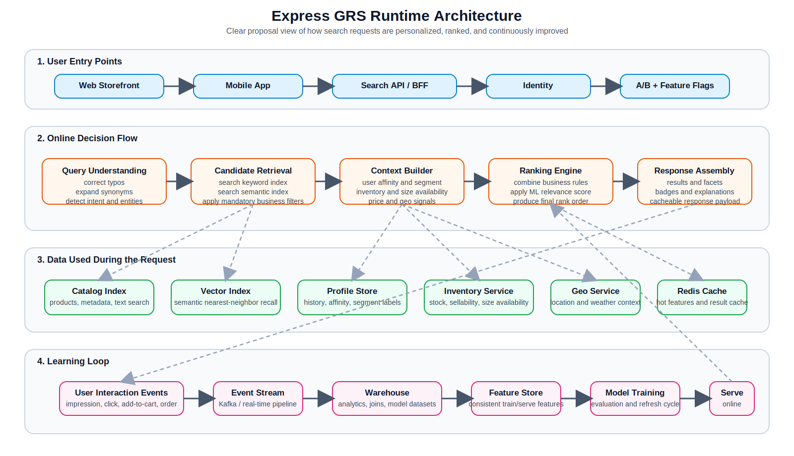
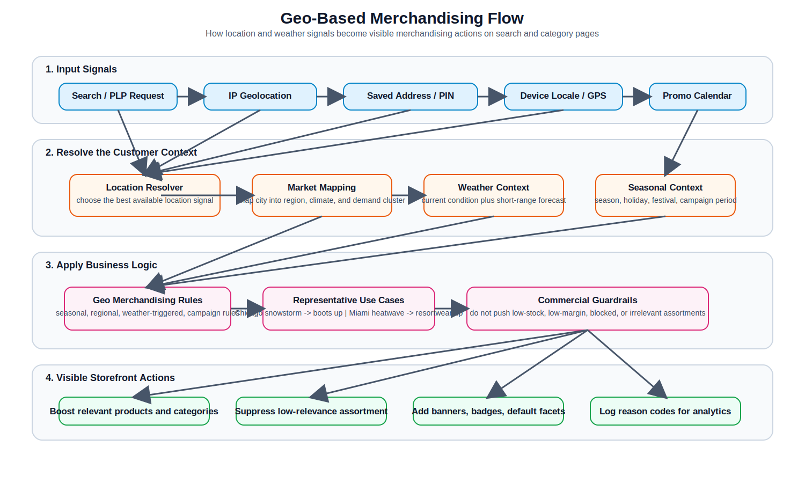
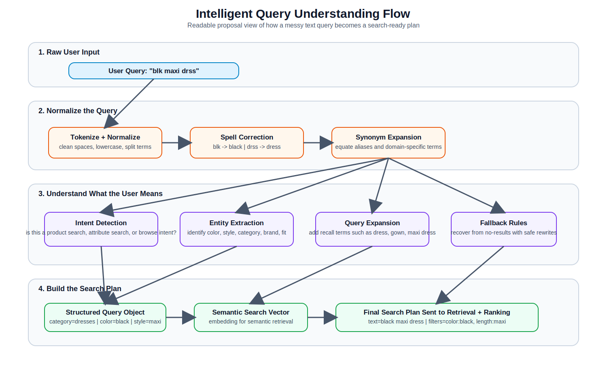

# Express GRS Proposal Diagrams

This document contains proposal-ready static diagrams for Express GRS. These are intended to replace Mermaid flowcharts in presentation or client-facing material.

Design intent for these versions:

- Larger typography and fewer boxes per row for executive readability
- Stronger visual hierarchy so the flow is obvious without zooming
- Business-facing labels instead of low-level tool names
- Cleaner left-to-right/top-to-bottom progression for slide and PDF export

## 1. Express GRS Runtime Architecture

This diagram shows the actual serving path for personalized search and merchandising: request intake, query understanding, candidate retrieval, context building, ranking, response assembly, and the model feedback loop.

## 2. Geo-Based Merchandising Decision Flow

This diagram shows how location, weather, and campaign context are resolved into merchandising actions such as boosting, suppression, pre-applied facets, and analytics reason codes.

## 3. Intelligent Query Understanding Flow

This diagram shows how noisy user input is normalized, understood, expanded, and converted into a structured search plan that downstream retrieval and ranking can execute.

## Notes For Proposal Use

- These diagrams are static SVG assets, so they can be embedded in Markdown, converted to PDF, or inserted into slides.
- They are representative architecture diagrams, not code-level implementation specs.
- File location for all assets: `docs/express/diagrams/`
