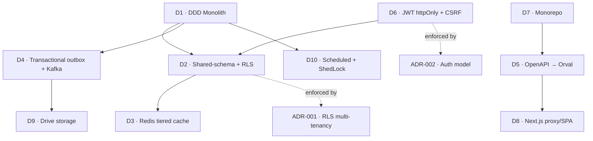

# Architecture Decisions

## Purpose

A consolidated summary of the major architectural choices that shape NU-AURA — the
*why* behind [[System-Overview]], [[C4-Container]], and [[C4-Component]]. Formal,
numbered decision records live in the `11-Decisions` folder; this note links to
[[ADR-001]] and [[ADR-002]] and summarizes the rest inline.

## Context

NU-AURA is a multi-tenant HR platform for many small/medium companies on shared
infrastructure. The decisions below optimize for: strong tenant isolation, a small
operational footprint, type-safe client/server contracts, and a path to future
service extraction without paying microservice tax up front.

## Dependencies

These decisions are inter-dependent — RLS depends on the monolith's single connection
context; Orval codegen depends on SpringDoc OpenAPI; caching tiers depend on Redis.

## Decision Summary

| # | Decision | Choice | Rationale | Evidence |
|---|----------|--------|-----------|----------|
| D1 | Backend shape | **DDD modular monolith** (api → application → domain → infrastructure + common) | One deployable keeps transactions, RLS context, and the approval engine simple; module boundaries enforced by ArchUnit allow later extraction along Kafka seams | `backend/src/main/java/com/nulogic/{api,application,domain,infrastructure,common}`; ArchUnit `backend/src/test/.../architecture/` |
| D2 | Multi-tenancy | **Shared DB / shared schema + PostgreSQL RLS** (fail-closed) | Cheapest per-tenant cost at SMB scale; defence-in-depth (app ThreadLocal + DB RLS) so a single missed `WHERE` cannot leak data | `common/config/TenantRlsTransactionManager.java`; migrations V177 (strict), V254 (NOBYPASSRLS); `common/security/RlsStartupProbe.java` → [[ADR-001]] |
| D3 | Caching | **Redis tiered caches** (25 named, TTL 30s–24h, tenant-scoped keys) | Hot reference data (roles, holidays, departments) served from Redis; graceful fallback to DB on outage | `common/config/CacheConfig.java`, `CacheWarmUpService.java` |
| D4 | Async eventing | **Transactional outbox → Kafka** (6 topics + per-topic `.dlt`) | `EventPublisher` writes domain events to `outbox_events` table atomically with the business tx; `OutboxEventProcessor` polls + dispatches to consumer handlers. Kafka broker is used where provisioned (dev/GKE); outbox makes event delivery durable without a broker (Railway). Decouple write paths from fan-out (notifications, audit, search indexing, payroll); `IdempotencyService` for exactly-once semantics | `infrastructure/kafka/{KafkaTopics,EventPublisher,IdempotencyService}.java`, `kafka/outbox/{OutboxEventProcessor,OutboxEvent}.java` |
| D5 | API contract | **OpenAPI → Orval codegen** | Single source of truth; generated React Query hooks keep client/server types in sync, no hand-written API clients | SpringDoc `OpenApiConfig`; `orval ^7.21.0` → `frontend/lib/generated/api/` |
| D6 | Auth transport | **JWT in httpOnly cookie** (roles only) + CSRF double-submit | No tokens in localStorage (XSS-resistant); permissions loaded from DB/Redis, not the token, so revocation is immediate | `common/security/JwtAuthenticationFilter.java`, `CsrfDoubleSubmitFilter.java`; Google OAuth + SAML 2.0 + API keys → [[ADR-002]] |
| D7 | Repo strategy | **Monorepo** (`frontend/` + `backend/` + `infra/` + `docs/`) | One PR can change contract + producer + consumer atomically; shared CI; Orval reads the backend spec in-repo | repo root layout |
| D8 | Frontend shape | **Next.js App Router as proxy + SPA shell** | Single origin (clean cookies, no CORS); RSC where useful, React Query for server state, Zustand for auth/UI | `frontend/next.config.js` rewrites; `frontend/app/providers.tsx` |
| D9 | Storage | **Google Drive behind `StorageProvider`** | Externalize large files cheaply; pluggable abstraction with a mock fallback for local dev | `common/config/GoogleDriveConfig.java`, `StorageProviderConfig.java` |
| D10 | Scheduling | **`@Scheduled` + ShedLock**, gated by `app.scheduling.enabled` | Multi-pod safety without a separate scheduler service; worker pods run jobs, API pods do not | `common/config/SchedulingConfig.java`, `ShedLockConfig.java` |

## Diagram — decision dependency map

## Related Links

- [[ADR-001]] — RLS multi-tenancy (formal record)
- [[ADR-002]] — JWT-cookie / OAuth / SAML auth model (formal record)
- [[System-Overview]] · [[C4-Context]] · [[C4-Container]] · [[C4-Component]]
- [[Shared-Platform]] · [[Module-Relationships]] · [[Data-Flows]]
- [[Schema]] · [[Permissions]] · [[RBAC-Matrix]] · [[Security-Audit]]
- [[Deployment]] · [[CI-CD]] · [[00-Home]]

## Risks

- **Monolith coupling drift.** Without ArchUnit discipline, module boundaries erode and
  the future-extraction promise (D1) becomes hollow. Keep the architecture tests green.
- **RLS bypass under connection pooling.** D2's guarantee relies on tx-local `SET LOCAL`
  resetting per transaction; any direct-JDBC path that skips the tenant transaction
  manager risks a leak. See [[Security-Audit]].
- **Codegen staleness (D5).** If the committed OpenAPI snapshot drifts from the live
  backend, generated hooks silently diverge. Regenerate on contract changes.
- **Topic-coupled extraction (D4).** Extracting a module later assumes its events are
  already Kafka-mediated; synchronous in-process calls between modules undercut this.

## Operational Notes

- ADRs are the canonical record; this note is a fast index — update both together.
- New cross-cutting decisions (new state store, new auth method, topology change) MUST
  get an ADR in `11-Decisions` and a row here.
- Deviations observed in code but not yet ADR-backed should be flagged in
  [[Architecture-Decisions]] as "undocumented" rather than silently accepted.
