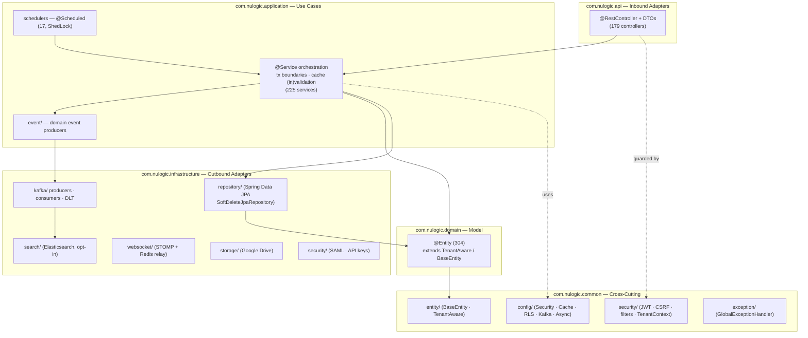
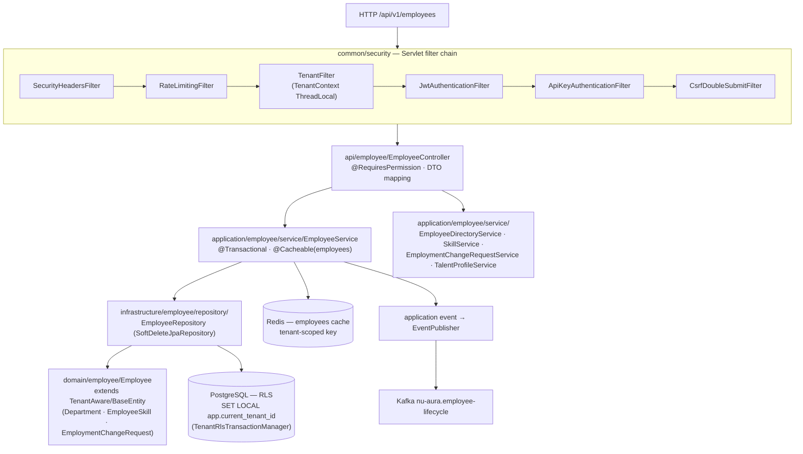

# C4 Component

## Purpose

The **C4 level-3 (Component)** view: the internal structure of the Spring Boot backend
container (from [[C4-Container]]). It shows the DDD layering, the cross-cutting platform
filter chain, and — as a concrete example — the `employee` module sliced across all
four layers. Zoom out to [[C4-Container]] or [[System-Overview]].

## Context

The backend (`backend/src/main/java/com/nulogic/`) is organized by Domain-Driven Design
into five top-level packages. Each bounded context (e.g. `employee`, `payroll`,
`recruitment`) is a **vertical slice** present in `api`, `application`, `domain`, and
`infrastructure`, with shared concerns in `common`.

### Layer responsibilities (verified)

| Layer | Package | Responsibility | Depends on |
|-------|---------|----------------|------------|
| API | `com.nulogic.api.<ctx>` | `@RestController` (179), request/response DTOs, MapStruct mappers, OpenAPI, validation | application |
| Application | `com.nulogic.application.<ctx>` | `@Service` (225) use cases, `@Transactional`, cache put/evict, event publishing, schedulers | domain, infrastructure |
| Domain | `com.nulogic.domain.<ctx>` | `@Entity` (304) JPA model extending `TenantAware` / `BaseEntity` | common/entity |
| Infrastructure | `com.nulogic.infrastructure.<ctx>` | Spring Data repositories, Kafka, Elasticsearch, WebSocket, Drive, SAML/API-key adapters | domain |
| Common | `com.nulogic.common.*` | Config, security filters, base entities, exceptions, health, metrics | — |

Counts verified 2026-06-16: `grep -rl @RestController .../api` → 179; `@Service` (application) → 225;
`@Entity` (domain) → 304; `@Scheduled` sites → 17. Dependency direction enforced by ArchUnit
tests under `backend/src/test/java/com/nulogic/architecture/`.

## Dependencies

The `common` layer (security filters, RLS tx manager, cache config) is a dependency of
every module. See [[Shared-Platform]] for the cross-cutting catalog and [[Services]] /
[[APIs]] for module-level detail.

## Diagram 1 — Backend DDD components

## Diagram 2 — Representative module: `employee` (vertical slice)

Evidence: `backend/src/main/java/com/nulogic/api/employee/EmployeeController.java`,
`application/employee/service/EmployeeService.java` (+ `EmployeeDirectoryService`,
`SkillService`, `EmploymentChangeRequestService`, `TalentProfileService`),
`infrastructure/employee/repository/EmployeeRepository.java`,
`domain/employee/{Employee,Department,EmployeeSkill,EmploymentChangeRequest}.java`.

## Component catalog (common platform)

| Component | File | Role |
|-----------|------|------|
| Tenant context | `common/security/TenantContext.java`, `TenantFilter.java` | Per-request tenant ThreadLocal |
| RLS tx manager | `common/config/TenantRlsTransactionManager.java` | `SET LOCAL` tenant GUC, fail-closed |
| RLS canary | `common/security/RlsStartupProbe.java` | Boot-time RLS regression guard |
| JWT auth | `common/security/JwtAuthenticationFilter.java`, `JwtTokenProvider.java` | httpOnly-cookie JWT (roles only) |
| CSRF | `common/security/CsrfDoubleSubmitFilter.java` | Double-submit cookie |
| Cache | `common/config/CacheConfig.java`, `CacheWarmUpService.java` | 25 tenant-scoped caches |
| Kafka | `infrastructure/kafka/{KafkaTopics,EventPublisher,IdempotencyService}.java` | Events + idempotency + DLT |
| Errors | `common/exception/GlobalExceptionHandler.java` | `@RestControllerAdvice` envelope |

## Related Links

- [[C4-Container]] — the container this drills into
- [[C4-Context]] · [[System-Overview]] · [[Architecture-Decisions]]
- [[Shared-Platform]] — full cross-cutting platform catalog
- [[APIs]] · [[Services]] · [[Middleware]] · [[Schema]] · [[ERD]]
- [[Roles]] · [[Permissions]] · [[RBAC-Matrix]] · [[Security-Audit]]
- [[Module-Relationships]] · [[Data-Flows]] · [[System-Flows]] · [[00-Home]]

## Risks

- **Layer-skip leaks.** A controller calling a repository directly (bypassing the
  service tx boundary) can escape the RLS transaction manager and the cache layer.
  ArchUnit guards this — keep those tests green. See [[Architecture-Decisions]].
- **Wide `common` blast radius.** A change in `common/security` or `common/config`
  affects every module simultaneously; review such changes against [[Security-Audit]].
- **Per-module cache invalidation correctness.** Stale tenant-scoped cache entries after
  a write are a data-correctness risk if evict annotations miss a mutation path.
- **Event/consumer coupling.** Modules that depend on another module's Kafka event shape
  ([[Module-Relationships]]) break silently if the producer changes the payload.

## Operational Notes

- New modules MUST follow the four-layer slice and extend `TenantAware`/`BaseEntity`;
  repositories extend `SoftDeleteJpaRepository`.
- Authorization is declarative: `@RequiresPermission` + `PermissionAspect` resolve
  against the DB/Redis permission model ([[Permissions]], [[RBAC-Matrix]]) — the JWT
  carries roles only.
- Errors return a typed `ErrorResponse` via `GlobalExceptionHandler`; do not leak
  stack traces. See [[APIs]].
