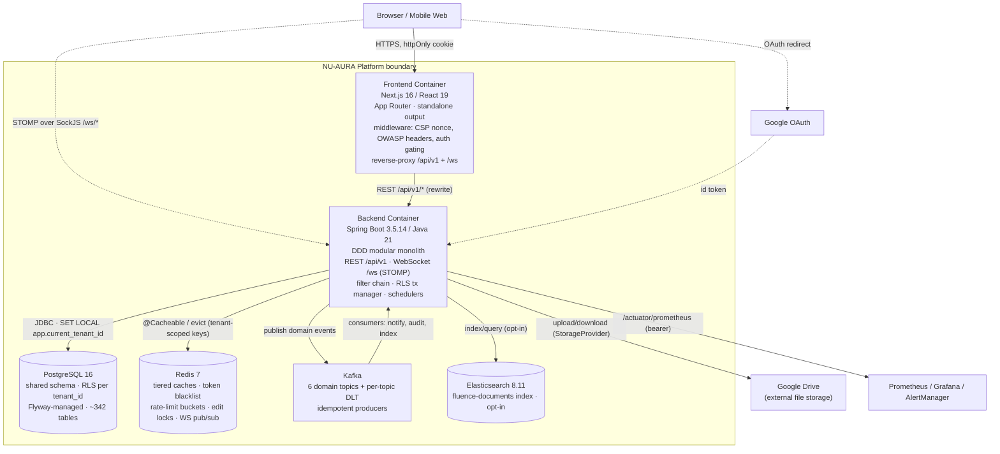

# C4 Container

## Purpose

The **C4 level-2 (Container)** view: the deployable/runtime units inside the NU-AURA
boundary and how they communicate. Zoom in from [[C4-Context]]; zoom further into the
backend internals at [[C4-Component]].

## Context

Two application containers (Next.js frontend, Spring Boot backend) plus four stateful
backing services (PostgreSQL, Redis, Kafka, Elasticsearch) and one external file store
(Google Drive). The frontend is the only thing the browser talks to directly — it
proxies REST and WebSocket to the backend.

## Dependencies

| Container | Tech | Talks to | Protocol |
|-----------|------|----------|----------|
| Frontend | Next.js 16 / React 19, Mantine, React Query, Zustand | Backend (proxy) | HTTP rewrite `/api/v1/*`, `/ws/*` |
| Backend | Spring Boot 3.5.14 / Java 21, 179 controllers | PG, Redis, Kafka, ES, Drive | JDBC, RESP, Kafka protocol, HTTP |
| PostgreSQL 16 | RLS, ~342 tables, Flyway V0→V294+ | Backend only | JDBC (`SET LOCAL` tenant GUC) |
| Redis 7 | 25 named caches, Bucket4j, ShedLock | Backend only | RESP + Lua |
| Kafka (Confluent) | 6 topics + `.dlt` | Backend (produce + consume) | Kafka protocol |
| Elasticsearch 8.11 | `fluence-documents` index (opt-in) | Backend only | HTTP REST |
| Google Drive | Service-account file storage | Backend (`StorageProvider`) | HTTPS (Drive v3) |

## Diagram — Container view (C4 L2)

## Container responsibilities

### Frontend (Next.js)
App Router app under `frontend/app/` ([[Routes]], [[Pages]], [[Components]]). Server
state via TanStack Query over Orval-generated hooks (`frontend/lib/generated/api/`);
auth/UI state in Zustand. `frontend/next.config.js` rewrites proxy REST + WS to the
backend so the browser sees a single origin. Edge security in `middleware.ts`
([[Middleware]]): CSP nonce, OWASP headers, route-level auth gating + RBAC redirects.

### Backend (Spring Boot)
DDD modular monolith ([[C4-Component]]). Exposes REST `/api/v1/*` ([[APIs]]) and
WebSocket `/ws/*`. The servlet filter chain establishes tenant + identity per request
before the controller runs ([[Data-Flows]]). Application [[Services]] own transactions,
cache invalidation, and event publishing. Multi-pod-safe scheduled jobs via ShedLock.

### Backing services
PostgreSQL is the system of record ([[Schema]], [[ERD]]); Redis is cache + coordination;
Kafka is the async backbone; Elasticsearch is opt-in Fluence search; Drive is file
storage. Each has a fallback so an outage degrades rather than fails — see
[[System-Overview]].

## Related Links

- [[C4-Context]] — wider zoom (actors + external systems)
- [[C4-Component]] — narrower zoom (backend DDD layers + a module)
- [[System-Overview]] · [[Architecture-Decisions]] · [[Shared-Platform]]
- [[Routes]] · [[Pages]] · [[Components]] · [[Middleware]] · [[APIs]] · [[Services]]
- [[Schema]] · [[ERD]] · [[Data-Flows]] · [[System-Flows]]
- [[Deployment]] · [[CI-CD]] · [[Production-Support]] · [[00-Home]]

## Risks

- **Single backend container = single failure domain** for all four sub-apps. HPA
  (2–10 replicas) and stateless design mitigate, but a poison deploy hits everything.
- **Proxy as a hard dependency.** If the Next.js rewrite layer misbehaves, the browser
  cannot reach the API even when the backend is healthy. See [[Middleware]].
- **WebSocket fan-out across pods** depends on `RedisWebSocketRelay` — a Redis outage
  silently degrades real-time delivery (falls back to single-pod scope).
- **Kafka back-pressure.** Payroll topic runs concurrency=1 (serialized); a stuck
  consumer stalls payroll event processing. Watch DLT depth. See [[Production-Support]].

## Operational Notes

- Local: FE `:3000`, BE `:8080`; Redis/Kafka/ES/Prometheus via `docker-compose.yml`.
- Prod: GKE, frontend + backend deployments behind an ingress that routes `/api/*` and
  `/ws/*` to the backend, everything else to the frontend. See [[Deployment]].
- Scheduled jobs run only on worker pods (`app.scheduling.enabled=true`) under ShedLock.
- Images are Cosign-signed in CI before staging/prod promotion. See [[CI-CD]].
