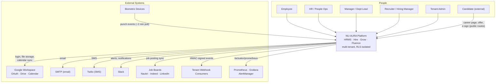

# C4 Context

## Purpose

The **C4 level-1 (System Context)** view of NU-AURA: who uses the platform, and which
external systems it depends on. This is the widest zoom — internal containers are not
shown here (see [[C4-Container]]). It frames [[System-Overview]] for non-implementers.

## Context

NU-AURA sits at the center as a single logical system. Around it are human actors
(internal staff and external candidates) and external services it integrates with for
identity, communication, storage, recruitment, attendance, and observability.

### Actors

| Actor | Uses NU-AURA for | Surface |
|-------|------------------|---------|
| Employee | Self-service: leave, attendance, payslips, profile, wiki, wall | `frontend/app/me/*` + [[Nu-HRMS]] / [[Nu-Fluence]] |
| HR / People Ops | Employee lifecycle, payroll, compliance, benefits | [[Nu-HRMS]] |
| Manager / Dept Lead | Approvals, team attendance, reviews, OKRs | [[Nu-HRMS]] / [[Nu-Grow]] |
| Recruiter / Hiring Manager | Requisitions, candidates, scorecards, offers | [[Nu-Hire]] |
| Candidate (external) | Career page, application, offer acceptance, e-sign | public routes |
| Tenant Admin | Tenant settings, roles, feature flags, integrations | [[Shared-Platform]] |

## Dependencies (external systems)

| External system | Direction | Purpose | Evidence |
|-----------------|-----------|---------|----------|
| Google Workspace | out | OAuth 2.0 login, Drive file storage, Calendar sync | `GoogleDriveConfig.java`, `@react-oauth/google` |
| SMTP | out | Email notifications, digests | `EmailSchedulerService` |
| Twilio | out | SMS notifications | integration module |
| Slack | out | Alerts, notifications, AlertManager routing | integration module |
| Job Boards (Naukri / Indeed / LinkedIn) | out | Job-posting sync ([[Nu-Hire]]) | `JobBoardIntegrationService` |
| Biometric Devices | in | Punch events polled every ~2 min | `BiometricIntegrationService` |
| Tenant Webhook Consumers | out | HMAC-signed domain events | `WebhookDeliveryService` |
| Prometheus / Grafana / AlertManager | out | Metrics scrape + dashboards + alerting | `/actuator/prometheus` |

## Diagram — System Context (C4 L1)

## Related Links

- [[System-Overview]] — narrative + tech stack
- [[C4-Container]] — zoom into containers (Next.js, Spring Boot, PG, Redis, Kafka, ES)
- [[C4-Component]] — zoom into backend DDD components
- [[Nu-HRMS]] · [[Nu-Hire]] · [[Nu-Grow]] · [[Nu-Fluence]] · [[Shared-Platform]]
- [[Roles]] · [[Permissions]] · [[RBAC-Matrix]] — who-can-do-what
- [[Data-Flows]] · [[System-Flows]] · [[Architecture-Decisions]] · [[00-Home]]

## Risks

- **External-dependency availability.** OAuth (Google), SMTP, and Drive are on critical
  paths (login, notifications, file access). Login is hard-blocked if Google OAuth is
  down; storage and notifications degrade more gracefully.
- **Inbound biometric trust boundary.** Devices push punch data inbound — input
  validation and per-tenant scoping matter. See [[Security-Audit]].
- **Webhook fan-out abuse.** Outbound webhooks to tenant consumers need retry caps and
  HMAC signing to avoid amplification / spoofing. Handled by `WebhookDeliveryService`.

## Operational Notes

- Candidate-facing routes are **public** (no auth) — they are the only unauthenticated
  surface and are rate-limited separately. See [[Middleware]].
- All external integration credentials are per-tenant where applicable and encrypted at
  rest (`CryptoConverter` / `EncryptionService`).
- Observability is pull-based (Prometheus scrapes the backend with a bearer token);
  alerts route to `#nu-aura-alerts` via AlertManager → Slack. See [[Production-Support]].
