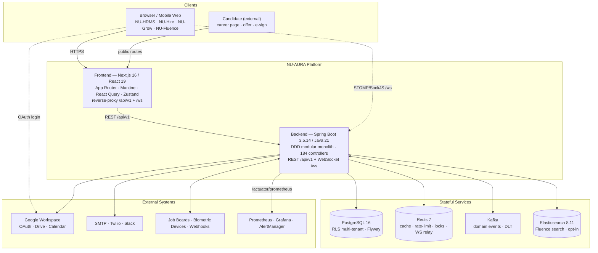
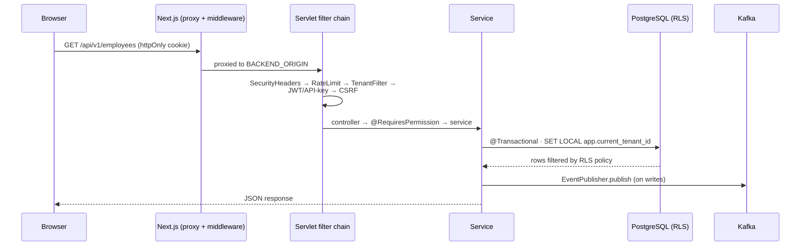
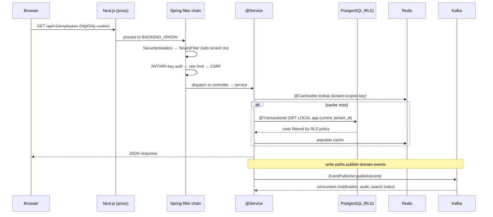

# System Overview

## Purpose

NU-AURA is a **multi-tenant HR-management platform** delivered as a bundle of four
sub-applications behind one shell: [[Nu-HRMS]] (core HR), [[Nu-Hire]] (recruitment),
[[Nu-Grow]] (performance / learning), and [[Nu-Fluence]] (knowledge / social). All
four are served by a single Next.js frontend and a single Spring Boot **modular
monolith** backend, sharing one PostgreSQL database and schema, isolated at the row
level by Row-Level Security.

This note is the level-0 map. Drill down via [[C4-Context]] → [[C4-Container]] →
[[C4-Component]], and see [[Architecture-Decisions]] for the *why*.

## Context

- **One deployable each side.** The frontend (`frontend/`) is a single Next.js 16 App
  Router app; the backend (`backend/`) is one Spring Boot deployable organized by DDD
  bounded context. The cross-app personal portal lives at `frontend/app/me/*`.
- **Shared platform layer.** Auth, tenancy, RBAC, caching, eventing, and observability
  are shared by all four sub-apps — see [[Shared-Platform]].
- **Single origin.** The Next.js server reverse-proxies `/api/v1/*` and `/ws/*` to the
  backend (`frontend/next.config.js` rewrites), so the browser sees one origin (clean
  httpOnly cookies, no CORS in prod). See [[Middleware]] and [[Data-Flows]].

| Sub-App        | Domain                                              | Frontend routes |
|----------------|-----------------------------------------------------|-----------------|
| [[Nu-HRMS]]    | Core HR: employees, payroll, attendance, leave, performance, benefits, compliance | `frontend/app/{employees,payroll,attendance,leave,performance,...}` |
| [[Nu-Hire]]    | Recruitment, agencies, scorecards, onboarding, career page, e-sign | `frontend/app/recruitment/*`, `careers/*` |
| [[Nu-Grow]]    | Reviews, OKRs, 360 feedback, LMS, training, surveys, wellness | served via core HRMS routes + performance/training modules |
| [[Nu-Fluence]] | Knowledge base, wiki, blogs, templates, search, AI chat, social wall | `frontend/app/fluence/*` |

## Dependencies

| Layer | Technology | Evidence |
|-------|-----------|----------|
| Frontend | Next.js 16 (App Router), React 19, TypeScript strict | `frontend/package.json`: `next ^16.2.7`, `react 19.2.7` |
| UI / state | Mantine 9, Tailwind, Radix UI, TanStack Query v5, Zustand, Axios, RHF+Zod, Framer Motion 12 | `@mantine/core ^9.3.0`, `@tanstack/react-query ^5.x`, `zustand ^5.x` |
| API codegen | Orval (OpenAPI → React Query hooks) | `orval ^7.21.0` → `frontend/lib/generated/api/` |
| Realtime (FE) | STOMP + SockJS (`@stomp/stompjs`) | `frontend/` realtime client |
| Rich content | Tiptap, ExcelJS, DOMPurify | `frontend/package.json` |
| Backend | Java 21, Spring Boot 3.5.14 (BOM) | `backend/pom.xml`, `.claude/CLAUDE.md` |
| Persistence | PostgreSQL 16 (Neon dev / PG16 prod), Hibernate 6 (`@SQLRestriction` soft-delete), Flyway | `db/migration/` V0→V294+ |
| Cache / coord | Redis 7 (Bucket4j 8.x, ShedLock 7.7.0) | `common/config/CacheConfig.java` |
| Messaging | Kafka (Confluent) — 6 domain topics + DLT | `infrastructure/kafka/KafkaTopics.java` |
| Search | Elasticsearch 8.11 (opt-in) | `common/config/ElasticsearchConfig.java` |
| File storage | Google Drive (service account, v3 API) | `common/config/GoogleDriveConfig.java` |
| AuthN | Google OAuth, JWT (httpOnly cookie), SAML 2.0, API keys (JJWT 0.13.0) | `common/config/SecurityConfig.java` |
| Mapping | MapStruct 1.6.3 | `backend/pom.xml` |
| Docs / OpenAPI | SpringDoc OpenAPI | `backend/pom.xml` |
| Observability | Micrometer + Prometheus + Grafana, OTLP tracing | `/actuator/prometheus` |
| Deployment | Docker Compose (dev), Kubernetes on GCP GKE (prod), GitHub Actions CI/CD | `infra/deployment/kubernetes/` |

> **Version note:** the canonical framework BOM is Spring Boot **3.5.14**. The two
> `<version>3.3.1</version>` entries in `backend/pom.xml` are **Apache Tika**
> (`tika-core`, `tika-parsers-standard-package`) — unrelated to Spring Boot, so there
> is no framework version skew.

## Diagrams

### System landscape



### Request anatomy (write path)



See [[Data-Flows]] and [[System-Flows]] for the full lifecycle, and [[RBAC-Matrix]]
for the authorization model.

## Top-Level Components

### Frontend — Next.js (App Router)

`frontend/` — Next.js 16, React 19, TypeScript (strict), Mantine UI + Tailwind,
React Query (TanStack v5) for server state, Zustand for client/auth state, Axios
HTTP client with httpOnly-cookie auth. API hooks are generated by **Orval** from
the backend OpenAPI spec into `frontend/lib/generated/api/`. The Next server also
acts as a reverse proxy: `next.config.js` rewrites `/api/v1/*` and `/ws/*` to
`BACKEND_ORIGIN`, so the browser sees a single origin (clean cookies, no CORS in
production). Provider stack and auth wiring live in `frontend/app/providers.tsx`.

### Backend — Spring Boot (modular monolith)

`backend/` — Java 21, Spring Boot (BOM **3.5.14**), packaged as a single deployable.
Code follows DDD layering under `com.nulogic`:

```
api/            @RestController + request/response DTOs + MapStruct mappers
application/    @Service orchestration, transactions, cache invalidation, schedulers
domain/         JPA entities (@Entity) organized by bounded context
infrastructure/ repositories, Kafka, websocket, search, tenant data-source plumbing
common/         cross-cutting config, security filters, exceptions, utilities
```

Exposes REST under `/api/v1/*` and WebSocket (STOMP over SockJS) under `/ws/*`.
Key config classes verified in `backend/.../common/config/`: `SecurityConfig`,
`TenantRlsTransactionManager`, `TenantAwareDataSourceConfig`, `CacheConfig`,
`RedisConfig`, `ElasticsearchConfig`, `GoogleDriveConfig`, `SamlSecurityConfig`.

### PostgreSQL — system of record

PostgreSQL 16 (Neon in dev, self-hosted PG 16 in prod). ~331 distinct tables; every
tenant-aware table carries `tenant_id UUID NOT NULL`. Schema is managed by **Flyway**
(`backend/src/main/resources/db/migration/`, V0 → V294+). Row-Level Security policies
provide defence-in-depth tenant isolation (see [[Security-Audit]]).

### Redis — caching & coordination

Redis 7 backs many cross-cutting concerns (`common/config/CacheConfig.java`,
`RedisConfig.java`, and infrastructure services):

| Concern              | Mechanism |
|----------------------|-----------|
| Caching              | 20+ named caches, tenant-scoped keys, tiered TTLs (5min–24h) |
| Distributed rate limiting | `DistributedRateLimiter` (Redis Lua + Bucket4j fallback) |
| Token blacklist      | `TokenBlacklistService` (logout/password-change revocation) |
| Distributed locks    | edit locks, account lockout, idempotency (SETNX) |
| WebSocket relay      | `RedisWebSocketRelay` Pub/Sub for multi-pod fan-out |

### Kafka — domain events

Confluent Kafka for asynchronous domain events (approval, notification, audit,
employee-lifecycle, Fluence content, payroll). Producers via `EventPublisher`;
consumers under `infrastructure/kafka/`; dead-letter handling and `IdempotencyService`
for exactly-once processing; tenant context propagated onto records.

### Elasticsearch — full-text search (opt-in)

Elasticsearch 8.11 powers full-text search (Fluence knowledge base, employees,
documents). Activated via `app.elasticsearch.enabled=true` (`ElasticsearchConfig.java`);
the platform degrades gracefully to `pg_trgm` when disabled.

### Google Drive — file storage

File/document storage (contracts, receipts, employee documents) goes to Google Drive
via a service-account integration (`GoogleDriveConfig.java`) behind a `StorageProvider`
abstraction, with a mock provider fallback for local dev.

## How the Pieces Connect — Request Flow



**Key connection facts (evidence-grounded):**

- **Single origin** — the browser only talks to the Next.js server; it proxies REST
  and WebSocket to the backend (`frontend/next.config.js` rewrites for `/api/v1/:path*`
  and `/ws/:path*`).
- **Cookie-based auth** — JWT lives in an httpOnly cookie; no tokens in localStorage.
  CSRF uses a double-submit cookie pattern.
- **Tenant context** — set per-request by `TenantFilter`, pushed into the DB session
  by `TenantRlsTransactionManager` / `TenantAwareDataSourceConfig` so RLS policies
  evaluate `current_setting('app.current_tenant_id')`.
- **Cache-aside** — reads hit Redis first via `@Cacheable`; writes evict.
- **Event-driven side effects** — writes publish to Kafka; consumers handle
  notifications, audit, and search indexing asynchronously.
- **Generated API contract** — frontend hooks are generated from the backend's
  SpringDoc OpenAPI spec (Orval), keeping client/server types in sync.

## Multi-Tenancy & Security (summary)

- **Model:** shared-database / shared-schema; every tenant-aware table has
  `tenant_id UUID NOT NULL`.
- **Layer 1 (application):** `TenantContext` ThreadLocal + `TenantFilter` validating
  the tenant on each request; JPA queries scoped by tenant.
- **Layer 2 (database):** PostgreSQL RLS policies, hardened to **fail-closed**
  (V177 strict policies, V254 NOBYPASSRLS runtime role + `RlsStartupProbe` canary).
  Flyway runs under a separate BYPASSRLS migration role.
- **AuthN:** JWT (httpOnly cookie) + optional SAML 2.0 SSO + API keys for integrations.
  **AuthZ:** DB-backed role/permission model, cached in Redis.
- **Hardening:** BCrypt cost 12, password policy + lockout, OWASP security headers at
  both the Next.js edge and Spring Security, per-scope rate limiting.

See [[Data-Flows]] (tenancy / RLS flow) and the RLS migrations for full detail.

## Related Links

- [[C4-Context]] · [[C4-Container]] · [[C4-Component]] — progressive zoom
- [[Architecture-Decisions]] · [[ADR-001]] · [[ADR-002]] — the rationale
- [[Nu-HRMS]] · [[Nu-Hire]] · [[Nu-Grow]] · [[Nu-Fluence]] · [[Shared-Platform]]
- [[Module-Relationships]] · [[Data-Flows]] · [[System-Flows]]
- [[APIs]] · [[Services]] · [[Middleware]] · [[Schema]] · [[ERD]]
- [[Roles]] · [[Permissions]] · [[RBAC-Matrix]] · [[Security-Audit]]
- [[Deployment]] · [[CI-CD]] · [[Production-Support]] · [[00-Home]]

## Risks

- **Monolith blast radius.** A single deployable means a backend regression can affect
  all four sub-apps at once. Mitigated by in-package module boundaries (ArchUnit) and
  Kafka-topic seams for future extraction — see [[Architecture-Decisions]].
- **RLS is the last line of tenant isolation.** Any pooled-connection GUC leak is a
  cross-tenant data risk. Hardened fail-closed (V177 strict policies, V254 NOBYPASSRLS
  + `RlsStartupProbe`). See [[Security-Audit]].
- **Opt-in search drift.** Elasticsearch is off by default; Fluence search degrades to
  `pg_trgm`. Index/source divergence is possible if the indexing consumer lags.

## Operational Notes

- **Ports:** frontend `:3000`, backend `:8080` (fixed for local dev).
- **Scheduled work** is gated by `app.scheduling.enabled` (default on; set
  `APP_SCHEDULING_ENABLED=false` on web pods) — **25 `@Scheduled` methods across 15
  components, 24 `@SchedulerLock`-guarded** for multi-pod safety (1 intentional per-pod
  Redis probe). See [[Scheduled-Jobs]] and [[Production-Support]].
- **Graceful degradation:** Redis cache, Elasticsearch, and Google Drive each have a
  fallback path (DB / pg_trgm / mock provider) so a dependency outage does not 500.
- **Deployment shapes:** local Docker Compose (Redis/Kafka/Elasticsearch/Prometheus/
  Grafana via `docker-compose.yml`, DB on Neon cloud or local PG 16); beta (Vercel +
  Render); production GKE via Helm behind an ingress that routes `/api/*` and `/ws/*`
  to the backend and everything else to the frontend; images are signed (Cosign) in CI
  before staging/production deploys. See [[Deployment]] and [[CI-CD]].
