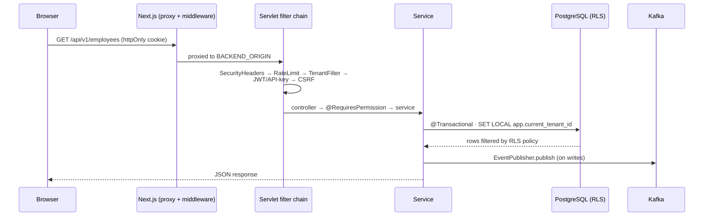

# System Overview

## Purpose

NU-AURA is a **multi-tenant HR-management platform** delivered as a bundle of four
sub-applications behind one shell: [[Nu-HRMS]] (core HR), [[Nu-Hire]] (recruitment),
[[Nu-Grow]] (performance / learning), and [[Nu-Fluence]] (knowledge / social). All
four are served by a single Next.js frontend and a single Spring Boot **modular
monolith** backend, sharing one PostgreSQL database isolated by Row-Level Security.

This note is the level-0 map. Drill down via [[C4-Context]] → [[C4-Container]] →
[[C4-Component]], and see [[Architecture-Decisions]] for the *why*.

## Context

- **One deployable each side.** The frontend (`frontend/`) is a single Next.js 16 App
  Router app; the backend (`backend/`) is one Spring Boot deployable organized by DDD
  bounded context. The cross-app personal portal lives at `frontend/app/me/*`.
- **Shared platform layer.** Auth, tenancy, RBAC, caching, eventing, and observability
  are shared by all four sub-apps — see [[Shared-Platform]].
- **Single origin.** The Next.js server reverse-proxies `/api/v1/*` and `/ws/*` to the
  backend (`frontend/next.config.js` rewrites), so the browser sees one origin (clean
  httpOnly cookies, no CORS in prod). See [[Middleware]] and [[Data-Flows]].

| Sub-App        | Domain                                              | Frontend routes |
|----------------|-----------------------------------------------------|-----------------|
| [[Nu-HRMS]]    | Employees, payroll, attendance, leave, benefits     | `frontend/app/{employees,payroll,attendance,...}` |
| [[Nu-Hire]]    | Recruitment, agencies, scorecards, onboarding, e-sign | `frontend/app/recruitment/*`, `careers/*` |
| [[Nu-Grow]]    | Reviews, OKRs, 360 feedback, LMS, surveys, wellness | performance / training routes |
| [[Nu-Fluence]] | Wiki, blogs, templates, search, AI chat, social wall | `frontend/app/fluence/*` |

## Dependencies

| Layer | Technology | Evidence |
|-------|-----------|----------|
| Frontend | Next.js 16 (App Router), React 19, TypeScript strict | `frontend/package.json`: `next ^16.2.7`, `react 19.2.7` |
| UI / state | Mantine 9, Tailwind, TanStack Query v5, Zustand, Axios, RHF+Zod | `@mantine/core ^9.3.0`, `@tanstack/react-query ^5.x`, `zustand ^5.x` |
| API codegen | Orval (OpenAPI → React Query hooks) | `orval ^7.21.0` → `frontend/lib/generated/api/` |
| Backend | Java 21, Spring Boot 3.5.14 (BOM) | `backend/pom.xml`, `.claude/CLAUDE.md` |
| Persistence | PostgreSQL 16 (Neon dev / PG16 prod), Hibernate 6, Flyway | `db/migration/` V0→V294+ |
| Cache / coord | Redis 7 (Bucket4j, ShedLock) | `common/config/CacheConfig.java` |
| Messaging | Kafka (Confluent) — 6 domain topics + DLT | `infrastructure/kafka/KafkaTopics.java` |
| Search | Elasticsearch 8.11 (opt-in) | `common/config/ElasticsearchConfig.java` |
| File storage | Google Drive (service account) | `common/config/GoogleDriveConfig.java` |
| AuthN | Google OAuth, JWT (httpOnly cookie), SAML 2.0, API keys | `common/config/SecurityConfig.java` |

> **Version note:** the canonical BOM is Spring Boot 3.5.14; a stray `<version>3.3.1</version>`
> appears in `backend/pom.xml` as a transitive/plugin pin — do not treat it as the framework version.

## Diagrams

### System landscape

### Request anatomy (write path)

See [[Data-Flows]] and [[System-Flows]] for the full lifecycle, and [[RBAC-Matrix]]
for the authorization model.

## Related Links

- [[C4-Context]] · [[C4-Container]] · [[C4-Component]] — progressive zoom
- [[Architecture-Decisions]] · [[ADR-001]] · [[ADR-002]] — the rationale
- [[Nu-HRMS]] · [[Nu-Hire]] · [[Nu-Grow]] · [[Nu-Fluence]] · [[Shared-Platform]]
- [[Module-Relationships]] · [[Data-Flows]] · [[System-Flows]]
- [[APIs]] · [[Services]] · [[Middleware]] · [[Schema]] · [[ERD]]
- [[Roles]] · [[Permissions]] · [[RBAC-Matrix]] · [[Security-Audit]]
- [[Deployment]] · [[CI-CD]] · [[Production-Support]] · [[00-Home]]

## Risks

- **Monolith blast radius.** A single deployable means a backend regression can affect
  all four sub-apps at once. Mitigated by in-package module boundaries (ArchUnit) and
  Kafka-topic seams for future extraction — see [[Architecture-Decisions]].
- **RLS is the last line of tenant isolation.** Any pooled-connection GUC leak is a
  cross-tenant data risk. Hardened fail-closed (V177 strict policies, V254 NOBYPASSRLS
  + `RlsStartupProbe`). See [[Security-Audit]].
- **Opt-in search drift.** Elasticsearch is off by default; Fluence search degrades to
  `pg_trgm`. Index/source divergence is possible if the indexing consumer lags.
- **Doc-vs-code version skew.** `backend/pom.xml` shows a `3.3.1` pin alongside the
  3.5.14 BOM — verify before quoting framework version.

## Operational Notes

- **Ports:** frontend `:3000`, backend `:8080` (fixed for local dev).
- **Scheduled work** runs only on worker pods (`app.scheduling.enabled=true`), guarded by
  ShedLock for multi-pod safety — 17 `@Scheduled` sites. See [[Production-Support]].
- **Graceful degradation:** Redis cache, Elasticsearch, and Google Drive each have a
  fallback path (DB / pg_trgm / mock provider) so a dependency outage does not 500.
- **Deployment shapes:** local Docker Compose, beta (Vercel + Render), production GKE
  via Helm. See [[Deployment]] and [[CI-CD]].
