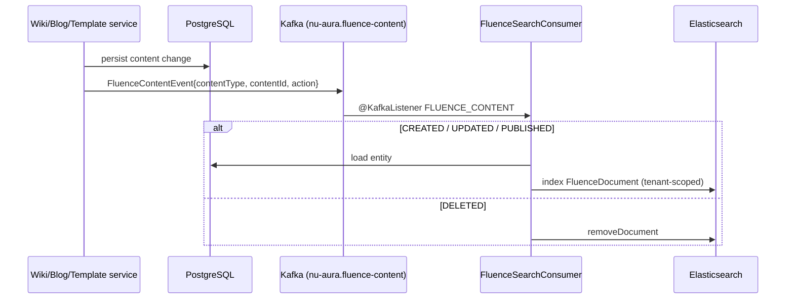

# NU-Fluence

> Knowledge & internal-social sub-app of [[System-Overview|NU-AURA]]. The company handbook +
> activity wall + RAG AI chat. Siblings: [[Nu-HRMS]], [[Nu-Hire]], [[Nu-Grow]].
> Cross-cutting services in [[Shared-Platform]]. Grounding doc: `docs/apps/nu-fluence.md`.

## Purpose

NU-Fluence is the company knowledge hub: a Confluence-style **wiki**, a **blog**, reusable
page **templates**, a file **drive**, an **activity wall** (praise/shout-outs), unified
full-text **search**, and an **AI chat** assistant grounded in the knowledge base via RAG.
Route group `frontend/app/fluence/*`; hub at `/fluence`.

## Business Capability

- **Wiki** — spaces → page tree, versioning, inline comments, watch, edit-lock, approval tasks.
- **Blog & templates** — long-form posts with categories; pre-built page structures.
- **Drive** — file/attachment storage and browsing.
- **Activity wall** — posts, reactions, nested comments, pins, votes, praise-for-employee.
- **Search** — Elasticsearch full-text (opt-in) with a PostgreSQL fallback path.
- **AI chat** — SSE-streamed RAG Q&A with source citations; delivered as a global floating widget.
- **Analytics** — content engagement dashboard (views, activity trends, distribution).

## Entry Points

### Key frontend routes (`frontend/app/fluence/...`)

| Surface | Route |
|---------|-------|
| Hub | `/fluence` |
| Wiki | `/fluence/wiki`, `/fluence/wiki/new`, `/fluence/wiki/[slug]`, `/fluence/wiki/[slug]/edit` |
| Blogs | `/fluence/blogs`, `/fluence/blogs/new`, `/fluence/blogs/[slug]`, `/fluence/blogs/[slug]/edit` |
| Templates | `/fluence/templates`, `/fluence/templates/new`, `/fluence/templates/[id]` |
| Drive / wall | `/fluence/drive`, `/fluence/wall` |
| Search / mine / analytics | `/fluence/search`, `/fluence/my-content`, `/fluence/analytics` |
| AI Chat | **no route** — `FluenceChatWidget` mounted globally in `AppLayout.tsx` |

Data layer: `lib/hooks/queries/useFluence.ts`, `useWall.ts`, `useFluenceChat.ts` (streams
via `fluence-chat.service.ts`). Editor is Tiptap (`components/fluence/editor/FluenceEditor.tsx`).
See [[Pages]], [[Routes]], [[Components]]. Hub gates on `KNOWLEDGE:VIEW`, `WIKI:VIEW`, or
`BLOG:VIEW`, else redirects to `/me/dashboard`.

### Backend controllers / packages (`backend/src/main/java/com/nulogic/api/...`)

| Controller | Base path |
|------------|-----------|
| `WikiSpaceController`, `WikiPageController`, `WikiInlineCommentController` | `/knowledge/wiki/spaces`, `/knowledge/wiki/pages` |
| `BlogPostController`, `BlogCategoryController` | `/knowledge/blogs`, `/knowledge/blogs/categories` |
| `TemplateController` | `/knowledge/templates` |
| `KnowledgeSearchController` | `/knowledge/search` (PostgreSQL fallback) |
| `FluenceSearchController` | `/fluence/search` (Elasticsearch → `Page<FluenceDocument>`) |
| `FluenceChatController` | `/fluence/chat` (SSE streaming RAG) |
| `FluenceActivityController`, `FluenceCommentController`, `ContentEngagementController` | `/fluence/activities`, `/fluence/comments`, `/fluence/engagement` |
| `FluenceAttachmentController`, `FluenceEditLockController` | `/fluence/attachments`, `/fluence/edit-lock` |
| `WallController` | `/wall` |

Entities under `domain/knowledge` (`WikiSpace`, `WikiPage`, `WikiPageVersion`, `BlogPost`,
`DocumentTemplate`, `FluenceActivity`, ...) and `domain/wall/model`. App service
`FluenceChatService` orchestrates the RAG pipeline. See [[APIs]], [[Services]].

## Dependencies

- **Elasticsearch** — full-text index (`FluenceDocument`, tenant-keyed); opt-in via
  `app.elasticsearch.enabled`, falls back to PostgreSQL search when off ([[Shared-Platform]]).
- **Kafka** — `FluenceContentEvent` CDC pipeline keeps Postgres (system of record) and ES
  (read model) eventually consistent via `FluenceSearchConsumer`.
- **Redis** — distributed edit locks (`FluenceEditLockService`, ~5-min TTL) for the
  collaborative Tiptap editor.
- **LLM** — `LlmStreamingService` for RAG completions; gated by `KNOWLEDGE:SEARCH`.
- **Auth / RBAC** — dedicated knowledge/wiki/blog/wall permission cluster ([[Permissions]],
  [[Roles]], [[RBAC-Matrix]]).
- **Multi-tenancy** — three-layer isolation: `TenantContext`, PostgreSQL RLS, tenant-keyed ES
  index ([[Middleware]], [[Schema]], [[Security-Audit]]).
- **File storage** — Drive attachments via Google Drive `StorageProvider`.

## Technical Flow — search indexing (CDC pipeline)

## Ownership

Self-assessed — no formal owners in the repo. The most infrastructure-heavy sub-app (ES +
Kafka + Redis locks + LLM); treat changes here as cross-stack.

## Related Links

- [[System-Overview]] · [[C4-Container]] · [[Module-Relationships]] · [[Data-Flows]] · [[System-Flows]]
- Siblings: [[Nu-HRMS]] · [[Nu-Hire]] · [[Nu-Grow]]
- Platform: [[Shared-Platform]] · [[Middleware]] · [[Roles]] · [[Permissions]] · [[RBAC-Matrix]] · [[Schema]] · [[ERD]] · [[APIs]] · [[Services]] · [[Pages]] · [[Routes]] · [[Components]] · [[Security-Audit]]
- Grounding: `docs/apps/nu-fluence.md`

## Risks

- **RLS history** — Fluence tables once had RLS enabled with **zero policies**
  (`V24__fix_rls_policies.sql` patched 15 tables with permissive policies; `V177`/`V254`
  later reasserted fail-closed). Verify any new knowledge table is fail-closed. See [[Security-Audit]].
- **RAG/LLM exposure** — chat retrieves tenant content into prompts; ThreadLocal tenant
  context does not propagate to the async worker thread (re-set required; backlog T4-17).
  A propagation miss is a cross-tenant leak.
- **Index drift** — ES and Postgres are eventually consistent; a dropped Kafka event leaves
  stale search results. `reindexAll(tenantId)` is the repair path.
- **Edit-lock starvation** — stale locks block collaborative editing if heartbeats fail.

## Operational Notes

- AI chat has **no `/fluence/chat` route** despite the hub tile linking there — it is a global
  floating widget in `AppLayout.tsx`.
- `FluenceChatController` sets `Cache-Control: no-transform`, `X-Accel-Buffering: no` to defeat
  proxy buffering for live SSE token streaming.
- Wall feed perf indexed by `V94__add_wall_post_feed_index.sql`; wall is infinite-scrolled.
- When ES is disabled, `/knowledge/search` (PostgreSQL) is the fallback search surface.
