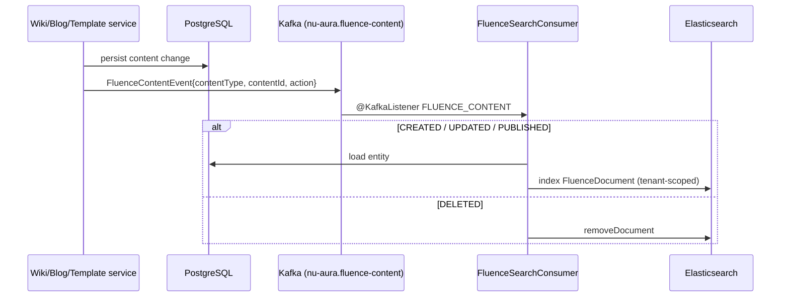
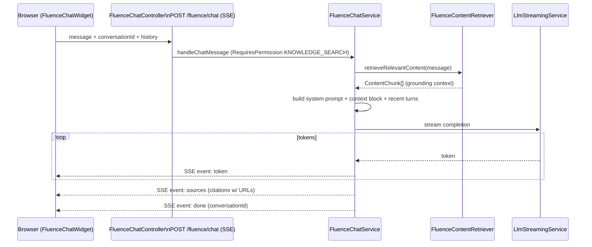

# NU-Fluence

> Knowledge & internal-social sub-app of [[System-Overview|NU-AURA]]. The company handbook +
> activity wall + RAG AI chat. Siblings: [[Nu-HRMS]], [[Nu-Hire]], [[Nu-Grow]].
> Cross-cutting services in [[Shared-Platform]]. Every claim below is grounded in source files
> cited inline.

## Purpose

NU-Fluence is the company knowledge hub: a Confluence-style **wiki**, a **blog** surface for
long-form writing, reusable page **templates**, a file **drive**, an **activity wall** for
praise / shout-outs, unified full-text **search**, and an **AI chat** assistant that answers
questions grounded in the knowledge base via RAG. Route group `frontend/app/fluence/*`; hub at
`/fluence`.

The landing page tagline captures the intent — *"The handbook the whole company actually opens.
Wikis, blogs, templates, and the wall — structured, searchable, never a blank page."*
(`frontend/app/fluence/page.tsx`).

## Business Capability

- **Wiki** — spaces → page tree, versioning, inline comments, watch, edit-lock, approval tasks.
- **Blog & templates** — long-form posts with categories; pre-built page structures so no one
  starts from a blank page.
- **Drive** — file/attachment storage and browsing.
- **Activity wall** — posts, reactions, nested comments, pins, votes, praise-for-employee.
- **Search** — Elasticsearch full-text (opt-in) with a PostgreSQL fallback path.
- **AI chat** — SSE-streamed RAG Q&A with source citations; delivered as a global floating widget.
- **Analytics** — content engagement dashboard (top content by views, activity trends, distribution).

## Entry Points

### Key frontend routes (`frontend/app/fluence/...`)

| Surface | Route | What it does |
|---------|-------|--------------|
| Hub / home | `/fluence` | Bento navigation, at-a-glance stats (active spaces, pages/blogs this week, contributions), recent cross-content activity feed |
| Wiki | `/fluence/wiki`, `/fluence/wiki/new`, `/fluence/wiki/[slug]`, `/fluence/wiki/[slug]/edit` | Spaces → pages tree, source-of-truth docs |
| Blogs | `/fluence/blogs`, `/fluence/blogs/new`, `/fluence/blogs/[slug]`, `/fluence/blogs/[slug]/edit` | Long-form posts, categories, drafts/published |
| Templates | `/fluence/templates`, `/fluence/templates/new`, `/fluence/templates/[id]` | Pre-built page structures |
| Drive | `/fluence/drive` | File/attachment storage and browsing |
| Wall | `/fluence/wall` | "Activity Wall" — praise, shout-outs, posts, reactions, comments |
| Search | `/fluence/search` | Unified full-text search across wiki/blog/template |
| My Content | `/fluence/my-content` | The current user's own wiki pages, blog posts, and favorites |
| Analytics | `/fluence/analytics` | Content engagement dashboard (top content by views, activity trends, distribution) |
| AI Chat | floating widget | Streaming RAG Q&A — **no dedicated route** (see Operational Notes) |

Verified file tree (each leaf route also ships `error.tsx` / `loading.tsx`, and most ship a
`layout.tsx` that sets the browser tab `Metadata`):

```text
app/fluence/
├── page.tsx                         # hub (bento nav + stats + activity)
├── layout.tsx                       # metadata: title "NU-Fluence"
├── analytics/   page.tsx + FluenceAnalyticsCharts.tsx (lazy charts)
├── blogs/       page.tsx · new/page.tsx · [slug]/page.tsx · [slug]/edit/page.tsx
├── dashboard/   page.tsx
├── drive/       page.tsx
├── my-content/  page.tsx
├── search/      page.tsx
├── templates/   page.tsx · new/page.tsx · [id]/page.tsx
├── wall/        page.tsx
└── wiki/        page.tsx · new/page.tsx · [slug]/page.tsx · [slug]/edit/page.tsx
```

The hub gates access to anyone holding `KNOWLEDGE:VIEW`, `WIKI:VIEW`, or `BLOG:VIEW`; users
without any are redirected to `/me/dashboard` (`frontend/app/fluence/page.tsx`, `usePermissions`).
See [[Pages]], [[Routes]], [[Components]].

### Data layer

- Query hooks live in `frontend/lib/hooks/queries/useFluence.ts` (`useWikiSpaces`, `useWikiPages`,
  `useWikiPage`, `useBlogPosts`, `useMyWikiPages`, `useMyBlogPosts`, `useFluenceSearch`, template
  hooks) with a structured `fluenceKeys` query-key factory.
- Wall uses `frontend/lib/hooks/queries/useWall.ts` (`useInfiniteWallPosts`, `useCreatePost`).
- Chat uses `frontend/lib/hooks/useFluenceChat.ts`, a multi-turn store that calls
  `streamFluenceChat` from `frontend/lib/services/platform/fluence-chat.service.ts`
  (native `fetch` + `ReadableStream` against `${baseUrl}/fluence/chat`).

### Notable components (`frontend/components/fluence`)

`editor/FluenceEditor.tsx` (Tiptap-based, with `FloatingBar`, `SlashMenu`, `CalloutNode`),
`WikiPageTree.tsx`, `Breadcrumbs.tsx`, `TableOfContents.tsx`, `InlineComments.tsx`,
`MentionInput.tsx`, `WatchButton.tsx`, `EditLockWarning.tsx`, `SpacePermissionsDrawer.tsx` /
`AccessControlSection.tsx`, `FileUploader.tsx` / `FileList.tsx`, `MacroRenderer.tsx` + `macros/`
(CalloutPanel, CodeBlock, ExpandCollapse, TableOfContents), `ChatMessage.tsx` /
`ChatSourceCard.tsx` / `FluenceChatWidget.tsx`, and `ActivityFeed.tsx`.

### Backend controllers / packages (`backend/src/main/java/com/nulogic/api/...`)

Two route families serve Fluence: the **`/knowledge`** CRUD family and the **`/fluence`**
experiential family, plus the Wall under `/wall`.

| Controller | Base path | Responsibility |
|------------|-----------|----------------|
| `WikiSpaceController` | `/api/v1/knowledge/wiki/spaces` | Space CRUD, archive, members (add/update/remove) |
| `WikiPageController` | `/api/v1/knowledge/wiki/pages` | Page CRUD, publish, archive, pin, tree/root/children, breadcrumbs, move, export, versions, search |
| `WikiInlineCommentController` | (under knowledge) | Inline (anchored) comments on wiki pages |
| `BlogPostController` | `/api/v1/knowledge/blogs` | Post CRUD, by-slug, published/active/featured, by-category, publish, schedule, archive, search |
| `BlogCategoryController` | `/api/v1/knowledge/blogs/categories` | Blog category management |
| `TemplateController` | `/api/v1/knowledge/templates` | Template CRUD, by-slug/category, featured, popular, toggle active/featured |
| `KnowledgeSearchController` | `/api/v1/knowledge/search` | Knowledge search (PostgreSQL-backed fallback) |
| `LinkedinPostController` | (under knowledge) | LinkedIn post integration |
| `FluenceSearchController` | `/api/v1/fluence/search` | Elasticsearch full-text search → `Page<FluenceDocument>` |
| `FluenceChatController` | `/api/v1/fluence/chat` | SSE streaming AI chat (RAG) |
| `FluenceActivityController` | `/api/v1/fluence/activities` | Activity feed (`/` and `/me`) |
| `FluenceCommentController` | `/api/v1/fluence/comments` | Comments on Fluence content |
| `ContentEngagementController` | `/api/v1/fluence/engagement` | Views / likes / engagement signals |
| `FluenceAttachmentController` | `/api/v1/fluence/attachments` | File attachments (Drive) |
| `FluenceEditLockController` | `/api/v1/fluence/edit-lock` | Distributed edit locks: acquire / release / check / heartbeat per `{contentType}/{contentId}` |
| `WallController` | `/api/v1/wall` | Posts, reactions, comments/replies, pin, vote, praise-for-employee |

App service `FluenceChatService` orchestrates the RAG pipeline. See [[APIs]], [[Services]].

### Domain entities — `backend/.../domain/knowledge`

`WikiSpace`, `WikiPage`, `WikiPageVersion`, `WikiPageComment`, `WikiInlineComment`,
`WikiPageLike`, `WikiPageWatch`, `WikiPageApprovalTask`, `SpaceMember`, `BlogPost`,
`BlogCategory`, `BlogComment`, `BlogLike`, `DocumentTemplate`, `TemplateInstantiation`,
`KnowledgeAttachment`, `KnowledgeView`, `KnowledgeSearch`, `FluenceActivity`, `FluenceFavorite`.

Wall lives in its own context: `backend/.../domain/wall/model`, served by `WallController` +
`WallService`.

## Dependencies

- **Elasticsearch** — full-text index (`FluenceDocument`, tenant-keyed); opt-in via
  `app.elasticsearch.enabled` (default off), falls back to PostgreSQL search when off
  ([[Shared-Platform]]).
- **Kafka** — `FluenceContentEvent` CDC pipeline keeps Postgres (system of record) and ES
  (read model) eventually consistent via `FluenceSearchConsumer`.
- **Redis** — distributed edit locks (`FluenceEditLockService`, ~5-min TTL) for the
  collaborative Tiptap editor.
- **LLM** — `LlmStreamingService` for RAG completions; gated by `KNOWLEDGE:SEARCH`.
- **Auth / RBAC** — dedicated knowledge/wiki/blog/wall permission cluster ([[Permissions]],
  [[Roles]], [[RBAC-Matrix]]).
- **Multi-tenancy** — three-layer isolation: `TenantContext`, PostgreSQL RLS, tenant-keyed ES
  index ([[Middleware]], [[Schema]], [[Security-Audit]]).
- **File storage** — Drive attachments via Google Drive `StorageProvider`.

## Database & RLS

Fluence tables (`wiki_*`, `blog_*`, `document_templates`) were the subject of a notable RLS
history: `V15__knowledge_base_fluence_integration.sql` integrated the knowledge base, and
`V24__fix_rls_policies.sql` patched 15 Fluence/Knowledge tables that had
`ENABLE ROW LEVEL SECURITY` but **zero policies** — these were given permissive (allow-all)
policies with isolation enforced at the application layer (`TenantContext` ThreadLocal + JPA
`WHERE tenant_id` filters). Later hardening (`V177`, `V254`) reasserted strict, fail-closed
tenant policies platform-wide. Wall feed performance is indexed via
`V94__add_wall_post_feed_index.sql`. See [[Schema]], [[ERD]], [[Security-Audit]].

## Key Flows

### Wiki authoring & publishing

```mermaid
flowchart LR
  A[Create space\nPOST /knowledge/wiki/spaces] --> B[Create page\nPOST /knowledge/wiki/pages]
  B --> C[Edit in Tiptap FluenceEditor]
  C -->|acquire| L[(Edit lock\nPUT/POST /fluence/edit-lock)]
  C --> V[WikiPageVersion snapshot]
  C --> D[Publish\nPOST /pages/{id}/publish]
  D --> E[Kafka FluenceContentEvent\naction=PUBLISHED]
  E --> F[Elasticsearch index]
```

Concurrent editing is protected by `FluenceEditLockController` — acquire on edit start, periodic
`heartbeat` to keep the lock alive, release on exit. The frontend surfaces conflicts via
`EditLockWarning.tsx`. Page hierarchy is exposed through `tree`, `root`, `children`,
`breadcrumbs`, and `move` endpoints, rendered by `WikiPageTree.tsx` and `Breadcrumbs.tsx`.

### Search indexing (CDC pipeline)

Search is **eventually consistent** between PostgreSQL (system of record) and Elasticsearch
(read model), kept in sync by Kafka:



- Event: `FluenceContentEvent` with `content_type` (`wiki`/`blog`/`template`), `content_id`,
  `action` (`CREATED`/`UPDATED`/`PUBLISHED`/`DELETED`)
  (`backend/.../infrastructure/kafka/events/FluenceContentEvent.java`).
- Consumer: `FluenceSearchConsumer` listens on `KafkaTopics.FLUENCE_CONTENT`, routing to
  `FluenceIndexingService.indexWikiPage / indexBlogPost / indexTemplate` or `removeDocument`
  (`backend/.../infrastructure/kafka/consumer/FluenceSearchConsumer.java`).
- Index document: `FluenceDocument` carries `tenantId`, `contentType`, `contentId`, `title`,
  `excerpt`, `bodyText`, `slug`, `status`, `visibility`, `author*`, `tags`, `spaceId/spaceName`
  — tenant-scoped at the index level
  (`backend/.../infrastructure/search/document/FluenceDocument.java`).
- `FluenceIndexingService.reindexAll(tenantId)` supports backfill/repair.
- Query path: `/fluence/search` → `FluenceSearchService` → returns `Page<FluenceDocument>`;
  frontend `useFluenceSearch` filters by `contentType` and `visibility`
  (`frontend/app/fluence/search/page.tsx`).

> Elasticsearch is **opt-in** (`app.elasticsearch.enabled`, default off). When disabled, the
> `KnowledgeSearchController` (`/knowledge/search`, PostgreSQL-backed) provides a fallback search
> path.

### AI Chat (RAG over the knowledge base)



- The controller returns an `SseEmitter` and sets `Cache-Control: no-transform`,
  `X-Accel-Buffering: no`, `Connection: keep-alive` to defeat proxy buffering so tokens stream
  live (`FluenceChatController.java`).
- `FluenceChatService` orchestrates the RAG pipeline: retrieve context → build a grounded prompt
  → stream the LLM response → emit source citations. Its system prompt explicitly instructs the
  model to answer only from the provided context, cite document titles, **always include document
  URLs**, and admit when nothing relevant exists in the knowledge base. Conversations are
  persisted via `ChatbotConversationRepository`; only the last few turns are sent to stay within
  the context window (`backend/.../application/knowledge/service/FluenceChatService.java`).
- The async pipeline runs on a `taskExecutor`; tenant context is re-set on the worker thread
  because ThreadLocal does not propagate (noted backlog item T4-17).
- Frontend: `useFluenceChat` accumulates streamed tokens into the active message, attaches
  `sources` on the `sources` event, and marks the message done; sources render via
  `ChatSourceCard.tsx`.

### Activity Wall

`WallController` (`/api/v1/wall`) backs the "Activity Wall" page. Capabilities: create/update/
delete posts, list (all, by-type, single), **pin**, **reactions** (add / remove / reactor
details), **comments + nested replies**, **vote** / remove-vote, and **praise-for-employee**
lookups (`backend/.../api/wall/controller/WallController.java`). The frontend wall is
infinite-scrolled via `useInfiniteWallPosts` and posts created with `useCreatePost`,
distinguishing "praise sent" vs "post published" toasts (`frontend/app/fluence/wall/page.tsx`).

## Permissions

Fluence is governed by a dedicated permission cluster (`frontend/lib/hooks/usePermissions.ts`):

| Area | Permission codes |
|------|------------------|
| Knowledge (root) | `KNOWLEDGE:VIEW/CREATE/UPDATE/DELETE/MANAGE`, `KNOWLEDGE:SEARCH` (chat gate) |
| Wiki | `WIKI:VIEW/CREATE/MANAGE` and granular `KNOWLEDGE:WIKI_READ/CREATE/UPDATE/DELETE/PUBLISH/APPROVE` |
| Blog | `BLOG:VIEW/CREATE/MANAGE` |
| Wall | `WALL:VIEW/POST/COMMENT/REACT/MANAGE/PIN` plus `WALL_FLUENCE:VIEW/POST/MANAGE` |

Backend enforcement uses `@RequiresPermission` (e.g. `FluenceChatController` requires
`Permission.KNOWLEDGE_SEARCH`). The hub route performs an
`hasAnyPermission(KNOWLEDGE_VIEW, WIKI_VIEW, BLOG_VIEW)` check and redirects unauthorized users
to `/me/dashboard`. See [[Permissions]], [[Roles]], [[RBAC-Matrix]].

## Cross-Cutting Notes

- **Edit locking** is distributed (Redis-backed `FluenceEditLockService`, 5-min TTL per project
  memory) and exposed via heartbeat semantics — required for the collaborative Tiptap editor.
- **Tenant isolation** spans three layers for Fluence content: application `TenantContext`,
  PostgreSQL RLS (permissive-then-hardened per migration history), and a tenant-keyed
  Elasticsearch index (`FluenceDocument.tenantId`).
- **Storage**: Drive attachments flow through `FluenceAttachmentController` and the platform's
  Google Drive `StorageProvider` abstraction.
- **Engagement analytics**: `KnowledgeView` / `ContentEngagementController` feed the
  `/fluence/analytics` dashboard (top content by `viewCount`, activity-trend and distribution
  charts, lazy-loaded from `FluenceAnalyticsCharts.tsx`).

## Ownership

Self-assessed — no formal owners in the repo. The most infrastructure-heavy sub-app (ES + Kafka
+ Redis locks + LLM); treat changes here as cross-stack.

## Risks

- **RLS history** — Fluence tables once had RLS enabled with **zero policies**
  (`V24__fix_rls_policies.sql` patched 15 tables with permissive policies; `V177`/`V254` later
  reasserted fail-closed). Verify any new knowledge table is fail-closed. See [[Security-Audit]].
- **RAG/LLM exposure** — chat retrieves tenant content into prompts; ThreadLocal tenant context
  does not propagate to the async worker thread (re-set required; backlog T4-17). A propagation
  miss is a cross-tenant leak.
- **Index drift** — ES and Postgres are eventually consistent; a dropped Kafka event leaves stale
  search results. `reindexAll(tenantId)` is the repair path.
- **Edit-lock starvation** — stale locks block collaborative editing if heartbeats fail.

## Operational Notes

- AI chat has **no `/fluence/chat` route** despite the hub bento tile linking there — it is a
  global floating widget lazy-imported and rendered in `AppLayout.tsx`
  (`frontend/components/layout/AppLayout.tsx` lines 33, 456;
  `frontend/components/fluence/FluenceChatWidget.tsx`).
- `FluenceChatController` sets `Cache-Control: no-transform`, `X-Accel-Buffering: no`,
  `Connection: keep-alive` to defeat proxy buffering for live SSE token streaming.
- Wall feed perf indexed by `V94__add_wall_post_feed_index.sql`; wall is infinite-scrolled.
- When ES is disabled, `/knowledge/search` (PostgreSQL) is the fallback search surface.

## Related Links

- [[System-Overview]] · [[C4-Container]] · [[Module-Relationships]] · [[Data-Flows]] · [[System-Flows]]
- Siblings: [[Nu-HRMS]] · [[Nu-Hire]] · [[Nu-Grow]]
- Platform: [[Shared-Platform]] · [[Middleware]] · [[Roles]] · [[Permissions]] · [[RBAC-Matrix]] · [[Schema]] · [[ERD]] · [[APIs]] · [[Services]] · [[Pages]] · [[Routes]] · [[Components]] · [[Security-Audit]]

### Primary evidence files

- `frontend/app/fluence/page.tsx`, `frontend/app/fluence/{search,wall,drive,my-content,analytics}/page.tsx`
- `frontend/components/layout/AppLayout.tsx`, `frontend/components/fluence/FluenceChatWidget.tsx`
- `frontend/lib/hooks/queries/useFluence.ts`, `frontend/lib/hooks/useFluenceChat.ts`, `frontend/lib/services/platform/fluence-chat.service.ts`
- `backend/.../api/knowledge/controller/{WikiSpace,WikiPage,BlogPost,Template,FluenceChat,FluenceSearch,FluenceActivity,FluenceEditLock}Controller.java`
- `backend/.../api/wall/controller/WallController.java`
- `backend/.../application/knowledge/service/FluenceChatService.java`
- `backend/.../infrastructure/kafka/{events/FluenceContentEvent,consumer/FluenceSearchConsumer}.java`
- `backend/.../infrastructure/search/{document/FluenceDocument,service/FluenceIndexingService}.java`
- `backend/src/main/resources/db/migration/{V15,V24,V94}*.sql`
