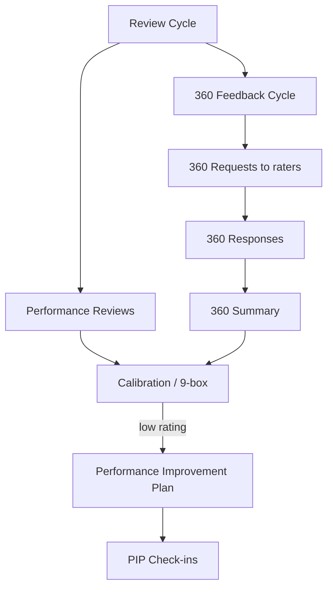

# NU-Grow

> Talent-development & engagement sub-app of [[System-Overview|NU-AURA]]. The growth loop
> for employees already on record in [[Nu-HRMS]]. Siblings: [[Nu-Hire]], [[Nu-Fluence]].
> Cross-cutting services in [[Shared-Platform]]. Grounding doc: `docs/apps/nu-grow.md`.

## Purpose

NU-Grow covers performance and engagement: goals/OKRs, performance review cycles, 360°
feedback, 1-on-1s, learning (training + LMS), peer recognition, engagement/pulse surveys,
competency tracking, and wellness. Identity in `frontend/lib/config/apps.ts`
(`PLATFORM_APPS.GROW`): `code GROW`, `entryRoute /performance`, `order 3`.

## Business Capability

- **Goals & OKRs** — objective → key-result → check-in lifecycle, company rollups.
- **Reviews** — review cycles, performance reviews, calibration, 9-box, PIPs.
- **360° feedback** — multi-rater cycles, requests, responses, summary.
- **Learning** — LMS courses/modules/quizzes/paths/certificates + instructor-led training programs.
- **Engagement** — peer recognition (badges, points, leaderboard), org surveys, pulse surveys, 1-on-1s.
- **Wellness** — programs, challenges, health logs, gamified points/leaderboards.
- **Competency** — competency matrix / skill-gap (backed by HRMS employee-skill data).

## Entry Points

### Key frontend routes (`frontend/app/...`)

`routePrefixes`: `/performance`, `/okr`, `/feedback360`, `/training`, `/learning`,
`/recognition`, `/surveys`, `/wellness`, `/one-on-one`. Many surfaces nest under
`/performance/*` (sidebar `href`s are the source of truth).

| Area | Routes |
|------|--------|
| Performance | `/performance` (hub), `/performance/reviews`, `/performance/cycles/[id]/calibration`, `/performance/cycles/[id]/nine-box`, `/performance/9box`, `/performance/pip`, `/performance/360-feedback`, `/performance/competency-matrix` |
| OKR / goals | `/performance/okr`, `/okr`, `/goals` |
| Learning | `/learning`, `/learning/courses/[id]/play`, `/learning/courses/[id]/quiz/[quizId]`, `/learning/paths`, `/learning/certificates`, `/training`, `/training/catalog/[id]`, `/training/my-learning` |
| Engagement | `/one-on-one`, `/recognition`, `/surveys`, `/surveys/pulse`, `/surveys/[id]/respond`, `/surveys/[id]/analytics`, `/wellness`, `/wellness/admin` |

Pages are client components using `lib/hooks/queries/use*.ts` + `lib/services/grow/*` thin
wrappers, gated by `PermissionGate` + `usePermissions()`. See [[Pages]], [[Routes]],
[[Components]], [[Permissions]].

### Backend controllers / packages (`backend/src/main/java/com/nulogic/api/...`)

| Frontend area | Controller (base path) |
|---------------|------------------------|
| Goals | `performance/GoalController` (`/goals`) |
| OKR | `performance/controller/OkrController` (`/okr`) |
| Reviews / cycles | `performance/PerformanceReviewController` (`/reviews`), `ReviewCycleController` (`/review-cycles`) |
| Feedback | `performance/FeedbackController` (`/feedback`), `controller/Feedback360Controller` (`/feedback360`) |
| PIP / revolution | `performance/PIPController` (`/performance/pip`), `controller/PerformanceRevolutionController` (`/performance/revolution`) |
| LMS | `lms/controller/LmsController` (`/lms`), `CourseEnrollmentController`, `QuizController` (`/lms/quizzes`) |
| Training | `training/controller/TrainingManagementController` (`/training`) |
| Recognition | `recognition/controller/RecognitionController` (`/recognition`) |
| Surveys | `survey/controller/SurveyManagementController` (`/survey-management`), `SurveyAnalyticsController` (`/survey-analytics`), `engagement/controller/PulseSurveyController` (`/surveys`) |
| Meetings | `meeting/controller/MeetingController` (`/one-on-one`), `engagement/controller/OneOnOneMeetingController` (`/meetings`) |
| Wellness | `wellness/controller/WellnessController` (`/wellness`) |

Bounded contexts: `com.nulogic.{performance, lms, training, recognition, survey, engagement, meeting, wellness}`.
See [[APIs]], [[Services]]. Note: there is **no** dedicated competency controller — the
matrix uses employee-skill + review-competency endpoints.

## Dependencies

- **[[Nu-HRMS]]** — competency matrix reads HRMS `EmployeeSkill`; reviews/OKRs hang off the
  HRMS employee + org structure.
- **Auth / RBAC** — Grow permission cluster: `REVIEW:VIEW`, `OKR:VIEW/VIEW_ALL`,
  `FEEDBACK_360:VIEW`, `MEETING:VIEW`, `TRAINING:VIEW`, `LMS:COURSE_VIEW`,
  `RECOGNITION:VIEW`, `SURVEY:VIEW`, `WELLNESS:VIEW` ([[Permissions]], [[RBAC-Matrix]]).
- **Multi-tenancy / RLS** — all Grow tables are tenant-aware ([[Middleware]], [[Schema]]).
- **Notifications / Kafka** — review reminders, 360 requests, survey invites, recognition feeds.
- **File storage** — LMS content and certificates via Google Drive `StorageProvider`.

## Technical Flow — review cycle + 360 feedback

## Ownership

Self-assessed — no formal owners in the repo. Spans the most bounded contexts of any sub-app
(performance, lms, training, recognition, survey, engagement, meeting, wellness).

## Related Links

- [[System-Overview]] · [[C4-Container]] · [[Module-Relationships]] · [[Data-Flows]] · [[System-Flows]]
- Siblings: [[Nu-HRMS]] (employee + skills source) · [[Nu-Hire]] · [[Nu-Fluence]]
- Platform: [[Shared-Platform]] · [[Middleware]] · [[Roles]] · [[Permissions]] · [[RBAC-Matrix]] · [[Schema]] · [[ERD]] · [[APIs]] · [[Services]] · [[Pages]] · [[Routes]] · [[Components]] · [[Security-Audit]]
- Grounding: `docs/apps/nu-grow.md`

## Risks

- **Route↔config drift** — `apps.ts` prefixes (`/feedback360`, `/okr`) don't all match the
  nested `/performance/*` routes users actually click; the sidebar `href`s are authoritative.
  Easy to mis-gate RBAC if you trust `apps.ts` alone.
- **Survey duplication** — two survey stacks exist (org `SurveyManagementController` vs
  lightweight `PulseSurveyController`, both partly under `/surveys`); confirm which a page hits.
- **Gamification integrity** — recognition/wellness points are user-influenced; guard against
  self-award and point inflation.
- **Competency has no dedicated backend** — relies on HRMS skill endpoints; fragile coupling.

## Operational Notes

- Entry route `/performance`; the Performance Hub aggregates goals, active cycles, OKR
  summary, and pending 360s.
- Schema lands in migrations such as `V11__mfa_quiz_learning_paths.sql`,
  `V98__survey_template_support.sql`, `V103__training_skill_mappings.sql`.
- Survey/leave/onboarding carry-forward jobs were N+1 save hotspots (recently batched).
