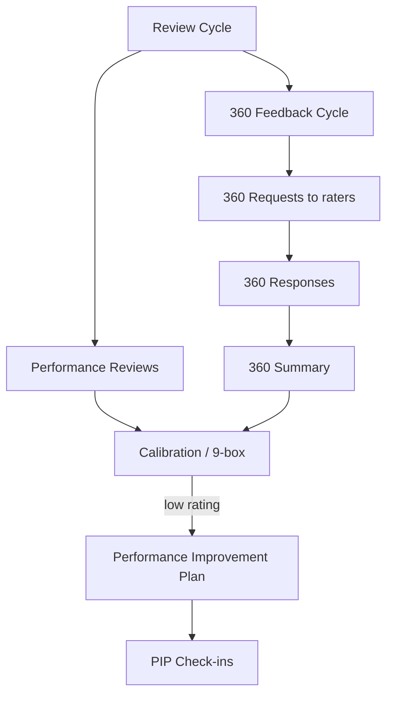
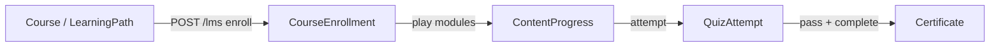

# NU-Grow

> Talent-development & engagement sub-app of [[System-Overview|NU-AURA]]. The growth loop
> for employees already on record in [[Nu-HRMS]]. Siblings: [[Nu-Hire]], [[Nu-Fluence]].
> Cross-cutting services in [[Shared-Platform]]. Grounding doc: [[Nu-Grow]].

## Purpose

NU-Grow is the **talent-development and engagement** sub-app. It covers the employee growth
loop: goals/OKRs, performance review cycles, 360° feedback, 1-on-1s, learning (training +
LMS), peer recognition, engagement/pulse surveys, competency tracking, and wellness.

Its identity is defined in `frontend/lib/config/apps.ts` (`PLATFORM_APPS.GROW`):

| Field | Value |
|-------|-------|
| `code` | `GROW` |
| `name` | NU-Grow |
| `description` | "Performance, learning & engagement" |
| `entryRoute` | `/performance` |
| `iconName` | `TrendingUp` |
| `order` | 3 |
| `available` | `true` |

The same file lists the route and permission prefixes Grow owns:

- `routePrefixes`: `/performance`, `/okr`, `/feedback360`, `/training`, `/learning`,
  `/recognition`, `/surveys`, `/wellness`, `/one-on-one`
- `permissionPrefixes`: `review`, `okr`, `feedback_360`, `training`, `lms`, `recognition`,
  `survey`, `wellness`, `goal`, `competency`, `meeting`

`getAppForRoute()` resolves a pathname to `GROW` by matching those prefixes (checked before
the HRMS catch-all). The Grow sidebar renders a single section, `grow-hub`
(`APP_SIDEBAR_SECTIONS.GROW`, defined in `frontend/components/layout/menuSections.tsx`,
lines ~654–753).

## Business Capability

- **Goals & OKRs** — objective → key-result → check-in lifecycle, company rollups.
- **Reviews** — review cycles, performance reviews, calibration, 9-box, PIPs.
- **360° feedback** — multi-rater cycles, requests, responses, summary.
- **Learning** — LMS courses/modules/quizzes/paths/certificates + instructor-led training programs.
- **Engagement** — peer recognition (badges, points, leaderboard), org surveys, pulse surveys, 1-on-1s.
- **Wellness** — programs, challenges, health logs, gamified points/leaderboards.
- **Competency** — competency matrix / skill-gap (backed by HRMS employee-skill data).

## Entry Points

### Key frontend routes (`frontend/app/...`)

All Grow pages live directly under `frontend/app/` (flat App Router, no route group).
Several growth surfaces are **nested under `/performance/*`** rather than the top-level
prefixes named in `apps.ts`; the sidebar `href`s are the source of truth for what users
actually click.

#### Performance & reviews (`/performance/*`)

| Route (`page.tsx`) | Purpose | Sidebar |
|--------------------|---------|---------|
| `performance/page.tsx` | Performance Hub — aggregates goals, active cycles, OKR summary, pending 360s | "Performance Hub" |
| `performance/revolution/page.tsx` | Continuous "Performance Revolution" view | "Revolution" |
| `performance/reviews/page.tsx` | Performance reviews list | — |
| `performance/cycles/page.tsx` | Review cycles | — |
| `performance/cycles/[id]/calibration/page.tsx` | Per-cycle calibration | — |
| `performance/cycles/[id]/nine-box/page.tsx` | Per-cycle 9-box grid | — |
| `performance/calibration/page.tsx` | Calibration | — |
| `performance/9box/page.tsx` | 9-box talent grid | — |
| `performance/feedback/page.tsx` | Continuous feedback | — |
| `performance/pip/page.tsx` | Performance Improvement Plans | — |
| `performance/goals/page.tsx` | Goals (within performance) | — |
| `performance/okr/page.tsx`, `performance/okrs/page.tsx` | OKRs (within performance) | "OKR" → `/performance/okr` |
| `performance/360-feedback/page.tsx` | 360° feedback | "360 Feedback" |
| `performance/competency-framework/page.tsx` | Competency framework | — |
| `performance/competency-matrix/page.tsx` | Competency matrix / skill-gap | "Competency Matrix" |

Standalone top-level surfaces mirror some of the above: `goals/page.tsx`, `okr/page.tsx`,
`feedback360/page.tsx` (the `apps.ts` prefixes `/okr`, `/feedback360`, `/goals` resolve here).

#### Learning & training

| Route | Purpose | Sidebar |
|-------|---------|---------|
| `training/page.tsx` | Training landing | "Training" |
| `training/catalog/page.tsx`, `training/catalog/[id]/page.tsx` | Program catalog + detail | — |
| `training/my-learning/page.tsx` | My enrolled training | — |
| `learning/page.tsx` | LMS dashboard | "Learning (LMS)" |
| `learning/courses/page.tsx`, `learning/courses/[id]/page.tsx` | Course list + detail | — |
| `learning/courses/[id]/play/page.tsx` | Course player | — |
| `learning/courses/[id]/quiz/[quizId]/page.tsx` | Quiz attempt | — |
| `learning/paths/page.tsx` | Learning paths | — |
| `learning/certificates/page.tsx` | Earned certificates | — |

#### Engagement, recognition, wellness

| Route | Purpose | Sidebar |
|-------|---------|---------|
| `one-on-one/page.tsx` | 1-on-1 meetings | "1-on-1 Meetings" |
| `recognition/page.tsx` | Peer recognition, badges, points, leaderboard | "Recognition" |
| `surveys/page.tsx` | Survey list ("My Surveys") | "Surveys" → "My Surveys" |
| `surveys/pulse/page.tsx` | Pulse surveys | "Pulse Surveys" |
| `surveys/[id]/page.tsx`, `surveys/[id]/respond/page.tsx`, `surveys/[id]/analytics/page.tsx` | Survey detail / respond / analytics | — |
| `wellness/page.tsx` | Wellness dashboard, challenges, health logs | "Wellness" |
| `wellness/admin/page.tsx` | Wellness program admin | — |

Pages are client components (`'use client'`) using TanStack Query hooks under
`frontend/lib/hooks/queries/` + thin service wrappers under `frontend/lib/services/grow/`,
gated by `<PermissionGate>` + `usePermissions()`. See [[Pages]], [[Routes]],
[[Components]], [[Permissions]].

### Frontend data layer

| Domain | Query hook(s) | Service | Types |
|--------|---------------|---------|-------|
| Performance/goals | `usePerformance.ts`, `useGoals.ts`, `useReviews.ts`, `useReviewCycles.ts`, `usePip.ts` | `performance.service.ts` | `types/grow/performance.ts` |
| OKR | `useOkr.ts` | `okr.service.ts` | `types/grow/performance.ts` |
| 360 feedback | `useFeedback360.ts`, `useFeedback.ts` | `feedback360.service.ts` | `types/grow/performance-360.ts` |
| Learning (LMS) | `useLearning.ts` | `lms.service.ts` | `types/grow/training.ts` |
| Training | `useTraining.ts` | `training.service.ts` | `types/grow/training.ts` |
| Recognition | `useRecognition.ts` | `recognition.service.ts` | `types/grow/recognition.ts` |
| Surveys | `useSurveys.ts`, `useSurveyQuestions.ts` | `survey.service.ts` | `types/grow/survey.ts` |
| Wellness | `useWellness.ts` | `wellness.service.ts` | `types/grow/wellness.ts` |
| 1-on-1 | `useOneOnOne.ts` | — | `types/hrms/meeting.ts` |
| Competency matrix | `useCompetency.ts` | `competencyService.ts` | `types/grow/competency.ts` |

The Performance Hub (`performance/page.tsx`) composes `useAllGoals`,
`useMyPending360Reviews`, `useOkrDashboardSummary`, and `usePerformanceActiveCycles` from
`lib/hooks/queries/usePerformance`.

### Backend controllers & domains (`backend/src/main/java/com/nulogic/api/...`)

| Frontend area | Controller | Base path | Domain entities (`domain/…`) |
|---------------|-----------|-----------|------------------------------|
| Goals | `performance/GoalController` | `/api/v1/goals` | `performance/Goal` |
| OKR | `performance/controller/OkrController` | `/api/v1/okr` | `performance/Objective`, `KeyResult`, `OkrCheckIn` |
| Reviews | `performance/PerformanceReviewController` | `/api/v1/reviews` | `performance/PerformanceReview`, `ReviewCompetency` |
| Review cycles | `performance/ReviewCycleController` | `/api/v1/review-cycles` | `performance/ReviewCycle` |
| Continuous feedback | `performance/FeedbackController` | `/api/v1/feedback` | `performance/Feedback` |
| 360 feedback | `performance/controller/Feedback360Controller` | `/api/v1/feedback360` | `performance/Feedback360Cycle`, `Feedback360Request`, `Feedback360Response`, `Feedback360Summary` |
| PIP | `performance/PIPController` | `/api/v1/performance/pip` | `performance/PerformanceImprovementPlan`, `PIPCheckIn` |
| Revolution | `performance/controller/PerformanceRevolutionController` | `/api/v1/performance/revolution` | (performance domain) |
| LMS | `lms/controller/LmsController`, `lms/CourseEnrollmentController` | `/api/v1/lms` | `lms/Course`, `CourseModule`, `ModuleContent`, `CourseEnrollment`, `ContentProgress`, `LearningPath`, `LearningPathCourse`, `Certificate` |
| Quizzes | `lms/controller/QuizController` | `/api/v1/lms/quizzes` | `lms/Quiz`, `QuizQuestion`, `QuizAttempt` |
| Training | `training/controller/TrainingManagementController` | `/api/v1/training` | `training/TrainingProgram`, `TrainingEnrollment`, `TrainingSkillMapping` |
| Recognition | `recognition/controller/RecognitionController` | `/api/v1/recognition` | `recognition/Recognition`, `PeerRecognition`, `RecognitionBadge`, `RecognitionReaction`, `EmployeePoints`, `Milestone` |
| Surveys (mgmt) | `survey/controller/SurveyManagementController` | `/api/v1/survey-management` | `survey/Survey`, `SurveyQuestion`, `SurveyResponse`, `SurveyAnswer`, `SurveyInsight`, `EngagementScore` |
| Survey analytics | `survey/controller/SurveyAnalyticsController` | `/api/v1/survey-analytics` | (survey domain) |
| Pulse surveys | `engagement/controller/PulseSurveyController` | `/api/v1/surveys` | `engagement/PulseSurvey`, `PulseSurveyQuestion`, `PulseSurveyResponse`, `PulseSurveyAnswer` |
| 1-on-1 meetings | `meeting/controller/MeetingController` | `/api/v1/one-on-one` | `engagement/OneOnOneMeeting`, `MeetingAgendaItem`, `MeetingActionItem` |
| Meetings | `engagement/controller/OneOnOneMeetingController` | `/api/v1/meetings` | `engagement/OneOnOneMeeting` |
| Wellness | `wellness/controller/WellnessController` | `/api/v1/wellness` | `wellness/WellnessProgram`, `WellnessChallenge`, `ChallengeParticipant`, `HealthLog`, `WellnessPoints`, `PointsTransaction` |

Bounded contexts: `com.nulogic.{performance, lms, training, recognition, survey, engagement, meeting, wellness}`.
See [[APIs]], [[Services]].

> **Competency note:** there is **no** dedicated competency controller. The Competency Matrix
> page (`performance/competency-matrix/page.tsx`) is backed via `competencyService.ts`, which
> calls **employee-skill** endpoints (`/employees/skills`, `/employees/skills/{id}/verify`)
> and review-competency endpoints (`/reviews/competencies`). The matching entity is
> `performance/ReviewCompetency.java`; skill data comes from the HRMS `EmployeeSkill` model.

## Dependencies

- **[[Nu-HRMS]]** — competency matrix reads HRMS `EmployeeSkill`; reviews/OKRs hang off the
  HRMS employee + org structure.
- **Auth / RBAC** — Grow permission cluster: `REVIEW:VIEW`, `OKR:VIEW` / `OKR:VIEW_ALL`,
  `FEEDBACK_360:VIEW`, `MEETING:VIEW`, `TRAINING:VIEW`, `LMS:COURSE_VIEW`,
  `RECOGNITION:VIEW`, `SURVEY:VIEW`, `WELLNESS:VIEW` (`frontend/lib/hooks/usePermissions.ts`;
  [[Permissions]], [[RBAC-Matrix]]).
- **Multi-tenancy / RLS** — all Grow entities extend the tenant-aware base
  (`tenant_id UUID NOT NULL` + RLS), consistent with the platform model ([[Middleware]], [[Schema]]).
- **Notifications / Kafka** — review reminders, 360 requests, survey invites, recognition feeds.
- **File storage** — LMS content and certificates via Google Drive `StorageProvider`.

## Key Flows

### OKR lifecycle

`OkrController` (`/api/v1/okr`) exposes the full objective → key-result → check-in cycle:
create/list/get objectives (`/objectives`, `/objectives/my`, `/objectives/{id}`), update
status and approve (`/objectives/{id}/status`, `/objectives/{id}/approve`), manage key
results (`/objectives/{objectiveId}/key-results`, `/key-results/{id}/progress`), log
check-ins (`/check-ins`), and read rollups (`/dashboard/summary`, `/company/objectives`).

```mermaid
flowchart LR
  U[Employee/Manager] -->|POST /okr/objectives| O[Objective draft]
  O -->|POST /objectives/{id}/approve| OA[Approved objective]
  OA -->|POST /objectives/{id}/key-results| KR[Key Results]
  KR -->|PUT /key-results/{id}/progress| KP[Progress updated]
  KP -->|POST /okr/check-ins| CI[Check-in logged]
  CI -->|GET /okr/dashboard/summary| D[Performance Hub summary]
```

### Performance review + 360 feedback

A `ReviewCycle` (`/api/v1/review-cycles`) frames a window in which `PerformanceReview`s are
created (`/api/v1/reviews`). In parallel, a `Feedback360Cycle` issues `Feedback360Request`s
to raters who submit `Feedback360Response`s, aggregated into a `Feedback360Summary`
(`/api/v1/feedback360`). Calibration and 9-box views consume cycle data
(`performance/cycles/[id]/calibration`, `.../nine-box`). Under-performers move into a PIP
(`/api/v1/performance/pip`) with `PIPCheckIn`s.



### Learning: enroll → consume → certify

`LmsController` / `CourseEnrollmentController` (`/api/v1/lms`) manage `Course`,
`CourseModule`, `ModuleContent`, `LearningPath`, and `CourseEnrollment`. `QuizController`
(`/api/v1/lms/quizzes`) drives `Quiz` / `QuizAttempt`. Course completion + passing quizzes
yields a `Certificate`. The frontend `learning` pages walk this path: courses list → detail
→ play → quiz → certificate. `TrainingManagementController` (`/api/v1/training`) is the
parallel instructor-led/program track (`/programs`, `/enrollments`,
`/enrollments/{id}/complete`, `/enrollments/{id}/generate-certificate`), with
`TrainingSkillMapping` linking programs to skills.



### Recognition & wellness gamification

`RecognitionController` (`/api/v1/recognition`) supports giving recognition (`POST /`),
feeds (`/feed`, `/received`, `/given`), reactions (`/{id}/react`), badges (`/badges`),
points (`/points`), leaderboard (`/leaderboard`), and upcoming milestones
(`/milestones/upcoming`). `WellnessController` (`/api/v1/wellness`) mirrors the gamified
model: programs/challenges (`/programs`, `/challenges`, `/challenges/{id}/join`), health
logs (`/health-logs`), points and leaderboards (`/points`, `/leaderboard`,
`/challenges/{id}/leaderboard`). Both award points (`EmployeePoints` / `WellnessPoints` +
`PointsTransaction`).

### Engagement: surveys & 1-on-1s

Two survey surfaces exist: full-lifecycle org surveys via `SurveyManagementController`
(`/api/v1/survey-management`) + `SurveyAnalyticsController` (`/api/v1/survey-analytics`),
and lightweight `PulseSurveyController` (`/api/v1/surveys`, surfaced at `/surveys/pulse`).
1-on-1s run through `MeetingController` (`/api/v1/one-on-one`) backed by `OneOnOneMeeting`
with `MeetingAgendaItem` and `MeetingActionItem`.

## Ownership

Self-assessed — no formal owners in the repo. Spans the most bounded contexts of any sub-app
(performance, lms, training, recognition, survey, engagement, meeting, wellness).

## Risks

- **Route↔config drift** — `apps.ts` prefixes (`/feedback360`, `/okr`) don't all match the
  nested `/performance/*` routes users actually click; the sidebar `href`s are authoritative.
  Easy to mis-gate RBAC if you trust `apps.ts` alone.
- **Survey duplication** — two survey stacks exist (org `SurveyManagementController` vs
  lightweight `PulseSurveyController`, both partly under `/surveys`); confirm which a page hits.
- **Gamification integrity** — recognition/wellness points are user-influenced; guard against
  self-award and point inflation.
- **Competency has no dedicated backend** — relies on HRMS skill endpoints; fragile coupling.

## Operational Notes

- Entry route `/performance`; the Performance Hub aggregates goals, active cycles, OKR
  summary, and pending 360s.
- Schema lands in migrations such as `V11__mfa_quiz_learning_paths.sql` (learning paths,
  quizzes), `V98__survey_template_support.sql`, and `V103__training_skill_mappings.sql`.
- Survey/leave/onboarding carry-forward jobs were N+1 save hotspots (recently batched).

## Related Links

- [[System-Overview]] · [[C4-Container]] · [[Module-Relationships]] · [[Data-Flows]] · [[System-Flows]]
- Siblings: [[Nu-HRMS]] (employee + skills source) · [[Nu-Hire]] · [[Nu-Fluence]]
- Platform: [[Shared-Platform]] · [[Middleware]] · [[Roles]] · [[Permissions]] · [[RBAC-Matrix]] · [[Schema]] · [[ERD]] · [[APIs]] · [[Services]] · [[Pages]] · [[Routes]] · [[Components]] · [[Security-Audit]]
- Grounding: [[Nu-Grow]]
