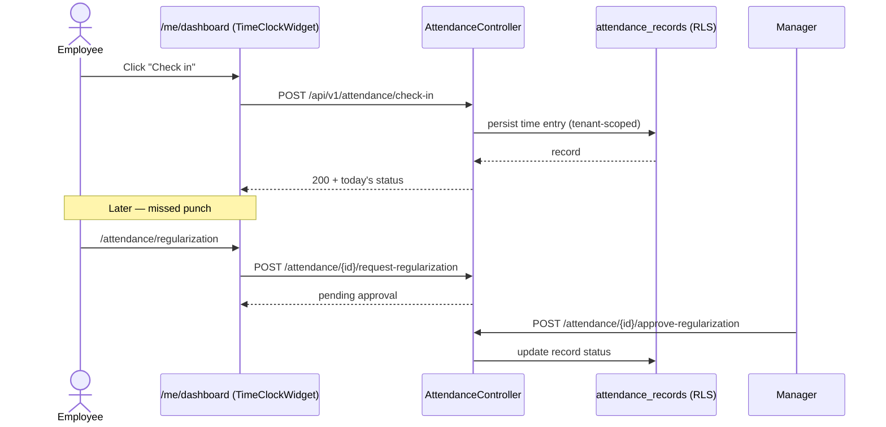
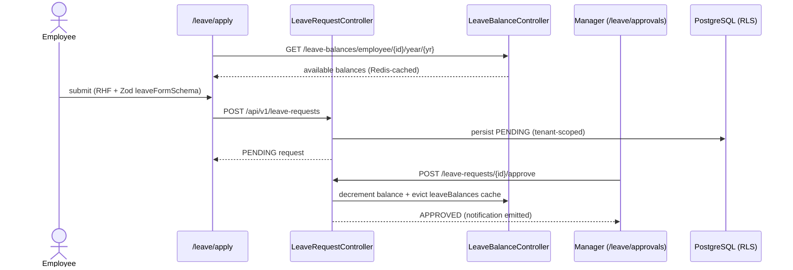
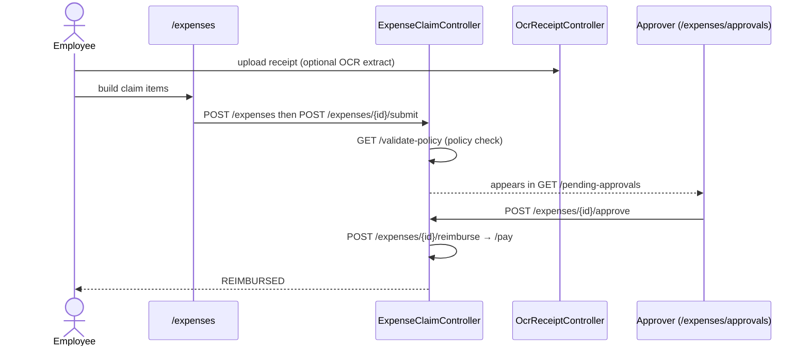
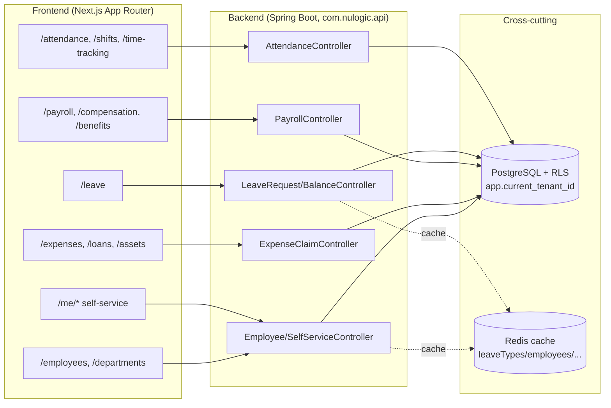

# NU-HRMS

> Core HR sub-app of [[System-Overview|NU-AURA]]. The default landing experience and the
> record-of-truth for the employee lifecycle. See [[Nu-Hire]], [[Nu-Grow]], [[Nu-Fluence]]
> for the sibling apps and [[Shared-Platform]] for the cross-cutting services every module
> leans on. Every route, controller, and endpoint cited below was read from source; paths are
> relative to the repo root `/Users/fayaz.m/IdeaProjects/nulogic/nu-aura`.

## Purpose

NU-HRMS owns day-to-day HR: employee master data, the self-service portal, attendance &
time tracking, shifts, leave, payroll/compensation/benefits, expenses, loans, assets,
Indian statutory/tax handling, letters, helpdesk, and the organization structure. It is the
largest of the four bundle apps and the one all employees touch daily.

The sub-app boundary is **declared**, not inferred, in `frontend/lib/config/apps.ts`
(`PLATFORM_APPS.HRMS`): flat routes (`/leave`, `/payroll`, ...) are mapped to HRMS at
runtime by `routePrefixes`, gated by `permissionPrefixes`. Entry route is `/me/dashboard` —
the personal self-service home.

```ts
// frontend/lib/config/apps.ts — PLATFORM_APPS.HRMS
HRMS: {
  code: 'HRMS', name: 'NU-HRMS', shortName: 'HRMS',
  description: 'Core HR management',
  entryRoute: '/me/dashboard',
  permissionPrefixes: [ 'employee','department','leave','attendance','payroll',
    'compensation','benefit','expense','loan','travel','asset','letter',
    'statutory','lwf','tax','helpdesk','overtime','probation','dashboard',
    'self_service','document','calendar','announcement','workflow',
    'org_structure','report','analytics','settings','role','permission',
    'integration','timesheet','project','resource','email','shift' ],
  available: true, order: 1,
}
```

## Business Capability

- **Employee lifecycle of record** — master data, directory, documents, skills, change
  requests, bulk import; the destination of the [[Nu-Hire]] hire-to-onboard handoff.
- **Time & attendance** — check-in/out, regularization, comp-off, biometric sync, holidays,
  shifts/rosters/swaps, timesheets, overtime.
- **Leave management** — apply / approve / encash / carry-forward against tenant leave types.
- **Compensation & payroll** — payroll runs, payslips, salary structures, bonuses, benefits.
- **Expense & spend** — claims, mileage, OCR receipts, advances, loans, asset assignment.
- **Statutory compliance** — TDS, PF, ESI, PT, LWF, tax declarations, statutory filings.
- **Servicing** — letters, HR helpdesk/ticketing, announcements, calendar, reports/analytics.

## Entry Points

### Key frontend routes (`frontend/app/...`)

Routes were enumerated directly from the filesystem; the app→route mapping is authoritative
per `HRMS.routePrefixes`.

| Area | Routes |
|------|--------|
| Self-service (`/me`) | `/me/dashboard`, `/me/profile`, `/me/leaves`, `/me/attendance`, `/me/payslips`, `/me/documents`, `/me/assets`, `/me/skills` |
| Attendance | `/attendance`, `/attendance/my-attendance`, `/attendance/team`, `/attendance/regularization`, `/attendance/comp-off`, `/attendance/shift-swap` |
| Shifts | `/shifts`, `/shifts/definitions`, `/shifts/patterns`, `/shifts/my-schedule`, `/shifts/swaps` |
| Time tracking | `/time-tracking`, `/time-tracking/new`, `/time-tracking/[id]`, `/time-tracking/[id]/edit`, `/timesheets` |
| Overtime | `/overtime` |
| Leave | `/leave`, `/leave/apply`, `/leave/my-leaves`, `/leave/team`, `/leave/approvals`, `/leave/calendar`, `/leave/encashment`, `/leave/admin/carry-forward` |
| Employees / org | `/employees`, `/employees/directory`, `/employees/[id]`, `/employees/[id]/edit`, `/employees/[id]/compensation`, `/employees/change-requests`, `/employees/import`, `/departments` |
| Payroll / comp | `/payroll`, `/payroll/runs`, `/payroll/runs/[id]`, `/payroll/bulk-processing`, `/payroll/payslips`, `/payroll/components`, `/payroll/salary-structures`, `/payroll/salary-structures/create`, `/payroll/structures`, `/payroll/statutory`, `/compensation`, `/benefits` |
| Expense / loans / assets | `/expenses`, `/expenses/[id]`, `/expenses/approvals`, `/expenses/reports`, `/expenses/mileage`, `/expenses/settings`, `/loans`, `/loans/new`, `/loans/[id]`, `/assets` |
| Statutory / tax | `/statutory`, `/statutory/filings`, `/tax`, `/tax/declarations`, `/lwf` |
| Servicing | `/letters`, `/letters/templates`, `/helpdesk`, `/helpdesk/tickets`, `/helpdesk/tickets/[id]`, `/helpdesk/sla`, `/helpdesk/knowledge-base`, `/announcements`, `/calendar` |
| Cross-cutting | `/dashboard`, `/dashboards`, `/approvals`, `/reports`, `/analytics`, `/settings`, `/admin`, `/workflows`, `/import-export` |

> **Excluded by design:** `app/recruitment`, `app/fluence`, `app/performance`, `app/okr`,
> `app/training`, `app/learning`, `app/recognition`, `app/surveys`, `app/wellness`,
> `app/onboarding`, `app/offboarding`, `app/careers`, `app/referrals` belong to the
> **sibling** sub-apps [[Nu-Hire]] / [[Nu-Grow]] per their own `routePrefixes`.

Frontend wiring is React Query hooks + `PermissionGate`; see [[Pages]], [[Routes]],
[[Components]]. Representative wiring:

- `app/me/dashboard/page.tsx` — composes self-service widgets (`TimeClockWidget`,
  `LeaveBalanceWidget`, `HolidayCarousel`, presence cards) via `useSelfServiceDashboard(employeeId)`
  plus `attendanceService`.
- `app/leave/apply/page.tsx` — RHF + Zod (`leaveFormSchema`), gated by `PermissionGate`,
  using `useActiveLeaveTypes`, `useEmployeeBalancesForYear`, `useCreateLeaveRequest`.

### Backend controllers / packages (`backend/src/main/java/com/nulogic/api/...`)

Controllers read from `backend/src/main/java/com/nulogic/api/<domain>/controller/`.

| Domain | Controllers |
|--------|-------------|
| `attendance` | `AttendanceController`, `MobileAttendanceController`, `CompOffController`, `BiometricDeviceController`, `HolidayController`, `RestrictedHolidayController`, `OfficeLocationController` |
| `timetracking` / `shift` / `overtime` | `TimeTrackingController`, `ShiftManagementController`, `ShiftSwapController`, `OverTimeManagementController` |
| `leave` | `LeaveRequestController`, `LeaveBalanceController`, `LeaveTypeController` |
| `payroll` | `PayrollController`, `GlobalPayrollController`, `BonusController`, `PayrollStatutoryController`, `StatutoryFilingController` |
| `compensation` / `benefits` | `CompensationController`, `BenefitManagementController`, `BenefitEnhancedController` |
| `expense` | `ExpenseClaimController`, `ExpenseItemController`, `ExpenseCategoryController`, `ExpensePolicyController`, `ExpenseReportController`, `ExpenseAdvanceController`, `MileageController`, `MileagePolicyController`, `OcrReceiptController` |
| `loan` / `asset` | `LoanController`, `AssetController` |
| `employee` / `selfservice` | `EmployeeController`, `EmployeeDirectoryController`, `EmployeeImportController`, `EmployeeDocumentController`, `EmployeeSkillController`, `TalentProfileController`, `SelfServiceController` |
| `organization` | `OrganizationController`, `DepartmentController`, `DesignationController` |
| `statutory` / `tax` | `TDSController`, `ProvidentFundController`, `ESIController`, `ProfessionalTaxController`, `LWFController`, `TaxDeclarationController` |
| `letter` / `helpdesk` | `LetterController`, `HelpDeskController`, `HelpDeskSLAController` |

See [[APIs]] for the full endpoint catalog and [[Services]] for the application layer.

## Dependencies

NU-HRMS consumes [[Shared-Platform]] services end to end:

- **Auth / RBAC** — JWT httpOnly cookie + DB-backed roles/permissions ([[Roles]],
  [[Permissions]], [[RBAC-Matrix]]). Allowed roles include `SUPER_ADMIN`, `HR_ADMIN`,
  `HR_EXECUTIVE`, `MANAGER`, `EMPLOYEE` (`frontend/lib/constants/roles.ts`).
- **Multi-tenancy / RLS** — `TenantFilter` → `TenantContext` ThreadLocal → PostgreSQL RLS
  via `TenantRlsTransactionManager` (`SET LOCAL app.current_tenant_id`). See [[Middleware]],
  [[Schema]], [[Security-Audit]].
- **Redis cache** — hot reference data `leaveTypes`, `departments`, `designations`,
  `employees`, `leaveBalances` with tiered TTLs (`CacheConfig`).
- **Kafka** — employee-lifecycle, approval, payroll, notification domain events.
- **Notifications** — leave/expense/payroll approvals route through the notification service.
- **File storage** — Google Drive for documents, receipts, generated letters.

## Key User Flows

### Attendance — check-in / check-out / regularization

Endpoints from `attendance/controller/AttendanceController.java`
(`@RequestMapping("/api/v1/attendance")`): `POST /check-in`, `POST /check-out`, `GET /today`,
`GET /my-attendance`, `POST /{id}/request-regularization`, `POST /{id}/approve-regularization`,
`POST /{id}/reject-regularization`.



### Leave — apply → approve → balance update

Endpoints from `leave/controller/LeaveRequestController.java`
(`@RequestMapping("/api/v1/leave-requests")`): `POST` (create), `POST /{id}/approve`,
`POST /{id}/reject`, `POST /{id}/cancel`, `GET /employee/{employeeId}`. Balances from
`LeaveBalanceController` (`/api/v1/leave-balances`):
`GET /employee/{employeeId}/year/{year}`, `POST /encash`, `POST /admin/carry-forward`.



### Expense claim — submit → approve → reimburse

Endpoints from `expense/controller/ExpenseClaimController.java`
(`@RequestMapping("/api/v1/expenses")`): `POST` (create), `POST /{claimId}/submit`,
`POST /{claimId}/approve`, `POST /{claimId}/reject`, `POST /{claimId}/reimburse`,
`POST /{claimId}/pay`, `GET /pending-approvals`, `GET /validate-policy`. Receipts can be
parsed via `OcrReceiptController`; mileage via `MileageController`.



### Payroll run (admin) — supporting flow

From `payroll/controller/PayrollController.java` (`/api/v1/payroll`): `POST /runs` →
`POST /runs/{id}/process` → `POST /runs/{id}/approve` → `POST /runs/{id}/lock`; payslips
via `GET /payslips/employee/{employeeId}/year/{year}`, surfaced to employees at `/me/payslips`.

## Architecture at a Glance



## Ownership

Self-assessed — there are no formal `CODEOWNERS`/owner records in the repo. Treat as the
largest and most cross-cutting module; touching it ripples across [[Shared-Platform]].

## Risks

- **Tenant isolation surface is huge** — every HRMS table is RLS-scoped; a single
  `set_config(...,false)` regression on a pooled connection leaks cross-tenant (historical
  RLS-leak finding, since fixed). See [[Security-Audit]].
- **Statutory engine is India-specific** — TDS/PF/ESI/PT/LWF logic is jurisdiction-bound and
  drifts with annual budget changes; high correctness risk.
- **Payroll lock semantics** — run lifecycle (`process → approve → lock`) must be idempotent;
  partial runs are financially sensitive.
- **Cache staleness** — leave-balance and employee caches must evict on every mutation path.

## Operational Notes

- Entry route `/me/dashboard`; dev ports frontend `:3000`, backend `:8080`.
- Payslips surface to employees at `/me/payslips`; admin payroll at `/payroll/runs/[id]`.
- Bulk imports (`/employees/import`, KEKA migration) are batched — watch for N+1 saves
  (recently remediated for onboarding/budget/biometric paths).
- Letters and documents depend on the Google Drive `StorageProvider`; mock provider in dev.

## Source References

- `frontend/lib/config/apps.ts` — `PLATFORM_APPS.HRMS` (route & permission mapping)
- `frontend/app/me/dashboard/page.tsx`, `frontend/app/leave/apply/page.tsx`
- `backend/.../api/attendance/controller/AttendanceController.java`
- `backend/.../api/leave/controller/{LeaveRequestController,LeaveBalanceController}.java`
- `backend/.../api/payroll/controller/PayrollController.java`
- `backend/.../api/expense/controller/ExpenseClaimController.java`
- `backend/.../api/selfservice/controller/SelfServiceController.java`

## Related Links

- [[System-Overview]] · [[C4-Container]] · [[Module-Relationships]] · [[Data-Flows]] · [[System-Flows]]
- Siblings: [[Nu-Hire]] (hire-to-onboard source) · [[Nu-Grow]] (performance on the same employee) · [[Nu-Fluence]]
- Platform: [[Shared-Platform]] · [[Middleware]] · [[Roles]] · [[Permissions]] · [[RBAC-Matrix]] · [[Schema]] · [[ERD]] · [[APIs]] · [[Services]] · [[Pages]] · [[Routes]] · [[Components]] · [[Security-Audit]]
