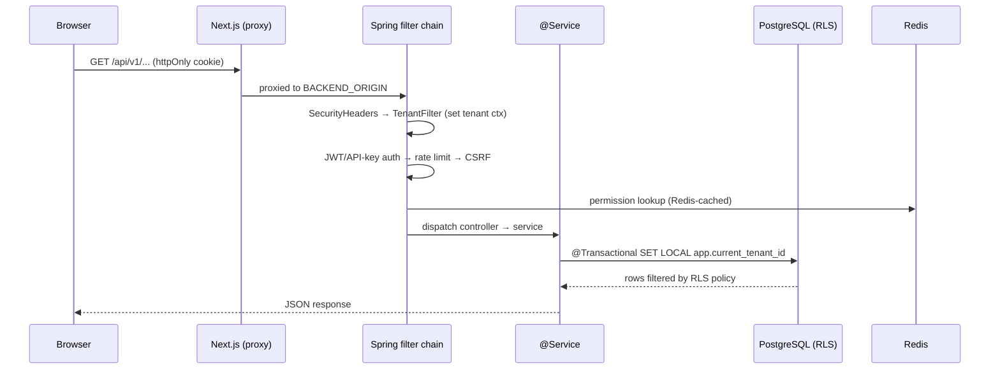

# Shared-Platform

> The cross-cutting layer every sub-app stands on: auth, RBAC, multi-tenancy/RLS,
> notifications, integrations, feature flags, file storage, audit, and admin. Consumed by
> [[Nu-HRMS]], [[Nu-Hire]], [[Nu-Grow]], [[Nu-Fluence]]. Grounding:
> `docs/architecture/README.md`, `docs/architecture/backend.md`.

## Purpose

NU-AURA is a single Next.js frontend + single Spring Boot modular monolith serving four
sub-apps from the same deployable units. The shared platform provides the services those apps
all depend on so each module can focus on its domain. It is not a user-facing app; it is the
spine — see [[System-Overview]] and [[C4-Container]].

## Business Capability

- **Authentication** — JWT in httpOnly cookie, Google OAuth, MFA, optional SAML 2.0 SSO,
  API keys for integrations; token blacklist + account lockout.
- **Authorization (RBAC)** — DB-backed roles & permissions cached in Redis; implicit-role
  rules; permission gating at edge and backend.
- **Multi-tenancy** — shared-DB/shared-schema with PostgreSQL Row-Level Security; tenant
  registration & management.
- **Notifications** — multi-channel (in-app, email, SMS, Slack) with per-user preferences.
- **Integrations** — connectors, DocuSign, Slack commands, webhooks (+ rotation).
- **Feature flags** — runtime toggles by key/category.
- **File storage** — Google Drive behind a `StorageProvider` abstraction.
- **Audit & admin** — system audit log, admin/system operations, Kafka admin, encryption backfill.

## Entry Points

### Key frontend routes (`frontend/app/...`)

| Area | Routes |
|------|--------|
| Auth | `/login` and auth flows (`lib/hooks` + Zustand auth store) |
| Admin | `/admin`, `/admin/roles`, `/admin/permissions`, `/admin/implicit-roles`, `/admin/feature-flags`, `/admin/integrations`, `/admin/system`, `/admin/audit` |
| Settings | `/settings`, `/settings/rbac`, `/settings/sso`, `/settings/security`, `/settings/notifications` |
| Integrations | `/integrations`, `/integrations/slack` |
| Notifications | `/notifications` |

RBAC client config: `frontend/lib/config/apps.ts` (route↔app mapping), `lib/constants/roles.ts`,
`lib/types/roles.ts`, `lib/types/implicitRoles.ts`, `lib/hooks/usePermissions.ts`. Generated
clients under `lib/generated/api/{role-controller,permission-controller,implicit-role-rules}`.
See [[Pages]], [[Routes]], [[Roles]], [[Permissions]], [[RBAC-Matrix]].

### Backend controllers / packages (`backend/src/main/java/com/nulogic/api/...`)

| Domain | Controllers (base path) |
|--------|-------------------------|
| `auth` | `AuthController` (`/auth`: `/login`, `/google`, `/mfa-login`, `/refresh`, `/logout`, `/change-password`, `/forgot-password`, `/reset-password`, `/me`), `MfaController`, `SamlConfigController` |
| `user` (RBAC) | `UserController`, `RoleController` (`/roles`), `PermissionController` (`/permissions`), `ImplicitRoleRuleController`, `NotificationPreferencesController` |
| `platform` | `TenantController` (`/tenants`: `/register`), `PlatformController` (`/platform`), `RootProbeController` |
| `featureflag` | `FeatureFlagController` (`/admin/feature-flags`: `/map`, `/enabled`, `/check/{key}`, `/{key}/toggle`) |
| `notification` | `NotificationController` (`/notifications`), `MultiChannelNotificationController`, `SmsNotificationController` |
| `integration` | `IntegrationController` (`/integrations`), `IntegrationConnectorController`, `DocuSignController`, `SlackCommandController` |
| `webhook` | `WebhookController`, `WebhookRotationController` |
| `admin` / `audit` | `AdminController` (`/admin`), `SystemAdminController`, `KafkaAdminController`, `EncryptionBackfillController`, `SystemAuditLogController`, `AuditLogController` |
| `document` | `FileUploadController` |

Cross-cutting infra (`backend/.../common/`): `SecurityConfig`, `TenantFilter`,
`TenantRlsTransactionManager`, `TenantAwareDataSourceConfig`, `TenantCacheManager`,
`TenantAwareTaskDecorator`, `TenantIdentifierResolver`, `CacheConfig`, `RedisConfig`,
`ElasticsearchConfig`, `GoogleDriveConfig`, `SamlSecurityConfig`. See [[Middleware]],
[[Services]], [[APIs]].

## Dependencies

Inverted — the sub-apps depend on this layer, not vice versa. Internally it relies on:

- **PostgreSQL 16** — system of record + RLS policies ([[Schema]], [[ERD]]).
- **Redis 7** — cache, `DistributedRateLimiter`, `TokenBlacklistService`,
  `AccountLockoutService`, edit/idempotency locks, `RedisWebSocketRelay`.
- **Kafka** — domain events + DLT; `IdempotencyService` for exactly-once.
- **Elasticsearch 8** — opt-in full-text (used by [[Nu-Fluence]] and employee/document search).
- **Google Drive** — `StorageProvider` for all file storage.
- **Google OAuth / SAML IdP** — federated login.

## Technical Flow — request lifecycle (auth + tenant + RLS)

## Ownership

Self-assessed — no formal owners in the repo. This is the highest-blast-radius module; a
regression here (auth, RLS, rate limiting) affects all four sub-apps simultaneously.

## Related Links

- [[System-Overview]] · [[C4-Container]] · [[Module-Relationships]] · [[Data-Flows]] · [[System-Flows]]
- Consumers: [[Nu-HRMS]] · [[Nu-Hire]] · [[Nu-Grow]] · [[Nu-Fluence]]
- Detail: [[Middleware]] · [[Roles]] · [[Permissions]] · [[RBAC-Matrix]] · [[Schema]] · [[ERD]] · [[APIs]] · [[Services]] · [[Pages]] · [[Routes]] · [[Components]] · [[Security-Audit]]
- Grounding: `docs/architecture/README.md`, `docs/architecture/backend.md`

## Risks

- **RLS fail-closed is load-bearing** — historical leak via session-scoped
  `set_config(...,false)` on pooled connections (fixed); `V177` strict policies + `V254`
  NOBYPASSRLS runtime role + `RlsStartupProbe` canary enforce it. Any new tenant table must be
  fail-closed. See [[Security-Audit]], [[Schema]].
- **TENANT_ADMIN role mapping** — a prior bug mapped `TENANT_ADMIN` to an `ADMIN` code →
  empty permissions → blanket 403s. RBAC code mapping is fragile; validate against
  `lib/constants/roles.ts` and the DB role table ([[Roles]], [[Permissions]]).
- **Demo credentials gate** — `DEMO_CREDENTIALS_ENABLED` + seeded `Welcome@123` must be off
  in production (deploy-gate checklist).
- **Async tenant propagation** — ThreadLocal `TenantContext` does not cross to Kafka
  consumers / `taskExecutor` threads without `TenantAwareTaskDecorator`; missing re-set leaks.
- **Single origin / cookie auth** — JWT in httpOnly cookie + CSRF double-submit; cookie
  `Domain` must match the serving host (local preview gotcha: use `localhost`, not `*.local`).

## Operational Notes

- Dev ports: frontend `:3000`, backend `:8080`. Single origin — Next proxies `/api/v1/*` and
  `/ws/*` to `BACKEND_ORIGIN` (`frontend/next.config.js`).
- 25 `@Scheduled` jobs (attendance, contracts, email, notifications, recruitment, leave
  accrual, rate-limit cleanup) guarded by ShedLock for multi-pod safety.
- Frontend API hooks are Orval-generated from the backend SpringDoc OpenAPI spec — keep the
  committed spec snapshot in sync.
- Tenant registration via `POST /api/v1/tenants/register`; feature flags toggled at
  `/admin/feature-flags`.
