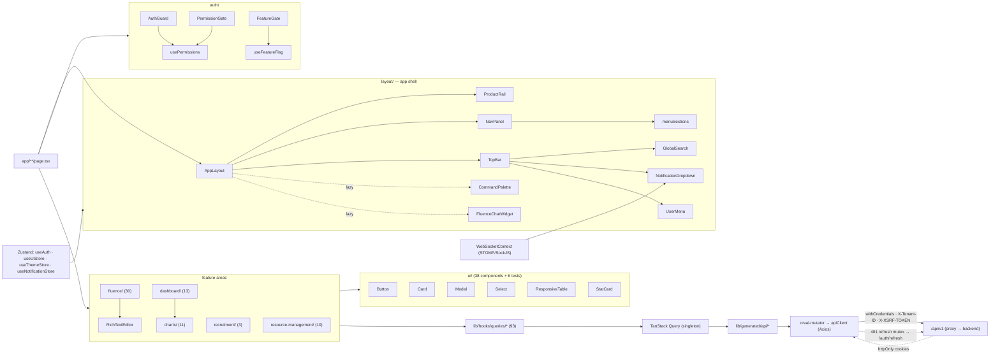

# Frontend Components — Inventory, State & Providers

## Purpose

Inventory of the **171** React components under `frontend/components/`, organized
by feature area, plus the shared UI primitive library, the state-management split
([[#State management]] — Zustand for client/identity/UI, TanStack Query for
server state), the realtime `WebSocketContext`, and the custom-hook catalog.
Companion to [[Routes]] (route map) and [[Pages]] (layout + guard logic).

## Context

**Measured** (`find frontend/components -name '*.tsx' | wc -l` and per-dir
counts, run for this doc):

| Metric | Count |
|--------|-------|
| Total components (`*.tsx` under `components/`) | **171** (incl. 9 test files; 162 pure components) |
| `use*` hook files (whole frontend) | **121** (excl. generated; 114 non-test) |
| Domain query hooks (`lib/hooks/queries/*`) | **93** |
| Service wrappers (`lib/services/*`) | **226** |
| Zustand stores (`lib/stores/*`) | **3** (+ 2 test files) |
| React contexts (`lib/contexts/*`) | **1** (`WebSocketContext`) |

### Components by feature area (measured per-dir)

| Area | Count | Examples |
|------|-------|----------|
| `ui/` (shared primitives) | **44** (38 components + 6 test files) | `Button`, `Card`, `Modal`, `Select`, `Input`, `Tabs`, `ResponsiveTable`, `StatCard`, `EmptyState`, `Toast`, `ConfirmDialog`, `FileUpload`, `AdvancedFilterPanel`, `ErrorBoundary`, `AccessibleFormField`, `Sidebar`, `Skeleton`, `SlidePanel`, `Spinner`, `Switch` |
| `fluence/` ([[Nu-Fluence]]) | **30** (23 direct + 4 `macros/` + 3 `editor/`) | `RichTextEditor`, `WikiPageTree`, `ContentViewer`, `InlineComments`, `MentionInput`, `FluenceChatWidget`, `ChatSourceCard`, `FileUploader`, `MacroRenderer`, `TableOfContents`, `SpacePermissionsDrawer` |
| `layout/` (app shell) | **16** (11 direct + 5 `shell/`) | `AppLayout`, `Header`, `GlobalSearch`, `NotificationDropdown`, `UserMenu`, `menuSections`, `Breadcrumbs`, `DarkModeProvider`, `MantineThemeProvider`, `AdminPageContent`, `AppLandingHero`, + `shell/` (`ProductRail`, `NavPanel`, `TopBar`, `CommandPalette`, `shellConfig`) |
| `dashboard/` | **13** | dashboard widgets / cards |
| `charts/` (Recharts) | **11** (6 direct + 5 `aura/`) | chart wrappers, `aura/` primitives (`AreaChart`, `BarsH`, `Donut`, `Ring`, `Sparkline`) |
| `resource-management/` (PSA) | **10** | allocation / resourcing UI |
| `auth/` | **7** (5 components + 2 test files) | `AuthGuard`, `PermissionGate`, `FeatureGate`, `MfaSetup`, `MfaVerification` |
| `integrations/` | **5** | connector config UI |
| `wall/` ([[Nu-Fluence]] social) | **4** | `PostComposer`, `ReactionBar`, `CommentThread`, `WallCards` |
| `motion/` (Framer Motion) | **4** | animation primitives |
| `recruitment/` ([[Nu-Hire]]) | **3** | |
| `projects/` · `performance/` · `notifications/` · `errors/` | 3 each | |
| `platform/` · `payroll/` · `expenses/` · `custom-fields/` · `admin/` | 2 each | `platform/` incl. 1 test file |
| `training/` · `employee/` | 1 each | |

> No root-level `components/*.tsx` files — everything is grouped by feature area
> (matches the "organize by surface area, not file type" convention).

## Dependencies

Versions from `frontend/package.json`: Next.js (App Router) `^16.2.7`, React
`19.2.7`, TypeScript strict, Mantine `@mantine/core ^9.3.0`, Tailwind `3.4.19`,
TanStack React Query `^5.100.14`, Zustand `^5.0.14`, Axios `^1.15.2`, Orval
`^7.21.0`, React Hook Form `^7.49.2` + Zod `3.23.8`, Framer Motion `^12.40.0`,
`@react-oauth/google ^0.12.2`, STOMP over SockJS.

- **UI**: Mantine 9 (`@mantine/core`, `@mantine/notifications`) + Tailwind 3.4.
- **Server state**: TanStack Query v5 (`lib/queryClient.ts` singleton).
- **Client state**: Zustand 5 (`lib/hooks/useAuth.ts`, `lib/stores/*`).
- **Forms**: React Hook Form + Zod. **HTTP**: Axios (`lib/api/client.ts`).
- **Rich text**: Tiptap (`fluence/RichTextEditor`). **Charts**: Recharts.
- **Motion**: Framer Motion. **DnD**: `@hello-pangea/dnd` (recruitment kanban).
- **Realtime**: STOMP + SockJS (`lib/contexts/WebSocketContext.tsx`).
- **Generated API**: Orval (`lib/generated/api/*`, gitignored) via `orval-mutator`.

## Diagram — Component dependency map

## State management

**Two distinct lanes** — server state never duplicated into client stores.

### Client / identity / UI — Zustand

| Store | File | Holds |
|-------|------|-------|
| Auth | `lib/hooks/useAuth.ts` | `user`, `isAuthenticated`, `isLoading`, `hasHydrated`; actions `login`/`googleLogin`/`logout`/`restoreSession`. `persist` middleware; user mirrored to `sessionStorage` `nu-aura-user`. |
| UI | `lib/stores/useUiStore.ts` | sidebar/modal state |
| Theme | `lib/stores/useThemeStore.ts` | dark mode |
| Notifications | `lib/stores/useNotificationStore.ts` | in-app notifications |

### Server state — TanStack Query

`lib/queryClient.ts` singleton (`getQueryClient()`); domain hooks in
`lib/hooks/queries/*` (**93**) wrap Orval-generated hooks; `lib/services/*`
(**226**) are thin domain wrappers, not a separate data layer. `queryClient.clear()`
on logout wipes cached server state. See [[APIs]] · [[Services]] · [[Data-Flows]].

Defaults (from `lib/queryClient.ts`): `staleTime` 5 min, `gcTime` 10 min,
`retry: 1`, `refetchOnWindowFocus: false` for queries; **`retry: false` for
mutations** (writes are not safely repeatable — a timed-out POST may still commit
server-side). A `MutationCache.onError` routes all mutation errors through
`createQueryErrorHandler()`.

### Data layer — Orval + Axios

The three-layer data path (`lib/hooks/queries/*` → Orval-generated hooks →
`apiClient`) is the single contract surface against the backend:

- **Orval codegen** (`orval.config.ts`, Orval `^7.21.0`): input is
  `API_DOCS_URL` env or `http://localhost:8080/v3/api-docs` (CI uses the
  committed `frontend/openapi-snapshot.json`); output `lib/generated/api/`
  (**gitignored**, regenerated via `npm run api:generate`), `mode: 'tags-split'`
  (one file per OpenAPI tag), `client: 'react-query'`, `httpClient: 'axios'`.
- **Custom mutator** (`lib/api/orval-mutator.ts → orvalMutator()`): every
  generated call delegates to the hand-rolled `apiClient`, so cookie auth, CSRF,
  the 401 refresh mutex, tenant headers, and `/api/v1` normalization are
  preserved while generated code stays thin and type-safe.
- **Axios singleton** (`lib/api/client.ts`, an `ApiClient` class):
  `withCredentials: true` (httpOnly cookie auth — **no tokens in localStorage**).
  Request interceptor injects `X-Tenant-ID` (from `safeStorage`) and, for
  non-GET, `X-XSRF-TOKEN` read from the `XSRF-TOKEN` cookie (double-submit CSRF);
  GET timeout 30 s, writes 120 s. Response 401 interceptor uses a **shared
  refresh mutex** (`refreshPromise` via `getSharedRefreshPromise` /
  `setSharedRefreshPromise`) so concurrent 401s and `useAuth.restoreSession()`
  share one `/auth/refresh` call (SEC-F06 / P0-SESSION-FIX), then retries the
  original request; on refresh failure a debounced hard redirect to
  `/auth/login?reason=expired` fires (auto-resets after 5 s).
  `getPermissive<T>()` treats 403/404 as non-errors (`validateStatus: s < 500`)
  for endpoints a role may legitimately lack.

### Realtime — context

`lib/contexts/WebSocketContext.tsx`: STOMP-over-SockJS keyed on
`isAuthenticated`/`user`; exposes `notifications`, `unreadCount`, `markAsRead`,
and approval-task callbacks consumed by `NotificationDropdown`.

## `lib/` layout

| Dir | Role |
|-----|------|
| `lib/api/` | Axios `client.ts`, `orval-mutator.ts`, `public-client.ts`, hand-written endpoint modules (`auth.ts`, `mfa.ts`, `roles.ts`, `users.ts`) |
| `lib/generated/api/` | Orval output (gitignored) |
| `lib/hooks/` + `lib/hooks/queries/` | auth/permission/UI hooks + per-domain query hooks (93) |
| `lib/stores/` | Zustand UI/theme/notification stores |
| `lib/services/` | thin domain service wrappers |
| `lib/config/` | `env.ts` (Zod-validated), `routes.ts`, `apps.ts`, `index.ts` |
| `lib/contexts/` | `WebSocketContext.tsx` |
| `lib/theme/` | `theme-script.ts` FOUC prevention; CSS-var fonts |
| `lib/types/` | hand-written domain types |
| `lib/utils/` | `error-handler.ts`, `logger.ts`, `safeStorage.ts`, `googleToken.ts`, formatters |
| `queryClient.ts` | React Query singleton |

`lib/config/env.ts` validates env vars with Zod (`NEXT_PUBLIC_API_URL` required
and URL-shaped; `NEXT_PUBLIC_GOOGLE_CLIENT_ID` optional; loopback/placeholder URL
detection helpers). The `/api/v1` rewrite + CSP nonce are emitted by
`frontend/proxy.ts` ([[Routes]], [[Pages]]).

## Provider stack

Assembled in `frontend/app/providers.tsx` (full chain documented in [[Pages]]):
`ErrorBoundary → GoogleOAuthProvider → QueryClientProvider → ToastProvider (ui)
→ NotificationsToastProvider → DarkModeProvider → MantineThemeProvider →
Notifications → WebSocketProvider → TokenRefreshManager → AuthGuard → children`.

## Custom hooks (121 `use*` files, excl. generated)

- **Auth/RBAC**: `useAuth`, `useAuthStatus`, `usePermissions`, `useActiveApp`,
  `useFeatureFlag`, `useSamlConfig`.
- **Session lifecycle**: `useTokenRefresh`, `useSessionTimeout`,
  `useUnsavedChanges`, `useUnsavedChangesWarning`.
- **Domain query hooks** (93 in `lib/hooks/queries/`): `useEmployees`,
  `useApprovals`, `useDashboards`, `useAttendance`, `useExpenses`,
  `useContracts`, `useAgency`, `useCompensation`, `useEsignature`, …
- **Utility**: `useDebounce`, `useAnimation`, `useAriaAnnounce` (a11y live
  region), `useOrgChart`, `usePreloadData`, `useBiometric`, `useFluenceChat`,
  `useCompetency`, `useNotifications`.

**Non-query hook count** (excl. generated, excl. test files): **114** hook files in
`lib/hooks/` (non-queries) and `lib/hooks/queries/` (93 files).

## Related Links

- [[Routes]] — route map · [[Pages]] — layouts, guards, data fetching
- [[APIs]] · [[Services]] — backend contract these hooks call
- [[Permissions]] · [[Roles]] · [[RBAC-Matrix]] — `usePermissions` / gating
- [[Data-Flows]] · [[System-Flows]] — request lifecycle, WebSocket fan-out
- [[Test-Coverage]] — component + RBAC test sweep
- [[Nu-HRMS]] · [[Nu-Hire]] · [[Nu-Grow]] · [[Nu-Fluence]] · [[Shared-Platform]]
- [[System-Overview]] · [[C4-Container]] · [[C4-Component]] · [[00-Home]]

## Risks

- **226 service wrappers vs 93 query hooks vs generated Orval**: three layers of
  indirection over the API. Thin wrappers can drift or duplicate; verify a
  service isn't shadowing a generated hook before adding logic.
- **`lib/generated/api/*` is gitignored** — regenerated from
  `openapi-snapshot.json` / live `/v3/api-docs`. A stale snapshot means
  components compile against an outdated contract ([[APIs]]).
- **Mantine + Tailwind dual styling**: two systems in play; uncoordinated tokens
  risk visual drift (the repo enforces a compact desktop-first sizing baseline).
- **Heavy client libs** (Tiptap, Recharts, Framer Motion, SockJS): bundle weight;
  `AppLayout` lazy-loads `CommandPalette` and `FluenceChatWidget` to mitigate.
- **WebSocket lifecycle** keyed on auth — reconnect/cleanup correctness matters
  for multi-tab and post-refresh scenarios.

## Operational Notes

- Recount: `find frontend/components -name '*.tsx' | wc -l` (171 total, 162 non-test);
  per-area: pipe through `sed`/`awk` on the first path segment.
- Component tests live beside sources (`Button.test.tsx`, `Stat.test.tsx`,
  `StatusBadge.test.tsx`, `Callout.test.tsx`, store/hook `.test.ts`).
- `shell/CommandPalette.tsx` and `fluence/FluenceChatWidget.tsx` are lazy
  imports in `AppLayout` — expect them absent from the initial chunk.
- Dev ports: frontend 3000, backend 8080.
