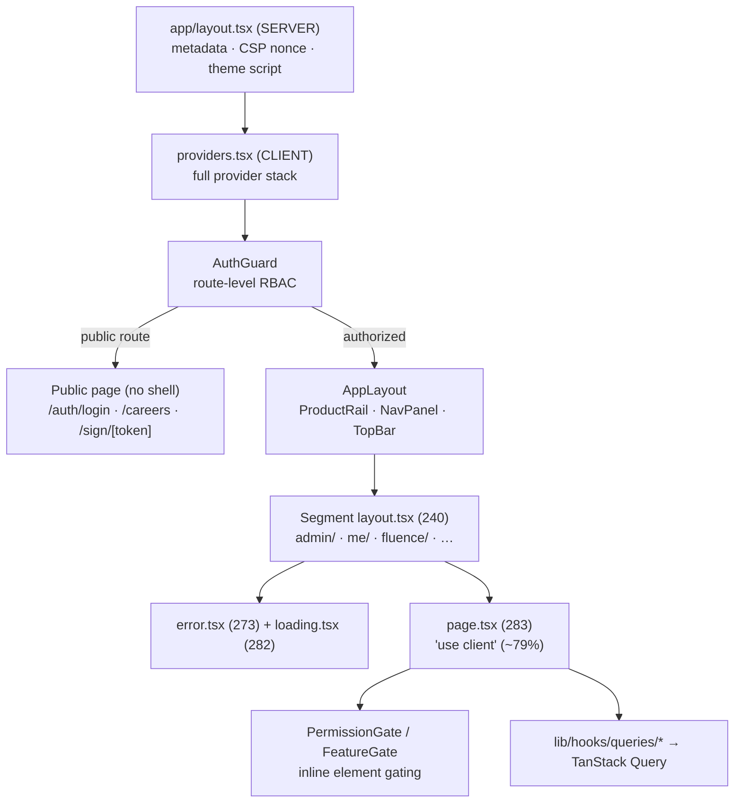
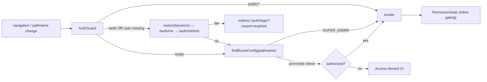

# Frontend Pages — Layouts, Guards & Data Fetching

## Purpose

How the **283** [[Routes|route pages]] are composed: the root layout + provider
stack, segment-scoped layouts, the [[RBAC-Matrix|RBAC]] route guard
(`AuthGuard`) and inline `PermissionGate`, the server-vs-client component split,
and the standard data-fetching pattern (Orval-generated [[APIs|API]] hooks over
TanStack Query). Pair with [[Routes]] (route map) and [[Components]] (UI inventory).

## Context

**Measured** (`find frontend/app …`, run for this doc):

| Metric | Count |
|--------|-------|
| `page.tsx` | **283** |
| `layout.tsx` (root + segment) | **240** |
| `error.tsx` boundaries | **273** |
| `loading.tsx` suspense | **282** |
| `not-found.tsx` | **1** (root) · `global-error.tsx` 1 (root) |
| Files with `'use client'` (app + components) | **1043** of **1323** total `.tsx` (~79%) |

> **Almost everything is a client component.** ~79% of `.tsx` files carry
> `'use client'`. The only confirmed **server components** are the root
> `app/layout.tsx` (sets `metadataBase`, CSP nonce, theme FOUC script) plus
> `robots.ts` / `sitemap.ts`. Data is fetched **client-side** via TanStack Query
> + Orval hooks, not React Server Components — there are no `app/**/route.ts`
> data endpoints except `/api/health`.

## Dependencies

- **Root layout** — `frontend/app/layout.tsx` (server): metadata, viewport, skip
  link, theme FOUC + Mantine `ColorSchemeScript`, both stamped with the CSP
  **nonce** from `x-nonce` (set by `frontend/proxy.ts`, production only).
- **Provider stack** — `frontend/app/providers.tsx` (client).
- **Route guard** — `frontend/components/auth/AuthGuard.tsx`.
- **Inline gate** — `frontend/components/auth/PermissionGate.tsx`,
  `FeatureGate.tsx`, MFA components.
- **Permission logic** — `frontend/lib/hooks/usePermissions.ts` ([[Permissions]]).
- **Auth store** — `frontend/lib/hooks/useAuth.ts` (Zustand + `persist`).
- **Route config** — `frontend/lib/config/routes.ts` (`PROTECTED_ROUTES`).
- **App shell** — `frontend/components/layout/AppLayout.tsx` + `shell/*`.
- **Query client** — `frontend/lib/queryClient.ts` (singleton).

## Provider stack (verified from `providers.tsx`)

```
ErrorBoundary
└─ GoogleOAuthProvider          (sentinel client id when OAuth disabled)
   └─ QueryClientProvider       (singleton getQueryClient())
      └─ ToastProvider (ui)
         └─ NotificationsToastProvider
            └─ DarkModeProvider
               └─ MantineThemeProvider
                  └─ <Notifications position="top-right" autoClose={5000}/>
                     └─ WebSocketProvider           (STOMP/SockJS)
                        └─ TokenRefreshManager       (useTokenRefresh + useSessionTimeout)
                           └─ AuthGuard              (route-level RBAC)
                              └─ {children}          → AppLayout → page.tsx
```

`TokenRefreshManager` wires proactive token refresh and inactivity logout, both
keyed on `isAuthenticated`. `GoogleOAuthProvider` always wraps to avoid the
"must be used within GoogleOAuthProvider" error even when OAuth is off.

## Layout nesting

- **Root** `app/layout.tsx` (server) → `Providers` → per-route `layout.tsx`.
- **240 segment layouts**: most top-level dirs and many nested dirs carry their
  own `layout.tsx` (e.g. `admin/`, `admin/roles/`, `admin/budget/`,
  `attendance/`, `attendance/team/`, `contracts/[id]/`, `auth/login/`,
  `app/fluence/`). They provide segment shells, segment-scoped `error.tsx`
  (273) and `loading.tsx` (282) boundaries.
- The **app chrome** (product rail, nav panel, top bar) is rendered by
  `AppLayout.tsx` inside `AuthGuard`, not by a route group layout — so public
  routes (login, careers, sign) render without the shell.



## Route guard — `AuthGuard.tsx`

On every navigation:

1. Wait for Zustand hydration (`hasHydrated`).
2. Allow public routes (`isPublicRoute` from `routes.ts`).
3. If unauthenticated **or** authenticated-but-`user`-missing → call
   `restoreSession()` (cookie-based `/auth/me` then `/auth/refresh`) **before**
   redirecting; uses ref mirrors (`isRestoringRef`, `restoreAttemptedRef`) to
   survive React StrictMode double-fires.
4. Once `isReady`, look up `findRouteConfig(pathname)` in `PROTECTED_ROUTES` and
   evaluate `permission` / `anyPermission` / `allPermissions` / `adminOnly` /
   `hrOnly` / `managerOnly`. **`SUPER_ADMIN` bypasses all route checks.**



## Inline gating — `PermissionGate` / `FeatureGate`

`PermissionGate` conditionally renders buttons/menus/page shells via
`permission` / `anyOf` / `allOf` / `role` / `anyRole` / `allRoles`. While
`!isReady` it renders a visible `Loading...` placeholder (so smoke tests and
assistive tech see a mounted page); `isAdmin` bypasses; `PageDeniedFallback`
gives a visible page-level denial (inline gates default to `null` to hide
silently). `FeatureGate` gates by feature flag (`useFeatureFlag`).

`usePermissions()` (`lib/hooks/usePermissions.ts`) — permissions and roles
originate from the login / `/auth/me` response (stored as `Role[]` with nested
permissions on the Zustand `user`), mirroring the backend permission model:

- `Permissions` constant holds `MODULE:ACTION` codes (e.g. `EMPLOYEE:READ`,
  `PAYROLL:APPROVE`) plus field-level codes (e.g. `FIELD:EMPLOYEE:BANK:VIEW`)
  matching backend `Permission.java` / `FieldPermission`. `Roles` includes
  `SUPER_ADMIN`, `TENANT_ADMIN`, and HR/finance/manager roles.
- Normalizes three permission shapes: canonical `MODULE:ACTION`, legacy dot
  `employee.read` (→ `EMPLOYEE:READ`), and app-prefixed `APP:MODULE:ACTION`
  (→ `MODULE:ACTION`).
- `MODULE:MANAGE` implies all actions in that module.
- `isAdmin` bypass **only** for `SUPER_ADMIN` / `SYSTEM:ADMIN`-equivalent —
  **`TENANT_ADMIN` is additive** (mirrors backend `SecurityContext.isSuperAdmin()`).
- `isReady` stays `false` during the post-refresh window (`isAuthenticated &&
  !user`) so gates show loading instead of false-denying.

### Sub-app gating

`useActiveApp()` (`lib/hooks/useActiveApp.ts`) derives the active sub-app from
`usePathname()` and exposes `hasAppAccess(code)` — matching the user's permission
module prefixes against each app's `permissionPrefixes` (`SUPER_ADMIN`
short-circuits) — plus `getAppEntryRoute(code)`. `AppLayout`
(`components/layout/AppLayout.tsx`) builds the sidebar from `buildMenuSections`
filtered by `APP_SIDEBAR_SECTIONS[appCode]`. See [[Routes]] for the
`PLATFORM_APPS` prefix tables.

### RBAC verification harness

`frontend/nu-rbac.config.ts` is a standalone Playwright config that runs only
`e2e/nu-rbac.spec.ts` against the dev server on `:3000` (no auth-setup project,
single chromium). The spec drives a role × route catalog (`SUPER_ADMIN`,
`TENANT_ADMIN`, `HR_ADMIN`, … `EMPLOYEE`) asserting `render` / `redirect` /
`render_scoped` per use case, failing soft if the optional `nu-chrome-e2e`
catalog is absent ([[Test-Coverage]]).

## Data-fetching pattern (per page)

1. Page component (client) calls a domain hook from
   `frontend/lib/hooks/queries/*` (**93** files, e.g. `useEmployees`,
   `useApprovals`, `useDashboards`).
2. Those wrap **Orval-generated** React Query hooks (`lib/generated/api/*`,
   gitignored, `mode: 'tags-split'`).
3. Every generated call routes through `orvalMutator()` →
   `apiClient` (Axios singleton) → preserves cookie auth, CSRF double-submit,
   401 refresh mutex, `X-Tenant-ID`, `/api/v1` normalization.
4. `getQueryClient()` singleton: `staleTime` 5 min, `gcTime` 10 min, `retry: 1`
   for queries, **`retry: false` for mutations** (writes not safely repeatable).

See [[Data-Flows]] for the full request lifecycle and [[Services]] / [[APIs]].

## Related Links

- [[Routes]] — full route map and dynamic segments
- [[Components]] — UI inventory, state stores, providers
- [[Permissions]] · [[Roles]] · [[RBAC-Matrix]] — gating model
- [[APIs]] · [[Services]] · [[Data-Flows]] — data layer
- [[Security-Audit]] — auth + CSP findings
- [[Test-Coverage]] — `nu-rbac.spec.ts` route×role sweep
- [[Nu-HRMS]] · [[Nu-Hire]] · [[Nu-Grow]] · [[Nu-Fluence]] · [[Shared-Platform]]
- [[System-Overview]] · [[C4-Container]] · [[C4-Component]] · [[00-Home]]

## Risks

- **Client-heavy (~79% `'use client'`)**: little server rendering means larger
  hydration cost and SEO limited to the explicit public marketing pages (which
  add `robots.ts`/`sitemap.ts`/OG metadata). Not a defect, but a scale concern.
- **Guard relies on client state**: RBAC enforcement is client-side
  (`AuthGuard` + `PermissionGate`). It is a UX gate, **not** a security boundary —
  the backend must independently enforce every permission ([[Security-Audit]]).
- **`SUPER_ADMIN` total bypass** at the route guard: any mis-issued SUPER_ADMIN
  role grants the full app surface.
- **Restore-session timing** (BUG-011/014/020 history): the `isReady` /
  `restoreSession` interplay is subtle; regressions reappear as 403/redirect
  flicker on first paint.
- **240 layouts duplicating shells/boundaries** can drift; a missing segment
  `error.tsx` would bubble to the nearest ancestor.

## Operational Notes

- E2E auth mode: `NEXT_PUBLIC_E2E_AUTH_STORAGE=localStorage` lets Playwright seed
  deterministic auth state (`useAuth.ts`).
- The `user` object is persisted to a **separate** `sessionStorage` key
  `nu-aura-user` (Zustand `partialize` would otherwise overwrite injected user
  data) — relevant when debugging session-restore.
- CSP nonce only injected in production; dev CSP uses `'unsafe-inline'`.
- Recount client components:
  `grep -rl "'use client'" frontend/app frontend/components | wc -l`.
