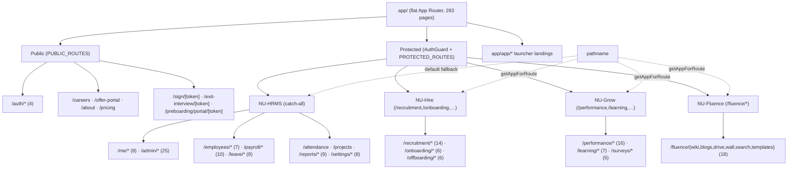

# Frontend Routes — App Router Map

## Purpose

Authoritative map of the [[Nu-HRMS|NU-AURA]] Next.js 16 **App Router** route tree
(`frontend/app/`). It groups ~80 top-level route directories into the four
sub-apps ([[Nu-HRMS]], [[Nu-Hire]], [[Nu-Grow]], [[Nu-Fluence]]), separates
**public** from **protected** routes, enumerates **dynamic segments**, and shows
how a pathname is resolved to an active sub-app. See [[Pages]] for layout nesting
and guard logic, and [[Components]] for the UI inventory.

## Context

**Measured on disk** (`find frontend/app -name page.tsx`, run for this doc):

| Metric | Count | Command |
|--------|-------|---------|
| `page.tsx` (routes) | **283** | `find frontend/app -name page.tsx \| wc -l` |
| `layout.tsx` (segment layouts) | **240** | `find frontend/app -name layout.tsx \| wc -l` |
| `error.tsx` boundaries | **273** | `find frontend/app -name error.tsx \| wc -l` |
| `loading.tsx` (suspense) | **282** | `find frontend/app -name loading.tsx \| wc -l` |
| `not-found.tsx` | **1** (root) | `find frontend/app -name not-found.tsx` |
| `route.ts` (API handlers) | **1** (`app/api/health/route.ts`) | `find frontend/app -name route.ts` |
| Dynamic segment dirs (`[param]`) | **28** | `find frontend/app -type d -name '[*]'` |

> **No `(group)` route groups.** NU-AURA uses a **flat** App Router: each
> top-level directory under `frontend/app/` is a route. Sub-apps are **logical
> groupings derived from pathname prefixes**, not nested folders — defined as
> `PLATFORM_APPS` in `frontend/lib/config/apps.ts`. The only nested "app group"
> is the launcher landing pages under `frontend/app/app/{hrms,hire,grow,fluence}/`.

## Dependencies

- **Sub-app + prefix mapping** — `frontend/lib/config/apps.ts`
  (`PLATFORM_APPS`, `getAppForRoute(pathname)`, `APP_SIDEBAR_SECTIONS`).
- **Public / protected route config** — `frontend/lib/config/routes.ts`
  (`PUBLIC_ROUTES`, `PROTECTED_ROUTES`, `isPublicRoute`, `findRouteConfig`).
- **Route guard** — `frontend/components/auth/AuthGuard.tsx` ([[Pages]], [[RBAC-Matrix]]).
- **Active-app hook** — `frontend/lib/hooks/useActiveApp.ts` (`hasAppAccess`).
- **Proxy / rewrite** — `frontend/proxy.ts` rewrites `/api/v1` → backend ([[APIs]], [[Data-Flows]]).

## Route inventory by sub-app

Counts below are the **top-level route directory** page totals (measured); they
sum to the 283 total. Examples are representative samples, not exhaustive.

### Public routes (no auth — `PUBLIC_ROUTES` in `routes.ts`)

| Route | File | Notes |
|-------|------|-------|
| `/` | `app/page.tsx` | Marketing / entry landing |
| `/auth/login` · `/auth/signup` · `/auth/forgot-password` | `app/auth/*/page.tsx` | 4 auth pages |
| `/careers` (+ `/careers/`) | `app/careers/page.tsx` | Public job board |
| `/offer-portal` | `app/offer-portal/page.tsx` | Candidate offer acceptance |
| `/preboarding/portal/[token]` | dynamic | Token-gated preboarding |
| `/sign/[token]` | `app/sign/[token]/page.tsx` | E-signature portal |
| `/exit-interview/[token]` | dynamic | Token-gated exit survey |
| `/about` · `/pricing` · `/contact` · `/features` | public marketing | SEO pages (robots.ts/sitemap.ts) |

### [[Nu-HRMS]] (HRMS — catch-all core HR)

Largest surface. `getAppForRoute` returns `HRMS` for anything not matched by the
other three apps.

| Area | Route dir (page count) | Examples |
|------|------------------------|----------|
| Personal portal | `me` (8) | `/me/dashboard`, `/me/profile`, `/me/leaves`, `/me/payslips`, `/me/assets`, `/me/skills` |
| Admin console | `admin` (25) | `/admin/roles`, `/admin/permissions`, `/admin/users`, `/admin/settings`, `/admin/holidays`, `/admin/custom-fields`, `/admin/budget` |
| People | `employees` (7), `departments`, `team-directory` | `/employees`, `/employees/new`, `/employees/[id]`, `/employees/[id]/edit`, `/employees/[id]/compensation` |
| Time & attendance | `attendance` (6), `shifts` (5), `time-tracking` (4), `timesheets`, `overtime`, `holidays`, `restricted-holidays`, `biometric-devices` | `/attendance/approvals`, `/shifts`, `/time-tracking/[id]/edit` |
| Leave | `leave` (8) | `/leave/approvals`, `/leave/requests`, `/leave/balances` |
| Finance / payroll | `payroll` (10), `compensation`, `benefits`, `expenses` (6), `loans` (3), `travel` (4), `tax` (2), `statutory` (2), `lwf`, `payments` (2) | `/payroll/runs/[id]`, `/payroll/process`, `/expenses/[id]`, `/loans/[id]`, `/travel/[id]` |
| Projects / PSA | `projects` (8), `allocations` (2), `resources` (6) | `/projects/[id]`, `/allocations/summary` |
| Docs / comms | `documents`, `letters` (2), `announcements`, `inbox`, `notifications`, `helpdesk` (5), `contracts` (4) | `/contracts/[id]`, `/contracts/new`, `/helpdesk/tickets/[id]` |
| Calendar / workspace | `calendar` (3), `nu-calendar`, `nu-drive`, `nu-mail` | `/calendar/[id]` |
| Reports & analytics | `reports` (9), `analytics` (2), `dashboards` (3), `dashboard`, `executive`, `predictive-analytics`, `import-export` | `/reports`, `/analytics/org-health` |
| Settings / workflows | `settings` (8), `workflows` (2), `integrations` (2), `approvals` (2), `compliance`, `security` | `/settings`, `/workflows/[id]`, `/approvals/inbox` |

### [[Nu-Hire]] (HIRE — recruitment & onboarding)

Prefixes: `/recruitment`, `/onboarding`, `/preboarding`, `/offboarding`,
`/offer-portal`, `/careers`, `/referrals`.

| Area | Route dir (count) | Examples |
|------|-------------------|----------|
| Recruitment | `recruitment` (14) | `/recruitment/jobs`, `/recruitment/candidates/[id]`, `/recruitment/candidates/[id]/offer`, `/recruitment/agencies/[id]`, `/recruitment/[jobId]/kanban`, `/recruitment/scorecards` |
| Onboarding | `onboarding` (6) | `/onboarding/[id]`, `/onboarding/templates/[id]` |
| Preboarding | `preboarding` (2) | `/preboarding/portal/[token]` (public) |
| Offboarding | `offboarding` (6) | `/offboarding/[id]`, `/offboarding/[id]/exit-interview`, `/offboarding/[id]/fnf` |
| Referrals / offers | `referrals`, `offer-portal`, `exit-interview` | `/exit-interview/[token]` (public) |

### [[Nu-Grow]] (GROW — performance, learning, engagement)

Prefixes: `/performance`, `/okr`, `/feedback360`, `/training`, `/learning`,
`/recognition`, `/surveys`, `/wellness`, `/one-on-one`.

| Area | Route dir (count) | Examples |
|------|-------------------|----------|
| Performance | `performance` (16) | `/performance/cycles/[id]/calibration`, `/performance/cycles/[id]/nine-box` |
| Goals / OKR | `goals`, `okr`, `feedback360`, `one-on-one` | `/okr`, `/feedback360` |
| Learning / training | `learning` (7), `training` (4) | `/learning/courses/[id]`, `/learning/courses/[id]/play`, `/learning/courses/[id]/quiz/[quizId]`, `/training/catalog/[id]` |
| Engagement | `surveys` (5), `recognition`, `wellness` (2), `company-spotlight` | `/surveys/[id]/respond`, `/surveys/[id]/analytics` |

### [[Nu-Fluence]] (FLUENCE — knowledge & collaboration)

Single nested directory `frontend/app/fluence/` (**18** pages). Prefixes all
under `/fluence/*`.

| Area | Route | File |
|------|-------|------|
| Wiki | `/fluence/wiki`, `/fluence/wiki/[slug]`, `/fluence/wiki/[slug]/edit` | dynamic slug |
| Blogs | `/fluence/blogs`, `/fluence/blogs/[slug]`, `/fluence/blogs/[slug]/edit` | dynamic slug |
| Drive / files | `/fluence/drive` | |
| Wall | `/fluence/wall` | social feed |
| Search / AI | `/fluence/search` | AI chat ([[Components]] `FluenceChatWidget`) |
| Templates | `/fluence/templates`, `/fluence/templates/[id]` | |
| Other | `/fluence/my-content`, `/fluence/analytics`, `/fluence/dashboard` | |

### Launcher landing group — `app/app/`

`/app/hrms`, `/app/hire`, `/app/grow`, `/app/fluence` — per-app hero landing
pages (each with its own `layout.tsx`), the only true nested folder grouping.

## Dynamic segments (28 measured)

`[id]`: calendar, contracts, employees, expenses, loans, offboarding, onboarding,
projects, surveys, time-tracking, travel, workflows, helpdesk/tickets,
fluence/templates, learning/courses, onboarding/templates, payroll/runs,
performance/cycles, recruitment/agencies, recruitment/candidates ·
`[slug]`: fluence/wiki, fluence/blogs · `[jobId]`: recruitment ·
`[token]` (public): sign, exit-interview, preboarding/portal ·
`[quizId]`: learning/courses/[id]/quiz.

## Diagram — Route hierarchy (grouped, representative)

## Related Links

- [[Pages]] — layout nesting, AuthGuard, server/client split
- [[Components]] — component inventory and dependency map
- [[APIs]] · [[Services]] — backend endpoints these routes consume
- [[Roles]] · [[Permissions]] · [[RBAC-Matrix]] — route-level gating
- [[Data-Flows]] · [[System-Flows]] — request lifecycle and proxy rewrite
- [[Nu-HRMS]] · [[Nu-Hire]] · [[Nu-Grow]] · [[Nu-Fluence]] · [[Shared-Platform]]
- [[System-Overview]] · [[C4-Container]] · [[C4-Component]] · [[00-Home]]

## Risks

- **Flat routing scale**: 283 routes with no `(group)` segments — route→app
  resolution depends entirely on `apps.ts` prefix tables. A new top-level dir
  that is not added to any `routePrefixes` silently falls into HRMS (catch-all),
  which may bypass intended sub-app sidebar/RBAC gating.
- **Prefix overlap**: HRMS lists `/me` twice and overlapping prefixes; HIRE/GROW/
  FLUENCE are checked **before** HRMS so order matters. Misordered checks could
  misroute (see `getAppForRoute` iteration order).
- **Public token routes** (`/sign/[token]`, `/exit-interview/[token]`,
  `/preboarding/portal/[token]`) bypass `AuthGuard` — token validation must be
  enforced server-side ([[Security-Audit]]).
- **240 layouts / 273 error boundaries**: near-per-route duplication; drift
  between segment shells is possible.

## Operational Notes

- Dev ports: frontend **3000**, backend **8080** (proxy target). `proxy.ts`
  rewrites `/api/v1` and WebSocket traffic to `BACKEND_ORIGIN`.
- Regenerate route counts: `find frontend/app -name page.tsx | wc -l`.
- Build pins the legacy bundler (`next dev --webpack` / `next build --webpack`).
- Only one server `route.ts` exists (`/api/health`); all data goes through the
  rewrite proxy to the Spring backend, not Next API routes.
- RBAC sweep over routes: `frontend/nu-rbac.config.ts` → `e2e/nu-rbac.spec.ts`
  ([[Test-Coverage]]).
