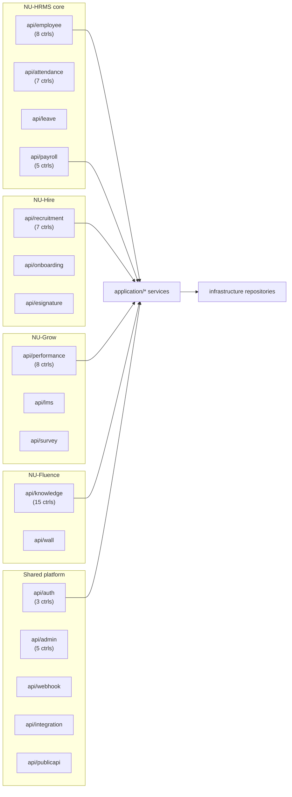

# Backend API Catalog

> Catalog of the NU-AURA REST surface. The top half is a **per-bounded-context domain
> map** (which `api/<domain>` package owns which base paths, the auth posture per area);
> the bottom half is the **full controller-by-controller endpoint reference** grouped by
> module. With **184 `@RestController` classes** spanning **68 `api/*` packages**, this
> page is the single source of truth for the HTTP surface. See [[Services]] for the
> service layer behind these controllers and [[Middleware]] for the filter chain every
> request traverses.

## Purpose

Give a navigable map of the backend HTTP surface: which `api/<domain>` package owns which
base paths, every controller and its base path, and the auth/RBAC posture per area —
enough to locate any endpoint's owning controller without reading all 184 files.

## Context

- **Stack:** Java 21, Spring Boot 3.5.14, single deployable modular monolith serving all
  four sub-apps ([[Nu-HRMS]], [[Nu-Hire]], [[Nu-Grow]], [[Nu-Fluence]]) plus the
  [[Shared-Platform]].
- **DDD layering:** `api → application → domain → infrastructure + common`. Controllers
  are the **inbound adapters** in `com.nulogic.api.<domain>`; they map DTOs, validate,
  annotate OpenAPI, and delegate to [[Services]]. See [[C4-Component]] / [[C4-Container]].
- **Versioning:** all business paths are `/api/v1/...`. A few infra endpoints sit outside
  that prefix: `MonitoringController` → `/api/monitoring`, `WebhookController` →
  `/api/webhooks`, `RootProbeController` → `/` (GET/HEAD liveness).
  `common/api/ApiVersionInterceptor` + `ApiVersion` govern version negotiation; responses
  use the `ApiResponses` envelope.
- **Counts (verified from source, 2026-06-16):**
  | Metric | Count | Evidence |
  |--------|-------|----------|
  | `@RestController` classes | 184 | `grep -rl @RestController backend/src/main/java` |
  | `api/*` domain packages | 68 | `ls backend/src/main/java/com/nulogic/api` |
  | `@Service` (all layers) | 257 | `grep -rl @Service` |
  | Repositories | 288 | repository interface grep |
  > Older [[Services]] cited 179 controllers and [[APIs]]
  > cited ~150 documented; the delta reflects controllers added since those docs and the
  > catalog below being a curated-but-near-complete cut. This page uses the live `grep`
  > count of 184.
  >
  > **Reconciliation (2026-06-17):** that raw `grep` over-counts — the true number of
  > live `@RestController` classes is **180** (the 184 includes 1 `.disabled` file + 2
  > `@RestControllerAdvice` + 1 annotation source). For the exhaustive, reconciled 1:1
  > list of every controller see [[Controller-Index]].

## Dependencies

- **Downstream:** every controller delegates to `application/<domain>` [[Services]].
- **Cross-cutting:** guarded by [[Middleware]] (JWT, tenant/RLS, rate-limit, CSRF),
  authorized via `@RequiresPermission` / `CustomPermissionEvaluator` → [[Permissions]],
  [[Roles]], [[RBAC-Matrix]]. Errors flow through `GlobalExceptionHandler`.
- **Data:** persisted through repositories over PostgreSQL with [[Schema]] / [[ERD]] and
  row-level-security tenancy (see [[Data-Flows]], [[Security-Audit]]).

## Conventions

### Authorization (RBAC)

Fine-grained access is enforced at the method level via the custom
`@RequiresPermission(Permission.XXX)` annotation (aspect-driven), e.g.
`EmployeeController.create` carries `@RequiresPermission(Permission.EMPLOYEE_CREATE)`.
`SUPER_ADMIN` bypasses the permission aspect. Some sensitive reads use `revalidate = true`
to re-check permissions against the DB rather than the cached set. A handful of endpoints
use Spring's `@PreAuthorize("isAuthenticated()")` (e.g. `MfaController`). Field-level
masking via `FieldPermission`. See [[Permissions]], [[Roles]], [[Middleware]].

### Rate-limit buckets

`RateLimitingFilter` classifies each URI and applies Redis-backed limits with an in-memory
fallback (full detail and tuning in [[Middleware]]). Quick reference:

| Bucket | Matched URIs | Limit |
|---|---|---|
| `AUTH` | `/api/v1/auth*` | **5 / min** (fails **closed** if Redis down) |
| `EXPORT` | URIs with `/export`, `/report`, `/download` | **5 / 5 min** |
| `WALL` | `/api/v1/wall*`, `/api/v1/social*` | **30 / min** |
| `UPLOAD` | URIs with `/upload`, `/import` | **20 / min** |
| `WEBHOOK` | `/api/v1/webhook*` | **50 / min** |
| `API` (default) | everything else | **100 / min** |

Per-tenant-per-resource budget defaults to **1000 req/min** (`DEFAULT_TENANT_CAPACITY`).
`/` and `/actuator/**` skip rate limiting entirely.

## Diagram

## Domain Map (where each controller lives)

> Package-level orientation. Counts are exact (`grep -rl @RestController api/<domain>`).
> The full controller/base-path catalog follows in the next section.

- **Core HR — [[Nu-HRMS]]:** `api/employee` (8), `api/organization`, `api/user`,
  `api/customfield`, `api/selfservice`.
- **Time/Attendance/Leave — [[Nu-HRMS]]:** `api/attendance` (7, incl. public biometric
  punch intake), `api/timetracking`, `api/shift`, `api/overtime`, `api/leave`.
- **Payroll/Comp/Finance — [[Nu-HRMS]]:** `api/payroll` (5), `api/compensation`,
  `api/loan`, `api/payment` (public provider webhooks), `api/tax`, `api/statutory`,
  `api/budget`, `api/benefits`. Most permission-gated area; statutory had a fixed IDOR.
- **Assets/Expense/Travel — [[Nu-HRMS]]:** `api/asset`, `api/expense`, `api/travel`.
- **Recruitment/Onboarding — [[Nu-Hire]]:** `api/recruitment` (7), `api/onboarding`,
  `api/preboarding`, `api/probation`, `api/referral`, `api/exit`, `api/esignature`,
  `api/letter`. Several token-based public portals.
- **Performance/Learning — [[Nu-Grow]]:** `api/performance` (8), `api/lms`,
  `api/training`, `api/survey`, `api/recognition`, `api/engagement`, `api/wellness`.
- **Knowledge/Social — [[Nu-Fluence]]:** `api/knowledge` (15, densest package),
  `api/wall` (1). Elasticsearch-backed, indexed async off Kafka (see [[Services]]).
- **Auth/Identity — [[Shared-Platform]]:** `api/auth` (3). Explicit public allow-list.
- **Governance/Analytics/Comms — [[Shared-Platform]]:** `api/admin` (5), `api/platform`,
  `api/featureflag`, `api/monitoring`, `api/migration`, `api/dataimport`,
  `api/compliance`, `api/audit`, `api/workflow`, `api/analytics`, `api/dashboard`,
  `api/report`, `api/home`, `api/notification`, `api/announcement`, `api/meeting`,
  `api/calendar`, `api/helpdesk`.
- **Channels/Integration — [[Shared-Platform]]:** `api/integration` (DocuSign/Slack
  webhooks), `api/webhook`, `api/publicapi` (`/api/v1/external/**`, `X-API-Key`),
  `api/mobile`, `api/document`, `api/export`.
- **Project/PSA — [[Nu-HRMS]]:** `api/project`, `api/psa`, `api/resourcemanagement`.

---

## Endpoint Catalog by Module

> Base paths come from each controller's class `@RequestMapping`; auth from
> `SecurityConfig`; rate limits from `RateLimitingFilter`/`DistributedRateLimiter`.

### Authentication & Identity

**Auth — `AuthController` (`/api/v1/auth`)** — all `/api/v1/auth*` in the `AUTH` bucket
(5/min, fail-closed):

| Method | Path | Auth |
|---|---|---|
| POST | `/login` | public |
| POST | `/google` | public (Google OAuth) |
| POST | `/mfa-login` | public (2nd factor) |
| POST | `/refresh` | public (httpOnly refresh cookie) |
| GET | `/me` | authenticated |
| POST | `/logout` | authenticated |
| POST | `/change-password` | authenticated |
| POST | `/forgot-password`, `/reset-password` | public |

- **MFA — `MfaController` (`/api/v1/auth/mfa`):** `GET /setup`, `POST /verify`,
  `DELETE /disable`, `GET /status` — all `@PreAuthorize("isAuthenticated()")`.
- **SAML SSO — `SamlConfigController` (`/api/v1/auth/saml`):** `GET/POST/PUT/DELETE
  /config`, `GET /metadata`, `POST /test`, `GET /providers`. Runtime SAML flows live at
  `/saml2/**` (handled by Spring Security).

**Users / Roles / Permissions:**

| Controller | Base path | Notable endpoints |
|---|---|---|
| `UserController` | `/api/v1/users` | user CRUD, role assignment |
| `RoleController` | `/api/v1/roles` | role CRUD |
| `PermissionController` | `/api/v1/permissions` | permission catalog |
| `ImplicitRoleRuleController` | `/api/v1/implicit-role-rules` | rule-based role grants |
| `NotificationPreferencesController` | `/api/v1/notification-preferences` | per-user prefs |
| `TenantController` | `/api/v1/tenants` | tenant mgmt; `/register` is public |

### Core HR — People & Org

**Employees:**

| Controller | Base path | Notes |
|---|---|---|
| `EmployeeController` | `/api/v1/employees` | CRUD; `@RequiresPermission(EMPLOYEE_*)` per method |
| `EmployeeDirectoryController` | `/api/v1/employees/directory` | searchable directory |
| `EmployeeDocumentController` | `/api/v1/employees` | document sub-resources |
| `EmployeeSkillController` | `/api/v1/employees` | employee skills |
| `EmployeeImportController` | `/api/v1/employees/import` | bulk import (UPLOAD bucket) |
| `TalentProfileController` | `/api/v1/employees/{id}/talent-profile` | talent profile |
| `EmploymentChangeRequestController` | `/api/v1/employment-change-requests` | change requests / approvals |
| `SelfServiceController` | `/api/v1/self-service` | employee self-service |

**Organization structure — `OrganizationController` (`/api/v1/organization`):**

| Method | Path | Purpose |
|---|---|---|
| GET | `/chart` | org chart |
| POST/GET | `/units`, `/units/{id}`, `/units/{id}/children` | org units |
| POST/GET | `/positions`, `/positions/critical`, `/positions/vacancies` | positions |
| POST/GET | `/succession-plans`, `/succession-plans/active`, `/.../high-risk` | succession |
| POST/GET/DELETE | `/succession-plans/{planId}/candidates`, `/.../ready-now` | succession candidates |
| POST/GET/DELETE | `/talent-pools`, `/talent-pools/{poolId}/members/{employeeId}` | talent pools |
| GET | `/analytics`, `/analytics/nine-box` | org analytics |

Other org controllers: `DepartmentController` (`/api/v1/departments`),
`OfficeLocationController` (`/api/v1/office-locations`), `CustomFieldController`
(`/api/v1/custom-fields`).

### Attendance & Time

| Controller | Base path | Notable endpoints |
|---|---|---|
| `AttendanceController` | `/api/v1/attendance` | `POST /check-in`, `/check-out`, `/multi-check-in`, `/bulk-check-in`; `GET /today`, `/my-attendance`, `/employee/{id}/range`, `/pending-regularizations`; `POST /{id}/request-regularization`, `/approve-regularization`, `/reject-regularization`; `POST /import` (UPLOAD) |
| `BiometricDeviceController` | `/api/v1/biometric` | device CRUD; `POST /punch`, `/punch/batch` are **public** (device API-key) |
| `MobileAttendanceController` | `/api/v1/mobile/attendance` | mobile check-in/out |
| `CompOffController` | `/api/v1/comp-off` | comp-off requests |
| `ShiftManagementController` | `/api/v1/shifts` | shift/roster mgmt |
| `ShiftSwapController` | `/api/v1/shift-swaps` | swap requests |
| `OvertimeManagementController` | `/api/v1/overtime` | overtime |
| `TimeTrackingController` | `/api/v1/time-tracking` | time entries |
| `HolidayController` | `/api/v1/holidays` | holiday calendar |
| `RestrictedHolidayController` | `/api/v1/restricted-holidays` | optional/restricted holidays |

### Leave

| Controller | Base path | Purpose |
|---|---|---|
| `LeaveRequestController` | `/api/v1/leave-requests` | apply / approve / cancel leave |
| `LeaveBalanceController` | `/api/v1/leave-balances` | balances & accrual |
| `LeaveTypeController` | `/api/v1/leave-types` | leave type config |
| `MobileLeaveController` | `/api/v1/mobile/leave` | mobile leave |

### Payroll, Compensation & Statutory

| Controller | Base path | Purpose |
|---|---|---|
| `PayrollController` | `/api/v1/payroll` | payroll runs |
| `GlobalPayrollController` | `/api/v1/global-payroll` | multi-region payroll |
| `PayrollStatutoryController` | `/api/v1/payroll/statutory` | statutory deductions |
| `StatutoryFilingController` | `/api/v1/payroll/statutory-filings` | filings |
| `BonusController` | `/api/v1/payroll/bonus` | bonuses |
| `CompensationController` | `/api/v1/compensation` | comp review |
| `LWFController` | `/api/v1/payroll/lwf` | Labour Welfare Fund |
| `ProvidentFundController` | `/api/v1/statutory/pf` | PF |
| `ESIController` | `/api/v1/statutory/esi` | ESI |
| `ProfessionalTaxController` | `/api/v1/statutory/pt` | professional tax |
| `TDSController` | `/api/v1/statutory/tds` | TDS |
| `StatutoryContributionController` | `/api/v1/statutory/contributions` | contributions (had a fixed cross-tenant IDOR — [[Security-Audit]]) |
| `TaxDeclarationController` | `/api/v1/tax-declarations` | employee tax declarations |
| `BudgetPlanningController` | `/api/v1/budget` | budget planning |

### Expense & Travel

| Controller | Base path | Purpose |
|---|---|---|
| `ExpenseClaimController` | `/api/v1/expenses` | `POST /` create, `/{id}/submit`, `/approve`, `/reject`, `/pay`, `/reimburse`, `/cancel`; `GET /pending-approvals`, `/summary`, `/validate-policy` |
| `ExpenseItemController` | `/api/v1/expenses/claims/{claimId}/items` | line items |
| `ExpenseCategoryController` | `/api/v1/expenses/categories` | categories |
| `ExpensePolicyController` | `/api/v1/expenses/policies` | policies |
| `ExpenseAdvanceController` | `/api/v1/expenses/advances` | cash advances |
| `ExpenseReportController` | `/api/v1/expenses/reports` | reports (EXPORT bucket) |
| `MileageController` | `/api/v1/expenses/mileage` | mileage logs |
| `MileagePolicyController` | `/api/v1/expenses/mileage/policies` | mileage policy |
| `OcrReceiptController` | `/api/v1/expenses/receipts` | OCR receipt scan |
| `TravelController` | `/api/v1/travel` | travel requests |
| `TravelExpenseController` | `/api/v1/travel/expenses` | travel expenses |

### Recruitment & Onboarding — [[Nu-Hire]]

| Controller | Base path | Purpose |
|---|---|---|
| `RecruitmentController` | `/api/v1/recruitment` | jobs / pipeline |
| `ApplicantController` | `/api/v1/recruitment/applicants` | candidate tracking |
| `AgencyController` | `/api/v1/recruitment/agencies` | staffing agencies |
| `AIRecruitmentController` | `/api/v1/recruitment/ai` | AI screening / match |
| `JobBoardController` | `/api/v1/recruitment/job-boards` | board integrations |
| `ScorecardController` | `/api/v1/recruitment/scorecards` | interview scorecards |
| `ReferralController` | `/api/v1/referrals` | employee referrals |
| `PublicCareerController` | `/api/v1/public/careers` | **public** job listings |
| `PublicOfferController` | `/api/v1/public/offers` | **public** offer portal (token) |
| `PreboardingController` | `/api/v1/preboarding` | preboarding; `/portal/**` is public |
| `OnboardingManagementController` | `/api/v1/onboarding` | onboarding tasks |
| `ProbationController` | `/api/v1/probation` | probation cases |

> Disabled: `RecruitmentManagementController.java.disabled` is present but excluded from
> the build — its advertised endpoints are not live.

### Performance & Growth — [[Nu-Grow]]

| Controller | Base path | Purpose |
|---|---|---|
| `PerformanceReviewController` | `/api/v1/reviews` | reviews |
| `ReviewCycleController` | `/api/v1/review-cycles` | review cycles |
| `PerformanceRevolutionController` | `/api/v1/performance/revolution` | continuous performance |
| `PIPController` | `/api/v1/performance/pip` | improvement plans |
| `GoalController` | `/api/v1/goals` | goals |
| `OkrController` | `/api/v1/okr` | OKRs |
| `FeedbackController` | `/api/v1/feedback` | feedback |
| `Feedback360Controller` | `/api/v1/feedback360` | 360 feedback |
| `LmsController` | `/api/v1/lms` | courses, quizzes, progress, certificates, skill-gaps |
| `QuizController` | `/api/v1/lms/quizzes` | quiz authoring |
| `CourseEnrollmentController` | `/api/v1/lms` | enrollments |
| `TrainingManagementController` | `/api/v1/training` | training |
| `WellnessController` | `/api/v1/wellness` | wellness |
| `SurveyManagementController` | `/api/v1/survey-management` | surveys |
| `SurveyAnalyticsController` | `/api/v1/survey-analytics` | survey analytics |
| `PulseSurveyController` | `/api/v1/surveys` | pulse surveys |
| `RecognitionController` | `/api/v1/recognition` | recognition / awards |

`LmsController` highlights: `GET /catalog`, `/courses/published`, `/dashboard`,
`/my-certificates`, `/certificates/verify/{certificateNumber}`,
`/employees/{employeeId}/skill-gaps`; `POST /courses`, `/courses/{id}/publish`,
`/quizzes/{quizId}/questions`.

### Knowledge & Content — [[Nu-Fluence]]

| Controller | Base path | Purpose |
|---|---|---|
| `WikiPageController` | `/api/v1/knowledge/wiki/pages` | wiki pages |
| `WikiSpaceController` | `/api/v1/knowledge/wiki/spaces` | wiki spaces |
| `WikiInlineCommentController` | `/api/v1/knowledge/wiki/...` | inline comments (method-level paths) |
| `BlogPostController` | `/api/v1/knowledge/blogs` | blogs |
| `BlogCategoryController` | `/api/v1/knowledge/blogs/categories` | blog categories |
| `TemplateController` | `/api/v1/knowledge/templates` | content templates |
| `KnowledgeSearchController` | `/api/v1/knowledge/search` | knowledge search |
| `FluenceSearchController` | `/api/v1/fluence/search` | Fluence search |
| `FluenceChatController` | `/api/v1/fluence/chat` | AI chat |
| `FluenceCommentController` | `/api/v1/fluence/comments` | comments |
| `FluenceActivityController` | `/api/v1/fluence/activities` | activity feed |
| `FluenceAttachmentController` | `/api/v1/fluence/attachments` | attachments |
| `FluenceEditLockController` | `/api/v1/fluence/edit-lock` | distributed edit locks (see [[Services]]) |
| `ContentEngagementController` | `/api/v1/fluence/engagement` | engagement |
| `ContentViewController` | `/api/v1/views` | content view tracking |
| `LinkedinPostController` | `/api/v1/linkedin-posts` | LinkedIn posts |

**Wall — `WallController` (`/api/v1/wall`)** — `WALL` bucket (30/min); reactions/comments/
replies had cross-tenant IDORs (fixed — [[Security-Audit]]):
`POST/GET /posts`, `GET /posts/type/{type}`, `GET/PUT/DELETE /posts/{postId}`,
`PATCH /posts/{postId}/pin`, `POST/DELETE /posts/{postId}/reactions`,
`POST/GET /posts/{postId}/comments`, `GET /comments/{commentId}/replies`,
`POST/DELETE /posts/{postId}/vote`, `GET /praise/employee/{employeeId}`.

### Contracts, Letters & E-Signature

| Controller | Base path | Notable endpoints |
|---|---|---|
| `ContractController` | `/api/v1/contracts` | CRUD; `PATCH /{id}/mark-active`, `/terminate`, `/renew`; `POST /{id}/send-for-signing`, `/record-signature`; `GET /expiring`, `/expired`, `/{id}/versions` |
| `ContractTemplateController` | `/api/v1/contracts/templates` | contract templates |
| `ESignatureController` | `/api/v1/esignature` | signing; `/external/**` is **public** (token) |
| `DocuSignController` | `/api/v1/integrations/docusign` | DocuSign; `/webhook` is public (HMAC) |
| `LetterController` | `/api/v1/letters` | HR letters |

### Exit & Offboarding

| Controller | Base path | Purpose |
|---|---|---|
| `ExitManagementController` | `/api/v1/exit` | exit process; `/interview/public/**` is public |
| `FnFController` | `/api/v1/exit` | full-and-final settlement |
| `OffboardingController` | `/api/v1/offboarding` | offboarding tasks |

### Finance — Loans, Payments, Benefits, Assets

| Controller | Base path | Notable endpoints |
|---|---|---|
| `LoanController` | `/api/v1/loans` | `POST /` apply; `/{id}/approve`, `/reject`, `/disburse`, `/activate`, `/repayment`, `/cancel`; `GET /my`, `/pending`, `/active` |
| `PaymentController` | `/api/v1/payments` | payments |
| `PaymentConfigController` | `/api/v1/payments/config` | payment config |
| `PaymentWebhookController` | `/api/v1/payments/webhooks` | **public** provider webhooks (signature-verified) |
| `BenefitManagementController` | `/api/v1/benefits` | benefit plans / enrollment |
| `BenefitEnhancedController` | `/api/v1/benefits-enhanced` | enhanced benefits |
| `AssetManagementController` | `/api/v1/assets` | asset issue / recovery |

### Projects, PSA & Resource Management — [[Nu-HRMS]]

| Controller | Base path | Purpose |
|---|---|---|
| `ProjectController` | `/api/v1/projects` | projects |
| `ProjectTimesheetController` | `/api/v1/project-timesheets` | project timesheets |
| `ResourceController` | `/api/v1/resources` | resource staffing |
| `ResourceManagementController` | `/api/v1/resource-management` | resource mgmt |
| `ResourceConflictController` | `/api/v1/resource-management/conflicts` | allocation conflicts |
| `ResourcePoolController` | `/api/v1/resource-pools` | pools |
| `PSAProjectController` | `/api/v1/psa/projects` | professional-services projects |
| `PSATimesheetController` | `/api/v1/psa/timesheets` | PSA timesheets |
| `PSAInvoiceController` | `/api/v1/psa/invoices` | PSA invoices |

### Engagement & Communication

| Controller | Base path | Purpose |
|---|---|---|
| `AnnouncementController` | `/api/v1/announcements` | announcements |
| `NotificationController` | `/api/v1/notifications` | in-app notifications |
| `MultiChannelNotificationController` | `/api/v1/notifications` | multi-channel delivery |
| `SmsNotificationController` | `/api/v1/notifications/sms` | SMS |
| `MeetingController` | `/api/v1/one-on-one` | 1:1 meetings |
| `OneOnOneMeetingController` | `/api/v1/meetings` | meetings |
| `CalendarController` | `/api/v1/calendar` | calendar |
| `HelpdeskController` | `/api/v1/helpdesk` | helpdesk tickets |
| `HelpdeskSLAController` | `/api/v1/helpdesk/sla` | SLA config |

### Workflow & Approvals

| Controller | Base path | Purpose |
|---|---|---|
| `WorkflowController` | `/api/v1/workflow` | workflow definitions |
| `ApprovalsController` | `/api/v1/approvals` | approval inbox |
| `ApprovalEscalationController` | `/api/v1/escalation` | escalation rules |

### Analytics, Reporting & Dashboards

| Controller | Base path | Purpose |
|---|---|---|
| `AnalyticsController` | `/api/v1/analytics` | core analytics |
| `AdvancedAnalyticsController` | `/api/v1/analytics/advanced` | advanced analytics |
| `OrganizationHealthController` | `/api/v1/analytics/org-health` | org health |
| `PredictiveAnalyticsController` | `/api/v1/predictive-analytics` | predictions |
| `DashboardController` | `/api/v1/dashboard` | dashboard |
| `DashboardsController` | `/api/v1/dashboards` | dashboards |
| `HomeController` | `/api/v1/home` | home summary |
| `ReportController` | `/api/v1/reports` | reports (EXPORT bucket) |
| `CustomReportController` | `/api/v1/reports/custom` | custom reports |
| `ScheduledReportController` | `/api/v1/scheduled-reports` | scheduled reports |
| `ExportController` | `/api/v1/export` | exports (EXPORT bucket) |

### Compliance, Audit & Data Subject Rights

| Controller | Base path | Purpose |
|---|---|---|
| `ComplianceController` | `/api/v1/compliance` | compliance |
| `AuditLogController` | `/api/v1/audit`, `/api/v1/audit-logs` | audit log queries (dual mapping) |
| `DsrController` | `/api/v1/me/dsr` | self-service data subject requests |
| `DsrAdminFulfillmentController` | `/api/v1/admin/dsr` | DSR fulfillment (admin) |

### Integrations & External APIs

| Controller | Base path | Notes |
|---|---|---|
| `IntegrationController` | `/api/v1/integrations` | integration registry |
| `IntegrationConnectorController` | `/api/v1/integrations` | connectors |
| `SlackCommandController` | `/api/v1/integrations/slack` | `/commands`, `/interactions`, `/events` are **public** (signing-secret) |
| `WebhookController` | `/api/webhooks` | webhook delivery (outside `/api/v1`) |
| `WebhookRotationController` | `/api/v1/admin/webhooks` | secret rotation |
| `KekaImportController` | `/api/v1/keka-import` | KEKA migration import |
| `DataMigrationController` | `/api/v1/migration` | data migration |
| `FileUploadController` | `/api/v1/files` | file upload (UPLOAD bucket) |

External partner integrations authenticate via `X-API-Key` under `/api/v1/external/**`
(allow-listed to `ApiKeyAuthenticationFilter`, not the JWT path).

### Platform & Admin

| Controller | Base path | Auth |
|---|---|---|
| `PlatformController` | `/api/v1/platform` | authenticated |
| `RootProbeController` | `/` | public liveness (GET/HEAD) |
| `MonitoringController` | `/api/monitoring` | authenticated (outside `/api/v1`) |
| `AdminController` | `/api/v1/admin` | admin |
| `SystemAdminController` | `/api/v1/admin/system` | admin |
| `SystemAuditLogController` | `/api/v1/admin/system/audit-logs` | admin |
| `KafkaAdminController` | `/api/v1/admin/kafka` | admin |
| `EncryptionBackfillController` | `/api/v1/admin/encryption-backfill` | admin |
| `FeatureFlagController` | `/api/v1/admin/feature-flags` | admin |

`/actuator/**`, Swagger UI, and `/v3/api-docs/**` require role `SUPER_ADMIN` (except
`/actuator/health*`, public, and `/actuator/prometheus`, which uses a scrape bearer token).

### Mobile API

A dedicated mobile surface mirrors core flows under `/api/v1/mobile/*`:

| Controller | Base path |
|---|---|
| `MobileDashboardController` | `/api/v1/mobile/dashboard` |
| `MobileApprovalController` | `/api/v1/mobile/approvals` |
| `MobileLeaveController` | `/api/v1/mobile/leave` |
| `MobileAttendanceController` | `/api/v1/mobile/attendance` |
| `MobileNotificationController` | `/api/v1/mobile/notifications` |
| `MobileSyncController` | `/api/v1/mobile/sync` |

## Related Links

- [[00-Home]] · [[System-Overview]] · [[C4-Container]] · [[C4-Component]]
- [[Controller-Index]] — exhaustive 1:1 list of all 180 controllers · [[Endpoint-Index]] — all 1,711 endpoints per-method · [[Feature-Traceability]] — end-to-end feature slices
- [[Services]] — service layer + dependency map · [[Middleware]] — request filter chain,
  public allow-list, rate-limit tuning
- [[Roles]] · [[Permissions]] · [[RBAC-Matrix]] — authorization model
- [[Schema]] · [[ERD]] · [[Data-Flows]] · [[System-Flows]]
- [[Nu-HRMS]] · [[Nu-Hire]] · [[Nu-Grow]] · [[Nu-Fluence]] · [[Shared-Platform]]
- [[Security-Audit]] · [[Deployment]]

## Risks

- **Catalog staleness:** 184 controllers change frequently. Re-run
  `grep -rl @RestController backend/src/main/java | wc -l` to re-verify.
- **Disabled controller:** `api/recruitment/RecruitmentManagementController.java.disabled`
  is excluded from the build — its endpoints are not live.
- **Public surface:** the `permitAll()` allow-list (careers, offers, e-sign, preboarding,
  biometric punch, payment/DocuSign/Slack webhooks) is the unauthenticated attack surface;
  each relies on its own token/HMAC/signature/API-key rather than the JWT chain — audited
  in [[Security-Audit]] / detailed in [[Middleware]].
- **IDOR history:** wall + statutory endpoints had cross-tenant IDORs (fixed); the same
  ownership-check discipline must hold for new endpoints.

## Operational Notes

- **Locate an endpoint's owner:**
  `grep -rl '"/api/v1/<path>"' backend/src/main/java/com/nulogic/api`.
- **List a domain's controllers:** `grep -rl @RestController backend/src/main/java/com/nulogic/api/<domain>`.
- **Base paths:** `grep -rho '@RequestMapping("[^"]*"' backend/src/main/java/com/nulogic/api/<domain>`.
- **Permission enforcement:** `@RequiresPermission` (e.g. `api/employee/EmployeeController.java`).
- **OpenAPI/Swagger:** `OpenApiConfig` (SpringDoc); `/swagger-ui/**` + `/v3/api-docs/**`
  require `SUPER_ADMIN` in production.
- Dev base URL `http://localhost:8080`; frontend proxies from `:3000`.
