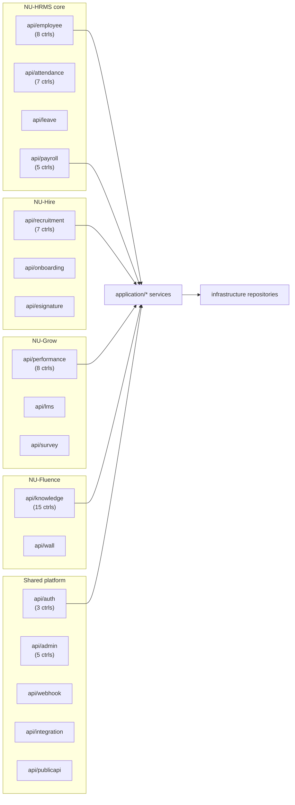

# Backend API Catalog

> Catalog of the NU-AURA REST surface organized **by bounded-context domain**, not by
> individual endpoint. With **184 `@RestController` classes** spanning **68 `api/*`
> packages**, an exhaustive endpoint dump would be unreadable and instantly stale. This
> page samples representative controllers + base paths per domain and points to
> [[Data-Flows]] and the generated `docs/reference/api.md` for the full endpoint
> reference. See [[Services]] for the service layer behind these controllers and
> [[Middleware]] for the filter chain every request traverses.

## Purpose

Give a navigable map of the backend HTTP surface: which `api/<domain>` package owns
which base paths, the controllers worth knowing, and the auth/RBAC posture per area —
enough to locate any endpoint's owning controller without reading all 184 files.

## Context

- **Stack:** Java 21, Spring Boot 3.5.14, single deployable modular monolith serving
  all four sub-apps ([[Nu-HRMS]], [[Nu-Hire]], [[Nu-Grow]], [[Nu-Fluence]]) plus the
  [[Shared-Platform]].
- **DDD layering:** `api → application → domain → infrastructure + common`. Controllers
  are the **inbound adapters** in `com.nulogic.api.<domain>`; they map DTOs, validate,
  annotate OpenAPI, and delegate to [[Services]]. See [[C4-Component]] / [[C4-Container]].
- **Versioning:** all paths are `/api/v1/...`. `common/api/ApiVersionInterceptor` +
  `ApiVersion` govern version negotiation; responses use the `ApiResponses` envelope.
- **Counts (verified from source, 2026-06-16):**
  | Metric | Count | Evidence |
  |--------|-------|----------|
  | `@RestController` classes | 184 | `grep -rl @RestController backend/src/main/java` |
  | `api/*` domain packages | 68 | `ls backend/src/main/java/com/nulogic/api` |
  | `@Service` (all layers) | 257 | `grep -rl @Service` |
  | Repositories | 288 | repository interface grep |
  > Slight drift from `docs/architecture/backend.md` (179 controllers) reflects
  > controllers added since that doc; this page uses the live `grep` count.

## Dependencies

- **Downstream:** every controller delegates to `application/<domain>` [[Services]].
- **Cross-cutting:** guarded by [[Middleware]] (JWT, tenant/RLS, rate-limit, CSRF),
  authorized via `@RequiresPermission` / `CustomPermissionEvaluator` → [[Permissions]],
  [[Roles]], [[RBAC-Matrix]]. Errors flow through `GlobalExceptionHandler`.
- **Data:** persisted through repositories over PostgreSQL with [[Schema]] / [[ERD]] and
  row-level-security tenancy (see [[Data-Flows]], [[Security-Audit]]).

## Diagram

## API Catalog by Domain

> Sampling note: counts are exact (`grep -rl @RestController api/<domain>`); endpoint
> examples are representative, not exhaustive. For every endpoint, method, and DTO see
> `docs/reference/api.md`.

### Core HR — [[Nu-HRMS]]

- **`api/employee` (8 controllers).** Base paths `/api/v1/employees`,
  `/api/v1/departments`, `/api/v1/employment-change-requests`.
  - `api/employee/EmployeeController.java` — `/api/v1/employees` CRUD + lifecycle.
  - `api/employee/DepartmentController.java` — `/api/v1/departments`.
  - `api/employee/EmployeeSkillController.java`, `EmployeeDocumentController.java`,
    `EmploymentChangeRequestController.java`.
  - `api/employee/controller/` — `TalentProfileController`
    (`/api/v1/employees/{id}/talent-profile`), `EmployeeImportController`
    (`/api/v1/employees/import`), `EmployeeDirectoryController`
    (`/api/v1/employees/directory`).
  - **Auth:** authenticated + `@RequiresPermission("employee.*")`; field-level masking via
    `FieldPermission` (see [[Permissions]]).
- **`api/organization`, `api/user`, `api/customfield`, `api/selfservice`** — org tree,
  user accounts, tenant-defined custom fields, employee self-service.

### Time, Attendance & Leave — [[Nu-HRMS]]

- **`api/attendance` (7 controllers)** — punches, regularization, biometric webhook
  intake (`/api/v1/biometric/punch[/batch]`, **public, API-key auth** — see
  [[Middleware]]).
- **`api/timetracking`, `api/shift`, `api/overtime`** — timesheets, shift policies, OT.
- **`api/leave`** — `/api/v1/leave*` balances, applications, approvals.

### Payroll, Comp & Finance — [[Nu-HRMS]]

- **`api/payroll` (5 controllers)** — payroll runs, payslips.
- **`api/compensation`, `api/loan`, `api/payment`, `api/tax`, `api/statutory`,
  `api/budget`, `api/benefits`** — comp bands, loans, payment provider webhooks
  (`/api/v1/payments/webhooks/**`, **public, signature-verified**), tax + statutory
  contribution engine, budgets, benefit plans.
- **Auth:** the most permission-gated area; statutory/contribution endpoints previously
  carried a cross-tenant IDOR (now fixed — see [[Security-Audit]]).

### Assets, Expense & Travel — [[Nu-HRMS]]

- **`api/asset`, `api/expense`, `api/travel`** — asset assignment, expense claims +
  mileage, travel expenses.

### Recruitment & Onboarding — [[Nu-Hire]]

- **`api/recruitment` (7 controllers).** Base path `/api/v1/recruitment` with sub-paths:
  - `RecruitmentController` (`/api/v1/recruitment`), `ApplicantController`
    (`/recruitment/applicants`), `ScorecardController` (`/recruitment/scorecards`),
    `AgencyController` (`/recruitment/agencies`), `JobBoardController`
    (`/recruitment/job-boards`), `AIRecruitmentController` (`/recruitment/ai`).
- **`api/onboarding`, `api/preboarding`, `api/probation`, `api/referral`, `api/exit`,
  `api/esignature`, `api/letter`.**
- **Public/token endpoints:** career page (`/api/v1/public/careers/**`), offer portal
  (`/api/v1/public/offers/**`), e-sign external (`/api/v1/esignature/external/**`),
  preboarding portal (`/api/v1/preboarding/portal/**`), public exit interview
  (`/api/v1/exit/interview/public/**`) — all token-based, **no JWT** (see [[Middleware]]).

### Performance, Learning & Engagement — [[Nu-Grow]]

- **`api/performance` (8 controllers)** — reviews, OKRs, 360 feedback.
- **`api/lms`, `api/training`, `api/survey`, `api/recognition`, `api/engagement`,
  `api/wellness`** — courses, training, surveys, recognition, wellness.

### Knowledge & Social — [[Nu-Fluence]]

- **`api/knowledge` (15 controllers)** — the densest package. Controllers:
  `WikiPageController`, `WikiSpaceController`, `WikiInlineCommentController`,
  `BlogPostController`, `BlogCategoryController`, `TemplateController`,
  `KnowledgeSearchController`, `FluenceSearchController`, `FluenceChatController` (AI),
  `FluenceCommentController`, `FluenceAttachmentController`, `FluenceEditLockController`
  (distributed edit lock — see [[Services]]), `FluenceActivityController`,
  `ContentEngagementController`, `LinkedinPostController`.
- **`api/wall` (1 controller)** — social wall posts, reactions, replies (cross-tenant
  IDORs on reactions/comments/replies fixed — [[Security-Audit]]).
- Search is Elasticsearch-backed and indexed asynchronously off Kafka (see [[Services]]).

### Auth & Identity — [[Shared-Platform]]

- **`api/auth` (3 controllers):**
  - `AuthController` (`/api/v1/auth`) — login, google OAuth, refresh, forgot/reset
    password, me, logout, change-password.
  - `MfaController` (`/api/v1/auth/mfa`), `SamlConfigController` (`/api/v1/auth/saml`).
- **Public allow-list (no JWT):** `/auth/login`, `/auth/google`, `/auth/refresh`,
  `/auth/forgot-password`, `/auth/reset-password`, `/auth/mfa-login`. All other auth
  endpoints `authenticated()` (explicit allow-list, no wildcard — see [[Middleware]]
  and `SecurityConfig`).
- SAML 2.0 SSO via `/saml2/**`, `/login/saml2/**` handled by Spring Security.

### Governance, Analytics & Comms — [[Shared-Platform]]

- **`api/admin` (5), `api/platform`, `api/featureflag`, `api/monitoring`,
  `api/migration`, `api/dataimport`** — tenant admin, platform ops, feature flags
  (`@RequiresFeature`), Prometheus/actuator (`/actuator/**` → `SUPER_ADMIN`, with a
  dedicated Prometheus scrape token).
- **`api/compliance`, `api/audit`, `api/workflow`** — compliance, audit log, approval
  workflows.
- **`api/analytics`, `api/dashboard`, `api/report`, `api/home`** — analytics summaries,
  dashboards, scheduled report execution.
- **`api/notification`, `api/announcement`, `api/meeting`, `api/calendar`,
  `api/helpdesk`** — notifications, announcements, meetings, calendar, helpdesk.

### Channels & Integration — [[Shared-Platform]]

- **`api/integration`** — external integrations: DocuSign webhook
  (`/api/v1/integrations/docusign/webhook`, HMAC-verified, public), Slack
  (`/api/v1/integrations/slack/commands|interactions|events`, signing-secret verified).
- **`api/webhook`** — outbound webhook config (scope-guarded via `@RequiresWebhookScope`).
- **`api/publicapi` / `api/v1/external/**`** — external partner API authenticated by
  `X-API-Key` (`ApiKeyAuthenticationFilter`), **not** JWT.
- **`api/mobile`, `api/document`, `api/export`** — mobile BFF, document storage (Google
  Drive), exports.

### Project / PSA — [[Nu-HRMS]]

- **`api/project`, `api/psa`, `api/resourcemanagement`** — projects, professional
  services automation (projects, invoices), resource/capacity management.

## Related Links

- [[00-Home]] · [[System-Overview]] · [[C4-Container]] · [[C4-Component]]
- [[Services]] — service layer + dependency map · [[Middleware]] — request filter chain
- [[Roles]] · [[Permissions]] · [[RBAC-Matrix]] — authorization model
- [[Schema]] · [[ERD]] · [[Data-Flows]] · [[System-Flows]]
- [[Nu-HRMS]] · [[Nu-Hire]] · [[Nu-Grow]] · [[Nu-Fluence]] · [[Shared-Platform]]
- [[Security-Audit]] · [[Deployment]]
- Source of truth for every endpoint: `docs/reference/api.md`

## Risks

- **Catalog staleness:** 184 controllers change frequently; this page samples and will
  drift. Re-run `grep -rl @RestController backend/src/main/java | wc -l` to re-verify.
- **Disabled controller:** `api/recruitment/RecruitmentManagementController.java.disabled`
  is present but excluded from the build — endpoints it advertises are not live.
- **Public surface:** the `permitAll()` allow-list in `SecurityConfig` (careers, offers,
  e-sign, preboarding, biometric punch, payment/DocuSign/Slack webhooks) is the
  unauthenticated attack surface; each relies on its own token/HMAC/signature/API-key
  check rather than the JWT chain — audit these in [[Security-Audit]].
- **IDOR history:** wall + statutory endpoints had cross-tenant IDORs (fixed); same
  ownership-check discipline must hold for new endpoints.

## Operational Notes

- **Locate an endpoint's owner:**
  `grep -rl '"/api/v1/<path>"' backend/src/main/java/com/nulogic/api`.
- **List a domain's controllers:** `grep -rl @RestController backend/src/main/java/com/nulogic/api/<domain>`.
- **Base paths:** `grep -rho '@RequestMapping("[^"]*"' backend/src/main/java/com/nulogic/api/<domain>`.
- **OpenAPI/Swagger:** `OpenApiConfig` (SpringDoc); `/swagger-ui/**` + `/v3/api-docs/**`
  require `SUPER_ADMIN` in production.
- Dev base URL `http://localhost:8080`; frontend proxies from `:3000`.
