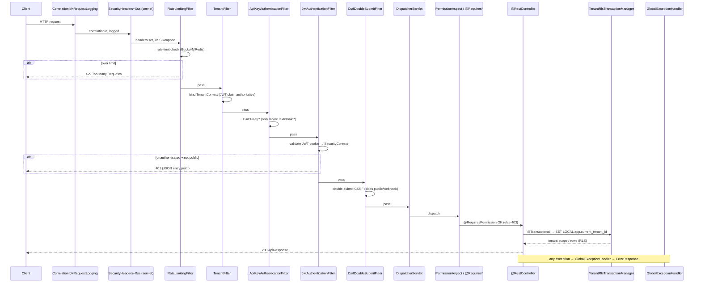

# Backend Middleware & Request Filter Chain

> The ordered gauntlet every HTTP request runs before reaching a [[APIs]] controller:
> servlet-container filters (logging, headers, XSS) → the Spring Security filter chain
> (rate-limit → tenant/RLS → API-key → JWT → CSRF) → method-level authorization →
> `@RestControllerAdvice` exception handling. Order is load-bearing; all class paths
> below are cited from `backend/src/main/java/com/nulogic/common/`.

## Purpose

Document the exact filter ordering and responsibility of each interceptor so changes to
auth, tenancy, or rate-limiting are made with full knowledge of what runs before/after —
and so the unauthenticated surface is auditable. See [[Security-Audit]], [[Data-Flows]].

## Context

- **Stack:** Spring Boot 3.5.14 Spring Security, `@EnableWebSecurity` +
  `@EnableMethodSecurity`, stateless (`SessionCreationPolicy.STATELESS`).
- **Two filter populations:**
  1. **Servlet-container filters** (`@Component @Order`, auto-registered by Tomcat) run
     *before* the Spring Security chain. These handle correlation IDs, request logging,
     security headers, and XSS wrapping.
  2. **Spring Security chain filters** added via `addFilterBefore/After` in
     `common/config/SecurityConfig.java`. These are *deliberately* prevented from Tomcat
     auto-registration via `FilterRegistrationBean(...).setEnabled(false)` beans (avoids
     CGLIB-proxy breakage from `@EnableAsync` on `OncePerRequestFilter`).
- **Profiles:** `SecurityConfig` (prod) vs `DevSecurityConfig` (dev) both define a
  `SecurityFilterChain`. See [[C4-Component]], [[Deployment]].

## Dependencies

- Feeds [[APIs]] controllers and [[Services]]; authorizes against [[Roles]],
  [[Permissions]], [[RBAC-Matrix]].
- Establishes tenant context consumed by RLS in [[Schema]] / [[Data-Flows]].

## Filter Inventory (cited classes)

### Servlet-container filters (run first, by `@Order`)

| Order | Class | File | Role |
|-------|-------|------|------|
| HIGHEST_PRECEDENCE | `CorrelationIdFilter` | `common/logging/CorrelationIdFilter.java` | Assign/propagate correlation ID (MDC) |
| HIGHEST_PRECEDENCE | `RequestLoggingFilter` | `common/logging/RequestLoggingFilter.java` | Structured request/response logging |
| 0 | `SecurityHeadersFilter` | `common/security/SecurityHeadersFilter.java` | Extra security headers (defense-in-depth alongside Spring's header writers) |
| 1 | `XssRequestWrapperFilter` | `common/security/XssRequestWrapperFilter.java` | Wrap request to sanitize XSS in params |

### Spring Security chain filters (ordered in `SecurityConfig.filterChain`)

Added relative to `UsernamePasswordAuthenticationFilter`. **Net runtime order from the
code** (`SecurityConfig` lines 263–270, plus the constructor comment):

| # | Filter | File | Role |
|---|--------|------|------|
| 1 | `RateLimitingFilter` | `common/security/RateLimitingFilter.java` | Bucket4j + `DistributedRateLimiter` (Redis Lua). 5/min auth, 100/min API, 5/5min exports |
| 2 | `TenantFilter` | `common/security/TenantFilter.java` | Resolve tenant → `TenantContext` ThreadLocal. **JWT claim is authoritative**; untrusted `X-Tenant-ID` header consumed *only* for unauthenticated public endpoints |
| 3 | `ApiKeyAuthenticationFilter` | `common/security/ApiKeyAuthenticationFilter.java` | `X-API-Key` auth for `/api/v1/external/**` (runs *before* JWT) |
| 4 | `JwtAuthenticationFilter` | `common/security/JwtAuthenticationFilter.java` | Validate JWT (httpOnly cookie), set `SecurityContext`; enforce JWT-vs-header tenant match |
| 5 | `CsrfDoubleSubmitFilter` | `common/security/CsrfDoubleSubmitFilter.java` | Double-submit cookie CSRF (non-httpOnly `XSRF-TOKEN` + `X-XSRF-TOKEN` header); skips auth/public/webhook paths. Spring's built-in CSRF is **disabled** |

> **Ordering nuance (code-verified):** `ApiKeyAuthenticationFilter` and
> `JwtAuthenticationFilter` are *both* added with `addFilterBefore(...,
> UsernamePasswordAuthenticationFilter.class)`. Because stacking two `addFilterBefore`
> against the same anchor inserts the first, then pushes the second closer to the anchor,
> the **net order is ApiKey → JWT** (per the `SecurityConfig` comment, lines 260–269).
> This page follows the code; note the prose mermaid in
> `docs/architecture/backend.md` shows JWT before ApiKey — the code ordering above is
> authoritative.

### Method-level authorization (after the chain, in the controller/service)

| Mechanism | File | Role |
|-----------|------|------|
| `@RequiresPermission` + `PermissionAspect` | `common/security/PermissionAspect.java` | Permission-gate methods → [[Permissions]] |
| `PermissionHandlerInterceptor` | `common/security/PermissionHandlerInterceptor.java` | Interceptor-level permission checks |
| `CustomPermissionEvaluator` + `RoleHierarchy` | `common/security/` | `hasPermission(...)` SpEL + role inheritance → [[Roles]] |
| `FieldPermission` | `common/security/FieldPermission.java` | Field-level read/write masking |
| `@RequiresFeature` + `FeatureFlagAspect` | `common/security/FeatureFlagAspect.java` | Feature-flag gating |
| `@RequiresWebhookScope` + `WebhookScopeAspect` | `common/security/WebhookScopeAspect.java` | Webhook scope gating |
| `ApiVersionInterceptor` | `common/api/ApiVersionInterceptor.java` | API version negotiation |

### RLS / tenancy (post-tenant-filter, at the transaction)

- `TenantRlsTransactionManager` (`common/config/`) issues `SET LOCAL
  app.current_tenant_id = '<uuid>'` per transaction (auto-resets on commit/rollback — no
  leak across pooled connections); `TenantAwareDataSourceConfig`, `TenantRlsSessionSync`
  for non-JPA paths; `RlsStartupProbe` fails boot if RLS regresses. See [[Data-Flows]],
  [[Security-Audit]].

### Exception handling (terminal)

- `GlobalExceptionHandler` (`common/exception/GlobalExceptionHandler.java`,
  `@RestControllerAdvice`) — **26 `@ExceptionHandler` methods** mapping domain + Spring
  exceptions (`ResourceNotFoundException`, `BusinessException`, `UnauthorizedException`,
  `FeatureDisabledException`, `BadCredentials`, `Locked`, `AccessDenied`, validation,
  `MaxUploadSizeExceeded`, catch-all `Exception`) to the `ErrorResponse` envelope —
  never leaking stack traces.
- `ApiResponseBodyAdvice` (`common/api/response/`) — wraps successful responses.

## Diagram

## Public / Unauthenticated Allow-List

`SecurityConfig.authorizeHttpRequests` permits these without JWT (each guarded by its
own token/HMAC/signature/API-key — this is the unauthenticated attack surface):

- **Auth:** `/auth/login`, `/auth/google`, `/auth/refresh`, `/auth/forgot-password`,
  `/auth/reset-password`, `/auth/mfa-login`; `/api/v1/tenants/register`.
- **Token-based portals:** `/api/v1/esignature/external/**`, `/api/v1/public/offers/**`,
  `/api/v1/public/careers/**`, `/api/v1/exit/interview/public/**`,
  `/api/v1/preboarding/portal/**`.
- **Webhooks:** `/api/v1/integrations/docusign/webhook` (HMAC),
  `/api/v1/payments/webhooks/**` (provider signature),
  `/api/v1/integrations/slack/{commands,interactions,events}` (signing secret),
  `/api/v1/biometric/punch[/batch]` (API key).
- **External API:** `/api/v1/external/**` → `ApiKeyAuthenticationFilter` (`X-API-Key`).
- **Infra:** `/`, `/error`, `/actuator/health[/**]`, `/ws/**`, `/saml2/**`,
  `/login/saml2/**`, `/logout/saml2/**`.
- **Restricted:** `/actuator/prometheus` (scrape token or `SUPER_ADMIN`),
  `/actuator/**` + Swagger (`SUPER_ADMIN`). Everything else `authenticated()`.

## Headers, CORS & Session

- **Headers (`SecurityConfig`):** `frameOptions(deny)`, CSP `default-src 'self';
  frame-ancestors 'none'`, HSTS 1y `includeSubDomains`, `nosniff`,
  `Referrer-Policy: strict-origin-when-cross-origin`, restrictive `Permissions-Policy`.
- **CORS:** origins from `app.cors.allowed-origins` (default localhost 3000/3001/8080);
  wildcard origins/headers rejected; explicit allowed headers + `allowCredentials=true`.
- **Session:** stateless; JWT in httpOnly cookie; 401/403 returned as JSON (no redirect).
- **Passwords:** `BCryptPasswordEncoder(12)`.

## Related Links

- [[00-Home]] · [[System-Overview]] · [[C4-Component]] · [[C4-Container]]
- [[APIs]] — controllers behind the chain · [[Services]] — services + RateLimiter/TokenBlacklist
- [[Data-Flows]] — full auth + RLS lifecycle · [[System-Flows]]
- [[Roles]] · [[Permissions]] · [[RBAC-Matrix]] — authorization
- [[Schema]] · [[ERD]] — RLS tenancy model · [[Security-Audit]] · [[Deployment]]
- Source: `common/config/SecurityConfig.java`, `common/security/*`, `common/exception/GlobalExceptionHandler.java`

## Risks

- **Order fragility:** the `addFilterBefore` stacking trick (ApiKey before JWT against the
  same anchor) is non-obvious; reordering or adding a third filter at the same anchor can
  silently change runtime order. Verify with the constructor comment + a chain dump.
- **Header trust:** `X-Tenant-ID` is untrusted; `TenantFilter` only honors it for
  unauthenticated public paths and warns if both cookie and header are present. A
  regression here is a cross-tenant risk — see prior IDOR findings in [[Security-Audit]].
- **RLS dependency:** application-layer tenant scoping + PostgreSQL RLS are
  defense-in-depth; `RlsStartupProbe` is the boot guard. Pooled-connection GUC leak was a
  real past bug (fixed via tx-local `SET LOCAL`).
- **Public allow-list:** each `permitAll()` path bypasses the JWT chain and must enforce
  its own token/signature; new entries are the highest-risk diff in `SecurityConfig`.

## Operational Notes

- **Inspect order:** read `SecurityConfig.filterChain` (`addFilterBefore/After` lines) +
  `@Order` on `common/logging/*` and `common/security/SecurityHeadersFilter`,
  `XssRequestWrapperFilter`.
- **Dev vs prod chain:** `DevSecurityConfig` vs `SecurityConfig` (profile-selected).
- **Rate-limit tuning:** `RateLimitingFilter` + `DistributedRateLimiter` (Redis); buckets
  configurable per endpoint class.
- **List all filters:** `grep -rl OncePerRequestFilter backend/src/main/java/com/nulogic`.
